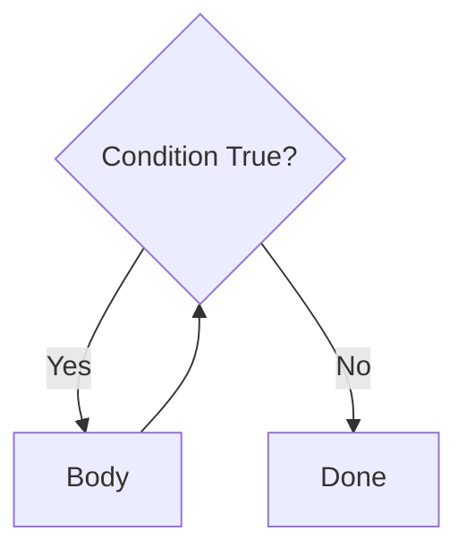

# Lecture Script: Loops, Iteration & Repetitive Logic
> **Instructor Reference** — Module 1: Foundations of Data | Session 4 | Duration: 2 Hours

---

## Session Overview

**Goal:** Students write `for` and `while` loops with correct termination, use `range()`, `break`, and `continue`, and iterate lists and strings to solve practical problems.

**Student profile at this point:** Comfortable with variables, basic types, and `if`/`elif`/`else` from Session 3. May have seen loops in passing but confuse `range()` bounds or create infinite `while` loops.

**Key outcome:** Every student completes three labs: sum/average of a list, a FizzBuzz-style pattern, and a password retry loop with `while` + `break` — and can explain when to choose `for` vs `while`.

---

## Timing Breakdown

| Segment | Duration | Cumulative |
|---|---|---|
| Opening & Hook | 5 min | 0:05 |
| **Concept 1:** Why Loops + for Loop Mental Model | 10 min | 0:15 |
| **Practical 1:** for Loops, range(), and List Iteration | 15 min | 0:30 |
| **Concept 2:** while Loops + Avoiding Infinite Loops | 10 min | 0:40 |
| **Practical 2:** while, break, continue Live Demos | 15 min | 0:55 |
| **BREAK** | 10 min | 1:05 |
| **Concept 3:** Index vs Value + String Iteration | 10 min | 1:15 |
| **Practical 3:** Sum, Average, and FizzBuzz-Style Lab | 20 min | 1:35 |
| **Concept 4:** Choosing for vs while + Common Pitfalls | 10 min | 1:45 |
| **Practical 4:** Password Retry with while + break | 10 min | 1:55 |
| Summary & Wrap-Up | 3 min | 1:58 |
| Q&A & Doubt Solving | 2 min | 2:00 |

---

## SEGMENT 1: Opening & Hook (8 min)


**Hook:** Show this on screen (or paste into the notebook):

```python
prices = [120, 450, 89, 310, 275]
# Someone wrote:
print(prices[0] + prices[1] + prices[2] + prices[3] + prices[4])
```

**Ask the class:** *"What happens tomorrow when the shop adds 50 more products? Do we add 50 more lines?"*

Let them answer. Then show:

```python
total = 0
for price in prices:
    total += price
print("Total:", total)
```

**Context to set:** Real data work — sales rows, sensor readings, survey answers — means repeating the same logic thousands of times. Loops are not a syntax trick. They are how programs scale.

**Learning contract for today:**
- Write `for` loops over lists and `range()`
- Write safe `while` loops that always move toward stopping
- Use `break` and `continue` on purpose, not by accident
- Build sum/average, FizzBuzz-style output, and a password retry script

**Say:** *"If you can explain when the loop stops, you understand the loop."*

---

## Concept Block 1: Why Loops + for Loop Mental Model (10 min)

### Copy-Paste vs One Pattern

Draw on the board:

```
WITHOUT LOOP          WITH for LOOP
─────────────         ─────────────
do task on item 1     for each item:
do task on item 2         do task
do task on item 3     (automatic)
... forever ...
```

**Key teaching point:** A **loop** is one recipe applied to each item in a sequence. The sequence can be a list, a string, or numbers from `range()`.

### Reading a for Loop Aloud

```python
for score in [90, 85, 72]:
    print(score)
```

Practice with the class: *"For each score in the list, print the score."* Three iterations, then done.

| Part | Name | Role |
|---|---|---|
| `for` | Keyword | Starts the loop |
| `score` | Loop variable | Holds current item |
| `in [90, 85, 72]` | Sequence | What to walk through |
| Indented block | Body | Runs once per item |

**Ask:** *"After the loop finishes, what is the last value of `score`?"* → `72` (the final item). Useful to know; do not rely on it unless intentional.

**Write on board:** **for = known collection or count → visit each**

---

## Practical Block 1: for Loops, range(), and List Iteration (15 min)

### Demo 1 — Print Each Item

```python
names = ["Ria", "Sam", "Jo"]
for name in names:
    print(f"Hello, {name}")
```

**Walk through output line by line.** Ask: *"How many times did the body run?"*

### Demo 2 — range() Variants

```python
# Zero to four
for i in range(5):
    print(i, end=" ")
print()  # 0 1 2 3 4

# One to five
for i in range(1, 6):
    print(i, end=" ")
print()  # 1 2 3 4 5

# Evens below 10
for i in range(0, 10, 2):
    print(i, end=" ")
print()  # 0 2 4 6 8
```

**Teaching moment:** `range(5)` means "start at 0, stop before 5." Same idea as list indices starting at 0.

**Ask the class before running:** *"What will `range(2, 7)` print?"* — Let them predict, then run.

### Demo 3 — Accumulator Pattern (Sum)

```python
nums = [4, 7, 2, 9, 1]
total = 0
for n in nums:
    total += n
print("Sum:", total)
```

**Explain the pattern:** Initialise before the loop (`total = 0`), update inside (`total += n`), use after (`print`).

```python
# Average — same loop, one more step
count = len(nums)
average = total / count
print("Average:", average)
```

**Live demonstration tip:** Change `nums` to a longer list live. Show that the loop body did not change — only the data did.

**Extension for faster students:**

```python
# Multiplication table for 7
n = 7
for i in range(1, 11):
    print(f"{n} x {i} = {n * i}")
```

---

## Concept Block 2: while Loops + Avoiding Infinite Loops (10 min)

### The while Mental Model



**One-line definition for students:** **while** repeats *as long as* the condition is True — check first, then run, then check again.

```python
countdown = 3
while countdown > 0:
    print(countdown)
    countdown -= 1
print("Lift off!")
```

**Key teaching point:** Something inside the body must **move the condition toward False**. If you forget `countdown -= 1`, you get an infinite loop.

### for vs while — Decision Guide

| Use | Loop | Example |
|---|---|---|
| Fixed list or known count | `for` | Sum all scores in a list |
| Repeat until event | `while` | Login until correct or 3 fails |
| Process until empty | `while` | Read lines until end of file |

**Danger sign:** `while True:` without a `break` path → runs forever.

**Ask:** *"You need to retry an API call until it succeeds or you hit 5 failures. for or while?"* → Either works; `while attempts < 5` is often clearest.

---

## Practical Block 2: while, break, continue Live Demos (15 min)

### Demo 1 — Menu Loop with break

```python
while True:
    choice = input("Enter q to quit: ")
    if choice == "q":
        break
    print(f"You typed: {choice}")
print("Goodbye")
```

**Say:** *"`while True` looks scary — but `break` is the planned exit. This pattern is common in menus and games."*

### Demo 2 — continue Skips One Round

```python
for i in range(1, 8):
    if i == 4:
        continue
    print(i, end=" ")
print()
# prints 1 2 3 5 6 7 — skips 4
```

**Ask:** *"What is the difference between `continue` and `break` here?"* → `continue` skips printing 4 only; `break` would stop the whole loop at 4.

### Demo 3 — Filter While Summing (from coding problem)

```python
nums = [4, 7, 2, 9, 1]
running = 0
for n in nums:
    if n > 5:
        print(n)
    running += n
    if running > 15:
        print("Stopping early — running sum exceeded 15")
        break
```

**Discussion:** Order matters. We add every `n` to `running`, even small ones. That is why we break after 7 and 9, not only after printing large values.

---

## BREAK (10 min)

---


*Suggested break prompt:* Ask students to write on paper: one problem for `for`, one for `while`. Share one example each when class resumes.

---

## Concept Block 3: Index vs Value + String Iteration (10 min)

### Two Ways Through a List

| Style | Code | When to use |
|---|---|---|
| By value | `for x in items:` | Sum, filter, print values |
| By index | `for i in range(len(items)):` | Need position (rank, pair with another list) |

```python
items = ["pen", "book", "bag"]
for i in range(len(items)):
    print(i, items[i])
```

**Teaching point:** Prefer **by value** when you do not need the index — it is clearer.

### Strings Are Sequences

```python
word = "loop"
for ch in word:
    print(ch)
```

**Ask:** *"How many iterations for `'hello'`?"* → 5 (one per character).

**Link to data:** CSV columns, JSON strings, and user input are all text you will walk character by character or line by line later.

---

## Practical Block 3: Sum, Average, and FizzBuzz-Style Lab (20 min)

### Lab Part A — Sum and Average (8 min)

**Give students this starter:**

```python
test_scores = [78, 85, 92, 88, 74, 91, 83]

# TODO: use a loop to compute total and average
# Print: "Total: ..." and "Average: ..."
```

**Walk through solution together after 5 minutes solo work:**

```python
test_scores = [78, 85, 92, 88, 74, 91, 83]

total = 0
for score in test_scores:
    total += score

average = total / len(test_scores)
print(f"Total: {total}")
print(f"Average: {average:.1f}")
```

**Check:** Ask a student to explain why `len(test_scores)` is safe outside the loop but the `+=` must be inside.

### Lab Part B — FizzBuzz-Style (12 min)

**Rules (write on board):**

- For numbers 1 to 20:
  - Divisible by 3 and 5 → print `FizzBuzz`
  - Divisible by 3 only → print `Fizz`
  - Divisible by 5 only → print `Buzz`
  - Otherwise → print the number

**Starter:**

```python
for n in range(1, 21):
    # your if/elif chain here
    pass
```

**Solution to reveal step-by-step:**

```python
for n in range(1, 21):
    if n % 3 == 0 and n % 5 == 0:
        print("FizzBuzz")
    elif n % 3 == 0:
        print("Fizz")
    elif n % 5 == 0:
        print("Buzz")
    else:
        print(n)
```

**Common mistake to demonstrate:** Checking `% 3` before the combined `% 3 and % 5` case — show wrong output for 15 if order is wrong.

**Ask:** *"Why do we test 3 and 5 together first?"* → Otherwise 15 prints `Fizz` only.

---

## Concept Block 4: Choosing for vs while + Common Pitfalls (10 min)

### Pitfall Checklist

| Mistake | Symptom | Fix |
|---|---|---|
| Infinite while | Program never ends | Update condition variable; add break |
| Off-by-one range | Missing first or last item | Trace `range(start, stop)` — stop is exclusive |
| Modifying list while looping | Skipped items | Loop over a copy or use index carefully |
| Forgetting initialiser | Wrong sum (`total` undefined) | Set `total = 0` before loop |

**Write on board:** **INIT → LOOP → UPDATE → USE RESULT**

### Nested Loops (Brief Intro)

```python
for row in range(1, 4):
    for col in range(1, 4):
        print(f"({row},{col})", end=" ")
    print()
```

**Say:** *"Outer loop = rows. Inner loop = columns. You will see this again with tables and grids — not exam depth today, just know the pattern exists."*

---

## Practical Block 4: Password Retry with while + break (10 min)

### Lab Setup

**Scenario:** Correct PIN is `"1234"`. User gets **3 attempts**. After success, welcome message. After 3 failures, lock message.

**Starter:**

```python
CORRECT_PIN = "1234"
MAX_TRIES = 3
attempts = 0

# TODO: while loop — ask for PIN, compare, break on success
# increment attempts; if attempts == MAX_TRIES and still wrong, print locked
```

**Solution:**

```python
CORRECT_PIN = "1234"
MAX_TRIES = 3
attempts = 0

while attempts < MAX_TRIES:
    pin = input("Enter PIN: ")
    if pin == CORRECT_PIN:
        print("Access granted. Welcome!")
        break
    else:
        attempts += 1
        remaining = MAX_TRIES - attempts
        if remaining > 0:
            print(f"Wrong PIN. {remaining} attempt(s) left.")
        else:
            print("Account locked. Too many failed attempts.")
```

**Alternative with for:**

```python
CORRECT_PIN = "1234"
for attempt in range(1, 4):
    pin = input(f"Attempt {attempt}/3 — Enter PIN: ")
    if pin == CORRECT_PIN:
        print("Access granted!")
        break
else:
    # runs only if loop did NOT break
    print("Account locked.")
```

**Teaching moment:** Python's `for`/`else` is optional — mention it for advanced students; `while` version is enough for core outcome.

**Discussion:** *"Why not store the real PIN in plain text in production?"* — Brief security note: real systems hash passwords; this is a learning exercise only.

---

## Summary & Wrap-Up (3 min)

**What we covered today:**
- **for** loops over lists, strings, and `range()`
- **while** loops with a clear path to stopping
- **break** (exit early) and **continue** (skip one round)
- Accumulator pattern for **sum** and **average**
- FizzBuzz-style multi-branch logic inside a loop
- Password retry with attempt counting

**Bridge to next session:** *"Tomorrow is a master class — no heavy coding. We zoom out to the math behind True/False, sets, and functions. That math is the same engine running inside every `if` and `while` you wrote today."*

**Homework / self-practice:**
- Print squares of 1–10 using `for` and `range`
- Write a loop that counts vowels in a string
- Optional: guess-the-number game with `while` and `break`

---

## Q&A & Doubt Solving (2 min)

**Likely questions and suggested answers:**

**Q: When should I use `range(len(list))` instead of `for x in list`?**
→ Use index when you need the position or two lists aligned by index. Otherwise prefer `for x in list`.

**Q: My while loop never stops — what do I check first?**
→ Print the condition variable inside the loop. Is it changing? Is the condition ever False?

**Q: Can I use `break` in a for loop?**
→ Yes. `break` exits whichever loop it is inside — for or while.

**Q: Does `range(10)` include 10?**
→ No. It stops before 10, so you get 0 through 9.

---

## Instructor Notes

- **Live coding tip:** Deliberately create an infinite loop once (remove `countdown -= 1`), show Ctrl+C or kernel interrupt, then fix it — students remember the scare.
- **Common student mistake:** Using `for i in range(len(nums))` when `for n in nums` is enough — praise simpler code when it works.
- **Pacing:** If running long before break, shorten nested loop intro. If ahead, add guess-the-number as a 5-minute bonus.
- **Connection to course:** Mention that Pandas `.apply()` and row iteration inherit this mental model — loops become hidden inside libraries later.
- **Assessment alignment:** Coding problem tasks (squares, sum with break) map directly to Practical Blocks 1–2; assign as exit ticket if time is tight.

---

## End-of-Session Quiz (5 Questions)

1. Define AI, ML, and GenAI in one sentence each.
2. Classify: UPI OTP above ₹10,000; Swiggy ETA; ChatGPT email draft.
3. What ML problem type is "predict monthly sales"?
4. Name two responsible AI habits when using GenAI for customer support.
5. Which role builds nightly data pipelines — analyst, engineer, or scientist?

**Answer key (instructor):** AI=umbrella field; ML=learns from data; GenAI=creates content. Rules/ML/GenAI respectively. Regression. Human review; verify facts. Data engineer.

---

## Homework Rubric

| Criterion | Excellent (4) | Good (3) | Needs Work (2) | Incomplete (1) |
|---|---|---|---|---|
| Core lab task | 4 clear categories with data sources | 3 mostly correct | 2 with gaps | 1 or missing |
| Lab completion | 8/8 defended | 6–7/8 | 4–5/8 | <4 |
| Written framing | 2 scenarios with I/O types | 2 partial | 1 complete | 0 |
| Reflection | Thoughtful responsible AI note | Good | Brief | Missing |

**Total:** /16 — Pass threshold: 10/16

---

## Materials Checklist

- [ ] Slide: nested AI / ML / GenAI diagram
- [ ] 8 (+1 optional) classification cards
- [ ] Course roadmap slide (Modules 1–3)
- [ ] Whiteboard markers
- [ ] Exit ticket form or sticky notes
- [ ] Timer visible to students

---

## Timing Contingencies

| Situation | Action |
|---|---|
| Running 10 min behind before break | Shorten Practical 2 walkthrough; assign e-commerce table as homework |
| Running long after break | Shorten Practical 4 to two scenarios instead of four |
| Low energy | Stand/sit vote on one headline card |
| Advanced students finish early | Stretch: Google Maps ETA — ML or rules? |
| No projector | Use chat poll for headline sort |

---

## FAQ — Q&A (8+ Questions)

**Q: Is ChatGPT "AI" or "GenAI"?** → Both. GenAI product inside AI field. Say "GenAI assistant" in interviews.

**Q: Can a rule-based system beat ML?** → Yes when rules are complete, stable, auditable.

**Q: Do I need math for ML?** → Module 1 builds Python/data first; Module 2 adds needed math.

**Q: Is Excel with formulas AI?** → Formulas are rules. Forecast on history is ML.

**Q: What's deep learning vs ML?** → Deep learning uses neural nets with many layers.

**Q: Will GenAI replace data jobs?** → No — pipelines and cleaning stay essential.

**Q: What is RAG?** → Retrieval + generation — Module 3 topic.

**Q: How pick a career path?** → Match ecosystem role to what excites you.


---

## SEGMENT 11: Supplemental Loop Demos

### Demo — Sum and average

```python
scores = [88, 92, 75]
total = 0
for s in scores:
    total += s
print(total / len(scores))
```

**Break it down:** accumulator pattern.

**Ask:** Empty list problem?

**Common mistake:** Divide by zero on [].

**Fix:** Check len > 0.

### Demo — FizzBuzz core

```python
for n in range(1, 21):
    if n % 15 == 0:
        print("FizzBuzz")
    elif n % 3 == 0:
        print("Fizz")
    elif n % 5 == 0:
        print("Buzz")
    else:
        print(n)
```

**Ask:** Why 15 first?

**Common mistake:** Check 3 before 15.

**Fix:** Most specific condition first.

### Demo — while retry

```python
attempts = 0
pin = ""
while pin != "1234" and attempts < 3:
    pin = input("PIN: ")
    attempts += 1
```

**Break it down:** while until correct or max tries.

**Common mistake:** Infinite loop without update.

**Fix:** Increment attempts each round.

### Loop choice reference

| Pattern | Loop |
|---|---|
| Known list | for |
| Fixed count | for range |
| Until event | while |

### FAQ additions

**Q: range include stop?** → Stops before stop value.

**Q: for vs while?** → for known; while until event.

**Q: break vs continue?** → break exits; continue skips iteration.

**Q: Loop variable after?** → May hold last value.

**Q: Nested loops?** → Outer row inner col.

**Q: Pandas loops?** → Vectorised later; same idea now.

**Q: Modify list while looping?** → Avoid; copy or iterate copy.

**Q: while True?** → Only with break inside.


---

## SEGMENT 12: Extended Loop Labs

### Lab — Swiggy order IDs above threshold

```python
order_ids = ["SW100", "SW101", "SW102", "SW103"]
amounts = [320, 550, 275, 890]
THRESHOLD = 500
for i in range(len(order_ids)):
    if amounts[i] > THRESHOLD:
        print(order_ids[i], amounts[i])
```

**Output:**
```
SW101 550
SW103 890
```

**Break it down:**
- Parallel lists same length
- Index loop when both ID and amount needed
- if inside for filters rows

**Ask:** How rewrite with zip(order_ids, amounts)?

**Common mistake:** IndexError when lists different lengths.

**Fix:** Confirm len match or use zip.

### Lab — vowel counter

```python
word = "bangalore"
vowels = "aeiou"
count = 0
for ch in word:
    if ch in vowels:
        count += 1
print("Vowels:", count)
```

**Output:** `Vowels: 4`

**Break it down:** Loop over string characters; membership test with `in`.

**Ask:** Case-insensitive version?

**Common mistake:** Forgetting strings iterate by character.

**Fix:** `for ch in word.lower():`

### Lab — nested multiplication table snippet

```python
for row in range(1, 4):
    line = []
    for col in range(1, 4):
        line.append(str(row * col))
    print(" ".join(line))
```

**Output:**
```
1 2 3
2 4 6
3 6 9
```

**Break it down:** Outer row, inner col — classic nested pattern.

**Ask:** How many total iterations?

**Common mistake:** Infinite nested loop without increment.

**Fix:** for loops manage increment automatically.

### while vs for decision card

| Situation | Choose |
|---|---|
| Print 1..N | for + range |
| Sum a list | for over list |
| PIN until correct | while |
| Retry max 3 times | for range(3) or while |

### Session 4 exit checklist

- [ ] Student wrote a for loop over a list
- [ ] Student used range with correct start/stop
- [ ] Student explained break vs continue
- [ ] Student computed sum or average in a loop
- [ ] Student attempted FizzBuzz or similar

### Homework rubric (loops)

| Criterion | Excellent (4) | Good (3) | Needs Work (2) | Incomplete (1) |
|---|---|---|---|---|
| Sum/average lab | Correct logic + output | minor off-by-one | wrong accumulator | missing |
| FizzBuzz 1–20 | Correct elif order | minor branch bug | wrong range | missing |
| Password retry | 3 tries + message | no counter | infinite loop | missing |

