# Loops, Iteration & Repetitive Logic
---

## Mental Map

```mermaid
%%{init: {'flowchart': {'nodeSpacing': 55, 'rankSpacing': 65, 'diagramPadding': 24}}}%%
flowchart TB
linkStyle default stroke-width:3px

subgraph foundation[" Foundation "]
direction TB
    CURMOD["<b>Current Module Until<br/>Previous Session</b><br/><i>Foundations of Data</i><br/>Recall and distinguish AI, ML and GenAI…<br/>Identify and declare variables using co…<br/>Construct if/elif/else blocks to handle…"]
    CURSES["<b>Current Session</b><br/><b>Loops, Iteration & Repetitive L…</b><br/><i>Shift:</i> Strengthen data foundations around Writ…<br/>Write for and while loops with correct terminat…<br/>apply break and continue to control loop flow"]
end

subgraph value[" Value "]
direction LR
    CVAL["<b>Course Value</b><br/>Core stack every AI engineer<br/>repeats daily"]
    RVAL["<b>Real-Life Value</b><br/>Skills reused in internships<br/>and AI roles"]
end

subgraph future[" Future Path "]
direction TB
    U0["<b>Upcoming Module</b><br/>Classical ML<br/><i>[scikit-learn · Statistics]</i><br/>Predictive models before LLM ground…"]
    U1["<b>Upcoming Module</b><br/>GenAI & Agents<br/><i>[LLMs · Agents]</i><br/>Ship grounded AI products and agent…"]
end

START["Course Start"] ==>|&nbsp;Begin&nbsp;| CURMOD
CURMOD ==>|&nbsp;Progress&nbsp;| CURSES
CURSES ==>|&nbsp;Course Path&nbsp;| CVAL
CURSES ==>|&nbsp;Real-Life&nbsp;| RVAL
CURSES ==>|&nbsp;Next Module&nbsp;| U0
U0 -.->|&nbsp;Ahead&nbsp;| U1

classDef prevBox fill:#E8F4FC,stroke:#2B6CB0,stroke-width:2px,color:#1A202C
classDef curModBox fill:#FFF8E6,stroke:#B7791F,stroke-width:2px,color:#1A202C
classDef curSessBox fill:#E6FFFA,stroke:#0D9488,stroke-width:3px,color:#1A202C
classDef valueBox fill:#F3E8FF,stroke:#7C3AED,stroke-width:2px,color:#1A202C
classDef futureBox fill:#ECFDF5,stroke:#047857,stroke-width:2px,color:#1A202C
classDef startBox fill:#F7FAFC,stroke:#4A5568,stroke-width:2px,color:#1A202C
class START startBox
class CURMOD curModBox
class CURSES curSessBox
class CVAL,RVAL valueBox
class U0,U1 futureBox
```

## What You'll Learn

In this pre-read, you'll discover:

- Why **loops** replace copy-paste code when the same action must run many times
- How **for loops** walk through lists, strings, and number ranges
- How **while loops** repeat until a condition becomes False
- How **range()**, **break**, and **continue** give you fine control over repetition
- How to **iterate lists and strings** to compute sums, averages, and patterns
- When to pick **for** vs **while** in real Indian app scenarios

---

## A. Why Loops Beat Copy-Paste

> 💡 **Analogy:** Washing ten plates means repeating scrub–rinse–dry. You do not write a new card for each plate.

**One-line definition:** A **loop** is a block of code that repeats until a condition or collection is finished.

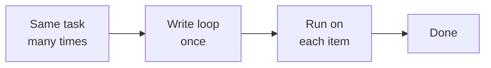

| Situation | Without a loop | With a loop |
|---|---|---|
| Sum 5 test scores | Five `+` lines | One `for` over the list |
| Print "Hello" 100 times | 100 print lines | `for i in range(100)` |
| Retry UPI until success | Hard to manage | `while` with counter |

**Key idea:** Loops handle **collections** — prices, rows, characters. Every data workflow later relies on iteration.

---

## B. for Loops — Repeat for Each Item

> 💡 **Analogy:** A baggage carousel — each bag passes once; you inspect **each bag** without knowing the count in advance.

**One-line definition:** A **for loop** runs its block once for every item in a sequence.

```python
fruits = ["apple", "banana", "cherry"]
for fruit in fruits:
    print(fruit)
```

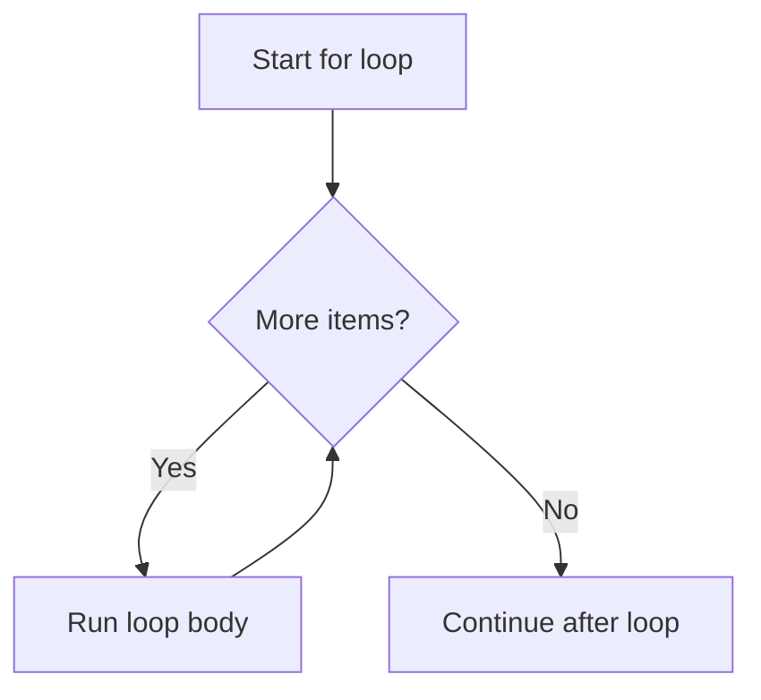

| Goal | Pattern |
|---|---|
| Print every item | `for x in my_list: print(x)` |
| Build a total | `total = 0` then `for n in nums: total += n` |
| Count matches | `count = 0` then `if` inside loop |

**Key idea:** Read aloud: *"For each item in the collection, do the body."*

---

## C. range() — Counting Without a List

> 💡 **Analogy:** Elevator floor buttons — **range()** generates the numbers for you.

**One-line definition:** **range()** produces integers you can loop over without building a full list.

```python
for i in range(5):
    print(i)   # 0, 1, 2, 3, 4
```

| Call | Numbers produced | Common use |
|---|---|---|
| `range(5)` | 0–4 | Repeat 5 times from zero |
| `range(1, 6)` | 1–5 | Count from 1 to 5 inclusive |
| `range(0, 10, 2)` | 0, 2, 4, 6, 8 | Step by 2 |
| `range(10, 0, -1)` | 10 down to 1 | Countdown |

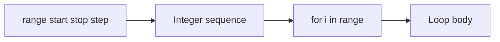

**Key idea:** `range(5)` stops **before** 5 — zero-based, like list indexes.

---

## D. while Loops — Repeat Until a Condition Fails

> 💡 **Analogy:** Filling bottles **while** the tap runs. When the tap stops, you stop.

**One-line definition:** A **while loop** repeats as long as a condition stays **True**.

```python
count = 3
while count > 0:
    print(count)
    count -= 1
print("Done")
```

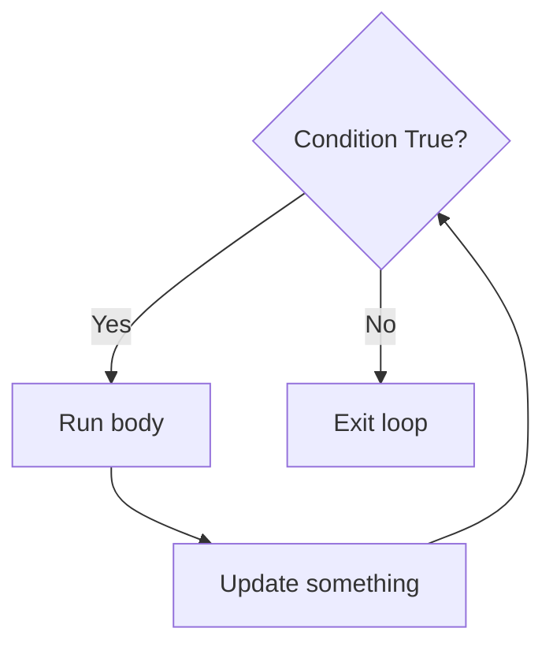

| Loop type | Best when | Risk |
|---|---|---|
| `for` | Known collection or count | Editing list while looping |
| `while` | Repeat until event (login OK) | **Infinite loop** if never False |

**Key idea:** Every `while` must move toward False — update a counter or read new input inside the body.

---

## E. break and continue — Steering Inside a Loop

> 💡 **Analogy:** **continue** skips one obstacle; **break** exits the entire level early.

**One-line definition:** **break** stops the whole loop; **continue** skips to the next item.

```python
for i in range(10):
    if i == 3:
        continue
    if i == 7:
        break
    print(i)
# prints 0, 1, 2, 4, 5, 6
```

| Keyword | Effect | Typical use |
|---|---|---|
| `break` | Exit loop now | Found answer; stop searching |
| `continue` | Skip to next iteration | Ignore invalid items |

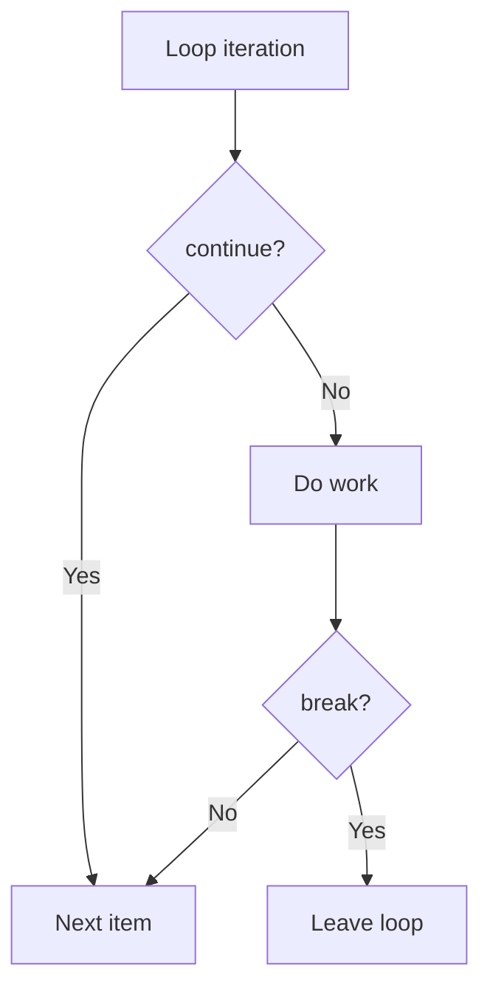

**Key idea:** Order of `if` checks inside the loop matters — test special cases first.

---

## F. Iterating Lists and Strings

> 💡 **Analogy:** Reading a message word by word or letter by letter — same text, two walks.

**One-line definition:** **Iteration** visits each element of a sequence one at a time.

```python
scores = [88, 92, 75]
total = 0
for score in scores:
    total += score
average = total / len(scores)
```

| Sequence | `for item in seq` | `for i in range(len(seq))` |
|---|---|---|
| List of numbers | Sum, average, max | Every 2nd item by index |
| String | Count vowels | Replace at position |
| Order IDs | Filter with `if` | Pair with parallel list |

**Worked example — Swiggy order totals:**

| Order ID | Amount (₹) |
|---|---|
| SW001 | 320 |
| SW002 | 450 |
| SW003 | 275 |

```python
amounts = [320, 450, 275]
total = 0
for amt in amounts:
    total += amt
print(f"Total sales: ₹{total}")  # ₹1045
```

**Key idea:** Pandas and SQL hide loops in fast library code — but the mental model is identical: visit each row, apply a rule.

---

## G. Nested Loops — Tables and Grids

> 💡 **Analogy:** Checking every seat in every row of a cinema — outer loop = row, inner loop = seat.

**One-line definition:** A **nested loop** is a loop inside another loop, used for grids, tables, and combinations.

```python
for row in range(3):
    for col in range(2):
        print(f"Row {row}, Col {col}")
```

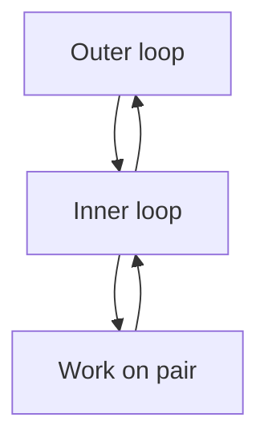

| Use case | Outer | Inner |
|---|---|---|
| Multiplication table | Row number 1–10 | Column 1–10 |
| Seat map | Row letter | Seat number |
| Batch UPI export | Day | Transaction in day |

**Key idea:** Nested loops multiply work — 10 × 10 = 100 iterations. Use only when you need every pair.

---

## H. Choosing for vs while — Decision Guide

> 💡 **Analogy:** **for** is a fixed school timetable; **while** is "study until you understand the chapter."

**One-line definition:** Pick **for** when you know how many times or which items; pick **while** when you stop on an event.

| Scenario | Best loop | Why |
|---|---|---|
| Sum all items in a list | `for` | Collection is known |
| Print numbers 1 to N | `for` with `range` | Fixed count |
| ATM PIN retry (3 tries) | `for` or `while` | Both work; counter clear |
| Wait for valid UPI PIN | `while` | Unknown attempts until correct |
| Read file until empty | `while` | Stop on end condition |

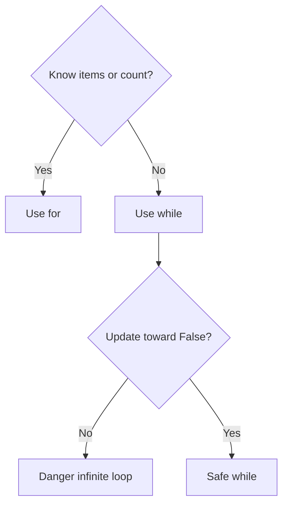

**Worked example — FizzBuzz 1 to 15 (outline):**

```
for each number n from 1 to 15:
    if n divisible by 3 and 5: print FizzBuzz
    elif n divisible by 3: print Fizz
    elif n divisible by 5: print Buzz
    else: print n
```

**Key idea:** If you cannot name what makes the loop stop, pause and redesign before coding.

---


## I. Accumulator Patterns — Building Results in a Loop

> 💡 **Analogy:** A piggy bank — each coin loop adds to the total without separate jars for coin 1, coin 2, coin 3.

**One-line definition:** An **accumulator** is a variable (often `total`, `count`, or `max_so_far`) updated inside a loop.

```python
amounts = [320, 450, 275, 510]
total = 0
count_over_400 = 0
for amt in amounts:
    total += amt
    if amt > 400:
        count_over_400 += 1
print(f"Total ₹{total}, orders over ₹400: {count_over_400}")
```

| Pattern | Starter value | Update inside loop |
|---|---|---|
| Sum | `total = 0` | `total += value` |
| Count | `count = 0` | `count += 1` when condition |
| Max | `best = values[0]` or `-inf` | `if v > best: best = v` |
| Join text | `parts = []` | `parts.append(s)` then `" ".join(parts)` |

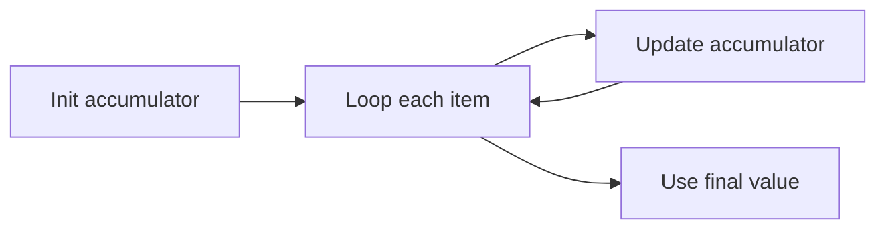

**Worked example — daily UPI summary:**

| txn | Amount |
|---|---|
| 1 | 250 |
| 2 | 1200 |
| 3 | 89 |

Loop computes total ₹1,539 and count of txns over ₹1000 (1).

**Key idea:** Accumulators turn loops into summaries — the same pattern behind sales dashboards and ML feature counts later.

---

## J. Common Loop Bugs — Spot Before You Run

| Bug | Symptom | Fix |
|---|---|---|
| Infinite while | Notebook hangs | Update variable toward False |
| Wrong range stop | Missing last number | Remember stop is exclusive |
| Wrong indent | IndentationError | Align body with 4 spaces |
| Sum without init | Wrong total | Set `total = 0` before loop |
| break vs continue swap | Skips wrong items | Trace on paper first |

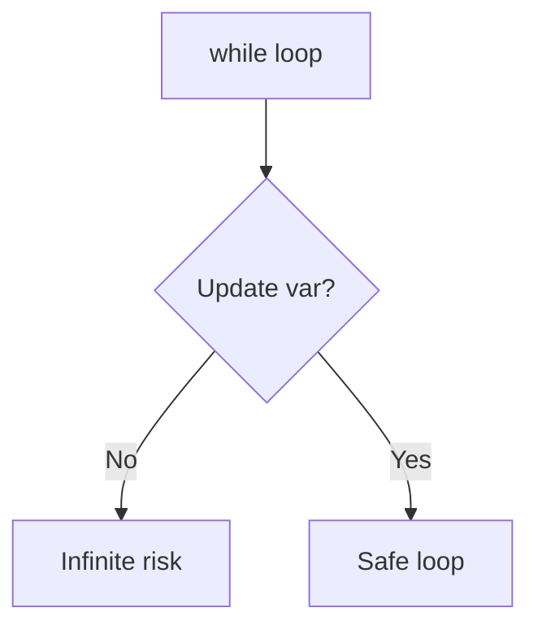

**Trace challenge — predict output:**

```python
total = 0
for n in [2, 4, 6]:
    total += n
print(total)
```

Answer: 12 — one pass, three additions.

**Key idea:** Loops fail in predictable ways; a 30-second trace prevents a 30-minute debug session.

---

## K. From Loops to Real Data — Preview

| Today (Python list) | Later (Pandas) | Same idea |
|---|---|---|
| `for x in amounts:` | `df['amount'].apply(...)` | visit each value |
| sum in loop | `df['amount'].sum()` | aggregate |
| filter with if | boolean mask | keep subset |

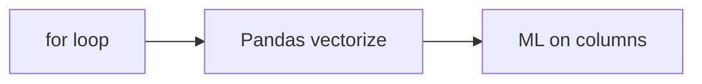

**Swiggy orders → tomorrow's DataFrame** — loop today; one Pandas line next month. Same mental model.

**Key idea:** You are learning the pattern every data and ML job uses — not just toy lists.

| Preview | Session 4 today | Session 10+ later |
|---|---|---|
| Sum a list | for loop | `df['amount'].sum()` |
| Filter rows | if inside for | boolean mask |
| Repeat N times | range(N) | vectorised ops |

**Stretch question:** If you have 10,000 UPI transactions in a list, why is a loop still the right *mental model* even when Pandas hides the loop?

**Key idea:** Performance changes; the pattern does not.

| Loop type | Stop condition | Example |
|---|---|---|
| for over list | list exhausted | print each order ID |
| for over range | counter reaches stop | Attempt 1..3 |
| while | condition False | PIN until correct |

---

## Practice Exercises

**1. Pattern Recognition** — `range(4)` vs `range(1, 5)`: what numbers print? Which prints "Attempt 1" through "Attempt 4"?

**2. Concept Detective** — Three password tries: compare `for` over `range(3)` with `while attempts < 3`. One advantage of each?

**3. Real-Life Application** — Name three tasks that repeat until a condition is met. For each, pick `for` or `while` and why.

**4. Spot the Error** — A loop should print evens and stop when sum > 20 but stops early. Explain why updating `total` before the even check changed behaviour.

**5. Planning Ahead** — FizzBuzz 1–20 pseudocode with if/elif. Note where `break` or `continue` are **not** needed.

---

> ✅ **You're done!** Loops let one short program handle ten items or ten thousand. Next is a **master class** on math and logic — then **functions** for reusable code.
