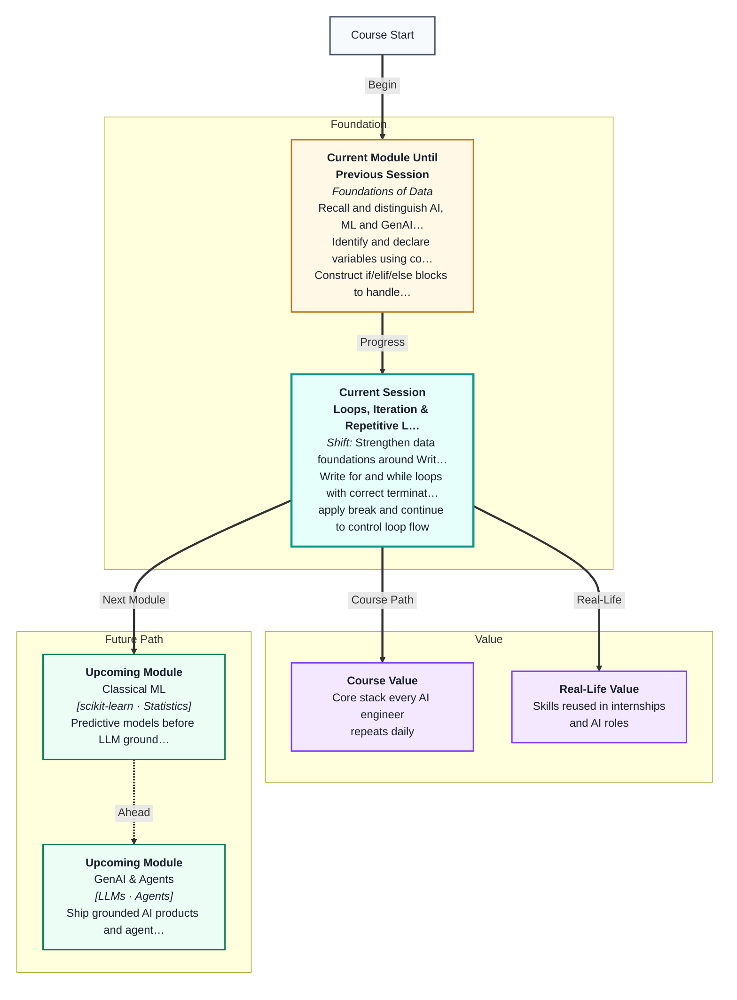
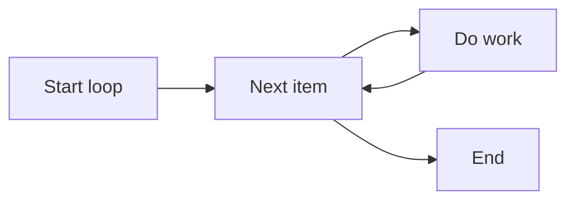

# Loops, Iteration & Repetitive Logic
---

## Mental Map



## What You'll Learn

In this pre-read, you'll discover:

- How **for loops** repeat over sequences
- How **while loops** repeat until a condition fails
- How **range()** generates number sequences
- When to use **break** and **continue**
- How to loop over **lists and strings** by index or item

---

## A. for Loops — Repeat for Each Item

> 💡 **Analogy:** Checking every bag on a conveyor belt — the loop **visits each bag once** without you naming them one by one.

```python
fruits = ["apple", "banana", "cherry"]
for f in fruits:
    print(f)
```



---

## B. while Loops — Repeat Until Done

> 💡 **Analogy:** Keep filling glasses while the jug has water. **while** checks the condition before each round.

```python
count = 3
while count > 0:
    print(count)
    count -= 1
```

---

## C. range(), break, continue

| Tool | Purpose |
|---|---|
| range(5) | 0,1,2,3,4 |
| break | Exit loop early |
| continue | Skip to next iteration |

```python
for i in range(5):
    if i == 3:
        continue
    print(i)
```

---

## D. Index vs Value

```python
names = ["Ana", "Bo", "Cy"]
for i in range(len(names)):
    print(i, names[i])
```

---

## Practice Exercises

**1. Pattern Recognition** — How many times does `for i in range(4): print(i)` print?

**2. Concept Detective** — You need to retry API calls until success or 5 failures. for or while?

**3. Real-Life Application** — Three daily tasks you repeat that map to loops.

**4. Spot the Error** — `while True: print("hi")` with no break — what happens?

**5. Planning Ahead** — Sum numbers 1 to 10 using a loop (pseudocode).

---

> ✅ **You're done!** Loops remove repetition from code. Next: a **master class** on the math behind logic and data structures.
