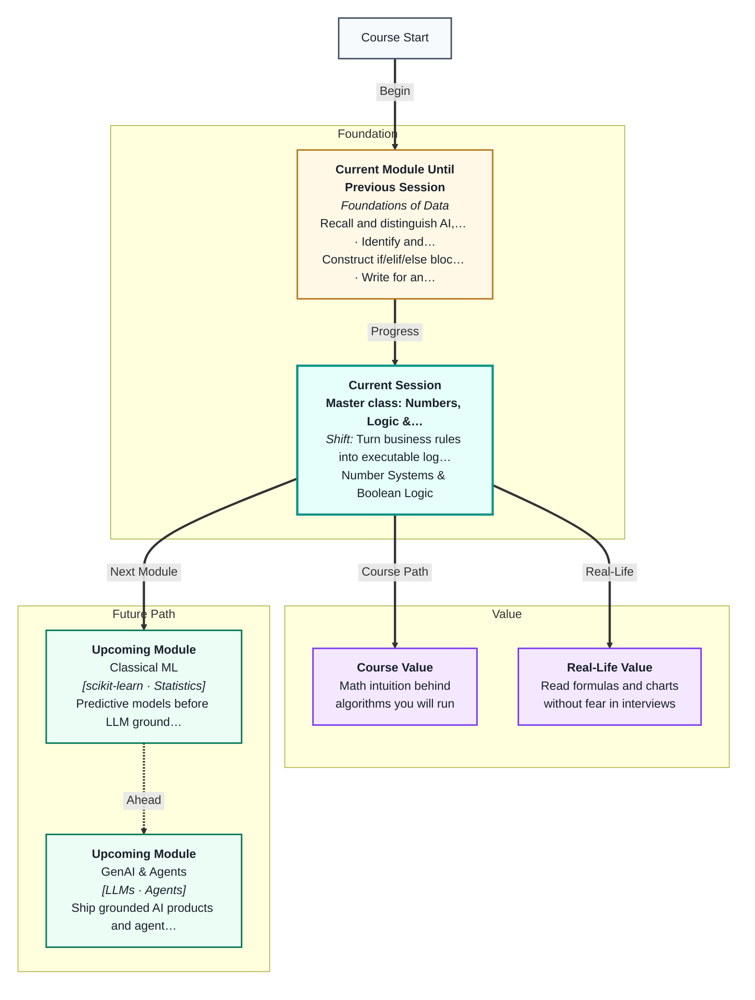
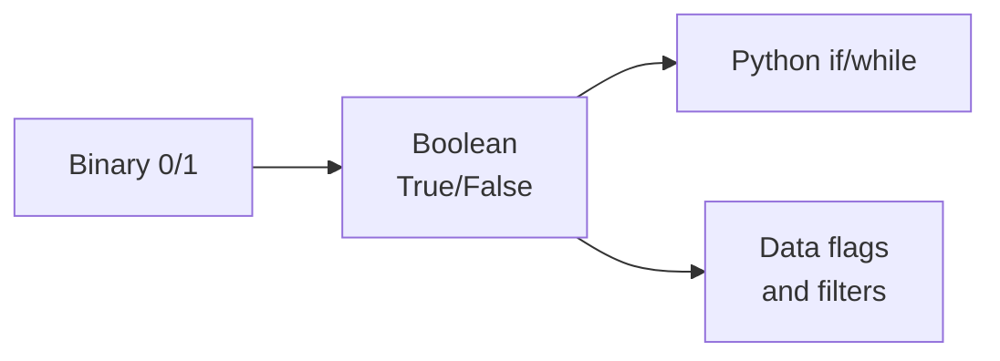
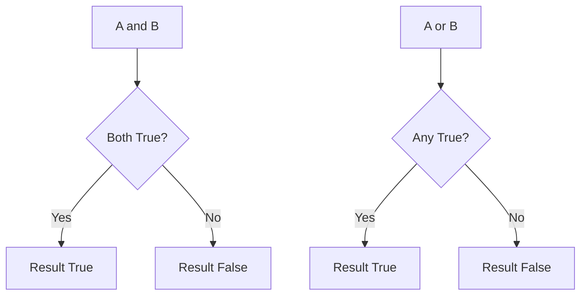
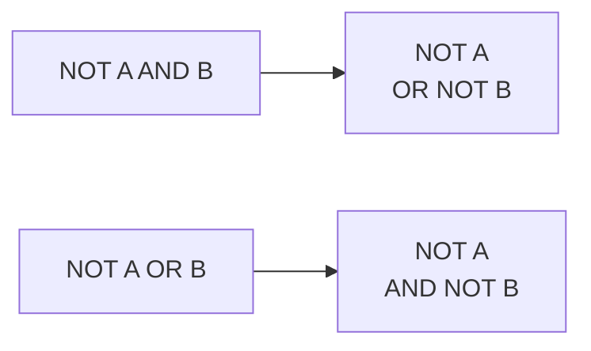
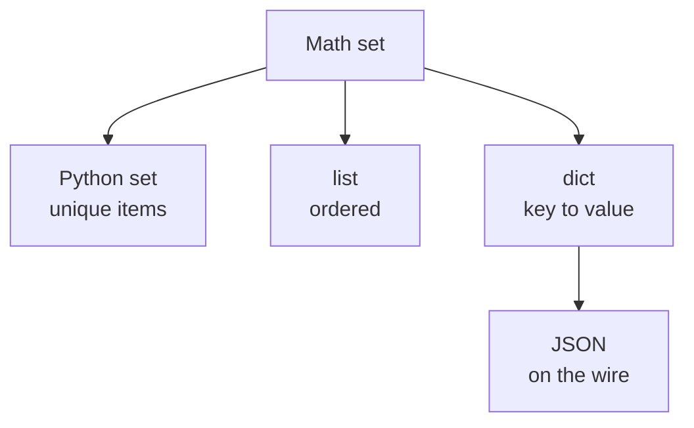
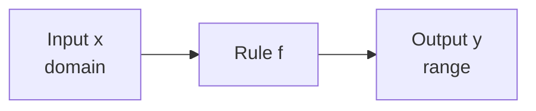
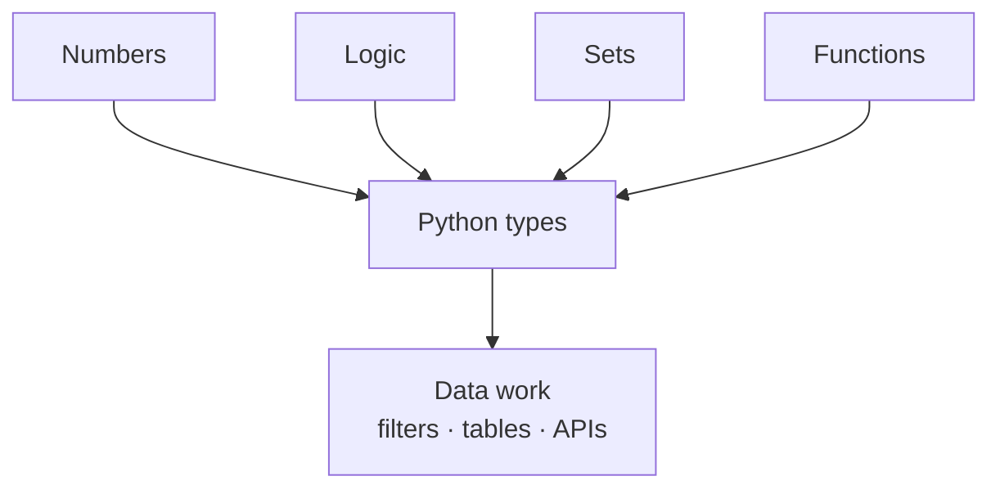
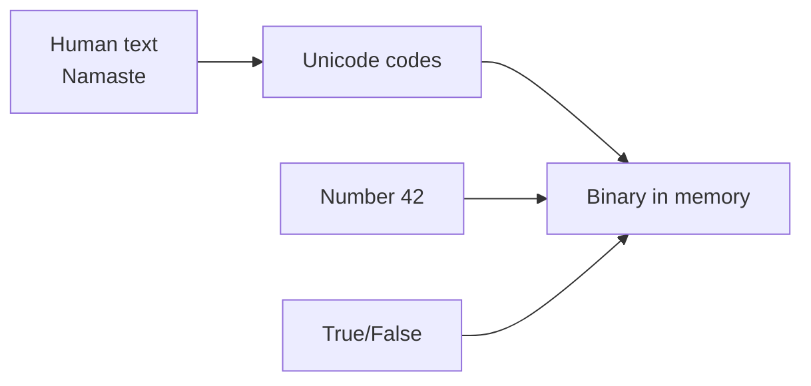
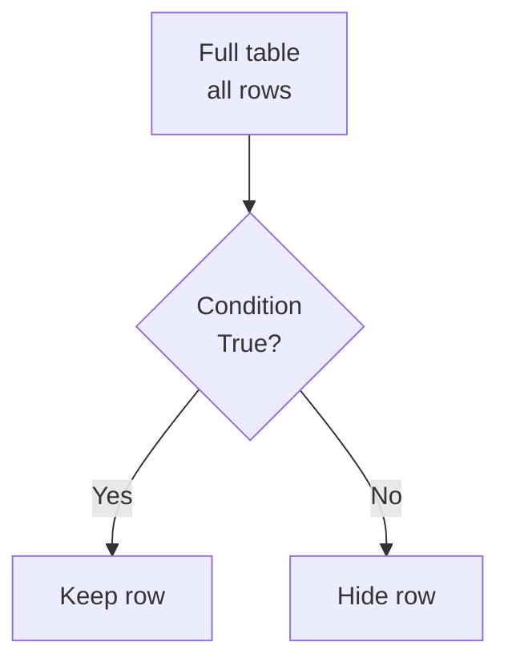

# Master Class: Numbers, Logic & Structure — The Mathematical Language of Data
---

## Mental Map



## What You'll Learn

In this pre-read, you'll discover:

- Why computers store everything as **binary** (0 and 1) and how that becomes **True/False**
- How **truth tables** for AND, OR, and NOT mirror Python `if` conditions you wrote in Session 3
- How **De Morgan's laws** help you rewrite negated conditions clearly — in Python, SQL, and dashboards
- What **sets** are, how **Venn diagrams** show overlap, and how lists and dicts relate
- How **mathematical functions** (domain → range) compare to Python `def` — same idea, different notation
- How **number systems** (decimal, binary, hex) represent the same value in different ways
- How **logic powers data filters** — the same AND/OR/NOT rules you will use in Pandas and SQL

---

## A. Binary and Boolean — The On/Off Language

> 💡 **Analogy:** A light switch in your Mumbai flat has only two states: **on** or **off**. A computer chip holds billions of such switches. Every photo, UPI payment amount, and yes/no decision is stored as patterns of on/off.

**One-line definition:** **Binary** uses only digits 0 and 1; **Boolean logic** uses **True** and **False** to represent those two states in decisions.

You already write conditions in Python:

```python
age = 20
is_adult = age >= 18   # True or False
```

Inside the machine, True and False are stored as 1 and 0. You do not need to code in binary — but knowing the two-state idea explains why computers love clear yes/no rules.



| Layer | What you see | Example |
|---|---|---|
| Human idea | Yes / No | "Is the user logged in?" |
| Python | `True` / `False` | `logged_in == True` |
| Hardware | Voltage high / low | 1 / 0 at the chip level |

**Key idea:** Data columns like `is_active`, `is_verified`, and `is_churned` are often Boolean flags. ML models later learn weights, but the **logic layer** underneath is still True/False combinations.

Think about a food delivery app in Bengaluru. Before you see restaurants, the app checks many yes/no questions: Is the user logged in? Is the location serviceable? Is the restaurant open? Each answer is True or False. The final screen appears only when the right combination of True values lines up — exactly like an `and` chain in Python.

**Why only two states?** Electrical circuits are reliable when they distinguish "on" from "off." Adding a third stable state at chip scale is hard and slow. So engineers built the digital world on binary, then gave programmers friendly names: True and False.

**Boolean is not just for `if` statements.** You use booleans when you compare values (`price < 500`), when you check membership (`"Mumbai" in cities`), and when you filter data (`df[df["city"] == "Pune"]`). The comparison produces True or False for each row.

| Python expression | Type of result | Example value |
|---|---|---|
| `25 >= 18` | Boolean | `True` |
| `name == "Riya"` | Boolean | `True` or `False` |
| `score > 60 and score < 90` | Boolean | `True` or `False` |
| `is_member` | Boolean (if variable holds True/False) | `True` |

**Remember:** A number like `42` is not a boolean. A comparison like `age == 42` **produces** a boolean. The math lives in the comparison; the decision lives in True/False.

---

## B. Truth Tables — Every Combination of AND, OR, NOT

> 💡 **Analogy:** A family WhatsApp group read receipt: message "delivered" **and** "read" means everyone saw it. **OR** means at least one cousin replied. **NOT** means the opposite of what was said.

**One-line definition:** A **truth table** lists every combination of True/False inputs and shows the result of AND, OR, or NOT.

### NOT

| A | NOT A |
|---|---|
| True | False |
| False | True |

NOT flips the value. If `is_raining = True`, then `not is_raining` is False.

### AND — both must be True

| A | B | A AND B |
|---|---|---|
| True | True | True |
| True | False | False |
| False | True | False |
| False | False | False |

### OR — at least one True

| A | B | A OR B |
|---|---|---|
| True | True | True |
| True | False | True |
| False | True | True |
| False | False | False |



**Python mapping:**

| Math / logic | Python |
|---|---|
| A AND B | `A and B` |
| A OR B | `A or B` |
| NOT A | `not A` |

Example — movie ticket counter at a Pune multiplex:

```python
has_ticket = True
age_ok = False
if has_ticket and age_ok:
    print("Enter")
else:
    print("Sorry")
# Sorry — both must be True for AND
```

**Practice habit:** For tricky conditions, sketch a tiny truth table on paper before coding. Two variables need four rows. Three variables need eight rows. No guessing — list every combination.

### Compound conditions

When you mix operators, work **inside-out**: NOT first, then AND, then OR (unless parentheses change the order).

Example: `(A or B) and not C`

| A | B | C | A or B | not C | Final |
|---|---|---|---|---|---|
| True | False | True | True | False | False |
| True | True | False | True | True | True |
| False | False | True | False | False | False |

**Real-life tie-in:** A bank loan pre-check might say: "(salaried OR self-employed) and not on blacklist." Same structure — OR inside, AND outside, NOT on one flag.

---

## C. De Morgan's Laws — Flipping Negated Conditions

> 💡 **Analogy:** "Not (rainy and cold)" in Mumbai monsoon means **at least one** of those is false — maybe it's rainy but warm, or dry and cool. You flip each part and swap AND for OR.

**One-line definition:** **De Morgan's laws** rewrite **NOT (A AND B)** as **(NOT A) OR (NOT B)**, and **NOT (A OR B)** as **(NOT A) AND (NOT B)**.

| Original | Equivalent form |
|---|---|
| NOT (A AND B) | (NOT A) OR (NOT B) |
| NOT (A OR B) | (NOT A) AND (NOT B) |

```python
# These are equivalent:
not (age >= 18 and has_id)
(age < 18) or (not has_id)
```



**Why this matters in data work:**

- SQL and Pandas filters often use negated conditions (`~`, `not`)
- Simpler conditions are easier to debug in dashboards and eligibility rules
- Interview questions sometimes ask you to simplify boolean expressions

**Spot check:** If `A = True`, `B = False`:

- `NOT (A AND B)` → NOT False → **True**
- `(NOT A) OR (NOT B)` → False OR True → **True** ✓

**E-commerce example:** A Flipkart seller dashboard filter says "Show orders where NOT (paid AND shipped)." That means: show orders that are unpaid **or** not yet shipped (or both). De Morgan turns one confusing negation into two clear checks.

**Parentheses warning:** `not paid and shipped` is **not** the same as `not (paid and shipped)`. Python applies `not` to `paid` first because of precedence. When negating a group, use parentheses, then apply De Morgan.

---

## D. Sets, Venn Diagrams, and Python Collections

> 💡 **Analogy:** A **set** is a bag of unique marbles — no duplicates allowed. A **list** is marbles in a line with order. A **dict** puts a name tag on each marble so you can find one fast.

**One-line definition:** A **set** is a collection of **unique** items where membership — "is x inside?" — is the main question.



### Set operations (Venn diagram ideas)

| Operation | Meaning | Everyday example |
|---|---|---|
| Union | Everything in A or B or both | All customers who bought dal **or** rice |
| Intersection | Only in both A and B | Customers who bought **both** dal and rice |
| Difference | In A but not B | Bought dal but never rice |
| Complement | Not in the set | Users who never opened the app |

Draw two overlapping circles on paper — overlap = intersection, whole shape = union.

**Venn counting formula:** If set A has 100 people, set B has 80, and overlap is 30:

`|A ∪ B| = |A| + |B| − |A ∩ B| = 100 + 80 − 30 = 150`

Do not count the overlap twice.

**Python set examples:**

```python
weekend = {"Sat", "Sun"}
holiday = {"Sun", "Mon"}
weekend | holiday      # union: Sat, Sun, Mon
weekend & holiday      # intersection: Sun
weekend - holiday      # difference: Sat
```

| Math idea | Python structure | Notes |
|---|---|---|
| Membership | `x in my_list` or `x in my_set` | Sets are faster for large unique checks |
| Ordered sequence | `list` | Allows duplicates |
| Fixed sequence | `tuple` | Cannot change after creation |
| Mapping | `dict` | Each key maps to one value |
| Wire format | JSON | Dict-like text sent by APIs |

**Key idea:** JSON objects you will parse in Session 8 are **maps** (dicts), not sets — keys must be unique, like function inputs mapping to one output slot.

**Indian context:** Imagine two cricket fan clubs — IPL Mumbai fans (set A) and IPL Chennai fans (set B). Some people support both (intersection). The union is everyone who supports at least one of those teams. Difference A − B is "Mumbai only, never Chennai."

---

## E. Mathematical Functions vs Python Functions

> 💡 **Analogy:** A vending machine at a Delhi metro station: you put in coins (**input from the domain**), it returns one snack (**output in the range**). You cannot get two different snacks from the same coin slot in one press.

**One-line definition:** A **function** (in math) assigns **each input from the domain exactly one output** in the range.

| Math term | Meaning | Python term |
|---|---|---|
| Domain | Allowed inputs | Parameter values you pass in |
| Range | Possible outputs | Return values |
| f(x) = x + 2 | Rule | `def f(x): return x + 2` |
| Composition | f then g | Call one function inside another |

```python
def celsius_to_fahrenheit(c):
    return c * 9 / 5 + 32

celsius_to_fahrenheit(0)    # 32.0 — one input, one output
celsius_to_fahrenheit(38)   # 100.4 — body temperature in °F
```



**Not a function (in math sense):** One exam score mapping to **both** grade B and grade A at the same time. Rules must be **unambiguous**.

**In code:** You *can* print inside a function or return nothing (`None`) — but the **mathematical habit** of "one clear output per input" makes functions easier to test and reuse. Session 6 will formalise this with `def`, `return`, and scope.

| Math function | Code function |
|---|---|
| Written f(x) | `def f(x):` |
| Domain stated | Docstring or validation |
| Single output y | `return y` |
| Graph on axes | Print/log for debugging |

**GST example:** A function `add_gst(price)` might take price in INR (domain: positive numbers) and return price with 18% GST (range: also positive numbers). One price in → one final price out. If the same price could return two different totals, your billing system would be broken — that is why the math definition matters.

**Composition preview:** `clean_phone(number)` then `format_phone(number)` — run one function, pass result to the next. Same as math: h(x) = f(g(x)).

---

## F. Structure — How This Math Sits Under Data Types

> 💡 **Analogy:** Lego bricks click together because they share the same connector pattern. Numbers, logic, sets, and functions are the **connectors** behind Python types you already use.

**One-line definition:** **Structure** in data means how pieces relate — order (lists), uniqueness (sets), labels (dicts), and rules (functions).

| Python type | Math idea | Data example |
|---|---|---|
| `int`, `float` | Numbers on a line | Age, price in INR, exam score |
| `bool` | Boolean algebra | `is_active`, `is_churned` |
| `list` | Ordered sequence | Daily UPI transaction amounts |
| `set` | Unique collection | Distinct user IDs who visited today |
| `dict` | Mapping / function-like | `user_id` → profile |
| `str` | Sequence of characters | Product name, email, pincode |

When you filter rows where `age >= 18 and state == "MH"`, you combine **boolean logic**. When you drop duplicate user IDs, you think in **sets**. When you apply a formula column in Pandas, you apply a **function** row by row.

This master class does not replace coding sessions — it gives you language to read documentation, whiteboards, and interview questions without fear.

**The big picture:**



**Session bridge:** Sessions 2–4 gave you Python syntax. Session 5 names the math behind it. Session 6 turns mappings into reusable `def` functions. Sessions 9–11 load tables and filter with the same logic you study today.

---

## G. Number Systems & Data Representation

> 💡 **Analogy:** You can write "twenty-five," "25," or "XXV" — same quantity, different **notation**. Computers prefer **binary** (base 2) because hardware reads on/off. Humans prefer **decimal** (base 10). Programmers often use **hexadecimal** (base 16) as a compact way to write binary.

**One-line definition:** A **number system** is a way to write quantities using digits and place value; **data representation** is how those patterns are stored in memory as bits.

### Three systems you will meet

| System | Base | Digits used | Who uses it |
|---|---|---|---|
| Decimal | 10 | 0–9 | Humans, prices, scores |
| Binary | 2 | 0, 1 | Computer memory, circuits |
| Hexadecimal | 16 | 0–9, A–F | Memory addresses, colours, debugging |

**Place value idea:** In decimal, `253` means 2×100 + 5×10 + 3×1. In binary, `101` means 1×4 + 0×2 + 1×1 = **5** in decimal.

| Binary | Decimal |
|---|---|
| 0 | 0 |
| 1 | 1 |
| 10 | 2 |
| 11 | 3 |
| 100 | 4 |
| 101 | 5 |
| 1111 | 15 |

You do not need to convert large numbers by hand in daily data work. You **do** need to know that "everything is bits" and that `True`/`False` map to 1/0.

### Beyond whole numbers

- **Integers** in Python can be huge — no fixed digit limit like some older languages.
- **Floats** store approximations — `0.1 + 0.2` may not equal `0.3` exactly due to binary fractions. For money in INR, teams often use integers (paise) or special decimal libraries.
- **Text** is stored as numbers too — each character maps to a code (Unicode). The letter "A" has a numeric code the machine stores.



**Colour hex codes** on design tools (e.g. `#FF5733`) are hexadecimal — six digits for red, green, blue intensity. That is data representation you already see in apps and websites.

**Key idea:** When a CSV column says `age = 25`, the file holds characters `'2'` and `'5'`. Python converts them to the number 25 when you read or calculate. Representation (text in file) vs value (number in memory) are different layers — Session 8 file handling makes this concrete.

---

## H. Logic in Data Filtering & SQL Preview

> 💡 **Analogy:** Finding a friend in a crowded Kumbh Mela ground is like **filtering** a table — you keep only people who match your rules (wearing a red cap **and** near gate 3). You discard everyone else without deleting them from the event; you just **hide** non-matches from your view.

**One-line definition:** **Data filtering** keeps rows that make a logical condition **True**; SQL `WHERE` clauses and Pandas boolean indexing use the same AND/OR/NOT rules as Python `if`.

### Same logic, three notations

| Idea | Python (preview) | SQL (preview) | English |
|---|---|---|---|
| Both conditions | `age >= 18 and city == "Mumbai"` | `WHERE age >= 18 AND city = 'Mumbai'` | Adults in Mumbai |
| Either condition | `paid or refunded` | `WHERE paid OR refunded` | Paid or refunded |
| Negation | `not is_blocked` | `WHERE NOT is_blocked` | Not blocked |
| De Morgan style | `(not paid) or (not shipped)` | `WHERE NOT paid OR NOT shipped` | Not fully complete |

You have not written SQL or Pandas filters yet — that is fine. The **logic is identical** to what you already used in Session 3.



### Row-by-row boolean mask (Pandas preview)

Imagine a tiny sales table:

| order_id | city | amount_inr |
|---|---|---|
| 101 | Mumbai | 1200 |
| 102 | Pune | 800 |
| 103 | Mumbai | 450 |

Condition: `city == "Mumbai" and amount_inr >= 500`

| order_id | city == Mumbai | amount >= 500 | AND result | Keep? |
|---|---|---|---|---|
| 101 | True | True | True | Yes |
| 102 | False | True | False | No |
| 103 | True | False | False | No |

Only order 101 survives the filter. Pandas will do this for millions of rows in one line — but the truth table thinking is the same.

### Sets meet filters

- **UNION** of two customer lists ≈ customers in A **or** B (combine, remove duplicates).
- **INTERSECT** ≈ customers in A **and** B.
- **EXCEPT** ≈ in A but not B — same as set difference.

When you hear "inner join" later, think **intersection** on keys. When you hear "outer join," think **union** with missing slots filled.

**Dashboard filters** in tools like Metabase or Power BI use the same boolean rules. A manager selects "Region = West" AND "Revenue > 10L INR" — that is AND logic on columns.

**Interview tip:** If a filter returns unexpected rows, build a four-row truth table for the condition. Check parentheses and De Morgan rewrites before blaming the tool.

---

## Practice Exercises

**1. Pattern Recognition**  
Given `A = True`, `B = False`, `C = True`, compute by hand (no Python): (a) `A and B`, (b) `A or B`, (c) `not (A and C)`, (d) `(not A) or C`. Which results are True?

**2. Concept Detective**  
A dashboard filter says: "Show orders where NOT (paid AND shipped)." A teammate rewrites it as "unpaid OR not shipped." Use De Morgan's law to explain why those mean the same thing. Give one example order that appears in both filters.

**3. Real-Life Application**  
Name three real situations that match set operations: one union, one intersection, one difference. Use Indian daily-life examples (streaming watchlists, cricket fan groups, festival sale shoppers — your own choices).

**4. Spot the Error**  
Someone claims: "A Python dictionary can store two identical keys with different values, like `{'id': 1, 'id': 2}`." Explain what actually happens when the second `'id'` is added and why that matches the idea of a **function** from keys to values.

**5. Planning Ahead**  
Design a grading rule: scores 0–100 map to grades A (90+), B (75–89), C (60–74), F (below 60). Write the **domain** and **range** in math language. Then sketch how you would express the rule as a Python function signature (name and parameter only — no full code required). Bonus: write one filter condition in English for "students who passed (C or better) and live in Maharashtra."

---

> ✅ **You're done!** You now see binary and Boolean logic, truth tables, De Morgan's laws, sets, functions, number systems, and filter logic as the math under your Python decisions and data structures. That foundation makes **functions in code** (Session 6) and **tables, SQL, and ML** (later modules) feel like the same story with new notation — not a pile of unrelated topics.
