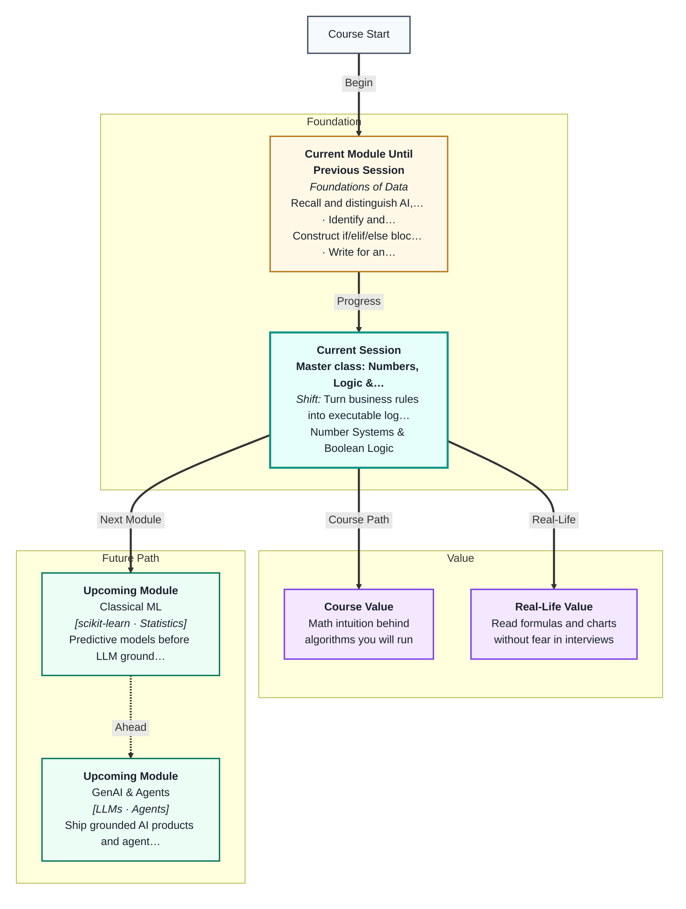
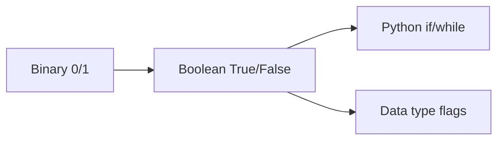
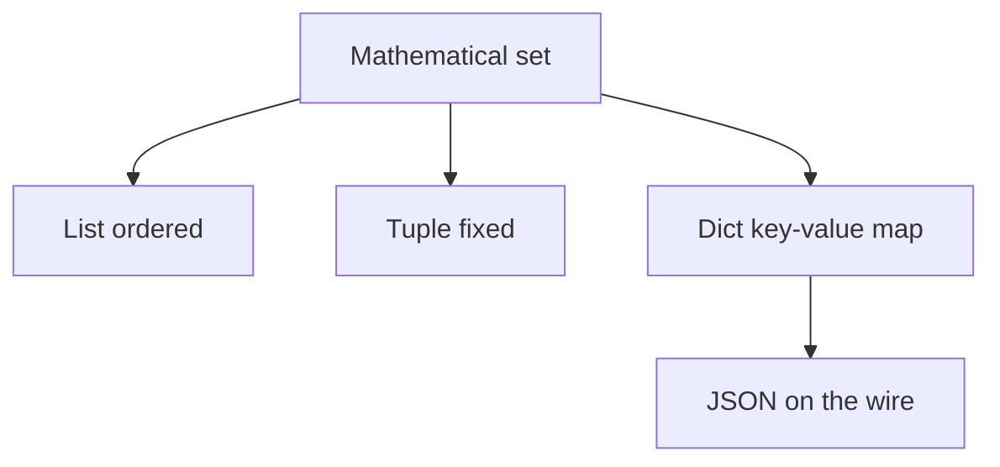

# Master Class: Numbers, Logic & Structure — The Mathematical Language of Data
---

## Mental Map

## What You'll Learn

In this pre-read, you'll discover:

- Why computers use **0 and 1** to represent every decision
- How **AND, OR, NOT** and truth tables mirror Python conditions
- What **sets** are and how lists, dicts, and JSON relate to set ideas
- How **functions** in math (domain → range) differ from but inform code functions
- Why this math sits underneath every data type you will use

---

## A. Binary and Boolean Logic

> 💡 **Analogy:** A light switch is only **on** or **off**. Every complex computer decision is built from millions of such switches.

**One-line definition:** **Boolean logic** uses True/False values combined with AND, OR, NOT to represent decisions.

| A | B | A AND B | A OR B |
|---|---|---|---|
| T | T | T | T |
| T | F | F | T |
| F | T | F | T |
| F | F | F | F |

**De Morgan's laws (intuition):** NOT (A AND B) = (NOT A) OR (NOT B) — flip each part and swap AND/OR.

---

## B. Set Theory — Lists, Dicts, JSON

> 💡 **Analogy:** A **set** is a bag of unique marbles — no duplicates. A **list** is marbles in order. A **dict** labels each marble with a name tag.

| Math idea | Python structure |
|---|---|
| Set membership | `x in my_list` |
| Union | combine unique items |
| Intersection | items in both |
| Mapping (function) | dict key → value |

---

## C. Functions in Math vs Code

> 💡 **Analogy:** A vending machine: you input coins (**domain**), it outputs a snack (**range**). Every input maps to **at most one** output.

**One-line definition:** A **function** maps each input from a **domain** to exactly one output in the **range**.

In Python, `def greet(name): return f"Hi {name}"` is the same idea: one input name → one output string.

---

## Practice Exercises

**1. Pattern Recognition** — Truth table: A=True, B=False. What is A OR B? A AND B?

**2. Concept Detective** — Why is a Python `set` better than a list for "unique user IDs"?

**3. Real-Life Application** — Give one example each of union and intersection in daily life.

**4. Spot the Error** — "A dict can have two identical keys with different values." True or false?

**5. Planning Ahead** — If domain is exam scores 0–100 and range is grades A–F, is one score → two grades allowed in a function?

---

> ✅ **You're done!** You see the math under Python's logic and collections. Next session: **functions** in code for reusable blocks.
