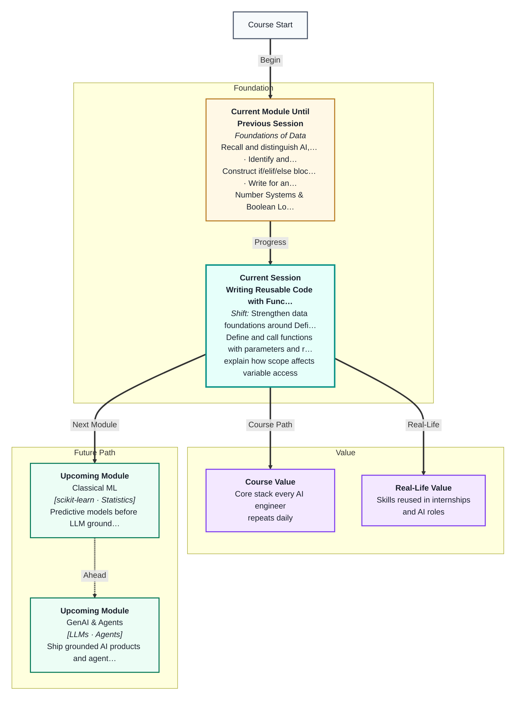
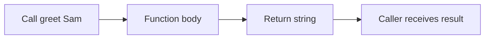

# Writing Reusable Code with Functions
---

## Mental Map



## What You'll Learn

In this pre-read, you'll discover:

- How to **define and call** functions with `def`
- How **parameters and arguments** pass data in
- How **return values** send results back
- How **scope** controls which variables exist where
- How **default arguments** make functions flexible

---

## A. Why Functions?

> 💡 **Analogy:** A **function** is a recipe card. Write it once; cook the dish whenever you need it — same steps, maybe different serving size (arguments).

**One-line definition:** A **function** is a named, reusable block of code that runs when called.

```python
def greet(name):
    return f"Hello, {name}"

print(greet("Sam"))
```

---

## B. Parameters, Return, and Scope

| Concept | Meaning |
|---|---|
| Parameter | Name in `def` |
| Argument | Value you pass in |
| return | Sends value back; ends function |
| Local scope | Variables inside function |



---

## C. Default Arguments and Modularity

```python
def power(base, exp=2):
    return base ** exp

power(5)      # 25
power(5, 3)   # 125
```

Refactor repeated blocks into one function — **DRY**: Don't Repeat Yourself.

---

## Practice Exercises

**1. Pattern Recognition** — What does `def f(): pass` do when called?

**2. Concept Detective** — A variable `x` is set inside a function but not returned. Can the caller use it?

**3. Real-Life Application** — Name three "functions" in real life (microwave preset, etc.).

**4. Spot the Error** — Function uses `total` but `total` was never passed or defined inside. Name the error type.

**5. Planning Ahead** — Design `celsius_to_fahrenheit(c)` with formula F = C × 9/5 + 32.

---

> ✅ **You're done!** Functions are your first modular design tool. Next: **data structures** for storing many values.
