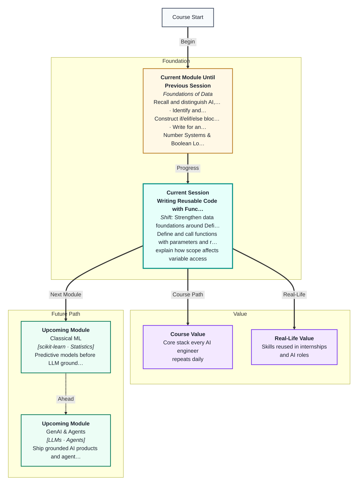
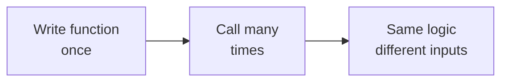
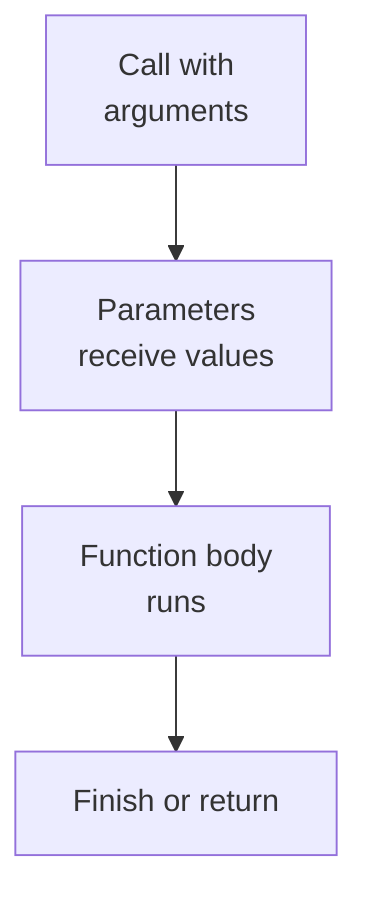
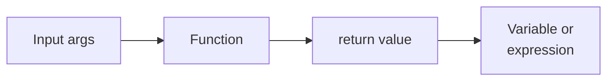
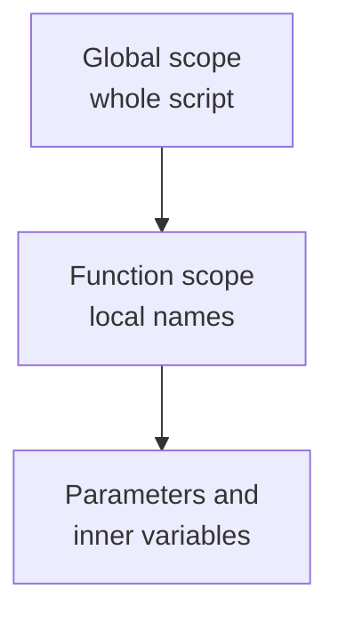
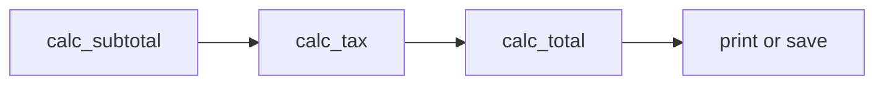
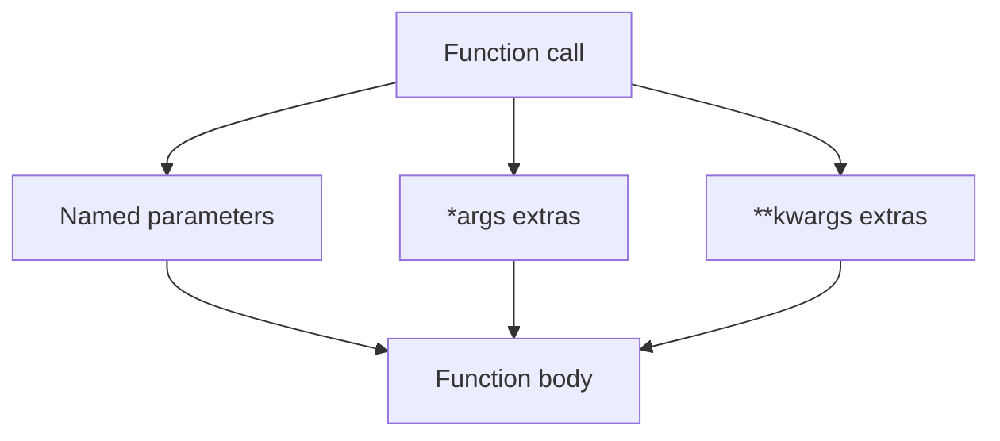

# Writing Reusable Code with Functions
---

## Mental Map



## What You'll Learn

In this pre-read, you'll discover:

- Why **functions** turn repeated code into named, reusable blocks you can trust
- How to **define and call** functions with `def`, parameters, and arguments
- How **return values and scope** control what goes in, what comes out, and what stays hidden
- How **default arguments** make functions flexible without copy-pasting signatures
- How **modularity** and refactoring prepare you for larger data scripts, APIs, and ML pipelines
- A preview of **docstrings** and flexible parameters (`*args`, `**kwargs`) used in real libraries

---

## A. Why Functions — Don't Repeat Yourself

> 💡 **Analogy:** A **recipe card** for chai: boil water, add tea, milk, sugar — same steps every morning, maybe different cup size. You do not rewrite the whole recipe for each guest.

**One-line definition:** A **function** is a named block of code you write once and run many times by **calling** its name.

```python
def greet(name):
    return f"Hello, {name}"

print(greet("Sam"))
print(greet("Ria"))
```



Without functions, changing one rule means hunting every copy-paste block. With one function, you fix it in **one place**.

| Problem with copy-paste | Function benefit |
|---|---|
| Bug fixed in one copy only | Fix once, all calls updated |
| Long scripts hard to read | Names describe intent (`calc_tax`) |
| Hard to test | Call function with sample inputs |
| Tax rate changes | Edit one `calc_tax`, not fifty blocks |

**DRY** means **Don't Repeat Yourself** — not "never repeat a line", but "do not duplicate the same **idea** in five places."

**When to reach for a function:**

- You wrote the same pattern twice with different variable names
- A block has a clear job you can name in plain English
- You want to test one piece without running the whole script
- A teammate should understand your code without reading every line

**Functions in data work:** Every Pandas helper, NumPy ufunc, and API client method is a function. You are learning the same building block professionals use at scale.

**Key facts:**

- A function is **defined** once with `def`
- A function is **called** whenever you need its job done
- The caller does not need to know internal steps — only inputs and outputs
- Good function names are verbs or verb phrases: `calc_total`, `load_csv`, `clean_email`

---

## B. def, Parameters, and Arguments

> 💡 **Analogy:** A pizza order form: **parameter** names are printed on the form ("size", "topping"). **Arguments** are what you write in — "large", "mushroom".

**One-line definition:** A **parameter** is the variable name in the function definition; an **argument** is the actual value you pass when you **call** the function.

```python
def area_rectangle(width, height):    # width, height = parameters
    return width * height

area_rectangle(5, 3)                  # 5, 3 = arguments
```



| Term | Where it appears | Example |
|---|---|---|
| Function name | `def` line and call | `area_rectangle` |
| Parameter | Inside parentheses in `def` | `width`, `height` |
| Argument | Inside parentheses in call | `5`, `3` |
| Call | Using the function | `area_rectangle(5, 3)` |

**Positional arguments** match order: first argument → first parameter.

```python
def describe_pet(name, species):
    return f"{name} is a {species}"

describe_pet("Milo", "cat")       # positional
describe_pet(species="dog", name="Rex")  # keyword — order flexible
```

**Keyword arguments** name the parameter at the call site. They help when a function has many parameters or you want to skip optional ones.

| Call style | Example | When to use |
|---|---|---|
| Positional | `power(2, 3)` | Few parameters, obvious order |
| Keyword | `power(base=2, exponent=3)` | Many parameters or skipped defaults |
| Mixed | `power(2, exponent=3)` | Positional first, then keywords |

**Void vs returning:** A function may `print` only (no `return`) — then the caller gets `None`. For reusable math and data steps, prefer **`return`** so you can store and combine results.

```python
def show_sum(a, b):
    print(a + b)          # displays only

def get_sum(a, b):
    return a + b          # caller can use the number

x = show_sum(3, 4)        # prints 7; x is None
y = get_sum(3, 4)         # y is 7
```

**Link to Session 5:** A math function maps input to output; `def` + `return` is how Python expresses that mapping in code.

---

## C. return — Sending Results Back

> 💡 **Analogy:** A vending machine: you put coins in, it **returns** one snack. You do not reach inside the machine's wiring — you get the **output** at the slot.

**One-line definition:** **return** sends a value back to whoever called the function and **ends** the function immediately.

```python
def double(n):
    return n * 2

result = double(7)
print(result)   # 14
```

| Statement | Effect |
|---|---|
| `return x` | Caller receives `x`; function stops |
| No `return` | Caller receives `None` |
| `return` alone | Returns `None`; still stops |
| Early `return` | Skips any code below in the function |



**Multiple steps inside, one output:**

```python
def discounted(price, pct):
    amount_off = price * pct / 100
    final = price - amount_off
    return final
```

The caller only needs `final` — internal variables like `amount_off` stay inside unless you return them.

**Early return with branching (Session 3 link):**

```python
def grade_label(score):
    if score >= 90:
        return "A"
    if score >= 75:
        return "B"
    return "C"

print(grade_label(88))   # B
```

Each `return` exits immediately — no need for `elif` chains after a return in many cases.

**Using return values in expressions:**

```python
total = discounted(1000, 10) + discounted(500, 20)
print(total)   # 900.0 + 400.0 = 1300.0
```

Only functions that **return** values can sit inside larger expressions. `print`-only functions cannot.

---

## D. Scope — Where Variables Live

> 💡 **Analogy:** A hotel room number is valid **inside your room**. The hallway has different guests — they cannot use your room key. **Local scope** is inside the function; **global** is the wider script.

**One-line definition:** **Scope** is the region where a variable name can be used — inside one function (**local**) or in the whole file (**global**).

```python
tax_rate = 0.18          # global

def calc_tax(amount):
    tax = amount * tax_rate   # reads global tax_rate
    return tax                # tax is local

# print(tax)   # Error — tax exists only inside calc_tax
```

| Variable | Scope | Visible outside function? |
|---|---|---|
| Parameter | Local | No |
| Variable created inside function | Local | No |
| Variable defined at top level of file | Global | Yes (read carefully) |
| Name assigned inside function | Local | Shadows global of same name |



**Best practice for learners:** Pass values in as parameters; **return** results out. Avoid changing global variables inside functions — harder to debug.

**Common error:**

```python
def add_bonus(salary):
    bonus = salary * 0.1
    new_salary = salary + bonus

add_bonus(50000)
print(new_salary)   # NameError — new_salary is local to the function
```

**Two fixes:**

1. `return new_salary` and assign: `final = add_bonus(50000)`
2. Pass `salary` in, return updated value — never rely on outer names

**Reading globals vs writing globals:** Reading a constant like `TAX_RATE` is common. **Assigning** to a global name inside a function creates a **new local** unless you use `global` (avoid for now). Prefer passing `tax_rate` as a parameter.

---

## E. Default Arguments — Flexible Signatures

> 💡 **Analogy:** A coffee order defaults to "medium" unless you say "large". The **default** saves you from repeating the same choice every time.

**One-line definition:** A **default argument** gives a parameter a fallback value when the caller omits it.

```python
def power(base, exp=2):
    return base ** exp

power(5)       # 25  — exp defaults to 2
power(5, 3)    # 125 — exp explicitly 3
```

| Call | `base` | `exp` | Result |
|---|---|---|---|
| `power(5)` | 5 | 2 (default) | 25 |
| `power(5, 3)` | 5 | 3 | 125 |
| `power(2, 10)` | 2 | 10 | 1024 |

**Rule:** Parameters with defaults must come **after** parameters without defaults:

```python
def greet(name, punctuation="!"):
    return f"Hello, {name}{punctuation}"

greet("Ria")
greet("Ria", "?")
```

**Invalid example:**

```python
# def bad(price, discount=10, currency):   # SyntaxError
# defaults must trail non-defaults
```

| Pattern | Example use | Benefit |
|---|---|---|
| Default rate | `tax_rate=0.18` | One place to change GST |
| Default discount | `pct=10` | Most orders use 10% off |
| Optional label | `currency="INR"` | Readable calls without clutter |
| Optional flag | `verbose=False` | Quiet by default, loud when debugging |

**Caution (mention only):** Mutable defaults like `def f(items=[])` can surprise you — the same list object is reused across calls. Use `None` and create the list inside for advanced courses. For now, stick to numbers and strings as defaults.

**Combining defaults with keyword calls:**

```python
def format_price(amount, currency="INR", decimals=2):
    return f"{currency} {amount:.{decimals}f}"

format_price(99.5)
format_price(99.5, currency="USD")
format_price(99.5, decimals=0)
```

---

## F. Modularity — Refactoring Scripts into Functions

> 💡 **Analogy:** Packing for travel: instead of throwing loose items in a suitcase, you use **labeled pouches** — toiletries, cables, documents. Functions are labeled pouches in your code.

**One-line definition:** **Modularity** means splitting a program into small, named pieces that each do one job well.

**Before (messy, repeated):**

```
# lines computing subtotal for order 1
# lines computing tax for order 1
# same logic copy-pasted for order 2 ...
```

**After (modular):**

```
calc_subtotal(items) → number
calc_tax(subtotal, rate) → number
calc_total(subtotal, tax) → number
```

| Function | Job | Typical inputs |
|---|---|---|
| `calc_subtotal` | Sum line items | list of prices |
| `calc_tax` | Apply tax rate | subtotal, rate |
| `calc_total` | Final amount | subtotal, tax |
| `format_receipt` | Human-readable string | order id, total |



**Refactoring** means improving structure **without changing behaviour** — same totals, cleaner code.

**Refactoring steps:**

1. Find repeated blocks — same pattern, different names
2. Name the job in plain English
3. Extract a `def` with parameters for what changes
4. `return` one clear result
5. Replace old blocks with calls
6. Test each function with known numbers before moving on

**Testing habit:** After each function, call it with a known example (`double(7)` should be `14`). Print checks are enough today; formal tests come later.

**Main section pattern:**

```python
def calc_subtotal(items):
    ...

def calc_tax(subtotal, tax_rate=0.18):
    ...

# --- main driver ---
orders = {101: [120, 450], 102: [50, 50]}
for order_id, items in orders.items():
    sub = calc_subtotal(items)
    tax = calc_tax(sub)
    ...
```

The bottom of the file reads like a **table of contents**; details live inside functions.

---

## G. Docstrings — Documenting Your Functions (Preview)

> 💡 **Analogy:** The **instruction label** on a microwave preset button: "Popcorn — 2:30, high." You see what it does without opening the machine.

**One-line definition:** A **docstring** is a triple-quoted string placed immediately under `def` that describes what the function does, its parameters, and what it returns.

```python
def calc_tax(amount, tax_rate=0.18):
    """Return tax amount for a given subtotal and rate."""
    return amount * tax_rate
```

| Element | Purpose |
|---|---|
| First line | Short summary — what the function does |
| Extra lines | Parameter and return notes (optional for beginners) |
| Triple quotes | `"""` or `'''` — must be first statement in function |

**Why docstrings matter:**

- **Future you** forgets details in two weeks
- **Teammates** read the summary before the code
- **`help()`** in Python displays the docstring

```python
help(calc_tax)
```

**Good vs weak docstrings:**

| Quality | Example |
|---|---|
| Weak | `"""does tax"""` |
| Good | `"""Return tax amount for subtotal at given rate (default 18%)."""` |
| Better (later) | Multi-line with Args/Returns sections like NumPy docs |

**Convention:** Write docstrings for every function you expect to reuse — especially in data pipelines where functions chain together.

**Preview only:** Full Google/NumPy docstring style is not required today. One clear sentence under each `def` is a strong habit.

---

## H. *args and **kwargs — Flexible Parameters (Preview)

> 💡 **Analogy:** A food court counter: some customers order one item, others three. **\*args** is the tray that holds however many items they hand you. **\*\*kwargs** is the order slip with labeled choices — "no ice", "extra spicy".

**One-line definition:** **\*args** collects extra positional arguments into a tuple; **\*\*kwargs** collects extra keyword arguments into a dictionary.

```python
def show_total(label, *amounts):
    return f"{label}: {sum(amounts)}"

show_total("Cart", 100, 250, 80)   # Cart: 430
```

```python
def build_profile(name, **details):
    profile = {"name": name}
    profile.update(details)
    return profile

build_profile("Ria", city="Pune", score=88)
# {'name': 'Ria', 'city': 'Pune', 'score': 88}
```

| Syntax | Collects | Type inside function |
|---|---|---|
| `*args` | Extra positional args | tuple |
| `**kwargs` | Extra keyword args | dict |



**Order rule in definition:** regular parameters, then `*args`, then `**kwargs`:

```python
def demo(a, b=1, *args, **kwargs):
    ...
```

**You will not write these daily yet** — but you will **read** them in library code:

```python
pd.read_csv("data.csv", sep=";", encoding="utf-8")
# Many keyword arguments passed to one flexible function
```

**When libraries use them:** APIs with optional settings, plotting functions with dozens of style options, ML model constructors with hyperparameters.

**For this course today:** Know the names and the idea — "extra arguments bundled up." Focus on clear named parameters and defaults; revisit `*args`/`**kwargs` when you read third-party docs.

---

## Practice Exercises

**1. Pattern Recognition**  
Two functions:

```python
def f():
    print("Hi")

def g():
    return "Hi"
```

What does `x = f()` store in `x`? What does `y = g()` store in `y`? Which is better if the caller needs the string for an email template?

**2. Concept Detective**  
A student writes:

```python
def add_bonus(salary):
    bonus = salary * 0.1
    new_salary = salary + bonus

add_bonus(50000)
print(new_salary)
```

Why does this crash? Name two different ways to fix it using ideas from this pre-read.

**3. Real-Life Application**  
Name three real-world "functions" (microwave preset, ATM withdrawal, ride fare estimate). For each, identify the **inputs** (parameters) and **output** (return).

**4. Spot the Error**  
```python
def apply_discount(price, discount=10, currency):
    return price * (1 - discount / 100)
```

Python rejects this definition. What rule about **default arguments** was broken?

**5. Planning Ahead**  
You have a 40-line script that calculates order totals for three orders with duplicated blocks. List the **three or four function names** you would create, what each would return, and in what order you would call them from a short `main` section at the bottom of the file.

---

> ✅ **You're done!** Functions are your first design tool for reusable, readable programs — parameters in, return values out, scope kept tidy, defaults and docstrings making calls clear. Next you will store **many values** in lists and dictionaries, then load real **files and JSON** — the same modular style scales to full data pipelines and every library you will import.
