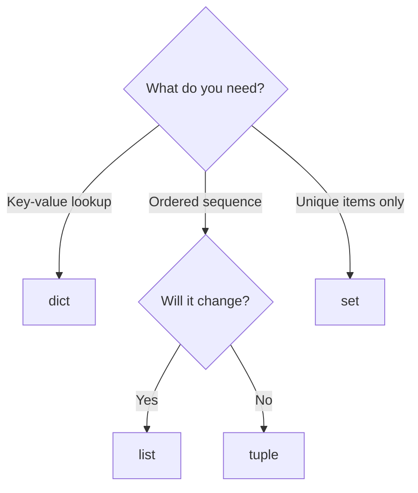

# Lecture Script: Python Data Structures (2 Hours)

> **Instructor Reference** — Module 1: Foundations of Data | Session 7 | Duration: 2 Hours

---

## Session Overview

**Duration**: 2 hours (105 min teaching + 5 min break + 10 min quiz buffer)

**Goal:** Students fluently create and manipulate lists, dicts, tuples, and sets — with confident indexing, slicing, nesting, structure selection, and a preview of list comprehensions.

**Student profile at this point:** Comfortable with variables, loops, functions, and if/else from Sessions 2–6. Ready to move from single values to collections that mirror real datasets.

**Key outcome:** Each student builds an in-memory **product catalog** — a list of dicts — with add, search, update, and summary operations. This pattern reappears in JSON, Pandas, and API work in Session 8.

**Today's Promise:** "By the end, you will build a product catalog in memory, reach any nested field with confidence, and know which container to pick before you write code."

---

## Timing Breakdown

| Segment | Duration | Cumulative |
|---|---|---|
| SEGMENT 1: Opening & Hook | 8 min | 0:08 |
| SEGMENT 2: Lists and Tuples | 15 min | 0:23 |
| SEGMENT 3: Dicts and Sets | 15 min | 0:38 |
| SEGMENT 4: Mutable vs Immutable | 12 min | 0:50 |
| **BREAK** | 10 min | 1:00 |
| SEGMENT 5: Indexing and Slicing | 15 min | 1:15 |
| SEGMENT 6: Nesting — List of Dicts | 12 min | 1:27 |
| SEGMENT 7: Product Catalog Capstone | 20 min | 1:47 |
| SEGMENT 8: Choosing Structures, Comprehensions & Wrap | 8 min | 1:55 |
| Quiz + Q&A buffer | 5 min | 2:00 |

---

## SEGMENT 1: Opening & Hook (8 min)

### Hook (3 min)

**Ask**: "Who has seen JSON from an API or a config file?" [Hands go up]

**Show on screen** (JSON-style snippet):

```json
[
  {"id": 1, "name": "Laptop", "price": 65000, "tags": ["tech", "sale"]},
  {"id": 2, "name": "Mouse", "price": 899, "tags": ["tech"]}
]
```

**Say**: "This is not magic. This is a Python **list of dictionaries**. By the end of today, you will build one yourself and know exactly how to reach `products[1]['tags'][0]`."

**Reveal**: "Four containers — list, tuple, dict, set — are how every dataset lives in memory before Pandas, JSON, or APIs enter the picture."

### Why This Matters (5 min)

**Connect**: "Session 6 taught functions that take single values. Real programs take **collections** — hundreds of users, thousands of orders."

| Container | One-line job |
|---|---|
| **list** | Ordered sequence that can change |
| **tuple** | Ordered record that stays fixed |
| **dict** | Lookup by name, not position |
| **set** | Unique members only |

**Learning contract for today:**
- Create and modify all four container types
- Index and slice sequences confidently
- Nest structures to model real records
- Build a product catalog lab end to end
- Preview list comprehensions for compact transforms

**Say**: "Pick the right shape first — wrong container means slow code or subtle bugs."

---

## SEGMENT 2: Lists and Tuples (15 min)

### Lists — Create and Read (5 min)

**Say**: "A list is an ordered, editable collection in square brackets."

**Show**:

```python
fruits = ["apple", "banana", "cherry"]
print(fruits[0])
print(len(fruits))
print(type(fruits))
```

Output:

```
apple
3
<class 'list'>
```

**Break it down**:
- `[ ]` creates a list literal
- Index `0` is the **first** item — same rule as Session 4
- `len()` counts items
- Lists are **ordered** — order matters

**Ask**: "What is `fruits[2]`?" → `"cherry"`.

**Common mistake**: Using index `3` on a 3-item list — valid indices are `0`, `1`, `2` only.

### Lists — Modify (5 min)

**Show**:

```python
fruits = ["apple", "banana", "cherry"]
fruits.append("date")
fruits.insert(1, "apricot")
removed = fruits.pop()
fruits.remove("banana")
print(fruits)
```

Output:

```
['apple', 'apricot', 'cherry']
```

**Break it down**:
- `append` adds to the **end**
- `insert(1, ...)` puts item at index 1, shifts others right
- `pop()` removes and returns **last** item (`date` was removed)
- `remove("banana")` deletes first matching value

**Ask**: "Which method removes by position vs by value?" → `pop(index)` vs `remove(value)`.

**Common mistake**: `remove("kiwi")` when `"kiwi"` is not in the list — raises `ValueError`.

### Lists — Iterate (2 min)

**Show**:

```python
scores = [88, 92, 79]
for s in scores:
    print(s)
```

Output:

```
88
92
79
```

**Break it down**:
- `for s in scores` — loop variable holds each item
- Same pattern as Session 4 — lists are the most common loop target

**Ask**: "How many iterations?" → Three.

**Common mistake**: Modifying a list while iterating over it — can skip items; loop over a copy if you must delete.

### Tuples — Fixed Records (3 min)

**Show**:

```python
point = (10, 20)
rgb = (255, 128, 0)
print(point[0])
print(point)

# point[0] = 5   # TypeError if uncommented
```

Output:

```
10
(10, 20)
```

**Break it down**:
- `( )` creates a tuple — parentheses, commas
- Reading by index works like lists
- **Assignment** to an index fails — tuples are **immutable**

**Ask**: "When would you use a tuple instead of a list?" → Fixed coordinates, RGB, return pairs from functions.

**Common mistake**: `(42)` is an `int`, not a tuple — use `(42,)` for one-item tuple.

### Tuple Unpacking (included)

**Show**:

```python
lat, lon = (19.076, 72.877)
name, age, city = ("Riya", 21, "Pune")
print(f"{name} lives in {city}")
```

Output:

```
Riya lives in Pune
```

**Break it down**:
- Left side variables match tuple length
- Common for function returns: `low, high = min_max(nums)`

**Ask**: "How many variables on the left for a 3-item tuple?" → Three.

**Common mistake**: `a, b = (1, 2, 3)` — too many values to unpack.

**Student try**: Create a list of three course names; append one; print the second item. **(2 min)**

---

## SEGMENT 3: Dicts and Sets (15 min)

### Dictionaries — Create and Access (5 min)

**Say**: "A dict maps **keys** to **values** — like a contact book lookup by name."

**Show**:

```python
student = {
    "name": "Riya",
    "age": 21,
    "courses": ["Python", "SQL"]
}

print(student["name"])
student["age"] = 22
student["city"] = "Pune"
print(student)
```

Output:

```
Riya
{'name': 'Riya', 'age': 22, 'courses': ['Python', 'SQL'], 'city': 'Pune'}
```

**Break it down**:
- Keys are strings here — must be immutable types
- `student["name"]` — bracket access by key
- New key `city` added with assignment
- Values can be any type — including lists

**Ask**: "What happens with `student["phone"]` if key missing?" → `KeyError`.

**Common mistake**: Using `.get()` vs `[]` — `get("phone", "N/A")` is safe when key may be absent.

### Safe Lookup with get (3 min)

**Show**:

```python
student = {"name": "Riya", "age": 21}
print(student.get("phone", "N/A"))
print(student.get("name"))
```

Output:

```
N/A
Riya
```

**Break it down**:
- Second argument to `.get` is default if key missing
- No crash — preferred for optional fields in records

**Ask**: "When to use `[]` vs `.get()`?" → `[]` when key must exist; `.get()` when optional.

**Common mistake**: `student.get("phone")` returns `None` when missing — fine, but document that behaviour.

### Loop Over Dict (2 min)

**Show**:

```python
for key, value in student.items():
    print(f"{key}: {value}")
```

Output:

```
name: Riya
age: 21
```

**Break it down**:
- `.items()` yields `(key, value)` pairs
- f-string formats readable lines

**Ask**: "What method gives only keys?" → `.keys()`.

**Common mistake**: Looping `for key in student` and expecting values — use `.items()` or `student[key]`.

### Sets — Uniqueness (5 min)

**Show**:

```python
tags = {"python", "ml", "data", "ml"}
print(tags)
print(len(tags))

words = ["data", "ml", "data", "ai", "ml", "ai"]
unique = set(words)
print(unique)
print(len(unique))
```

Output (order may vary):

```
{'python', 'ml', 'data'}
3
{'data', 'ml', 'ai'}
3
```

**Break it down**:
- Duplicate `"ml"` dropped at creation
- Sets are **unordered** — do not rely on print order
- `set(list)` deduplicates instantly

**Ask**: "Why is a set faster for `x in collection` on huge data?" → Hash-based lookup vs scanning a list.

**Common mistake**: `{}` creates empty **dict**, not set — use `set()` for empty set.

### Set Membership (bonus)

**Show**:

```python
user_ids = {"U-100", "U-200", "U-4821"}
print("U-4821" in user_ids)
print("U-9999" in user_ids)
```

Output:

```
True
False
```

**Break it down**:
- `in` on set is O(1) average — critical for large ID checks
- Pre-read exercise: list vs set for 10,000 IDs

**Ask**: "Would a list work for `in`?" → Yes, but slower at scale.

**Common mistake**: Expecting sets to preserve insertion order in older Python — 3.7+ dicts ordered; sets still unordered.

---

## SEGMENT 4: Mutable vs Immutable (12 min)

### The Core Idea (4 min)

**Say**: "Mutable means changeable in place. Immutable means you need a new object to 'change' it."

| Type | Mutable? |
|---|---|
| list | Yes |
| dict | Yes |
| set | Yes |
| tuple | No |
| str | No |
| int, float, bool | No |

**Ask**: "Why does mutability matter when two variables share data?" → Aliasing bugs.

**Common mistake**: Assuming `y = x` always copies — for lists it aliases the same object.

### Mutable Surprise — Shared List (4 min)

**Show**:

```python
a = [1, 2, 3]
b = a
b.append(4)
print("a:", a)
print("b:", b)
```

Output:

```
a: [1, 2, 3, 4]
b: [1, 2, 3, 4]
```

**Break it down**:
- `b = a` — both names point to **same list object**
- `b.append(4)` mutates that object — `a` sees the change

**Ask**: "How do you copy without sharing?" → `.copy()`, `list(a)`, or `a[:]`.

**Common mistake**: Thinking `b = a` makes an independent copy.

### Safe Copy (2 min)

**Show**:

```python
original = [1, 2, 3]
copy = original.copy()
copy.append(99)
print("original:", original)
print("copy:", copy)
```

Output:

```
original: [1, 2, 3]
copy: [1, 2, 3, 99]
```

**Break it down**:
- `.copy()` is a **shallow** copy — outer list independent
- Nested lists inside may still share — `deepcopy` later

**Ask**: "Which three ways make a shallow copy?" → `.copy()`, `list(original)`, `original[:]`.

**Common mistake**: Using `copy` as variable name shadowing `import copy` module — rename to `backup` in demos.

### Immutable Strings and Tuples (2 min)

**Show**:

```python
word = "Python"
# word[0] = "p"   # TypeError

config = ("localhost", 5432)
# config[0] = "127.0.0.1"   # TypeError
```

Output (if uncommented):

```
TypeError: 'str' object does not support item assignment
```

**Break it down**:
- Strings and tuples cannot change in place
- "Change" means create new object: `word = "python"` rebinds name

**Ask**: "How do you 'change' a tuple host?" → New tuple: `("127.0.0.1", 5432, "mydb")`.

**Common mistake**: Trying to patch tuple elements in config — redesign as dict if fields must update.

**Write on board:** **Mutable = shared changes hurt | Immutable = safer constants**

---

## — 10-MINUTE BREAK —

*Break prompt:* Write one example each of list, dict, and set from memory — syntax only.

---

## SEGMENT 5: Indexing and Slicing (15 min)

### Positive and Negative Index (5 min)

**Say**: "Indexing picks one item. Negative index counts from the end."

**Show**:

```python
nums = [10, 20, 30, 40, 50]

print(nums[0])
print(nums[-1])
print(nums[-2])
```

Output:

```
10
50
40
```

**Break it down**:
- `0` — first; `-1` — last; `-2` — second from end
- Works on lists, tuples, strings — all **sequences**

**Ask**: "What is `nums[-5]`?" → `10` (first item).

**Common mistake**: `nums[-0]` is same as `nums[0]` — `-0` is `0`.

### Slicing Basics (5 min)

**Show**:

```python
nums = [10, 20, 30, 40, 50]

print(nums[1:4])
print(nums[:3])
print(nums[2:])
print(nums[::2])
```

Output:

```
[20, 30, 40]
[10, 20, 30]
[30, 40, 50]
[10, 30, 50]
```

**Break it down**:
- `[start:stop]` — include start, **exclude** stop (like `range`)
- `[:3]` — from beginning; `[2:]` — through end
- `[::2]` — step of 2 — every other item

**Ask**: "What is `nums[1:4]` length?" → Three items (indices 1, 2, 3).

**Common mistake**: Expecting `nums[1:4]` to include index 4 — stop is exclusive.

### Reverse and Copy via Slice (3 min)

**Show**:

```python
nums = [10, 20, 30, 40, 50]
print(nums[::-1])
backup = nums[:]
print(backup)
```

Output:

```
[50, 40, 30, 20, 10]
[10, 20, 30, 40, 50]
```

**Break it down**:
- `[::-1]` reverses — common interview trick
- `[:]` shallow-copies entire list

**Ask**: "Does `nums[::-1]` change `nums`?" → No — slice creates new list.

**Common mistake**: Confusing slice copy with deep copy for nested lists.

### String Slicing (2 min)

**Show**:

```python
word = "Python"
print(word[0])
print(word[1:4])
print(word[-2:])
```

Output:

```
P
yth
on
```

**Break it down**:
- Strings slice like lists but are immutable
- Useful for parsing fixed-width text later

**Ask**: "Can you assign to `word[0]`?" → No — strings immutable.

**Common mistake**: Slicing a dict with `[0:2]` — dicts are not sequences; use keys.

**Student try**: Given `nums = [5, 10, 15, 20, 25]`, print first, last, and middle two (`[10, 15]`). **(2 min)**

---

## SEGMENT 6: Nesting — List of Dicts (12 min)

### The Pattern (4 min)

**Say**: "Real data is nested — list of dicts is the JSON table pattern."

**Show**:

```python
products = [
    {"id": 1, "name": "Laptop", "price": 65000, "tags": ["tech", "sale"]},
    {"id": 2, "name": "Mouse",  "price": 899,   "tags": ["tech"]},
    {"id": 3, "name": "Desk",   "price": 12000, "tags": ["furniture"]},
]

print(products[0]["name"])
print(products[1]["tags"][0])
```

Output:

```
Laptop
tech
```

**Break it down**:
- Outer `products` is a **list** — index picks record
- Inner `{"id": ...}` is a **dict** — key picks field
- `tags` is a **list** inside dict — second index into tags

**Ask**: "Trace `products[2]['price']`." → `12000`.

**Common mistake**: `products["name"]` — outer container is list, not dict.

### Drill Down Path (4 min)

**Write on board:**

```
products[1]["tags"][0]
    │      │     │    └── index into inner list
    │      │     └── key in dict
    │      └── index into outer list
    └── list variable
```

**Show loop over records**:

```python
for p in products:
    print(f"{p['id']}: {p['name']} — INR {p['price']}")
```

Output:

```
1: Laptop — INR 65000
2: Mouse — INR 899
3: Desk — INR 12000
```

**Break it down**:
- Each `p` is one dict — one product record
- Same pattern as iterating CSV rows before Pandas

**Ask**: "What type is `p` inside the loop?" → `dict`.

**Common mistake**: `p.name` — dict uses brackets `p['name']`, not dot notation (dot is for objects/modules).

### Dict of Lists (4 min)

**Show**:

```python
team_scores = {
    "alpha": [88, 92, 79],
    "beta":  [75, 80, 82],
}
print(team_scores["alpha"][1])
```

Output:

```
92
```

**Break it down**:
- Dict keys are team names
- Values are lists of scores
- `[1]` indexes into the score list

**Ask**: "Outer structure type? Inner value type?" → dict of lists.

**Common mistake**: Mixing up which bracket is for dict vs list — read outside-in.

**Say**: "`pd.DataFrame(products)` in a future session — today you are the DataFrame."

---

## SEGMENT 7: Product Catalog Capstone (20 min)

### Lab Overview (2 min)

**Say**: "Build an in-memory product catalog: list of dicts, with add, find, update, and summary functions from Session 6."

**Target functions:**

| Function | Job |
|---|---|
| `add_product(catalog, product_dict)` | Append one record |
| `find_by_id(catalog, product_id)` | Return dict or None |
| `update_price(catalog, product_id, new_price)` | Mutate matching record |
| `catalog_summary(catalog)` | Return count and total inventory value |

### Starter Catalog (3 min)

**Give students**:

```python
catalog = [
    {"id": 1, "name": "Laptop", "price": 65000, "tags": ["tech", "sale"]},
    {"id": 2, "name": "Mouse",  "price": 899,   "tags": ["tech"]},
]
```

**Ask**: "How do you print Mouse's price?" → `catalog[1]["price"]`.

**Common mistake**: Off-by-one — Mouse is index `1` but id `2`; id and index differ once you sort or delete.

### add_product (4 min)

**Show**:

```python
def add_product(catalog, product):
    """Append product dict to catalog list."""
    catalog.append(product)

add_product(catalog, {"id": 3, "name": "Desk", "price": 12000, "tags": ["furniture"]})
print(len(catalog))
print(catalog[-1]["name"])
```

Output:

```
3
Desk
```

**Break it down**:
- `catalog` is a list — `append` mutates in place
- Caller's list grows — mutability link from Segment 4
- `product` is a dict with consistent keys

**Ask**: "Does `add_product` need to return catalog?" → No if mutating same list; optional return for chaining.

**Common mistake**: `catalog = catalog.append(...)` — `append` returns `None`.

### find_by_id (4 min)

**Show**:

```python
def find_by_id(catalog, product_id):
    """Return product dict with matching id, or None."""
    for product in catalog:
        if product["id"] == product_id:
            return product
    return None

found = find_by_id(catalog, 2)
print(found["name"] if found else "Not found")
```

Output:

```
Mouse
```

**Break it down**:
- Loop + `if` — Sessions 3 and 4
- Early `return` when match found — Session 6
- `None` signals not found — caller checks before subscripting

**Ask**: "What if id does not exist?" → `None` — avoid `found["name"]` without check.

**Common mistake**: Returning index instead of dict — caller usually wants the record.

### update_price and catalog_summary (4 min)

**Show**:

```python
def update_price(catalog, product_id, new_price):
    """Update price for product with given id. Return True if updated."""
    product = find_by_id(catalog, product_id)
    if product:
        product["price"] = new_price
        return True
    return False

def catalog_summary(catalog):
    """Return tuple (count, total_value)."""
    total = 0
    for p in catalog:
        total += p["price"]
    return len(catalog), total

update_price(catalog, 2, 999)
count, value = catalog_summary(catalog)
print(f"{count} products, total value INR {value}")
```

Output:

```
3 products, total value INR 77999
```

**Break it down**:
- `update_price` reuses `find_by_id` — composition
- Mutates dict in place inside list
- `catalog_summary` returns **tuple** — unpack with `count, value = ...`

**Ask**: "Why is total value 77999?" → 65000 + 999 + 12000 after Mouse price update.

**Common mistake**: Summing prices before update — trace order of calls.

### Nested Access Lab — Drill (3 min)

**Show**:

```python
# Print all tags for product id 1
p = find_by_id(catalog, 1)
if p:
    for tag in p["tags"]:
        print(tag)

# List comprehension preview — uppercased names
names = [p["name"].upper() for p in catalog]
print(names)
```

Output:

```
tech
sale
['LAPTOP', 'MOUSE', 'DESK']
```

**Break it down**:
- `p["tags"]` is a list — inner loop
- Comprehension builds new list from catalog in one line — Segment 8 preview

**Ask**: "What is `p['tags'][1]` for Laptop?" → `sale`.

**Common mistake**: `KeyError` on `tags` if optional — use `.get("tags", [])`.

### Full Demo Run (4 min)

**Show end-to-end**:

```python
catalog = [
    {"id": 1, "name": "Laptop", "price": 65000, "tags": ["tech", "sale"]},
    {"id": 2, "name": "Mouse",  "price": 899,   "tags": ["tech"]},
]

add_product(catalog, {"id": 3, "name": "Desk", "price": 12000, "tags": ["furniture"]})
update_price(catalog, 2, 999)

for p in catalog:
    print(f"ID {p['id']}: {p['name']} @ {p['price']}")

count, value = catalog_summary(catalog)
print(f"Summary: {count} items, INR {value}")
```

Output:

```
ID 1: Laptop @ 65000
ID 2: Mouse @ 999
ID 3: Desk @ 12000
Summary: 3 items, INR 77999
```

**Break it down**:
- List of dicts + four functions = mini database
- Same structure exported as JSON in Session 8

**Ask**: "What Session 8 does with this catalog?" → Save to file, load back, send over API.

**Common mistake**: Hardcoding indices after deletes — prefer `find_by_id` by stable `id`.

---

## SEGMENT 8: Choosing Structures, Comprehensions & Wrap (8 min)

### Decision Guide (3 min)



| Scenario | Choice |
|---|---|
| Product records with named fields | list of dicts |
| Unique visitor IDs | set |
| Fixed RGB triple | tuple |
| Stock count by SKU | dict |

**Ask**: "CSV row with column names — what shape?" → list of dicts or dict of lists.

**Common mistake**: Using list of lists when records have names — dict keys are self-documenting.

### List Comprehension Preview (3 min)

**Show loop vs comprehension**:

```python
nums = [1, 2, 3, 4, 5]

squares_loop = []
for n in nums:
    squares_loop.append(n * n)

squares_comp = [n * n for n in nums]
evens = [n for n in nums if n % 2 == 0]

print(squares_loop)
print(squares_comp)
print(evens)
```

Output:

```
[1, 4, 9, 16, 25]
[1, 4, 9, 16, 25]
[2, 4]
```

**Break it down**:
- `[expr for item in seq]` — compact transform
- Optional `if` filters items
- Same result as loop — choose clarity for long logic

**Ask**: "When prefer a regular loop?" → Long bodies, multiple branches, side effects.

**Common mistake**: Nested comprehensions too deep — unreadable; use loop instead.

### Session Recap (2 min)

| Topic | Key Tool | Key Syntax |
|---|---|---|
| Ordered mutable | list | `[ ]`, `.append()` |
| Fixed record | tuple | `( )`, unpacking |
| Key lookup | dict | `{key: val}`, `.get()` |
| Unique set | set | `set()`, `in` |
| One item | index | `seq[i]`, `seq[-1]` |
| Subsequence | slice | `seq[start:stop]` |
| Table in memory | nest | `records[i]["field"]` |
| Compact list build | comprehension | `[x for x in seq]` |

**Bridge:** "Session 8 — **files, JSON, APIs**. Your catalog becomes `catalog.json` on disk and a response from a live endpoint."

---

## In-Class Quiz (10 Questions)

**Q1.** Which brackets create a list?  
**Q2.** What is the output of `len({1, 2, 2, 3})`?  
**Q3.** How do you access the value for key `"name"` in dict `student`?  
**Q4.** What does `nums[-1]` return for `nums = [5, 10, 15]`?  
**Q5.** Which types are mutable: list, tuple, dict, set?  
**Q6.** What is `nums[1:3]` for `nums = [10, 20, 30, 40]`?  
**Q7.** Why use a set for 10,000 user ID membership checks?  
**Q8.** In `products[0]["tags"][1]`, what does each bracket access?  
**Q9.** What is `[n * 2 for n in [1, 2, 3]]`?  
**Q10.** How do you safely get `phone` from dict `user` if key may be missing?

### Quiz Answer Key (Instructor Only)

1. Square brackets `[ ]`  
2. `3`  
3. `student["name"]` or `student.get("name")`  
4. `15`  
5. list, dict, set — mutable; tuple is not  
6. `[20, 30]`  
7. Faster `in` lookup; automatic uniqueness  
8. list index 0, dict key `tags`, list index 1  
9. `[2, 4, 6]`  
10. `user.get("phone", default)`  

---

## Homework / Self-Practice

1. Build a **student roster**: list of dicts with `name`, `score`, `city`. Write `class_average(roster)` function.
2. Given `words = ["data", "ml", "data", "ai"]`, print unique count with `set` and build `[w.upper() for w in words]` with comprehension.
3. Extend product catalog: `filter_by_tag(catalog, tag)` returning list of matching products.
4. Trace on paper: `team["alpha"][2]` for `team = {"alpha": [1,2,3], "beta": [4,5]}` before running.
5. Optional: Save catalog to JSON using `json.dump` preview from Session 8 pre-read.

**Exit ticket:** Write one line that prints the second product's first tag from a three-product catalog.

---

## FAQ — Frequently Asked Questions (8+)

**Q1: List or tuple for coordinates?**  
Tuple if fixed; list if points may be added to a path.

**Q2: Can dict keys be lists?**  
No — keys must be immutable. Use tuple of strings or a string id.

**Q3: Why did my set print in a different order?**  
Sets are unordered — order is not guaranteed.

**Q4: What is the difference between `append` and `extend`?**  
`append` adds one item (even a list as single element); `extend` adds each element from an iterable.

**Q5: Does slicing include the stop index?**  
No — `[1:4]` includes indices 1, 2, 3 only.

**Q6: Two variables, one list — why did both change?**  
Aliasing — assign `copy = original.copy()` for independence.

**Q7: How is JSON related to Python dicts?**  
JSON objects map to dicts; JSON arrays map to lists — Session 8 formalizes this.

**Q8: When use list comprehension vs loop?**  
Comprehension for simple transforms; loop for complex logic or side effects.

**Q9: Can I sort a dict by value?**  
`sorted(d.items(), key=lambda x: x[1])` — preview; Pandas sorts columns later.

**Q10: What is `{}` — set or dict?**  
Empty dict. Use `set()` for empty set.

**Q11: How do functions and structures combine?**  
Pass lists/dicts as parameters; return summaries — today's catalog lab pattern.

**Q12: Is `products[1]` the product with id 1?**  
Not necessarily — index 1 is second item; use `find_by_id` for stable lookup.

---

## Instructor Notes

- **Pre-read:** Sections A–H cover today's arc — open with hands-up on pre-read exercises, not full re-lecture.
- **Live coding:** Build catalog functions one at a time; test `find_by_id(catalog, 2)` before `update_price`.
- **Common student mistake:** `catalog.append` return value assigned back — `append` returns `None`.
- **Common student mistake:** `products["name"]` on a list — outer type drives first access.
- **Pacing:** Protect Segment 7 capstone; trim comprehension to one demo if behind.
- **Assessment:** Coding problem (first/last/slice, set unique count, dict sum) maps to Segments 2–5.
- **Connection:** Explicitly say `json.dump(catalog, f)` is next session — emotional bridge.
- **Differentiation:** Fast finishers add `filter_by_tag`, sort by price, or `deepcopy` discussion.
- **Mutable demo:** Shared list aliasing early prevents mysterious bugs in catalog updates.
- **Strict 2-hour:** Combine Segments 8 recap with quiz; assign one homework item as exit ticket.

---

## Appendix: Coding Problem Walkthrough (5 min if time)

Align with published coding problem:

```python
nums = [5, 10, 15, 20, 25]
print(nums[0])
print(nums[-1])
print(nums[1:3])
```

Output:

```
5
25
[10, 15]
```

**Break it down**:
- First, last, slice middle — Segment 5 skills
- Matches Task 1 in coding problem document

```python
words = ["data", "ml", "data", "ai", "ml", "ai"]
print(len(set(words)))
```

Output:

```
3
```

**Break it down**:
- Set deduplication — Segment 3

```python
inventory = {"apple": 3, "banana": 5}
print(sum(inventory.values()))
```

Output:

```
8
```

**Break it down**:
- `.values()` gives counts; `sum` aggregates — dict as inventory map

**Ask**: "Why not sum keys?" → Keys are product names, not counts.

**Common mistake**: `sum(inventory)` sums keys in Python 3 — use `.values()` for counts.
