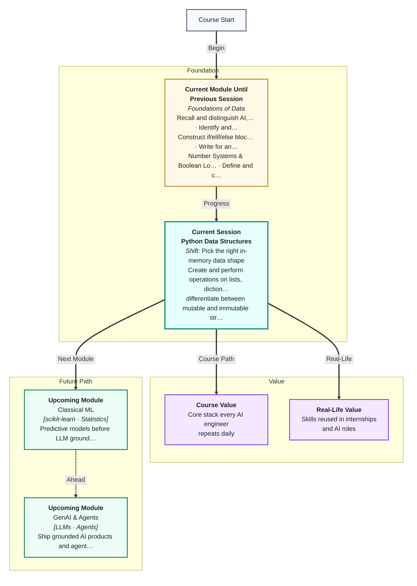
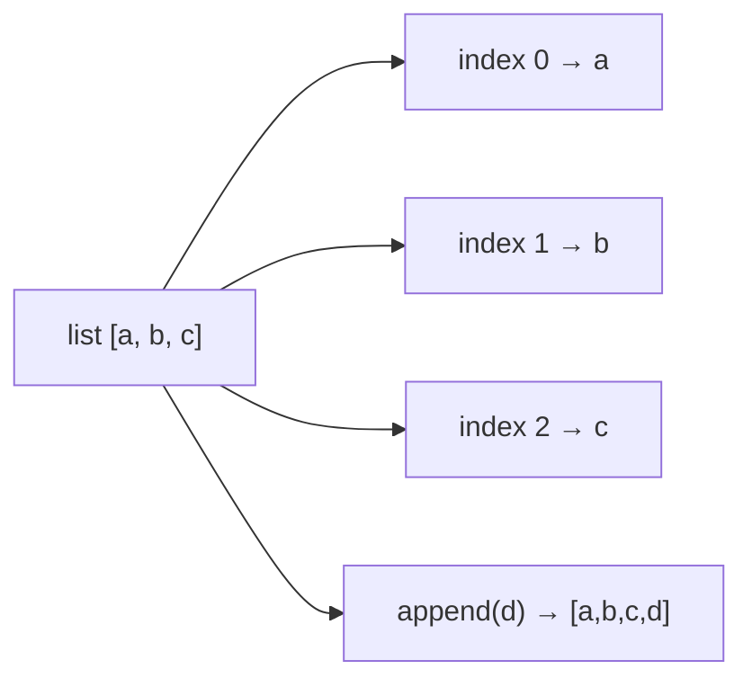
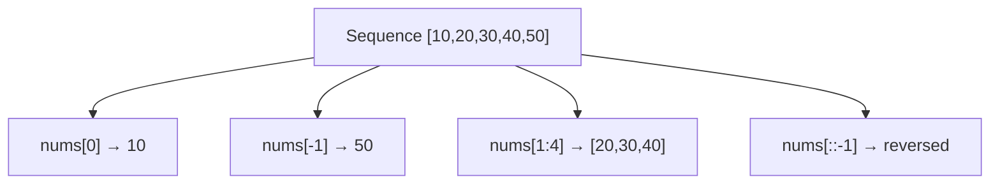
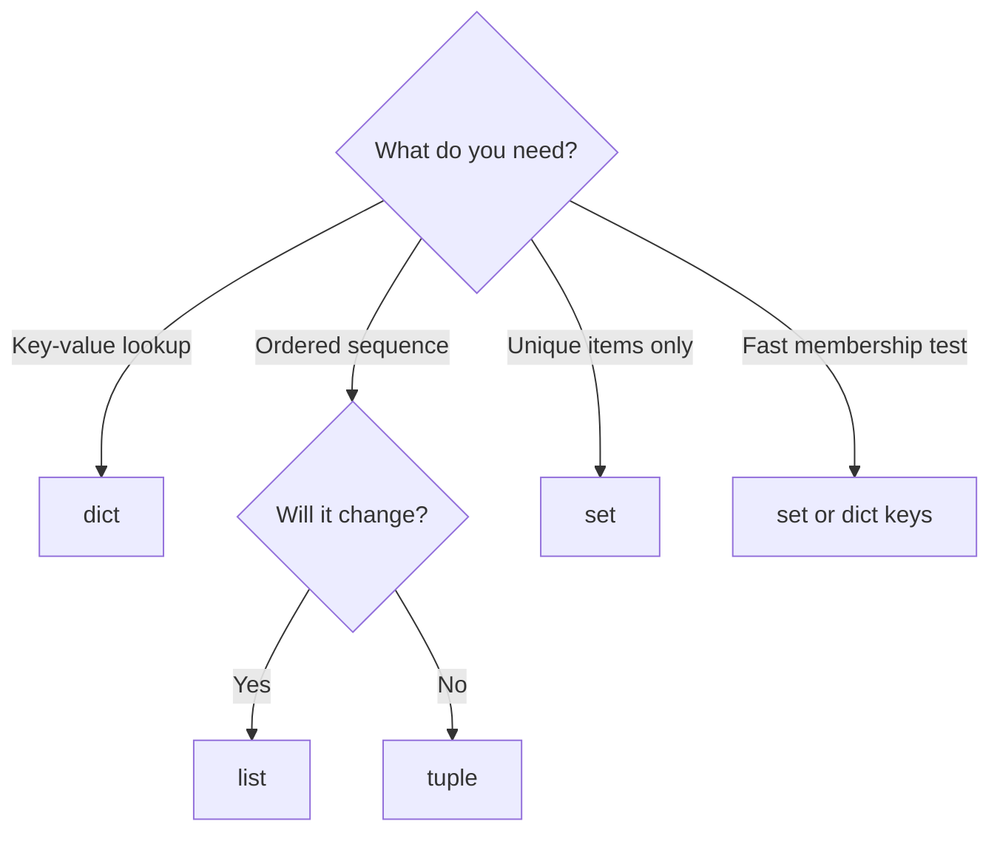

# Python Data Structures
---

## Mental Map



## What You'll Learn

In this pre-read, you'll discover:

- How **lists, dicts, tuples, and sets** store data differently — and when to use each
- How **indexing and slicing** let you reach one item or a slice of a sequence
- What **mutable vs immutable** means — and why it matters for bugs and performance
- How to **nest** structures to model real records like users, orders, and products
- How to **pick the right structure** for a problem before you write a single line of code
- A preview of **list comprehensions** — concise ways to build lists from loops

---

## A. Lists — Ordered, Editable Collections

> 💡 **Analogy:** A **list** is a shopping list on your phone. You can add items at the end, remove one in the middle, and reorder things — the list stays in the order you put them.

**One-line definition:** A **list** is an ordered, changeable collection of items written in square brackets `[ ]`.

```python
fruits = ["apple", "banana", "cherry"]
fruits.append("date")      # add to end
fruits[0] = "apricot"      # change first item
print(len(fruits))         # 4
```

**Common list operations:**

| Operation | Code | Result |
|---|---|---|
| Add one item | `items.append("x")` | Item at end |
| Add many | `items.extend(["a","b"])` | Extends list |
| Remove by value | `items.remove("x")` | First match gone |
| Remove by index | `items.pop(0)` | Returns removed item |
| Sort in place | `items.sort()` | List reordered |
| Count matches | `items.count("x")` | Integer count |
| Reverse | `items.reverse()` | Order flipped in place |

Lists can hold **mixed types** — numbers, strings, even other lists. In data work, lists often hold rows of records before you load them into Pandas.



**Creating lists:**

```python
empty = []
from_range = list(range(5))     # [0, 1, 2, 3, 4]
mixed = [1, "two", 3.0, True]
nested = [[1, 2], [3, 4]]
```

**Iteration (Session 4 link):**

```python
scores = [88, 92, 79]
for s in scores:
    print(s)
```

**Key idea:** Use a list when you have **many similar items in order** and the collection may **grow or shrink**.

---

## B. Tuples — Ordered, Fixed Records

> 💡 **Analogy:** A **tuple** is a printed train ticket. Seat number, coach, and date are fixed once printed — you cannot scribble over them without getting a new ticket.

**One-line definition:** A **tuple** is an ordered collection written in parentheses `( )` that **cannot be changed** after creation.

```python
point = (10, 20)
rgb = (255, 128, 0)
print(point[0])   # 10 — reading is fine

# point[0] = 5   # TypeError! Tuples are immutable
```

| Feature | list | tuple |
|---|---|---|
| Syntax | `[1, 2, 3]` | `(1, 2, 3)` |
| Mutable | Yes | No |
| Use when | Collection may grow or change | Fixed record (coordinates, DB row key) |
| Speed | Slightly slower | Slightly faster |
| As dict key | No | Yes (if all elements are hashable) |

**Single-item tuple trap:** `(42)` is just the number 42. Use `(42,)` with a trailing comma to make a one-item tuple.

```python
not_a_tuple = (42)
is_a_tuple = (42,)
print(type(not_a_tuple))   # int
print(type(is_a_tuple))    # tuple
```

**Tuple unpacking:**

```python
lat, lon = (19.076, 72.877)
name, age, city = ("Riya", 21, "Pune")
```

Use tuples when the shape of the data is **fixed by design** — GPS coordinates, RGB colour codes, or function return values that always come in pairs.

**Returning multiple values from functions (Session 6 link):**

```python
def min_max(nums):
    return min(nums), max(nums)

low, high = min_max([3, 9, 1, 7])
```

---

## C. Dictionaries — Lookup by Name

> 💡 **Analogy:** A **dictionary** is your phone's contact book. You look up a **name** (key) and get a **number** (value) — you do not search by position "contact #3."

**One-line definition:** A **dict** is a collection of **key → value** pairs written in curly braces `{ }`.

```python
student = {
    "name": "Riya",
    "age": 21,
    "courses": ["Python", "SQL"]
}

print(student["name"])           # Riya
student["age"] = 22              # update value
student["city"] = "Pune"         # add new key
print(student.get("phone", "N/A"))  # safe — no crash if missing
```

**Dict vs list — when to use which:**

| Need | Use | Why |
|---|---|---|
| Ordered sequence of similar items | list | Index 0, 1, 2… works |
| Named fields on one record | dict | Keys like `"email"`, `"score"` |
| Fast "does this exist?" check on keys | dict or set | O(1) lookup |
| Preserve insertion order of keys | dict (Python 3.7+) | Modern dicts remember order |

```python
# Loop over a dict
for key, value in student.items():
    print(f"{key}: {value}")
```

**Common dict methods:**

| Method | Purpose |
|---|---|
| `.keys()` | All keys |
| `.values()` | All values |
| `.items()` | (key, value) pairs |
| `.get(key, default)` | Safe lookup |
| `.pop(key)` | Remove key and return value |

In AI and data projects, **dicts are everywhere** — JSON from APIs, model configs, and hyperparameter settings all map to Python dictionaries.

**Keys must be immutable:** strings, numbers, tuples (if contents hashable). Lists cannot be keys.

---

## D. Sets — Unique Members Only

> 💡 **Analogy:** A **set** is a guest list with a bouncer at the door. If someone already checked in, they cannot enter again — **no duplicates allowed**, and order does not matter.

**One-line definition:** A **set** is an unordered collection of **unique** items written with `{ }` or `set()`.

```python
tags = {"python", "ml", "data", "ml"}  # duplicate "ml" dropped
print(tags)          # order not guaranteed
tags.add("ai")
tags.remove("data")

# set from a list — instant deduplication
words = ["data", "ml", "data", "ai"]
unique = set(words)
print(len(unique))   # 3
```

**Set operations useful in data work:**

| Operation | Code | Meaning |
|---|---|---|
| Union | `a \| b` or `a.union(b)` | All items in either set |
| Intersection | `a & b` or `a.intersection(b)` | Items in both |
| Difference | `a - b` | In a but not in b |
| Membership test | `"ml" in tags` | True/False — very fast |

**Empty set trap:** `{}` creates an empty **dict**, not a set. Use `set()` for empty set.

```python
empty_set = set()
empty_dict = {}
```

Use a set when you care about **uniqueness** — unique user IDs, unique words in a document, or checking whether an item was already processed.

---

## E. Indexing and Slicing

> 💡 **Analogy:** **Indexing** is opening a specific locker by number. **Slicing** is photocopying lockers 3 through 7 in one go — you get a **new** sub-collection without touching the rest.

**One-line definition:** **Indexing** picks one item by position; **slicing** picks a range using `[start:stop:step]`.

```python
nums = [10, 20, 30, 40, 50]

print(nums[0])      # 10 — first item
print(nums[-1])     # 50 — last item (negative = from end)
print(nums[-2])     # 40 — second from end

print(nums[1:4])    # [20, 30, 40] — index 1 up to (not including) 4
print(nums[:3])     # [10, 20, 30] — from start
print(nums[2:])     # [30, 40, 50] — from index 2 to end
print(nums[::2])    # [10, 30, 50] — every second item
print(nums[::-1])   # [50, 40, 30, 20, 10] — reversed
```

**Slicing rules:**

| Syntax | Meaning |
|---|---|
| `[i]` | Single item at index i |
| `[start:stop]` | From start up to (not including) stop |
| `[start:stop:step]` | Same range, every step items |
| `[:]` | Copy of entire sequence |



**Important:** Slicing works on **lists, tuples, and strings** — all are **sequences**. Dicts use **keys**, not numeric indexes (unless the key happens to be a number).

Strings slice too:

```python
word = "Python"
print(word[0])      # P
print(word[1:4])    # yth
```

**Index errors:** `nums[100]` raises `IndexError` — position does not exist. Slicing is forgiving: `nums[100:200]` returns `[]`.

---

## F. Nesting — Structures Inside Structures

> 💡 **Analogy:** **Nesting** is like a folder inside a folder on your laptop. The outer folder holds several inner folders, and each inner folder holds files — you drill down layer by layer.

**One-line definition:** **Nesting** means placing one data structure inside another — lists of dicts, dicts of lists, dicts of dicts.

```python
# List of dicts — common pattern for a table of records
products = [
    {"id": 1, "name": "Laptop",  "price": 65000, "tags": ["tech", "sale"]},
    {"id": 2, "name": "Mouse",   "price": 899,   "tags": ["tech"]},
    {"id": 3, "name": "Desk",    "price": 12000, "tags": ["furniture"]},
]

print(products[0]["name"])           # Laptop
print(products[1]["tags"][0])        # tech

# Dict of lists — grouping values under one key
team_scores = {
    "alpha": [88, 92, 79],
    "beta":  [75, 80, 82],
}
print(team_scores["alpha"][1])       # 92
```

**How to reach nested data:**

```
products[1]["tags"][0]
    │      │     │    └── index into inner list
    │      │     └── key in dict
    │      └── index into outer list
    └── outer list name
```

**Read nested data step by step:**

1. `products` — the outer list
2. `products[1]` — second dict in the list
3. `products[1]["tags"]` — list of tags for that product
4. `products[1]["tags"][0]` — first tag string

This pattern — a **list of dictionaries** — is exactly what `pd.DataFrame(records)` expects. You are already thinking like a data engineer.

**Dict of dicts (nested config):**

```python
config = {
    "database": {"host": "localhost", "port": 5432},
    "api": {"timeout": 30, "retries": 3}
}
print(config["database"]["host"])
```

---

## G. Mutable vs Immutable — What Can Change?

> 💡 **Analogy:** A **whiteboard** (mutable) — you can erase and rewrite. A **carved stone tablet** (immutable) — once engraved, you need a new tablet to change the message.

**One-line definition:** **Mutable** objects can be changed in place; **immutable** objects cannot — any "change" creates a new object.

| Type | Mutable? | Can you change contents after creation? |
|---|---|---|
| list | Yes | append, assign by index |
| dict | Yes | add/update/delete keys |
| set | Yes | add/remove elements |
| tuple | No | fixed — create new tuple instead |
| str | No | `"hello"[0] = "H"` crashes |
| int, float, bool | No | `x = 5; x += 1` rebinds name, does not mutate 5 |

**Why this matters:**

```python
# Mutable surprise — two names, one list
a = [1, 2, 3]
b = a              # b points to SAME list as a
b.append(4)
print(a)           # [1, 2, 3, 4] — a changed too!

# Immutable safety — two names, independent ints
x = 10
y = x
y = 20             # y now points to 20; x still 10
print(x)           # 10
```

**Copying a list safely:**

```python
original = [1, 2, 3]
copy = original.copy()      # or list(original) or original[:]
copy.append(99)
print(original)   # [1, 2, 3] — unchanged
```

**Shallow vs deep copy (preview):** `.copy()` copies the outer list but inner objects may still be shared. For nested data, `copy.deepcopy()` comes later.

When you pass a list to a function and the function modifies it, the caller sees the change. When you pass a tuple, the function cannot alter the original. This is why configs sometimes use tuples and working data uses lists.

---

## H. Choosing the Right Structure — and List Comprehensions (Preview)

> 💡 **Analogy:** Picking a container is like picking luggage — a backpack for daily items, a suitcase for a fixed packing list, a labelled folder for documents by name, and a guest list when duplicates are not allowed.

**One-line definition:** Pick the structure that matches how you **access**, **update**, and **uniquely identify** your data.

**Decision guide:**



| Scenario | Best choice | Reason |
|---|---|---|
| 100 student records with name, grade, email | list of dicts | Each record has named fields |
| Unique visitor IDs from a log file | set | Automatic deduplication |
| RGB colour that never changes | tuple | Immutable triple |
| Count items in stock by product name | dict | Key = product, value = count |
| Time-series temperatures in order | list | Ordered, may append new readings |
| Remove duplicate tags from a blog post | set | Uniqueness |

**Rule of thumb:** Start with a **dict** for one record, a **list** for many similar records, a **set** for uniqueness, and a **tuple** when the data must not change.

### List comprehensions — preview

> 💡 **Analogy:** A **photo filter** that applies the same edit to every picture in an album at once — one compact line instead of opening each file manually.

**One-line definition:** A **list comprehension** builds a new list by applying an expression to each item in a sequence, often with a filter.

**Loop version:**

```python
nums = [1, 2, 3, 4, 5]
squares = []
for n in nums:
    squares.append(n * n)
print(squares)   # [1, 4, 9, 16, 25]
```

**Comprehension version:**

```python
nums = [1, 2, 3, 4, 5]
squares = [n * n for n in nums]
print(squares)   # [1, 4, 9, 16, 25]
```

**With a filter:**

```python
evens = [n for n in nums if n % 2 == 0]
print(evens)   # [2, 4]
```

| Form | Pattern |
|---|---|
| Basic | `[expr for item in sequence]` |
| With filter | `[expr for item in sequence if condition]` |

**When to use:** Short, readable transforms — squaring numbers, uppercasing strings, extracting one field from records. When logic gets long, a regular `for` loop is clearer.

**You will see comprehensions again** in Pandas-adjacent code and when cleaning lists before analysis. Today: recognise the pattern; write simple ones; prefer clarity over cleverness.

---

## Practice Exercises

**1. Pattern Recognition**  
Look at these four declarations and label each as list, tuple, dict, or set:  
`(1, 2, 3)`, `{"a": 1, "b": 2}`, `[1, 2, 2, 3]`, `{1, 2, 3}`.  
For each, also state whether it is mutable or immutable.

**2. Concept Detective**  
A teammate stores 10,000 user IDs pulled from a database and needs to check `"U-4821" in collection` thousands of times per second. They used a list. Explain why a set would be faster and rewrite the creation line using `user_ids = [...]` (a long list of strings).

**3. Real-Life Application**  
Name three real situations where you would use: (a) a list, (b) a dictionary, (c) a set. Each situation should come from everyday apps or services you use — not abstract textbook examples.

**4. Spot the Error**  
```python
config = ("localhost", 5432, "mydb")
config[0] = "127.0.0.1"
```
What error appears and why? What two alternative approaches would fix the intent (changing the host)?

**5. Planning Ahead**  
Design a nested Python structure for a small online store: three products, each with `id`, `name`, `price`, and a list of `tags`. Write the structure as a list of dicts (pseudocode or real Python). Then write one line that would print the tags of the second product.

---

> ✅ **You're done!** You now understand how Python's four core containers — lists, tuples, dicts, and sets — hold data differently, how indexing and slicing reach into sequences, why mutable vs immutable behaviour affects real bugs, and how list comprehensions offer a compact loop alternative. These structures are the in-memory building blocks for every CSV row, JSON object, and API response you will handle next. In the upcoming session, you'll persist and exchange that data through **files, JSON, and APIs**.
