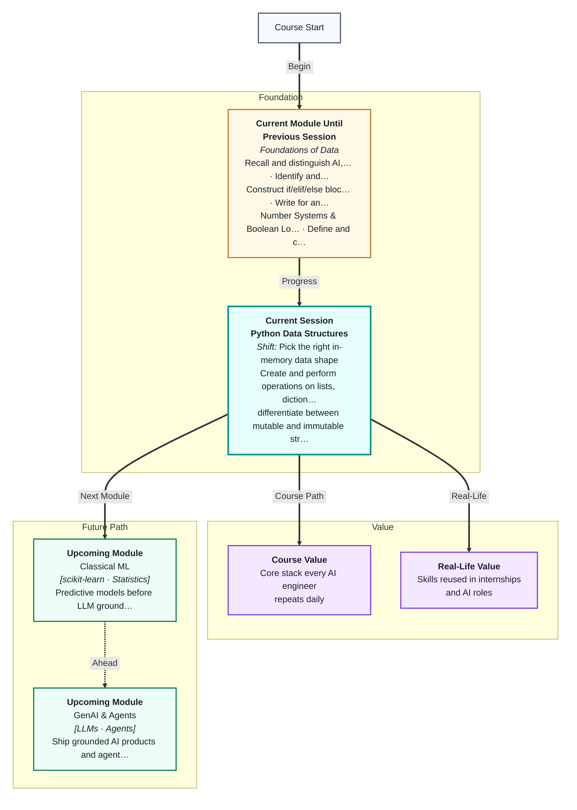
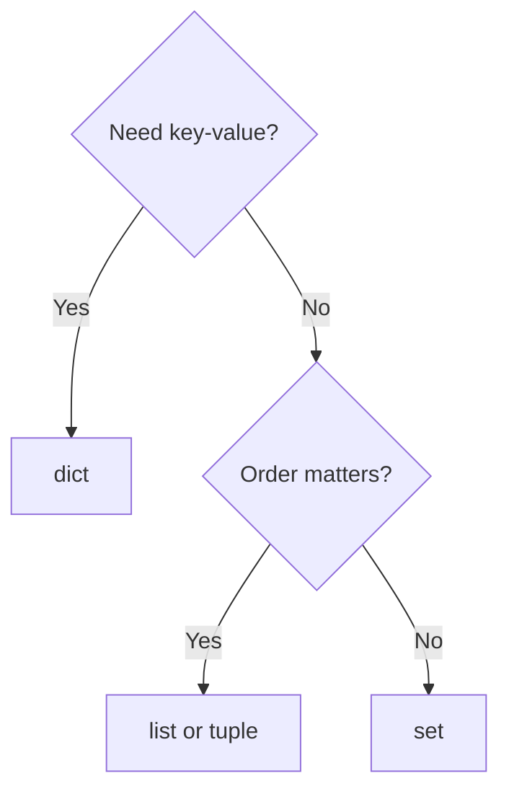

# Python Data Structures
---

## Mental Map



## What You'll Learn

In this pre-read, you'll discover:

- How **lists, dicts, tuples, and sets** store data differently
- **Indexing and slicing** on sequences
- **Mutable vs immutable** — what you can change in place
- **Nesting** structures for real records
- How to **pick the right structure** for a problem

---

## A. Lists and Tuples

> 💡 **Analogy:** A **list** is a shopping list you can edit. A **tuple** is a printed receipt — fixed once created.

| | list | tuple |
|---|---|---|
| Syntax | `[1,2]` | `(1,2)` |
| Mutable | Yes | No |
| Use | Changing collections | Fixed records |

```python
items = ["pen", "book"]
items.append("bag")
coords = (12.9, 77.6)
```

---

## B. Dictionaries and Sets

> 💡 **Analogy:** A **dict** is a contact book: name → number. A **set** is a unique guest list — no duplicates.

```python
user = {"name": "Alex", "role": "analyst"}
tags = {"ml", "python", "ml"}
```



---

## C. Indexing, Slicing, Nesting

```python
nums = [10, 20, 30, 40]
nums[0]    # 10
nums[-1]   # 40
nums[1:3]  # [20, 30]

team = [{"name": "A", "score": 9}, {"name": "B", "score": 7}]
```

---

## Practice Exercises

**1. Pattern Recognition** — Which types are mutable: list, tuple, dict, set?

**2. Concept Detective** — Store 50 student IDs with no duplicates — list or set?

**3. Real-Life Application** — Model a movie ticket: title, seat, price — which structures?

**4. Spot the Error** — `t = (1, 2); t[0] = 5` — what happens?

**5. Planning Ahead** — Nested dict for two users with name and email lists.

---

> ✅ **You're done!** You can choose and manipulate core Python containers. Next: **files, JSON, and APIs**.
