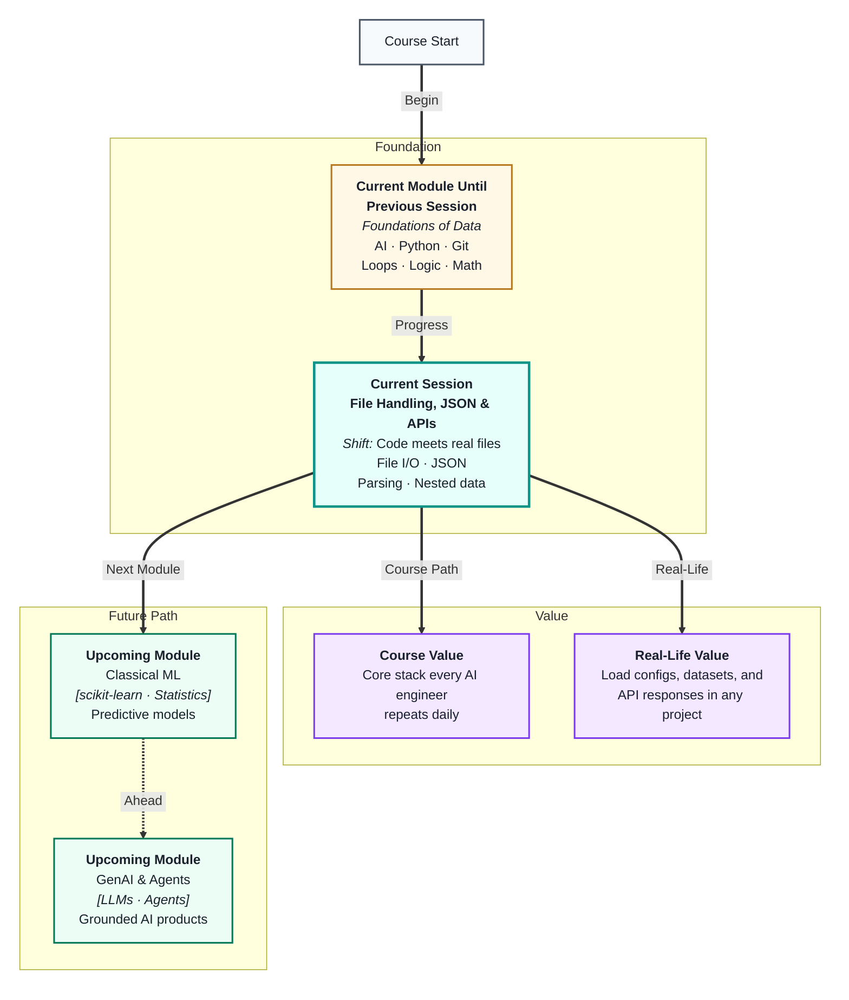
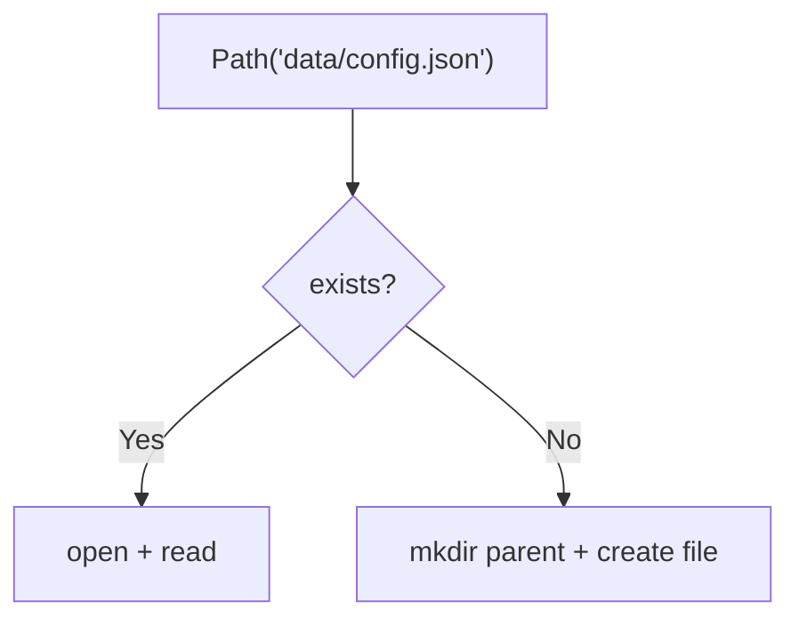
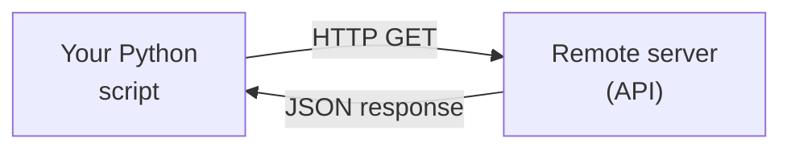
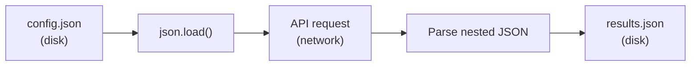

# File Handling, JSON & APIs
---

## Mental Map



## What You'll Learn

In this pre-read, you'll discover:

- How Python **reads and writes files** safely using `open()` and the `with` statement
- What **JSON** is and why it is the universal language of data exchange on the web
- How to **parse** JSON strings and files into Python dictionaries and lists
- How to navigate **nested JSON** — the structure every real API returns
- How **HTTP APIs** let your program fetch live data from services over the internet
- How to handle **errors ethically** and protect **API keys** when building real pipelines

---

## A. File I/O — Reading and Writing Files in Python

> 💡 **Analogy:** A book in a library sits on a shelf until someone borrows it, reads it, makes notes, and returns it. Python's file system works identically — a file sits on disk until your program **opens** it, does something with it, and **closes** it. Forgetting to close the book puts it in limbo.

**One-line definition:** **File I/O (Input/Output)** is the process of opening a file on disk, reading or writing its contents in memory, and closing it — using Python's built-in `open()` function.

```mermaid
flowchart LR
    DISK["File on disk\n(data.txt)"] -->|open()| MEM["Python reads into\nmemory (string/lines)"]
    MEM -->|process| CODE["Your code\nworks on the data"]
    CODE -->|write + close| DISK2["Updated file\non disk"]
```

**The three file modes:**

| Mode | Symbol | What it does | Use when |
|---|---|---|---|
| Read | `'r'` | Opens for reading (default) | Loading existing files |
| Write | `'w'` | Creates or overwrites the file | Saving new output |
| Append | `'a'` | Adds to the end of an existing file | Adding to logs |

**Two ways to open files — always prefer the second:**

```python
# Way 1: Manual open and close (risky — if code crashes, file stays open)
f = open('data.txt', 'r')
content = f.read()
f.close()

# Way 2: Context manager (always closes automatically, even on error)
with open('data.txt', 'r') as f:
    content = f.read()
# File is automatically closed here
print(content)
```

**The `with` statement is not optional in professional code.** It guarantees the file is closed no matter what happens — errors included.

**Three ways to read:**

```python
with open('data.txt', 'r') as f:
    entire_content = f.read()       # One big string

with open('data.txt', 'r') as f:
    all_lines = f.readlines()       # List of strings, one per line

with open('data.txt', 'r') as f:
    for line in f:                  # Memory-efficient: one line at a time
        print(line.strip())         # strip() removes the trailing \n
```

| Method | Returns | Best for |
|---|---|---|
| `f.read()` | One string with everything | Small files, full content needed |
| `f.readlines()` | List of strings | Iterating lines by index |
| `for line in f` | One line at a time | Large files, memory efficiency |

**Common file errors you will see:**

| Error | Cause | Fix |
|---|---|---|
| `FileNotFoundError` | Path is wrong or file missing | Check path with `Path.exists()` |
| `PermissionError` | No read/write access | Check folder permissions |
| Empty output | Opened with `'w'` by mistake | Use `'r'` to read, `'w'` only to overwrite |

**Key facts:**

- Files live on **disk** — they survive after your program ends
- Variables in memory disappear when the program stops; files do not
- Always specify the mode explicitly: `'r'`, `'w'`, or `'a'`
- Text files use string methods; binary files need `'rb'` / `'wb'` (advanced topic)

---

## B. Writing Files and File Paths

> 💡 **Analogy:** Writing to a file is like filling out a printed form — you are putting information into a permanent storage format that others (or your future self) can read later. Unlike a variable in memory, a file persists when the program closes.

**One-line definition:** Writing to a file means sending a string from Python's memory onto disk — `'w'` mode creates or overwrites, `'a'` mode appends to the end.

**Writing example:**

```python
# Writing a new file
results = ["Accuracy: 0.94\n", "Precision: 0.91\n", "Recall: 0.88\n"]

with open('model_results.txt', 'w') as f:
    f.writelines(results)  # Write all lines at once

# Or write line by line
with open('model_results.txt', 'w') as f:
    f.write("Accuracy: 0.94\n")
    f.write("Precision: 0.91\n")

# Appending to an existing log
with open('run_log.txt', 'a') as f:
    f.write("Run completed at 2025-03-01 14:32\n")
```

**File paths — absolute vs relative:**

| Type | Example | When to use |
|---|---|---|
| **Relative** | `'data/scores.txt'` | From the current working directory |
| **Absolute** | `'/Users/alice/project/data/scores.txt'` | Always works regardless of where script runs |

**Best practice for paths — use `pathlib`:**

```python
from pathlib import Path

# Portable, works on Windows, Mac, and Linux
data_path = Path('data') / 'scores.txt'
print(data_path)           # data/scores.txt

# Create folder if missing
data_path.parent.mkdir(parents=True, exist_ok=True)

# Check if file exists before opening
if data_path.exists():
    with open(data_path, 'r') as f:
        print(f.read())
else:
    print("File not found!")
```

Never hardcode `'C:\\Users\\alice\\...'` — it breaks on every other machine.

**Path operations cheat sheet:**

| Task | Code |
|---|---|
| Build a path | `Path('data') / 'file.json'` |
| Check exists | `path.exists()` |
| Create directory | `path.mkdir(parents=True, exist_ok=True)` |
| Get parent folder | `path.parent` |
| Get filename only | `path.name` |
| Get suffix | `path.suffix` → `.json` |



**Writing CSV-style text (preview before Pandas):**

```python
from pathlib import Path

Path('data').mkdir(exist_ok=True)
rows = [
    "name,score\n",
    "Riya,91\n",
    "Bob,88\n",
]
with open(Path('data') / 'scores.csv', 'w') as f:
    f.writelines(rows)
```

This is how data leaves your notebook and becomes a file someone else can open in Excel or load with Pandas later.

---

## C. JSON — The Language of Data Exchange

> 💡 **Analogy:** When people from different countries need to communicate, they often use a common language (e.g., English). When programs on different machines — built in different languages — need to exchange data, they use **JSON**: a text format that every language can read and write.

**One-line definition:** **JSON (JavaScript Object Notation)** is a text format that represents structured data as key-value pairs and lists — readable by humans and parseable by virtually every programming language.

**JSON looks almost exactly like Python dictionaries and lists:**

```json
{
  "name": "Alice",
  "age": 28,
  "skills": ["Python", "SQL", "Pandas"],
  "address": {
    "city": "Mumbai",
    "pincode": "400001"
  },
  "is_active": true,
  "score": null
}
```

**Type mapping — JSON to Python:**

| JSON type | Python equivalent | Example |
|---|---|---|
| `string` | `str` | `"Alice"` |
| `number` | `int` or `float` | `28`, `3.14` |
| `array` | `list` | `["Python", "SQL"]` |
| `object` | `dict` | `{"city": "Mumbai"}` |
| `true` / `false` | `True` / `False` | `true` → `True` |
| `null` | `None` | `null` → `None` |

**The two core JSON operations in Python:**

```python
import json

# 1. json.loads() — parse a JSON STRING into Python objects
json_string = '{"name": "Alice", "age": 28, "skills": ["Python", "SQL"]}'
data = json.loads(json_string)
print(type(data))          # <class 'dict'>
print(data['name'])        # Alice
print(data['skills'][0])   # Python

# 2. json.dumps() — convert Python objects to a JSON STRING
student = {"name": "Bob", "score": 91.5, "passed": True}
json_output = json.dumps(student, indent=2)
print(json_output)
```

**Memory trick:** `loads` = Load from **S**tring. `dumps` = Dump to **S**tring.

**Valid JSON rules (Python is more forgiving):**

| Rule | JSON | Python |
|---|---|---|
| Keys | Must be double-quoted strings | Can be any hashable type |
| Booleans | `true`, `false` (lowercase) | `True`, `False` |
| Null | `null` | `None` |
| Trailing commas | Not allowed | Allowed in lists/dicts |
| Comments | Not allowed | `# comment` works |

**Common `json.loads()` errors:**

| Error | Cause |
|---|---|
| `JSONDecodeError` | Missing quote, trailing comma, single quotes |
| `TypeError` | Passed a dict instead of a string to `loads` |

---

## D. Reading and Writing JSON Files

> 💡 **Analogy:** `json.loads()` is like translating a letter written in French into English in your head. `json.load()` is like directly reading a French book — the translator (Python) reads the file and converts it all in one step.

**One-line definition:** `json.load()` reads a JSON file directly into Python objects; `json.dump()` writes Python objects directly to a JSON file — both handle the file + parsing in one combined step.

**The four JSON functions — a clear map:**

| Function | Operates on | Direction | Use |
|---|---|---|---|
| `json.loads(s)` | String | JSON → Python | Parse API response string |
| `json.dumps(obj)` | Python object | Python → JSON | Convert to JSON string |
| `json.load(f)` | File object | JSON file → Python | Read a `.json` file |
| `json.dump(obj, f)` | Python obj + file | Python → JSON file | Write to a `.json` file |

**File read/write examples:**

```python
import json

# --- Read a JSON file ---
with open('config.json', 'r') as f:
    config = json.load(f)          # Reads file + parses in one step

print(config['model_name'])        # Access like a normal dict

# --- Write a JSON file ---
results = {
    "experiment": "run_01",
    "accuracy": 0.94,
    "hyperparams": {"lr": 0.001, "epochs": 50}
}

with open('results.json', 'w') as f:
    json.dump(results, f, indent=2)    # indent makes it human-readable
```

**Why save data as JSON instead of plain text?**

```mermaid
flowchart LR
    A["Plain text file\n'name: Alice, age: 28'"] -->|"custom parsing\n(fragile)"| B["Python dict"]
    C["JSON file\n{\"name\":\"Alice\",\"age\":28}"] -->|"json.load()\n(always works)"| D["Python dict"]
```

JSON gives you structure for free — no custom parsing required.

**Round-trip pattern (save and reload):**

```python
import json
from pathlib import Path

catalog = [
    {"id": 1, "name": "Laptop", "price": 65000},
    {"id": 2, "name": "Mouse",  "price": 899},
]

path = Path('data') / 'catalog.json'
path.parent.mkdir(exist_ok=True)

with open(path, 'w') as f:
    json.dump(catalog, f, indent=2)

with open(path, 'r') as f:
    restored = json.load(f)

print(restored[0]["name"])   # Laptop — structure preserved
```

**`indent=2` vs compact JSON:**

| Option | Output | Use when |
|---|---|---|
| `indent=2` | Pretty, multi-line | Config files humans edit |
| No indent | One long line | APIs, logs, minimal size |
| `ensure_ascii=False` | Keeps Unicode (Hindi, emoji) | Multilingual data |

---

## E. Nested JSON — Navigating Real-World API Responses

> 💡 **Analogy:** A Russian nesting doll (matryoshka) has dolls inside dolls inside dolls. **Nested JSON** is the same — objects contain objects contain arrays contain objects. Knowing how to reach the innermost doll without getting confused is the core skill.

**One-line definition:** **Nested JSON** is JSON where values are themselves objects or arrays — requiring chained key and index access to reach deeply nested data, which is the standard format returned by real-world APIs.

**A realistic API response (weather API style):**

```python
response = {
    "city": "Mumbai",
    "country": "IN",
    "weather": [
        {
            "main": "Clouds",
            "description": "scattered clouds"
        }
    ],
    "main": {
        "temp": 305.15,
        "feels_like": 310.2,
        "humidity": 78
    },
    "wind": {
        "speed": 5.1,
        "deg": 240
    }
}
```

**Accessing nested values — layer by layer:**

```python
# Top level
print(response['city'])                    # "Mumbai"

# One level deep (dict inside dict)
print(response['main']['temp'])            # 305.15
print(response['wind']['speed'])           # 5.1

# Array inside top-level (list index + key)
print(response['weather'][0]['main'])      # "Clouds"
print(response['weather'][0]['description'])  # "scattered clouds"

# Convert temperature from Kelvin to Celsius
temp_c = response['main']['temp'] - 273.15
print(f"Temperature: {temp_c:.1f}°C")     # 32.0°C
```

**Safe access with `.get()` — prevents KeyError on missing keys:**

```python
# This crashes if 'rain' key doesn't exist
# rain = response['rain']['1h']  # KeyError!

# Safe approach: .get() returns None if key is absent
rain = response.get('rain', {}).get('1h', 0)
print(f"Rainfall: {rain} mm")    # 0 mm (no KeyError)
```

**Flattening a list of API records into a table:**

```python
# API returned a list of user records
users = [
    {"id": 1, "name": "Alice", "address": {"city": "Mumbai"}},
    {"id": 2, "name": "Bob",   "address": {"city": "Delhi"}},
    {"id": 3, "name": "Charlie", "address": {"city": "Bangalore"}}
]

# Extract specific fields into a flat list of dicts (ready for DataFrame)
flat_users = [
    {
        "id": u["id"],
        "name": u["name"],
        "city": u["address"]["city"]
    }
    for u in users
]

print(flat_users)
```

This pattern — fetch JSON from an API, flatten the nested fields, load into a DataFrame — is one of the most frequently repeated patterns in all of data engineering and ML work.

**Navigation cheat sheet:**

```
response['weather'][0]['main']
    │        │      │     └── key inside inner dict
    │        │      └── index into list
    │        └── key whose value is a list
    └── top-level dict
```

---

## F. APIs & HTTP — Talking to Services Over the Web

> 💡 **Analogy:** An **API** is a restaurant menu with a fixed list of dishes. You order by name (endpoint); the kitchen (server) sends back your meal (JSON response). You do not walk into the kitchen — you use the menu.

**One-line definition:** An **API (Application Programming Interface)** lets your program request data or actions from another service over the internet using **HTTP** — the same protocol your browser uses.



**Key HTTP concepts:**

| Concept | Meaning | Example |
|---|---|---|
| URL / Endpoint | Address of the resource | `https://api.open-meteo.com/v1/forecast` |
| Method | What action to perform | `GET` (read), `POST` (send/create) |
| Status code | Did it work? | `200` OK, `404` Not Found |
| Params | Query string on GET URL | `?latitude=19.076&longitude=72.877` |
| Headers | Metadata about the request | `Authorization: Bearer <key>` |
| Body | Data sent (POST) or received | JSON string |

**GET vs POST:**

| | GET | POST |
|---|---|---|
| Purpose | Read/fetch data | Send data to create or process |
| Data location | URL parameters | Request body (JSON) |
| Example | Weather forecast | Submit a form, call ChatGPT |
| Safe to repeat? | Yes (idempotent) | No (may create duplicates) |

**Basic request with the `requests` library:**

```python
import requests

# GET — parameters in URL
response = requests.get(
    "https://api.github.com",
    timeout=10
)
print(response.status_code)   # 200
print(type(response.json()))  # dict
```

**Install once:** `pip install requests`

**What happens step by step:**

1. Your code sends an HTTP request to a URL
2. The remote server processes the request
3. The server sends back a response with a status code and body
4. You parse the body — often JSON — into Python objects

**Public APIs good for learning:**

| API | Key required? | Returns |
|---|---|---|
| Open-Meteo | No | Weather forecasts |
| GitHub public | No | Repo metadata |
| httpbin.org | No | Echo/test requests |
| OpenWeatherMap | Yes (free tier) | Weather data |

---

## G. Error Handling & Ethics — Building Responsibly

> 💡 **Analogy:** Calling an API is like phoning a help desk. Sometimes they answer (200 OK), sometimes the line is busy (429), sometimes you dial the wrong number (404). A professional caller checks the response before assuming success — and never shouts their password into the phone.

**One-line definition:** **Error handling** means checking whether a file or API call succeeded before using the result; **ethics** means respecting rate limits, protecting secrets, and using data responsibly.

**Status codes students must know:**

| Code | Meaning | What to do |
|---|---|---|
| 200 | OK — success | Parse `response.json()` |
| 401 | Unauthorised — bad/missing key | Check API key and headers |
| 404 | Not found — wrong URL | Check endpoint documentation |
| 429 | Rate limited — too many requests | Wait and retry with backoff |
| 500 | Server error | Retry; report to API provider |

**Always check before parsing:**

```python
import requests

response = requests.get(url, params=params, timeout=10)

if response.status_code == 200:
    data = response.json()
else:
    print(f"Failed: {response.status_code}")
```

**API key security — non-negotiable rules:**

| Rule | Bad | Good |
|---|---|---|
| Never hardcode keys | `api_key = "sk-secret"` | `os.environ.get("MY_API_KEY")` |
| Never commit `.env` | Push secrets to GitHub | Add `.env` to `.gitignore` |
| Revoke if exposed | Hope nobody noticed | Rotate key immediately |

**Using a `.env` file locally:**

```bash
# .env file (add to .gitignore immediately)
MY_API_KEY=your_key_here
```

```python
# pip install python-dotenv
from dotenv import load_dotenv
import os

load_dotenv()   # reads .env into environment
api_key = os.environ.get("MY_API_KEY")
```

**Retry pattern for flaky networks:**

```python
import time
import requests

def safe_api_call(url, params=None, retries=3):
    for attempt in range(retries):
        try:
            response = requests.get(url, params=params, timeout=10)
            if response.status_code == 200:
                return response.json()
            elif response.status_code == 429:
                time.sleep(2 ** attempt)  # exponential backoff
            else:
                return None
        except requests.exceptions.Timeout:
            time.sleep(2)
    return None
```

**Ethics checklist:**

| Principle | Practice |
|---|---|
| Respect rate limits | Add delays; backoff on 429 |
| Read Terms of Service | Some APIs forbid commercial use |
| Never commit keys | Use `.env`; revoke if exposed |
| Cache in development | Avoid hammering APIs during testing |
| Handle errors gracefully | Never show raw API errors to end users |
| Minimise data fetched | Request only the fields you need |

**Teaching line to remember:** *"An API key is a password. Treat it like your bank PIN."*

---

## H. End-to-End Pipeline Preview — Disk → Network → Disk

> 💡 **Analogy:** A pipeline is like a factory assembly line: raw materials arrive (config file), machines process them (API call), and finished products ship out (results JSON). Each station has a clear job — and quality control at every step.

**One-line definition:** An **end-to-end data pipeline** chains file I/O, configuration loading, API fetching, JSON parsing, and result saving into one repeatable workflow.



**The five pipeline steps you will build in class:**

| Step | Action | Tool |
|---|---|---|
| 1 | Load settings from disk | `json.load()` |
| 2 | Build API URL and params | dict from config |
| 3 | Fetch live data | `requests.get()` + `safe_api_call()` |
| 4 | Navigate nested response | keys, indexes, flatten loop |
| 5 | Save results to disk | `json.dump()` |

**Mini pipeline example (conceptual):**

```python
import json
import requests
from pathlib import Path

# 1. Load config
with open('data/config.json', 'r') as f:
    config = json.load(f)

# 2. Call API (Open-Meteo — no key needed)
city = config["cities"][0]
lat, lon = 19.076, 72.877  # Mumbai coordinates

response = requests.get(
    "https://api.open-meteo.com/v1/forecast",
    params={
        "latitude": lat,
        "longitude": lon,
        "daily": "temperature_2m_max",
        "forecast_days": config["settings"]["forecast_days"],
    },
    timeout=10,
)

# 3. Parse and save
if response.status_code == 200:
    output = {"city": city, "forecast": response.json()["daily"]}
    Path('data').mkdir(exist_ok=True)
    with open(config["output_path"], 'w') as f:
        json.dump(output, f, indent=2)
```

**What you gain from this pattern:**

- **Reproducibility** — rerun the same pipeline with a new config
- **Auditability** — saved JSON files show what was fetched and when
- **Separation** — config (what to fetch) vs code (how to fetch)

**Bridge to upcoming sessions:** Every CSV you `read_csv()` in Pandas and every LLM API call in the GenAI module follows this same skeleton — **load settings → fetch data → parse structure → save or analyse**.

---

## Practice Exercises

**1. Pattern Recognition**  
Given this JSON string: `'{"student": "Riya", "grades": {"math": 88, "science": 92, "english": 79}, "rank": 3}'`  
Write the Python code to: (a) parse it with `json.loads()`, (b) print Riya's science grade, (c) compute her average grade across all three subjects, (d) add a new key `"average"` with that value, and (e) write the updated dictionary to a file called `riya_report.json`.

**2. Concept Detective**  
A teammate runs the following code and gets an error: `KeyError: 'rainfall'`  
```python
data = {"temp": 32, "humidity": 70, "wind": {"speed": 12}}
print(data['rainfall'])
```  
Using section E, explain (a) why the error occurs, (b) how `.get()` would fix it, and (c) rewrite the line to safely return `0` if `'rainfall'` is missing.

**3. Real-Life Application**  
Name three real apps or services you use that rely on APIs returning JSON. For each, describe one piece of data the API likely returns (e.g., temperature, username, transaction amount).

**4. Spot the Error**  
A student writes this code to log results to a file:  
```python
f = open('results.txt', 'w')
for score in [88, 92, 79]:
    f.write(f"Score: {score}\n")
# Program crashes here due to a different bug
f.close()  # This line never runs
```  
Using section A, identify (a) what happens to the file if `close()` is never reached, (b) how the `with` statement would prevent this, and (c) rewrite the code correctly.

**5. Planning Ahead**  
You are building a configuration system for an ML pipeline. The pipeline needs to store: model name, hyperparameters (learning rate, epochs, batch size), input data path, and output directory. Design the complete config as a Python dictionary, write it to `pipeline_config.json` with proper indentation, then write the code to load it back and print each setting using a loop over `config.items()`. Finally, add a safety check: if the `input_data_path` file does not exist, print a warning before the pipeline starts.

---

> ✅ **You're done!** You now know how to open, read, and write files safely using the `with` statement; how to parse, navigate, and write JSON — the format that powers every config file, API response, and dataset export you will encounter; and how HTTP APIs connect your code to live data on the internet. Next up: **NumPy Foundations & Array Operations**, where you'll move from processing one value at a time to processing entire arrays of numbers in a single operation — the mathematical engine behind all of data science and ML.
