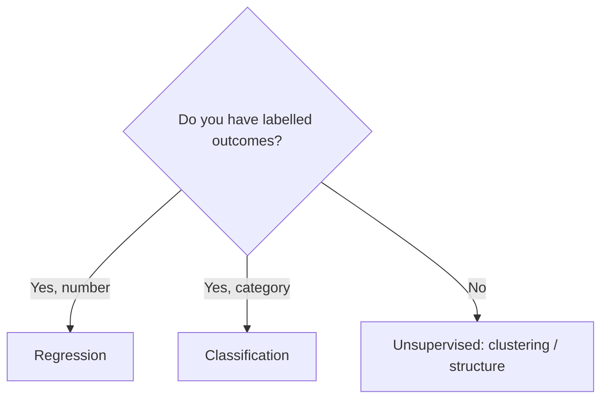
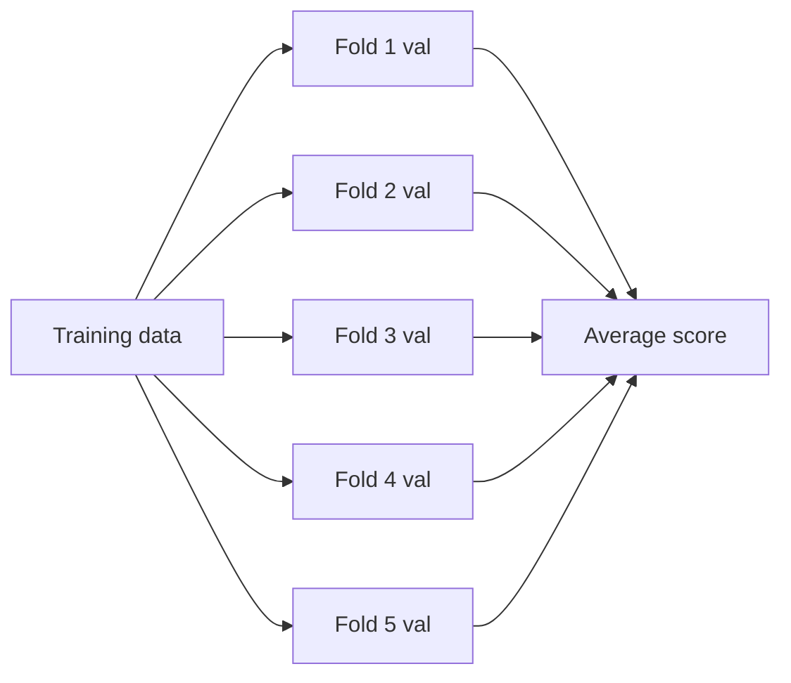

# ML Workflow & Problem Framing
---

## Mental Map

*(Generated by mental-map script — see mental Map file in this folder.)*

## What You'll Learn

In this pre-read, you'll discover:

- How to tell **supervised** apart from **unsupervised** learning
- How to turn a fuzzy business ask into a concrete **ML problem type**
- How `train_test_split` protects you from fooling yourself
- How `cross_val_score` gives a more reliable performance estimate
- How to **justify a metric choice** instead of picking one at random

---

## A. Supervised vs Unsupervised Learning

> 💡 **Analogy:** Supervised learning is studying with an answer key — you check every practice question against the correct answer. Unsupervised learning is sorting a box of mixed buttons by look alone, with no answer key telling you the "right" groups.

**One-line definition:** **Supervised learning** trains on labelled examples (input → known output); **unsupervised learning** finds structure in data that has no labels.

| Type | Has labels? | Goal | Example |
|---|---|---|---|
| Supervised: Regression | Yes (number) | Predict a quantity | House price |
| Supervised: Classification | Yes (category) | Predict a label | Churn yes/no |
| Unsupervised: Clustering | No | Find groups | Customer segments |
| Unsupervised: Dim. reduction | No | Compress features | PCA for visualization |



---

## B. Framing a Business Problem as an ML Problem

> 💡 **Analogy:** A doctor doesn't start treatment by ordering random tests — they first ask "what exactly are we trying to find out?" Problem framing is that diagnostic question, asked before any code is written.

**One-line definition:** **Problem framing** is translating a vague business goal ("reduce churn") into a precise, measurable ML task (predict, for each customer, the probability they cancel next month).

| Business ask | ML framing | Type |
|---|---|---|
| "Reduce customer churn" | Predict churn probability per customer next 30 days | Binary classification |
| "Price our new listings better" | Predict fair market price from listing features | Regression |
| "Understand our customer base" | Group customers into behavioural segments | Clustering |
| "Flag suspicious transactions" | Predict probability a transaction is fraud | Classification (imbalanced) |

---

## C. Splitting Data Honestly: train_test_split

> 💡 **Analogy:** You wouldn't let a student see the exam questions while studying for it — then call the resulting 100% "proof they learned the subject." A model must be tested on data it has never seen.

**One-line definition:** `train_test_split` divides your dataset into a **training set** (to fit the model) and a **test set** (to honestly evaluate it), so performance numbers reflect real-world behaviour.

```python
from sklearn.model_selection import train_test_split
import pandas as pd

df = pd.read_csv("customers.csv")
X = df.drop(columns=["churned"])
y = df["churned"]

X_train, X_test, y_train, y_test = train_test_split(
    X, y, test_size=0.2, random_state=42, stratify=y
)
print(X_train.shape, X_test.shape)
```

`stratify=y` keeps the class ratio the same in both splits — important when churn is rare.

---

## D. Cross-Validation: A More Trustworthy Score

> 💡 **Analogy:** Judging a chef on one dish is risky — they might have gotten lucky. Asking them to cook five different dishes for five different judges and averaging the scores gives a fairer picture. That's what cross-validation does for a model.

**One-line definition:** `cross_val_score` repeatedly splits the training data into different train/validation folds and averages the results, reducing the risk that one lucky (or unlucky) split misleads you.

```python
from sklearn.model_selection import cross_val_score
from sklearn.linear_model import LogisticRegression

model = LogisticRegression(max_iter=1000)
scores = cross_val_score(model, X_train, y_train, cv=5, scoring="accuracy")
print(scores)
print(f"Mean CV accuracy: {scores.mean():.3f} (+/- {scores.std():.3f})")
```



---

## Practice Exercises

**1. Pattern Recognition** — Classify each as regression, classification, or clustering: (a) predicting delivery time, (b) grouping products by sales pattern, (c) predicting if an email is spam.

**2. Concept Detective** — Why would `cross_val_score` with `cv=5` give a more trustworthy estimate than a single `train_test_split`?

**3. Real-Life Application** — A retail chain wants to "use AI to grow revenue." Write two different ML framings this could turn into.

**4. Spot the Error** — A student trains on the full dataset, then evaluates accuracy on the *same* full dataset and reports 99%. What's wrong?

**5. Planning Ahead** — For a rare-disease detection task (5% positive), would you pick plain accuracy or another metric? Why, in one sentence?

---

> ✅ **You're done!** You can now frame a problem, split data honestly, and use cross-validation for a trustworthy score. Next session: building real preprocessing pipelines with `ColumnTransformer` so your features are model-ready.
