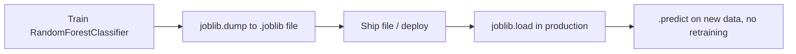

# Random Forests & Ensemble Methods
---

## Mental Map

*(Generated by mental-map script — see mental Map file in this folder.)*

## What You'll Learn

In this pre-read, you'll discover:

- How to train a `RandomForestClassifier` and why "many weak trees" beat "one deep tree"
- How to extract and read `feature_importances_` to explain model behavior
- How a random forest compares to a single decision tree on performance and interpretability
- How to **save and load** a trained model using `joblib`

---

## A. Why Combine Many Trees? (Ensemble Intuition)

> 💡 **Analogy:** Asking one expert for their opinion is useful, but risky if that expert has a blind spot. Asking 200 experts — each who saw a slightly different, randomly-sampled slice of the evidence — and taking a majority vote is far more reliable. A random forest is exactly that: 200 trees, each trained slightly differently, voting together.

**One-line definition:** A **Random Forest** is an ensemble of many decision trees, each trained on a random subset of rows (bootstrap sampling) and a random subset of features at each split, whose predictions are combined by majority vote (classification) or averaging (regression).

```python
import pandas as pd
from sklearn.model_selection import train_test_split
from sklearn.ensemble import RandomForestClassifier

df = pd.read_csv("customer_churn.csv")
X = df[["age", "monthly_spend", "tenure_months", "support_tickets"]]
y = df["churned"]

X_train, X_test, y_train, y_test = train_test_split(
    X, y, test_size=0.25, random_state=42, stratify=y
)

model = RandomForestClassifier(n_estimators=200, max_depth=4, random_state=42)
model.fit(X_train, y_train)
print(model.score(X_test, y_test))
```

---

## B. Feature Importances: Explaining the Forest

> 💡 **Analogy:** If 200 doctors each independently flag "blood pressure" as the deciding factor in most of their diagnoses, that's a far more trustworthy signal than one doctor's opinion. `feature_importances_` averages "how useful was this feature" across every tree in the forest.

**One-line definition:** `model.feature_importances_` scores each feature by how much it reduced impurity across all splits, in all trees, averaged across the entire forest — a more stable signal than a single tree's importances.

```python
importances = model.feature_importances_
for name, score in sorted(zip(X.columns, importances), key=lambda t: -t[1]):
    print(f"{name}: {score:.4f}")
```

| Feature | Importance (example) | Business reading |
|---|---|---|
| support_tickets | 0.226 | Strongest churn driver |
| tenure_months | 0.188 | Newer customers churn more |
| monthly_spend | 0.147 | Lower spenders churn more |

---

## C. Random Forest vs. a Single Tree

> 💡 **Analogy:** A single tree is a specialist who nailed one exam by memorizing the answer key. A forest is a study group who each saw different practice questions — individually less "perfectly confident," but collectively far more reliable on the real exam.

**One-line definition:** Random forests typically achieve better and more STABLE test performance than a single tree, at the cost of losing the single, fully-traceable root-to-leaf story that made one tree so directly explainable.

```python
from sklearn.tree import DecisionTreeClassifier

single_tree = DecisionTreeClassifier(max_depth=4, random_state=42)
single_tree.fit(X_train, y_train)

print("Single tree  - train:", single_tree.score(X_train, y_train), "test:", single_tree.score(X_test, y_test))
print("Random forest- train:", model.score(X_train, y_train), "test:", model.score(X_test, y_test))
```

| Aspect | Single Tree | Random Forest |
|---|---|---|
| Test accuracy | Can be unstable, sensitive to the split | Usually higher and more stable |
| Overfitting risk | Higher, especially if deep | Lower — averaging cancels out individual trees' noise |
| Explainability | One traceable root-to-leaf path | Feature importances only — no single path |
| Training speed | Fast | Slower (many trees), but still fast for small/medium data |

---

## D. Saving and Loading a Trained Model with joblib

> 💡 **Analogy:** Training a model is like baking a cake from scratch. `joblib.dump` is putting the finished cake in the freezer. `joblib.load` is taking it back out, ready to serve, without repeating the entire baking process.

**One-line definition:** `joblib.dump`/`joblib.load` serialize a trained scikit-learn model (and its fitted parameters) to and from a file on disk, so it can be reused later without retraining.

```python
import joblib

joblib.dump(model, "churn_rf_model.joblib")

loaded_model = joblib.load("churn_rf_model.joblib")
print(loaded_model.score(X_test, y_test))
```



---

## Practice Exercises

**1. Pattern Recognition** — A random forest's test accuracy is higher AND more stable across different `random_state` values than a single tree's. What property of forests explains this stability?

**2. Concept Detective** — A random forest has `feature_importances_` showing `tenure_months` as the top feature, but a single tree trained on the same data has a DIFFERENT feature at its root. Is this a contradiction?

**3. Real-Life Application** — A bank wants to explain to a regulator EXACTLY why one specific loan application was rejected, step by step. Would you recommend a single decision tree or a random forest for this specific requirement? Why?

**4. Spot the Error** — A student trains a `RandomForestClassifier`, calls `joblib.dump(model, "model.joblib")`, but later loads it in a script that never imported `RandomForestClassifier`. What might go wrong?

**5. Planning Ahead** — You're about to deploy a churn model to production, refreshed weekly. Would you retrain from scratch every time the app starts, or use `joblib` to load a saved model? Justify your choice.

---

> ✅ **You're done!** You can now train a random forest, extract and interpret feature importances, compare it against a single tree, and save/load a trained model for reuse. Next session: Model Validation & Leakage — making sure the performance numbers you report are actually trustworthy.
