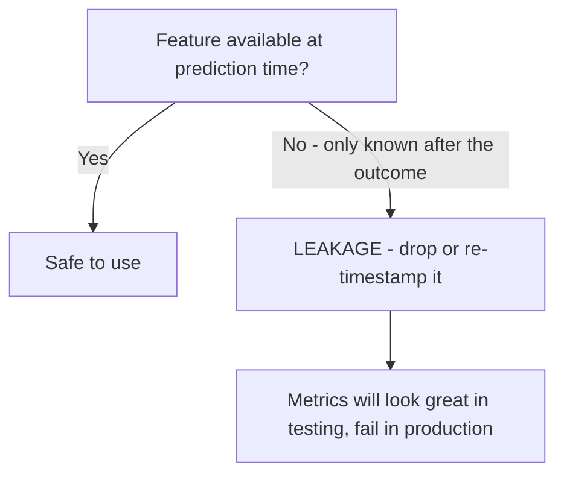

# Model Validation & Leakage
---

## Mental Map

*(Generated by mental-map script — see mental Map file in this folder.)*

## What You'll Learn

In this pre-read, you'll discover:

- How **k-fold cross-validation** and **stratified k-fold** produce more reliable performance estimates than a single train/test split
- How to tune hyperparameters systematically with `GridSearchCV`
- What **data leakage** is, how it silently inflates reported performance, and how to spot it
- How to design a **leakage-free evaluation pipeline**

---

## A. Why One Train/Test Split Isn't Enough

> 💡 **Analogy:** Judging a student's ability from ONE exam is risky — they might have had a lucky (or unlucky) day. Giving them 5 different exams and averaging the scores gives a far more trustworthy picture of their real ability. K-fold cross-validation does exactly this for a model.

**One-line definition:** **K-fold cross-validation** splits the data into `k` equal parts (folds), trains on `k-1` of them and tests on the remaining one, repeats this `k` times so every fold gets a turn as the test set, and reports the average score.

```python
import pandas as pd
from sklearn.model_selection import cross_val_score, StratifiedKFold
from sklearn.linear_model import LogisticRegression
from sklearn.pipeline import Pipeline
from sklearn.preprocessing import StandardScaler

df = pd.read_csv("patient_readmission.csv")
X = df[["age", "length_of_stay_days", "num_prior_visits", "num_medications", "has_chronic_condition"]]
y = df["readmitted_30d"]

pipe = Pipeline([("scaler", StandardScaler()), ("model", LogisticRegression(max_iter=1000))])
skf = StratifiedKFold(n_splits=5, shuffle=True, random_state=42)
scores = cross_val_score(pipe, X, y, cv=skf, scoring="accuracy")
print(scores, scores.mean())
```

---

## B. StratifiedKFold vs. plain KFold

> 💡 **Analogy:** Plain `KFold` shuffles a deck and deals folds without checking suit balance — one fold could end up almost all one class by chance. `StratifiedKFold` deals like a careful dealer, making sure every fold gets roughly the same suit (class) proportions as the full deck.

**One-line definition:** `StratifiedKFold` preserves the target class proportions in every fold, which matters most for classification with imbalanced or small datasets — plain `KFold` gives no such guarantee.

```python
from sklearn.model_selection import KFold

kf = KFold(n_splits=5, shuffle=True, random_state=42)
for i, (train_idx, test_idx) in enumerate(kf.split(X, y)):
    print(f"KFold fold {i} test class balance:", y.iloc[test_idx].value_counts().to_dict())
```

| Splitter | Guarantees class balance per fold? | Use for |
|---|---|---|
| `KFold` | No | Regression targets |
| `StratifiedKFold` | Yes | Classification targets |

---

## C. Tuning Hyperparameters with GridSearchCV

> 💡 **Analogy:** Manually trying every hyperparameter combination by hand is like tasting every dish on a huge menu one at a time, alone. `GridSearchCV` sends out an entire team to taste every combination at once, cross-validated, and hands you back the best-rated dish.

**One-line definition:** `GridSearchCV` exhaustively tries every combination of hyperparameter values you specify, evaluates each with cross-validation, and reports the combination with the best average score.

```python
from sklearn.model_selection import GridSearchCV

param_grid = {"model__C": [0.01, 0.1, 1, 10, 100]}
grid = GridSearchCV(pipe, param_grid, cv=skf, scoring="accuracy")
grid.fit(X, y)

print("Best params:", grid.best_params_)
print("Best CV score:", grid.best_score_)
```

---

## D. Data Leakage: When Your Metrics Lie to You

> 💡 **Analogy:** Data leakage is like a student who accidentally sees the answer key glued to the back of the exam paper. They'll score 100% — but that score tells you NOTHING about whether they actually learned the material, and they'll fail the moment the real exam has no answer key attached.

**One-line definition:** **Data leakage** happens when information that would not be available at real prediction time — often a proxy for the target itself — sneaks into the training features, making the model look far better than it will actually perform in production.

```python
# WITH a leaky feature (recorded AFTER the outcome was already known)
X_leak = df[["age", "length_of_stay_days", "num_prior_visits",
             "num_medications", "has_chronic_condition", "discharge_note_risk_flag"]]
scores_leak = cross_val_score(pipe, X_leak, y, cv=skf, scoring="accuracy")

# WITHOUT the leaky feature
scores_clean = cross_val_score(pipe, X, y, cv=skf, scoring="accuracy")

print("With leakage:   ", scores_leak.mean())
print("Without leakage:", scores_clean.mean())
```



| Leakage type | Example | Fix |
|---|---|---|
| Proxy for target | A "risk flag" filled in by staff AFTER the outcome is known | Remove the feature, or confirm timing precedes the outcome |
| Time-ordering leak | Using future data to predict the past in a time-based problem | Split train/test by TIME, not randomly |
| Preprocessing leak | Fitting a scaler/encoder on the FULL dataset before splitting | Fit preprocessing only on the training fold, inside a `Pipeline` |

---

## Practice Exercises

**1. Pattern Recognition** — A model's 5-fold CV accuracy scores are `[0.97, 1.0, 0.95, 0.60, 0.98]`. What does the one low score suggest, and what would you check first?

**2. Concept Detective** — A hospital readmission model reaches 99% test accuracy using a feature called "follow_up_call_scheduled," which is only ever set AFTER a patient is confirmed readmitted. Is this a trustworthy result?

**3. Real-Life Application** — You're predicting next month's sales using this month's promotional calendar, which is finalized and known in advance. Is this leakage? Why or why not?

**4. Spot the Error** — A student fits `StandardScaler()` on the entire dataset, THEN splits into train/test, THEN trains a model on the train split. What's wrong with this order?

**5. Planning Ahead** — You're building a churn model and one candidate feature is "days_until_account_closed." Before adding it, what question should you ask about WHEN this value becomes known?

---

> ✅ **You're done!** You can now cross-validate a model reliably, tune hyperparameters with GridSearchCV, and spot data leakage before it silently inflates your metrics. Next session: Clustering, Model Selection & Explainability — the Module 2 closer, where you'll run KMeans, compare multiple trained models side by side, and explain predictions in plain business language.
