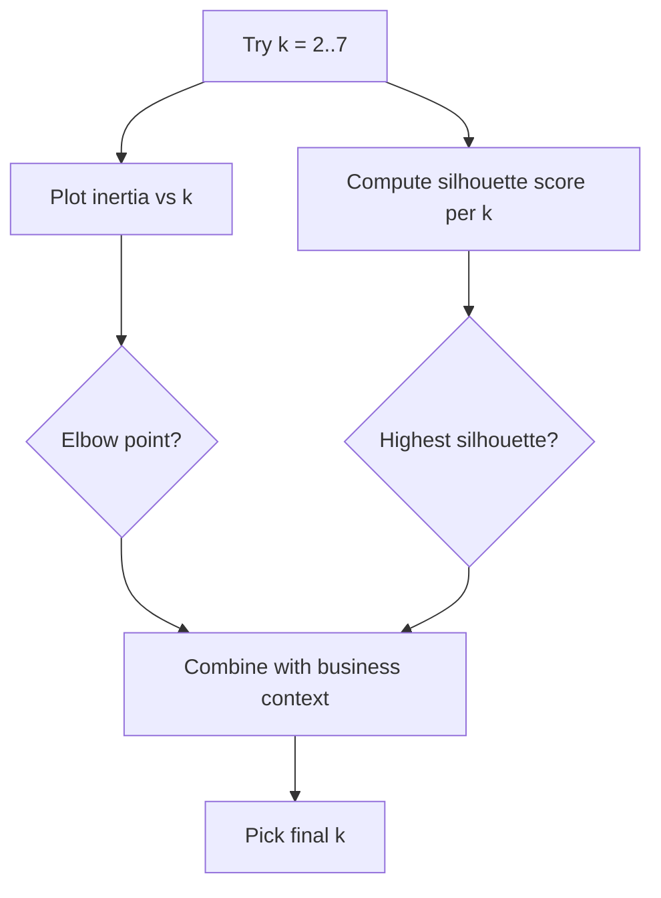

# Clustering, Model Selection & Explainability
---

## Mental Map

*(Generated by mental-map script — see mental Map file in this folder.)*

## What You'll Learn

In this pre-read, you'll discover:

- How **KMeans clustering** groups data with NO target label at all
- How to choose the number of clusters `k` using the **elbow method** and **silhouette score**
- How to build a structured metric table to **compare multiple trained models** side by side
- How to explain model predictions and feature importance in **plain business language**

---

## A. KMeans: Clustering Without Labels

> 💡 **Analogy:** Every model this module has had an "answer key" — a target column to predict. KMeans has none. It's like being handed a room full of people with no name tags and asked to sort them into groups of similar people, purely by how alike they look to each other.

**One-line definition:** `sklearn.cluster.KMeans` groups rows into `k` clusters by repeatedly assigning each point to its nearest cluster center, then recomputing each center as the average of its assigned points, until the centers stop moving.

```python
import pandas as pd
from sklearn.preprocessing import StandardScaler
from sklearn.cluster import KMeans

df = pd.read_csv("customer_segments.csv")
X = df[["annual_spend_k", "purchase_frequency_per_month", "avg_basket_value", "loyalty_years"]]

X_scaled = StandardScaler().fit_transform(X)

kmeans = KMeans(n_clusters=3, random_state=42, n_init=10)
df["cluster"] = kmeans.fit_predict(X_scaled)
print(df["cluster"].value_counts())
```

**Caution:** Always scale features before KMeans — it uses raw distance between points, so an unscaled feature with a huge numeric range (like `avg_basket_value` in the thousands) would dominate the distance calculation over a small-range feature (like `loyalty_years`).

---

## B. Choosing k: Elbow Method and Silhouette Score

> 💡 **Analogy:** The elbow method is like packing boxes — each additional box reduces the mess a little, but after a certain point, adding more boxes barely helps and just adds hassle. Silhouette score is a second opinion: it directly asks "how well does each point fit its OWN group versus the nearest other group?"

**One-line definition:** The **elbow method** plots inertia (within-cluster spread) against `k` and looks for the point where the curve stops dropping sharply; **silhouette score** (range -1 to 1) measures how well-separated the clusters are, with higher being better.

```python
from sklearn.metrics import silhouette_score

for k in range(2, 8):
    km = KMeans(n_clusters=k, random_state=42, n_init=10)
    labels = km.fit_predict(X_scaled)
    print(k, km.inertia_, silhouette_score(X_scaled, labels))
```



---

## C. Comparing Multiple Models in a Structured Table

> 💡 **Analogy:** Choosing a car by test-driving one at a time and trying to remember each "feel" is unreliable. A structured comparison table — same test track, same metrics, side by side — is how you actually make a fair choice.

**One-line definition:** A **model comparison table** evaluates several trained models on the SAME test set with the SAME metrics, so differences reflect real model quality, not inconsistent evaluation.

```python
results = []
for name, trained_model in models.items():
    preds = trained_model.predict(X_test)
    results.append({"Model": name, "Accuracy": ..., "Precision": ..., "Recall": ..., "F1": ...})

import pandas as pd
print(pd.DataFrame(results))
```

| Model | Accuracy | Precision | Recall | F1 |
|---|---|---|---|---|
| Logistic Regression | 0.889 | 0.80 | 1.00 | 0.889 |
| Decision Tree | 0.778 | 0.75 | 0.75 | 0.750 |
| Random Forest | 0.889 | 0.80 | 1.00 | 0.889 |

---

## D. Explainability in Plain Business Language

> 💡 **Analogy:** A great data scientist and a great teacher share one skill: translating something technically true into something a busy, non-technical person can act on in one sentence.

**One-line definition:** **Explainability** means connecting a model's internal signals (coefficients, feature importances, cluster centers) to a plain-English sentence a business stakeholder can use to make a decision — without them needing to understand the underlying math.

```python
importances = rf_model.feature_importances_
top_feature = X.columns[importances.argmax()]
print(f"The strongest driver of the prediction is: {top_feature}")
```

**Business sentence template:**

```
"[Model type] predicts [target] mainly based on [top feature/cluster trait].
In practice, this means [plain business consequence]."
```

---

## Practice Exercises

**1. Pattern Recognition** — Inertia keeps dropping as `k` increases, all the way to `k = n_rows` (where inertia hits 0). Why can't we just always pick the largest `k`?

**2. Concept Detective** — Silhouette score is highest at `k=2`, but a business stakeholder insists there are clearly 3 meaningful customer segments. How would you reconcile this?

**3. Real-Life Application** — A structured comparison table shows Random Forest and Logistic Regression tied on accuracy, but Random Forest offers `feature_importances_` while Logistic Regression offers coefficients. Which would you recommend to a non-technical stakeholder who wants a simple explanation, and why might the answer be "it depends"?

**4. Spot the Error** — A student computes silhouette score using UNSCALED features after standardizing for the elbow method plot. What inconsistency could this introduce?

**5. Planning Ahead** — You're about to present cluster results to a marketing team. Before writing your explanation, what plain-English question should each cluster's summary answer?

---

> ✅ **You're done!** You can now run KMeans clustering, pick `k` using the elbow method and silhouette score, build a structured multi-model comparison table, and explain any model's predictions in plain business language. This closes Module 2 — Classical ML. Module 3 begins next.
