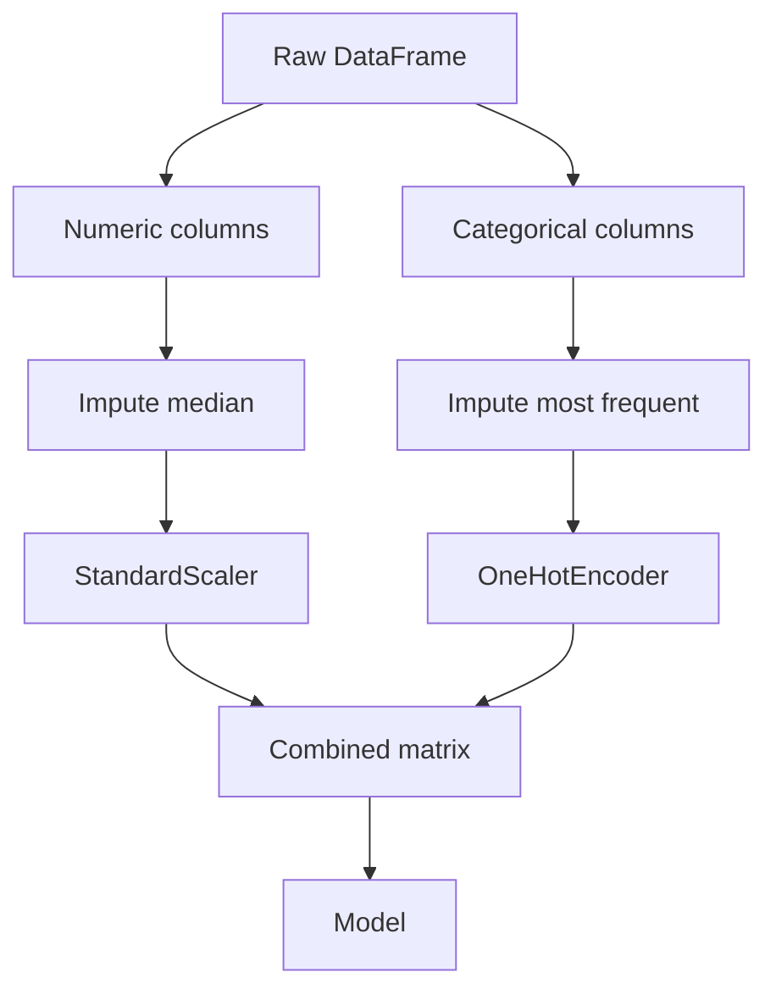
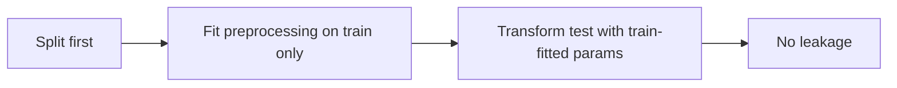

# Data Preparation for ML
---

## Mental Map

*(Generated by mental-map script — see mental Map file in this folder.)*

## What You'll Learn

In this pre-read, you'll discover:

- How to build an end-to-end `Pipeline` so preprocessing and modeling travel together
- How `ColumnTransformer` applies different steps to numeric and categorical columns
- Which **encoding** and **scaling** strategy fits which feature type
- What **data leakage** is, and the habits that prevent it
- Why "fit on train, transform on test" is the golden rule of ML preprocessing

---

## A. The Problem With Manual Preprocessing

> 💡 **Analogy:** Preparing ingredients separately for every guest at a dinner party, by hand, each time, is how bugs creep in — someone forgets the salt for table 3. A **Pipeline** is a fixed recipe card: every dish is prepared identically, every time, in the right order.

**One-line definition:** A **Pipeline** chains preprocessing steps and a final estimator into one object, so `fit`/`predict` always apply the same transformations in the same order.

```python
from sklearn.pipeline import Pipeline
from sklearn.preprocessing import StandardScaler
from sklearn.linear_model import LogisticRegression

pipe = Pipeline(steps=[
    ("scaler", StandardScaler()),
    ("model", LogisticRegression()),
])
pipe.fit(X_train, y_train)
pipe.predict(X_test)
```

---

## B. ColumnTransformer — Different Rules for Different Columns

> 💡 **Analogy:** Sorting laundry — whites need bleach, delicates need cold wash. You wouldn't run every item through the same cycle. `ColumnTransformer` runs the right "cycle" (encoder or scaler) on the right columns.

**One-line definition:** `ColumnTransformer` applies different transformers to different subsets of columns and stitches the results back into one feature matrix.

```python
from sklearn.compose import ColumnTransformer
from sklearn.preprocessing import StandardScaler, OneHotEncoder
from sklearn.impute import SimpleImputer
from sklearn.pipeline import Pipeline

numeric_features = ["age", "income"]
categorical_features = ["city", "plan_type"]

numeric_pipe = Pipeline(steps=[
    ("imputer", SimpleImputer(strategy="median")),
    ("scaler", StandardScaler()),
])
categorical_pipe = Pipeline(steps=[
    ("imputer", SimpleImputer(strategy="most_frequent")),
    ("onehot", OneHotEncoder(handle_unknown="ignore")),
])

preprocessor = ColumnTransformer(transformers=[
    ("num", numeric_pipe, numeric_features),
    ("cat", categorical_pipe, categorical_features),
])
```



---

## C. Encoding and Scaling Strategy by Feature Type

> 💡 **Analogy:** You can't do arithmetic on the word "Mumbai" — models need numbers. Encoding turns categories into numbers; scaling makes numeric columns comparable, like converting kilometers and grams onto the same ruler.

| Feature type | Strategy | Why |
|---|---|---|
| Numeric, no natural order | `StandardScaler` or `MinMaxScaler` | Puts features on comparable scales for distance/gradient-based models |
| Categorical, no order (city) | `OneHotEncoder` | Avoids implying a fake numeric order |
| Categorical, ordered (size: S/M/L) | `OrdinalEncoder` with explicit order | Preserves the rank information |
| Missing values | `SimpleImputer` | Fills gaps before other steps run |

---

## D. Data Leakage — The Silent Model Killer

> 💡 **Analogy:** Studying for tomorrow's exam using tomorrow's answer key is leakage — your practice score looks great, but it doesn't reflect real ability. Fitting a scaler on the *entire* dataset (train + test) before splitting is the same mistake.

**One-line definition:** **Data leakage** happens when information from outside the training data (often the test set, or the future) sneaks into the training process, making evaluation metrics look better than real-world performance will be.

| Leakage pattern | Fix |
|---|---|
| Scaling/encoding fit on full dataset before split | Fit only on `X_train`, `.transform()` on `X_test` |
| Target used to engineer a feature (e.g. average of `y` per group, computed globally) | Compute inside each CV fold, using only training rows |
| Duplicate rows across train and test | De-duplicate before splitting |
| Using a `Pipeline` fixes most of this automatically | `pipe.fit(X_train, y_train)` fits transformers *only* on train |



---

## Practice Exercises

**1. Pattern Recognition** — Which encoder fits: `payment_method` (credit/debit/UPI, no order) vs `education_level` (high school/bachelor's/master's, ordered)?

**2. Concept Detective** — Why does fitting `StandardScaler()` on the whole dataset *before* `train_test_split` count as leakage?

**3. Real-Life Application** — Describe a preprocessing pipeline (in words) for a housing dataset with `sqft` (numeric), `neighborhood` (categorical), and some missing `year_built` values.

**4. Spot the Error** — A student writes `scaler.fit(X)` then `train_test_split(X, y)` then trains a model. What's wrong?

**5. Planning Ahead** — Sketch (in words) a `ColumnTransformer` for a dataset with 3 numeric and 2 categorical columns, one of which has missing values.

---

> ✅ **You're done!** You can now build a leak-proof preprocessing pipeline. Next: a master class connecting the algebra of lines to the calculus of minimizing error — the math underneath every model you'll train from here on.
