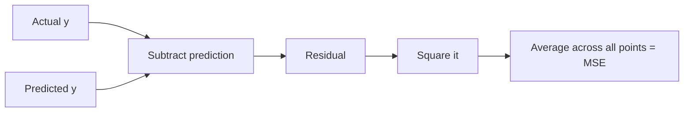
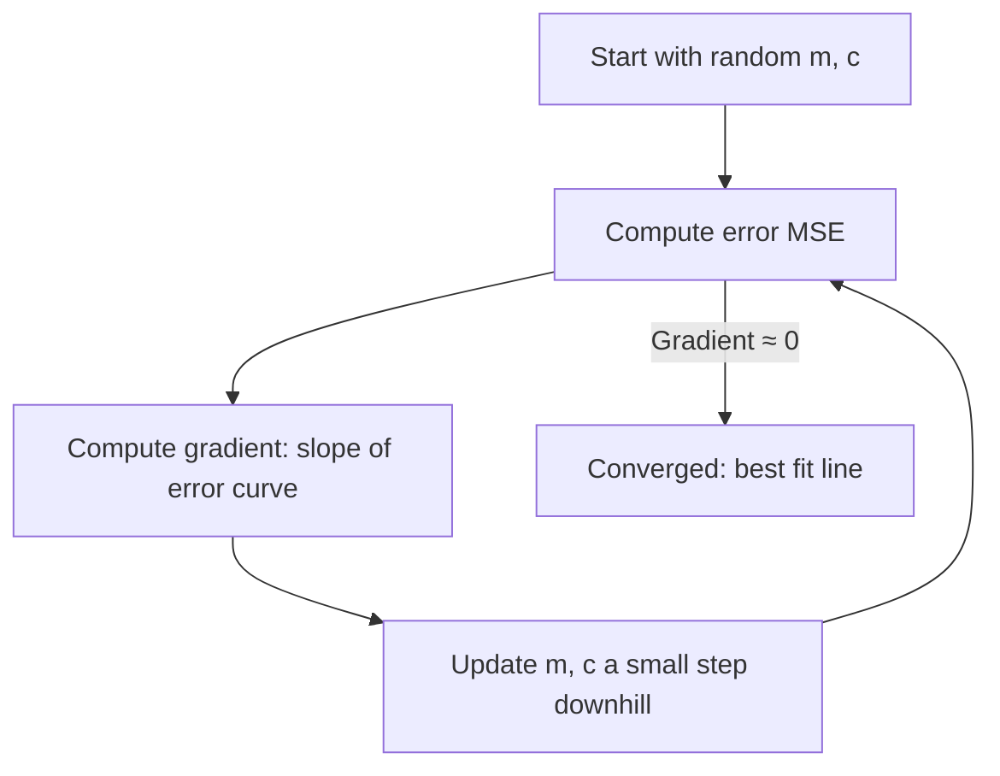

# Master Class: The Mathematics Behind Learning — Lines, Curves & Errors
---

## Mental Map

*(Generated by mental-map script — see mental Map file in this folder.)*

## What You'll Learn

In this pre-read, you'll discover:

- How the line equation **y = mx + c** encodes a prediction
- What a **residual** is and why we square errors
- What a **derivative** tells you about a curve
- How **gradient descent** finds the minimum error by "walking downhill"
- Why this math underlies every model in this module, starting with linear regression

---

## A. The Line Equation — A Prediction Machine

> 💡 **Analogy:** A line is a recipe: "take the input, multiply by the slope, add the starting point." Change the slope or intercept and you get a different recipe — a different prediction for the same input.

**One-line definition:** In **y = mx + c**, `m` is the slope (how much y changes per unit of x) and `c` is the intercept (the value of y when x = 0); together they define every point the line predicts.

```python
def predict(x, m, c):
    return m * x + c

# Predicting house price (in lakhs) from size (in 100 sqft)
m, c = 5, 10
print(predict(20, m, c))  # 5*20 + 10 = 110
```

| Term | Meaning | ML name |
|---|---|---|
| x | Input | Feature |
| y | Output | Target |
| m | Slope | Weight / coefficient |
| c | Intercept | Bias |

---

## B. Residuals — How Wrong Are We?

> 💡 **Analogy:** If you guess a friend's age and they tell you the real number, the gap between your guess and the truth is your **error**. Do that for every friend, and you get a list of errors — some too high, some too low.

**One-line definition:** A **residual** is the difference between the actual value and the model's predicted value: `residual = y_actual - y_predicted`.

We **square** residuals before averaging (Mean Squared Error) so positive and negative errors don't cancel out, and large errors are penalized more.

```python
actual = [110, 150, 90]
predicted = [108, 145, 95]

residuals = [a - p for a, p in zip(actual, predicted)]
squared = [r ** 2 for r in residuals]
mse = sum(squared) / len(squared)
print("Residuals:", residuals)
print("MSE:", mse)
```



---

## C. Derivatives — The Slope of a Curve

> 💡 **Analogy:** Standing on a hillside, the steepness under your feet tells you which direction is "downhill." A **derivative** is exactly that — the steepness (rate of change) of a curve at a specific point.

**One-line definition:** The **derivative** of a function at a point tells you the slope of the curve there — how fast the output changes as the input changes slightly.

For the error curve (MSE as a function of `m`), the derivative tells us: if we nudge `m` slightly, does the error go up or down, and how fast?

| Curve shape at a point | Derivative sign | Meaning |
|---|---|---|
| Going up (left to right) | Positive | Increasing `m` increases error |
| Going down | Negative | Increasing `m` decreases error |
| Flat (bottom of a bowl) | Zero | Minimum — no better direction to move |

---

## D. Gradient Descent — Walking Downhill to the Best Fit

> 💡 **Analogy:** You're on a foggy hillside at night trying to reach the lowest point of a valley. You can't see the whole landscape, but you can feel the slope under your feet — so you take small steps in the downhill direction, over and over, until the ground feels flat.

**One-line definition:** **Gradient descent** is an algorithm that repeatedly nudges model parameters in the direction that reduces error the fastest, using the derivative (gradient) as the compass, until it reaches (near) the minimum error.

```python
# Simplified 1-parameter gradient descent for y = m*x (c fixed at 0)
x_vals = [1, 2, 3, 4]
y_vals = [3, 5, 7, 9]  # true relationship: y = 2x + 1, roughly

m = 0.0          # start with a bad guess
learning_rate = 0.01

for step in range(1000):
    predictions = [m * x for x in x_vals]
    errors = [p - y for p, y in zip(predictions, y_vals)]
    gradient = sum(e * x for e, x in zip(errors, x_vals)) / len(x_vals)
    m = m - learning_rate * gradient

print(f"Learned slope m ≈ {m:.3f}")
```



The **learning rate** controls step size: too large and you overshoot the minimum; too small and training crawls.

---

## Practice Exercises

**1. Pattern Recognition** — For `y = 3x + 2`, what is the predicted y when x = 5? What do 3 and 2 represent?

**2. Concept Detective** — Why do we square residuals instead of just averaging the raw (signed) errors?

**3. Real-Life Application** — Describe "gradient descent" in your own words using a non-math analogy (not the fog/hill one from this pre-read).

**4. Spot the Error** — A student sets the learning rate to 100 and gradient descent's error keeps growing instead of shrinking. What's likely wrong?

**5. Planning Ahead** — If the derivative of the error curve at your current `m` is negative, should you increase or decrease `m` on the next step? Why?

---

> ✅ **You're done!** You now understand the math underneath every linear model: lines, residuals, derivatives, and gradient descent. Next session: putting this into practice by training your first `LinearRegression` model in scikit-learn.
