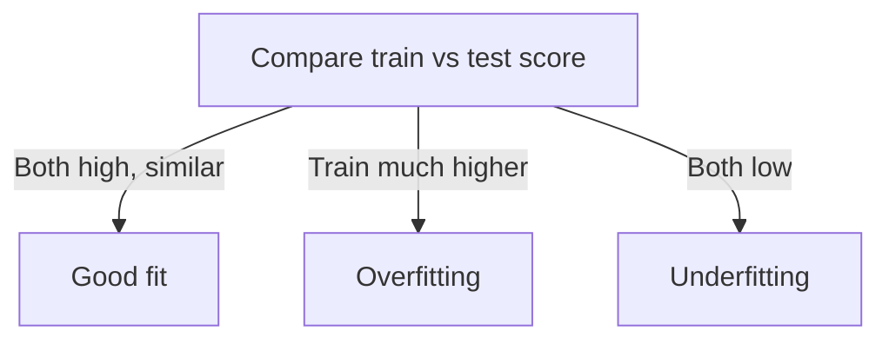

# Linear Regression
---

## Mental Map

*(Generated by mental-map script — see mental Map file in this folder.)*

## What You'll Learn

In this pre-read, you'll discover:

- How to train `LinearRegression` in scikit-learn and generate predictions
- How to evaluate a regression model with **MAE**, **RMSE**, and **R²**
- How to **interpret coefficients** in plain business language
- How to **diagnose overfitting** by comparing train vs. test performance

---

## A. Training Your First Regression Model

> 💡 **Analogy:** `LinearRegression()` is a factory-fresh machine with no settings yet. `.fit()` is the calibration process where it looks at examples and sets its internal dials (coefficients). `.predict()` is running the calibrated machine on new inputs.

**One-line definition:** `sklearn.linear_model.LinearRegression` finds the best-fit line (or hyperplane, with multiple features) that minimizes the sum of squared residuals between predictions and actual values.

```python
import pandas as pd
from sklearn.model_selection import train_test_split
from sklearn.linear_model import LinearRegression

df = pd.read_csv("house_prices.csv")
X = df[["sqft", "bedrooms", "age_years"]]
y = df["price_lakhs"]

X_train, X_test, y_train, y_test = train_test_split(X, y, test_size=0.2, random_state=42)

model = LinearRegression()
model.fit(X_train, y_train)

predictions = model.predict(X_test)
print(predictions[:5])
```

---

## B. Evaluating Regression: MAE, RMSE, R²

> 💡 **Analogy:** MAE is "on average, how many rupees off am I?" RMSE is the same idea but punishes big misses harder (like a strict examiner). R² answers "what fraction of the variation in price does my model actually explain?"

**One-line definition:** **MAE** (Mean Absolute Error) averages absolute residuals; **RMSE** (Root Mean Squared Error) penalizes large errors more; **R²** measures the proportion of variance in the target explained by the model (1.0 = perfect, 0 = no better than predicting the mean).

```python
from sklearn.metrics import mean_absolute_error, mean_squared_error, r2_score
import numpy as np

mae = mean_absolute_error(y_test, predictions)
rmse = np.sqrt(mean_squared_error(y_test, predictions))
r2 = r2_score(y_test, predictions)

print(f"MAE: {mae:.2f}, RMSE: {rmse:.2f}, R²: {r2:.3f}")
```

| Metric | Units | Sensitive to outliers? | Read as |
|---|---|---|---|
| MAE | Same as target | Less | Average absolute miss |
| RMSE | Same as target | More | "Typical" miss, big errors weighted more |
| R² | Unitless (0–1 typically) | — | % of variance explained |

---

## C. Interpreting Coefficients

> 💡 **Analogy:** A coefficient is a "dial setting" — it tells you how much the predicted price moves when you turn one dial (one feature) by one unit, holding all other dials fixed.

**One-line definition:** In `y = w1*x1 + w2*x2 + ... + b`, each coefficient `w_i` tells you the expected change in the target for a one-unit increase in that feature, all else held constant.

```python
for feature, coef in zip(X.columns, model.coef_):
    print(f"{feature}: {coef:.3f}")
print(f"Intercept: {model.intercept_:.3f}")
```

```
sqft: 0.045       # +0.045 lakh (~4,500 rupees) per extra sqft
bedrooms: 3.2     # +3.2 lakh per extra bedroom, sqft held fixed
age_years: -0.8   # -0.8 lakh per extra year of age
```

**Caution:** Coefficients assume features are roughly independent; heavily correlated features can distort individual coefficient interpretation (more on this in Session 5).

---

## D. Diagnosing Overfitting: Train vs. Test

> 💡 **Analogy:** A student who scores 100% on practice questions they memorized but 40% on the real exam hasn't learned the subject — they've memorized the practice set. Comparing train vs. test performance catches the same problem in a model.

**One-line definition:** **Overfitting** happens when a model performs much better on training data than on unseen test data — it has learned noise specific to the training set rather than a generalizable pattern.

```python
train_r2 = model.score(X_train, y_train)
test_r2 = model.score(X_test, y_test)
print(f"Train R²: {train_r2:.3f}, Test R²: {test_r2:.3f}")
```

| Pattern | Diagnosis |
|---|---|
| Train R² ≈ Test R², both high | Good fit |
| Train R² high, Test R² much lower | Overfitting |
| Train R² and Test R² both low | Underfitting |



---

## Practice Exercises

**1. Pattern Recognition** — If RMSE is much larger than MAE for the same model, what does that suggest about the error distribution?

**2. Concept Detective** — A model gets R² = 0.85 on train and R² = 0.83 on test. Is this overfitting? Why or why not?

**3. Real-Life Application** — Interpret this coefficient in plain English: `years_experience: 2.1` in a salary prediction model.

**4. Spot the Error** — A student reports only training R² in their final report and skips test R² entirely. What's the risk?

**5. Planning Ahead** — You have `sqft`, `bedrooms`, and `distance_to_metro_km` as features for price. Predict the sign (positive/negative) you'd expect for each coefficient, before training.

---

> ✅ **You're done!** You can now train, evaluate, and interpret a linear regression model, and tell overfitting from a good fit. Next session: regularization — using Ridge and Lasso to keep models from overfitting in the first place.
