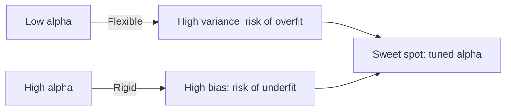

# Regularization
---

## Mental Map

*(Generated by mental-map script — see mental Map file in this folder.)*

## What You'll Learn

In this pre-read, you'll discover:

- Why **unregularized** linear regression can overfit when features are numerous or correlated
- How **Ridge** (L2) and **Lasso** (L1) regression add a penalty to control complexity
- How to **tune alpha**, the regularization strength knob, and watch coefficients shrink
- How to explain the **bias-variance tradeoff** in plain language, with no heavy math

---

## A. The Problem: Correlated Features Confuse Coefficients

> 💡 **Analogy:** A tailor given no fabric budget will add every possible decoration — sequins, embroidery, extra pockets — to fit *this one customer* perfectly. But the result is a costume, not a wearable design for anyone else. Unregularized regression with many correlated features behaves the same way, chasing every wiggle in the training data.

**One-line definition:** An **unregularized** model has no penalty on coefficient size, so with many or correlated features it can inflate or destabilize coefficients to fit training noise, hurting generalization.

```python
import pandas as pd
from sklearn.model_selection import train_test_split
from sklearn.linear_model import LinearRegression

df = pd.read_csv("housing_multicollinear.csv")
X = df[["sqft", "num_rooms", "age_years", "distance_center_km"]]
y = df["price_lakhs"]

X_train, X_test, y_train, y_test = train_test_split(X, y, test_size=0.2, random_state=42)

baseline = LinearRegression()
baseline.fit(X_train, y_train)
print("Baseline test R2:", baseline.score(X_test, y_test))
print(dict(zip(X.columns, baseline.coef_)))
```

`sqft` and `num_rooms` move together in real housing data — bigger homes have more rooms. When two features are this correlated, a plain `LinearRegression` can split credit between them unpredictably, sometimes even assigning one a surprising or unstable sign.

---

## B. Ridge Regression — Shrinking Coefficients Smoothly

> 💡 **Analogy:** Ridge is like a strict but fair coach: "You can use every player (feature), but no single player gets to dominate the game — everyone's role is toned down." No player is dropped entirely.

**One-line definition:** **Ridge regression** adds an L2 penalty (sum of squared coefficients) to the loss function, shrinking all coefficients toward zero without making any of them exactly zero.

```python
from sklearn.linear_model import Ridge

ridge = Ridge(alpha=1.0)
ridge.fit(X_train, y_train)
print("Ridge test R2:", ridge.score(X_test, y_test))
print(dict(zip(X.columns, ridge.coef_)))
```

---

## C. Lasso Regression — Shrinking and Selecting

> 💡 **Analogy:** Lasso is a stricter coach who benches weak players entirely — some coefficients get pushed all the way to **zero**, effectively removing those features from the model. This gives you automatic feature selection.

**One-line definition:** **Lasso regression** adds an L1 penalty (sum of absolute coefficients), which can shrink some coefficients exactly to zero, performing implicit feature selection.

```python
from sklearn.linear_model import Lasso

lasso = Lasso(alpha=0.5)
lasso.fit(X_train, y_train)
print("Lasso test R2:", lasso.score(X_test, y_test))
print("Non-zero coefficients:", sum(c != 0 for c in lasso.coef_))
```

| | Ridge (L2) | Lasso (L1) |
|---|---|---|
| Penalty | Sum of squared coefficients | Sum of absolute coefficients |
| Coefficients can hit exactly 0? | No | Yes |
| Good for | Many correlated features | Feature selection, sparse models |

---

## D. Tuning alpha and the Bias-Variance Tradeoff

> 💡 **Analogy:** Think of `alpha` as a leash length on a dog (the model). Leash too long (`alpha` too small) — the dog wanders anywhere, chasing every squirrel (overfitting/high variance). Leash too short (`alpha` too large) — the dog barely moves, ignoring real scents (underfitting/high bias). You want a leash long enough to explore, short enough to stay on the path.

**One-line definition:** **alpha** controls regularization strength — higher `alpha` means a stronger penalty (simpler model, more bias, less variance); lower `alpha` approaches unregularized linear regression (less bias, more variance).

```python
from sklearn.linear_model import Ridge
from sklearn.model_selection import cross_val_score

for alpha in [0.001, 0.01, 0.1, 1, 10, 100]:
    model = Ridge(alpha=alpha)
    scores = cross_val_score(model, X_train, y_train, cv=5, scoring="r2")
    print(f"alpha={alpha}: mean R2 = {scores.mean():.3f}")
```



**Bias-variance tradeoff, in plain language:** A model with **high bias** is too simple and misses real patterns (underfitting). A model with **high variance** is too sensitive to the specific training data and won't generalize (overfitting). Regularization is a dial that trades some flexibility (variance) for stability (bias) — the goal is to find the sweet spot that minimizes total error on unseen data.

---

## Practice Exercises

**1. Pattern Recognition** — With `alpha=1000` in Ridge, would you expect coefficients close to zero or far from zero? Why?

**2. Concept Detective** — You have 50 features and suspect only 5 truly matter. Would Ridge or Lasso help you find them? Why?

**3. Real-Life Application** — `sqft` and `num_rooms` are correlated in `housing_multicollinear.csv`. Describe how Ridge might handle this differently than plain `LinearRegression`.

**4. Spot the Error** — A student sets `alpha=0` in Ridge and says "this is regularized." What's wrong with that claim?

**5. Planning Ahead** — Sketch (in words) how you'd use `cross_val_score` across a range of `alpha` values to pick the best one, without touching the test set.

---

> ✅ **You're done!** You can now control overfitting with Ridge and Lasso, and explain the bias-variance tradeoff in plain language. Next session: moving from predicting numbers to predicting categories with logistic regression.
