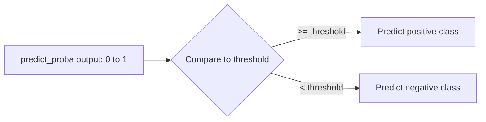

# Logistic Regression
---

## Mental Map

*(Generated by mental-map script — see mental Map file in this folder.)*

## What You'll Learn

In this pre-read, you'll discover:

- How `LogisticRegression` predicts categories instead of numbers
- How `predict_proba()` gives you a probability, not just a label
- How adjusting the **classification threshold** changes decisions and their tradeoffs
- The difference between **binary** and **multiclass** classification

---

## A. From Numbers to Categories

> 💡 **Analogy:** Linear regression is a ruler measuring exact distance. Logistic regression is a traffic light — it looks at the same kind of inputs but outputs "stop" or "go," not a distance.

**One-line definition:** **Logistic regression** predicts the probability that an input belongs to a class, by squashing a linear combination of features through the **sigmoid function** into a 0-1 range.

```python
import pandas as pd
from sklearn.model_selection import train_test_split
from sklearn.linear_model import LogisticRegression

df = pd.read_csv("loan_applications.csv")
X = df[["age", "income_k", "credit_score", "loan_amount_k"]]
y = df["approved"]

X_train, X_test, y_train, y_test = train_test_split(X, y, test_size=0.2, random_state=42, stratify=y)

model = LogisticRegression(max_iter=1000)
model.fit(X_train, y_train)
predictions = model.predict(X_test)
print(predictions[:10])
```

---

## B. predict_proba() — Probabilities, Not Just Labels

> 💡 **Analogy:** A weather forecaster who just says "rain" or "no rain" is less useful than one who says "70% chance of rain." `predict_proba()` gives you that 70%, letting you decide how confident the model is.

**One-line definition:** `predict_proba()` returns the model's estimated probability for each class, while `.predict()` just returns the class with the highest probability (using a default 0.5 threshold).

```python
probabilities = model.predict_proba(X_test)
print(probabilities[:5])
# Each row: [P(class 0), P(class 1)]

# Probability of the positive class (approved) only
positive_probs = model.predict_proba(X_test)[:, 1]
print(positive_probs[:5])
```

---

## C. Adjusting the Classification Threshold

> 💡 **Analogy:** A bank could approve loans at any probability above 50% — or, if it wants to be more cautious about defaults, only approve above 80%. Raising the bar approves fewer, safer applicants; lowering it approves more, riskier ones.

**One-line definition:** The **classification threshold** is the probability cutoff (default 0.5) above which a prediction is labeled the positive class; changing it trades off how many positives you catch against how many false alarms you accept.

```python
import numpy as np

probs = model.predict_proba(X_test)[:, 1]
threshold = 0.3
custom_predictions = (probs >= threshold).astype(int)
print(custom_predictions[:10])
```



| Threshold | Effect |
|---|---|
| Lower (e.g. 0.2) | More positives predicted; catches more true positives, but more false alarms too |
| Higher (e.g. 0.8) | Fewer positives predicted; fewer false alarms, but may miss real positives |

---

## D. Binary vs Multiclass Classification

> 💡 **Analogy:** Binary classification is a yes/no doorway. Multiclass is a hallway with several labeled doors — the model has to pick exactly one.

**One-line definition:** **Binary classification** has exactly two possible classes (e.g. approved/rejected); **multiclass classification** has three or more mutually exclusive classes (e.g. low/medium/high risk).

```python
# Multiclass example (conceptual — y would have 3+ categories)
multi_model = LogisticRegression(max_iter=1000)  # auto-detects multiclass from y
multi_model.fit(X_train, y_train_multiclass)
print(multi_model.classes_)
print(multi_model.predict_proba(X_test)[:3])  # one probability per class
```

scikit-learn's `LogisticRegression` handles multiclass automatically when `y` has more than two unique values — no separate class or parameter needed.

---

## Practice Exercises

**1. Pattern Recognition** — If `predict_proba()` returns `[0.1, 0.9]` for a row, what would `.predict()` return using the default threshold?

**2. Concept Detective** — Why might a loan approval model use a threshold of 0.7 instead of 0.5?

**3. Real-Life Application** — Describe a real scenario where lowering the classification threshold is the right business call, and one where raising it is right.

**4. Spot the Error** — A student uses `.predict()` and expects a probability value back. What's the misunderstanding?

**5. Planning Ahead** — You have a 3-class problem: "low," "medium," "high" credit risk. Sketch how `predict_proba()` output would look (in words) for one applicant.

---

> ✅ **You're done!** You can now train a classifier, read probabilities, and tune the decision threshold to match business risk. Next session: measuring classification performance properly with a full metrics toolkit.
