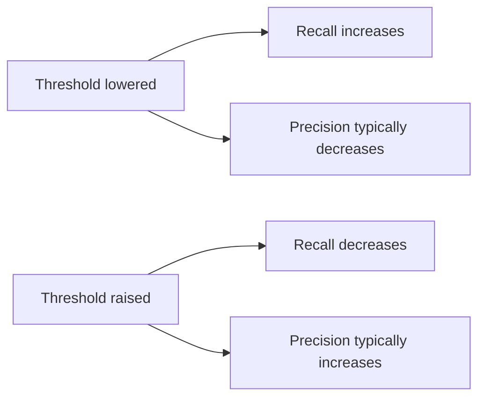

# Classification Metrics
---

## Mental Map

*(Generated by mental-map script — see mental Map file in this folder.)*

## What You'll Learn

In this pre-read, you'll discover:

- How to use `sklearn.metrics` for classification evaluation
- How to read a **confusion matrix** and spot false positives/negatives
- The **precision-recall tradeoff** and why it matters
- How to **choose the right metric** for a given business problem

---

## A. The Confusion Matrix — Four Ways to Be Right or Wrong

> 💡 **Analogy:** A smoke detector can be right in two ways (alarm when there's a fire; silent when there isn't) and wrong in two ways (silent during a real fire — dangerous; alarm with no fire — annoying). The confusion matrix names all four outcomes precisely.

**One-line definition:** A **confusion matrix** is a table comparing predicted vs. actual classes, breaking results into **true positives (TP)**, **true negatives (TN)**, **false positives (FP)**, and **false negatives (FN)**.

```python
import pandas as pd
from sklearn.model_selection import train_test_split
from sklearn.linear_model import LogisticRegression
from sklearn.metrics import confusion_matrix

df = pd.read_csv("transactions.csv")
X = df[["amount", "hour_of_day"]]
y = df["is_fraud"]

X_train, X_test, y_train, y_test = train_test_split(X, y, test_size=0.3, random_state=42, stratify=y)
model = LogisticRegression(max_iter=1000).fit(X_train, y_train)
y_pred = model.predict(X_test)

cm = confusion_matrix(y_test, y_pred)
print(cm)
```

| | Predicted No Fraud | Predicted Fraud |
|---|---|---|
| **Actual No Fraud** | TN | FP (false alarm) |
| **Actual Fraud** | FN (missed fraud) | TP |

---

## B. Precision and Recall — Two Different Kinds of "Correct"

> 💡 **Analogy:** A metal detector at airport security that beeps at *everything* has perfect **recall** (catches every real weapon) but terrible **precision** (mostly false alarms). One that only beeps when it's 99% sure has high precision but might miss real threats — low recall.

**One-line definition:** **Precision** = of everything predicted positive, how much was actually positive (`TP / (TP + FP)`). **Recall** = of everything actually positive, how much did we catch (`TP / (TP + FN)`).

```python
from sklearn.metrics import precision_score, recall_score, f1_score, classification_report

print("Precision:", precision_score(y_test, y_pred))
print("Recall:", recall_score(y_test, y_pred))
print("F1:", f1_score(y_test, y_pred))
print(classification_report(y_test, y_pred))
```



---

## C. The Precision-Recall Tradeoff

> 💡 **Analogy:** Casting a wide fishing net catches more fish (higher recall) but also more debris and unwanted species (lower precision). A narrow, targeted net catches fewer fish overall but almost everything caught is the right species (higher precision).

**One-line definition:** The **precision-recall tradeoff** means improving one typically worsens the other, because both depend on where you set the classification threshold.

```python
from sklearn.metrics import precision_recall_curve

probs = model.predict_proba(X_test)[:, 1]
precisions, recalls, thresholds = precision_recall_curve(y_test, probs)

import matplotlib.pyplot as plt
plt.plot(thresholds, precisions[:-1], label="Precision")
plt.plot(thresholds, recalls[:-1], label="Recall")
plt.xlabel("Threshold")
plt.legend()
plt.show()
```

**F1-score** balances the two: the harmonic mean of precision and recall, useful when you need one number and no strong preference for either.

---

## D. Choosing the Right Metric for the Business Problem

> 💡 **Analogy:** A doctor screening for a dangerous but treatable disease would rather run extra tests on healthy patients (false positives OK) than miss a sick patient (false negative dangerous) — recall matters most. A spam filter that occasionally lets spam through is less costly than one that blocks an important email — precision matters most.

| Business scenario | Costlier error | Prioritize |
|---|---|---|
| Fraud detection | Missing fraud (FN) | Recall (with precision monitored too) |
| Spam filter | Blocking a real email (FP) | Precision |
| Disease screening | Missing a sick patient (FN) | Recall |
| Balanced classes, no strong asymmetry | Either | Accuracy can be reasonable |

```python
# For imbalanced data, accuracy alone can be misleading
from sklearn.metrics import accuracy_score
print("Accuracy:", accuracy_score(y_test, y_pred))
# Always pair with precision/recall/F1 or a confusion matrix on imbalanced data
```

---

## Practice Exercises

**1. Pattern Recognition** — In a confusion matrix, which cell represents "predicted fraud, but transaction was legitimate"?

**2. Concept Detective** — A model has 90% accuracy on a dataset where only 10% of transactions are fraud. Is this necessarily a good model? Why?

**3. Real-Life Application** — For airport baggage screening (looking for prohibited items), would you prioritize precision or recall? Justify.

**4. Spot the Error** — A student reports only accuracy for a highly imbalanced fraud dataset. What are they missing?

**5. Planning Ahead** — Sketch (in words) how you'd decide the classification threshold for a fraud model, given false negatives (missing real fraud) are far costlier than false positives (flagging a legitimate transaction for review).

---

> ✅ **You're done!** You can now read a confusion matrix, compute precision/recall/F1, and match the metric to the business cost of errors. Next: a master class on probability and Bayes' Theorem — the mathematics underneath every classifier's confidence score.
