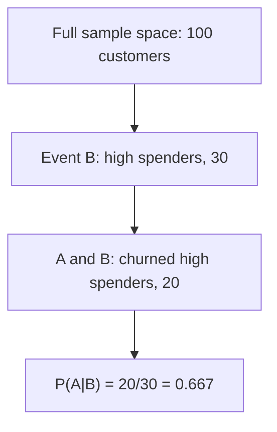

# Master Class: Probability & Counting — The Mathematics of Uncertainty
---

## Mental Map

*(Generated by mental-map script — see mental Map file in this folder.)*

## What You'll Learn

In this pre-read, you'll discover:

- What a **sample space** and an **event** are
- How to compute basic probabilities by counting outcomes
- What **conditional probability** means — probability given new information
- How **Bayes' Theorem** flips a conditional probability around, built from first principles
- Real-world examples that connect straight back to classifier confidence scores

---

## A. Sample Space and Events

> 💡 **Analogy:** Rolling a die, the **sample space** is every possible face (1-6) — the full menu of outcomes. An **event** is any subset you care about, like "rolling an even number" (2, 4, 6).

**One-line definition:** The **sample space** is the set of all possible outcomes of a random process; an **event** is any subset of that sample space.

```python
sample_space = {1, 2, 3, 4, 5, 6}
event_even = {2, 4, 6}

probability_even = len(event_even) / len(sample_space)
print(probability_even)  # 0.5
```

| Concept | Die roll example |
|---|---|
| Sample space | {1,2,3,4,5,6} |
| Event | "even number" = {2,4,6} |
| P(event) | \|event\| / \|sample space\| = 3/6 = 0.5 |

---

## B. Conditional Probability — Probability Given New Information

> 💡 **Analogy:** The chance it rains tomorrow is one number. The chance it rains tomorrow *given that the sky is already grey and overcast today* is a different, usually higher, number. New information narrows the sample space.

**One-line definition:** **Conditional probability** `P(A | B)` is the probability of event A occurring, given that event B has already occurred: `P(A | B) = P(A and B) / P(B)`.

```python
# 100 customers: 30 are "high spenders", 20 of those 30 also churned
total = 100
high_spenders = 30
high_spenders_and_churned = 20

p_churn_given_high_spender = high_spenders_and_churned / high_spenders
print(p_churn_given_high_spender)  # 0.667
```



---

## C. Bayes' Theorem — Flipping the Condition

> 💡 **Analogy:** A doctor knows `P(positive test | disease)` from lab studies, but what a *patient* actually wants to know is the reverse: `P(disease | positive test)`. Bayes' Theorem is the precise recipe for flipping a conditional probability around.

**One-line definition:** **Bayes' Theorem** states `P(A|B) = P(B|A) × P(A) / P(B)` — it lets you compute the probability of A given B, when you actually know the probability of B given A.

**Building it from first principles:** Both `P(A and B) = P(A|B) × P(B)` and `P(A and B) = P(B|A) × P(A)` describe the same overlap, just from different directions. Setting them equal and solving for `P(A|B)` gives Bayes' Theorem.

```python
# Disease screening example
p_disease = 0.01          # 1% of population has the disease (prior)
p_pos_given_disease = 0.95   # test correctly flags 95% of sick patients
p_pos_given_no_disease = 0.05  # 5% false positive rate

p_no_disease = 1 - p_disease
p_positive = (p_pos_given_disease * p_disease) + (p_pos_given_no_disease * p_no_disease)

p_disease_given_pos = (p_pos_given_disease * p_disease) / p_positive
print(f"P(disease | positive test) = {p_disease_given_pos:.3f}")
```

Even with a 95%-accurate test, if the disease is rare, `P(disease | positive)` can be surprisingly low — because false positives from the huge healthy population outnumber true positives from the tiny sick population.

---

## D. Why This Matters for ML

> 💡 **Analogy:** `predict_proba()` from Session 6 was, under the hood, an estimate built from patterns like these — how often does a pattern of features co-occur with a particular outcome? Naive Bayes classifiers apply Bayes' Theorem directly; the precision/recall ideas from Session 7 are themselves conditional probabilities in disguise.

| Probability concept | ML connection |
|---|---|
| Sample space / event | Every possible input → the specific outcome we're predicting |
| Conditional probability | `P(fraud \| high amount, late night)` mirrors what a classifier estimates per feature combination |
| Bayes' Theorem | Basis of Naive Bayes classifiers; explains why rare-event classifiers need careful threshold choices (Session 6-7) |
| Prior probability | Class imbalance (Session 7) is literally the prior `P(class)` |
| Precision, recall | Precision = `P(actually positive \| predicted positive)`; Recall = `P(predicted positive \| actually positive)` — a direct Bayes'-flip pair |

---

## Practice Exercises

**1. Pattern Recognition** — For a standard deck of 52 cards, what is `P(drawing a heart)`? What is the sample space and event here?

**2. Concept Detective** — Explain in your own words why `P(A|B)` and `P(B|A)` are usually different numbers.

**3. Real-Life Application** — A fraud filter is right 90% of the time when it says "fraud" — is that the same as `P(fraud | flagged)`? Explain using Bayes' Theorem structure.

**4. Spot the Error** — Someone claims: "The test is 95% accurate, so if I test positive, I have a 95% chance of having the disease." Using the worked example, explain why this is wrong.

**5. Planning Ahead** — If a rare-event classifier (1% positive rate) predicts "positive," would you expect the true probability of being positive to be higher, lower, or the same as 1%? Why?

---

> ✅ **You're done!** You now understand sample spaces, conditional probability, and Bayes' Theorem — the mathematics behind every probability a classifier reports, and the reason precision and recall are two genuinely different numbers. Next module continues with decision trees, ensembles, and model validation.
