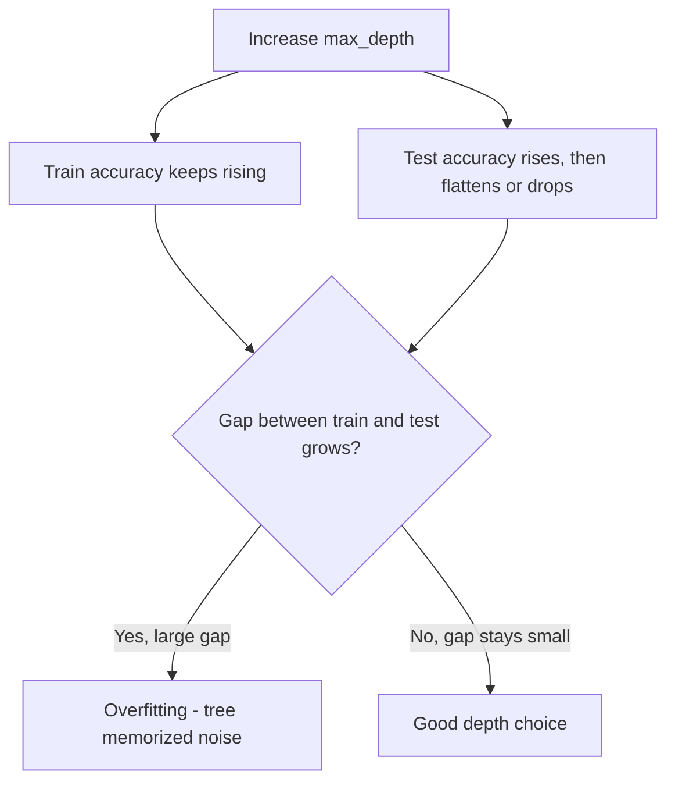

# Decision Trees
---

## Mental Map

*(Generated by mental-map script — see mental Map file in this folder.)*

## What You'll Learn

In this pre-read, you'll discover:

- How to train a `DecisionTreeClassifier` in scikit-learn and visualize it with `plot_tree`
- How to **read a tree's decision path** from root to leaf and explain it in plain language
- How tree **depth controls overfitting** — comparing train vs. test accuracy across depth values
- Why trees split on features the way they do (Gini impurity, intuitively)

---

## A. Training Your First Decision Tree

> 💡 **Analogy:** A decision tree is like a game of "20 Questions" — at each node it asks one yes/no-style question about a feature ("Is `contract_type` Monthly?"), and depending on the answer, it walks left or right until it reaches an answer (a leaf).

**One-line definition:** `sklearn.tree.DecisionTreeClassifier` builds a flowchart of feature-based questions that splits the training data into increasingly "pure" groups, ending in leaves that predict a class.

```python
import pandas as pd
from sklearn.model_selection import train_test_split
from sklearn.tree import DecisionTreeClassifier

df = pd.read_csv("customer_churn.csv")
X = df[["age", "monthly_spend", "tenure_months", "support_tickets"]]
y = df["churned"]

X_train, X_test, y_train, y_test = train_test_split(
    X, y, test_size=0.25, random_state=42, stratify=y
)

model = DecisionTreeClassifier(max_depth=3, random_state=42)
model.fit(X_train, y_train)
print(model.score(X_test, y_test))
```

---

## B. Visualizing the Tree

> 💡 **Analogy:** `plot_tree` is like unfolding the flowchart onto a whiteboard so anyone — even a non-technical stakeholder — can trace a single customer through the questions and see exactly why the model predicted what it predicted.

**One-line definition:** `sklearn.tree.plot_tree` draws the trained tree's structure: each box shows the split condition, the Gini impurity, the number of samples, and the predicted class.

```python
from sklearn.tree import plot_tree
import matplotlib.pyplot as plt

plt.figure(figsize=(14, 8))
plot_tree(model, feature_names=X.columns, class_names=["Stay", "Churn"], filled=True)
plt.show()
```

| Box element | Meaning |
|---|---|
| Split condition (e.g. `monthly_spend <= 644.0`) | The question asked at this node |
| `gini` | Impurity of the samples at this node (0 = perfectly pure) |
| `samples` | How many training rows reached this node |
| `value` | Class counts at this node (e.g. `[12, 6]`) |
| `class` | The majority-vote prediction if a customer stopped here |

---

## C. Reading a Root-to-Leaf Path

> 💡 **Analogy:** Explaining a prediction is like retracing someone's route on a map — "they went past the Monthly Contract junction, took the 'uses app' turn, then the spend-under-₹644 turn, and arrived at Churn." Every prediction has exactly one such route.

**One-line definition:** A **decision path** is the sequence of split conditions a single row satisfies, from the root node down to the leaf that produced its final prediction.

```python
from sklearn.tree import export_text

tree_rules = export_text(model, feature_names=list(X.columns))
print(tree_rules)
```

```
|--- contract_type_Monthly <= 0.50
|   |--- class: 0
|--- contract_type_Monthly >  0.50
|   |--- used_mobile_app_Yes <= 0.50
|   |   |--- class: 1
|   |--- used_mobile_app_Yes >  0.50
|   |   |--- monthly_spend <= 644.00
|   |   |   |--- class: 1
|   |   |--- monthly_spend >  644.00
|   |   |   |--- class: 0
```

**Plain-English translation of one path:** *"This customer is on a Monthly contract, does use the mobile app, and spends more than ₹644/month — so the tree predicts they will NOT churn."*

---

## D. Overfitting: Depth vs. Accuracy

> 💡 **Analogy:** A shallow tree is a doctor who asks 2 quick questions and gives a general diagnosis. A very deep tree is a doctor who asks 50 hyper-specific questions until they've basically just described ONE patient's exact history — accurate for that one patient, useless for the next.

**One-line definition:** As `max_depth` increases, a tree can carve the training data into smaller and smaller, more specific regions — train accuracy climbs toward 100%, while test accuracy plateaus or drops, the classic overfitting signature.

```python
for depth in [1, 2, 3, 4, 5, None]:
    m = DecisionTreeClassifier(max_depth=depth, random_state=42)
    m.fit(X_train, y_train)
    print(depth, m.score(X_train, y_train), m.score(X_test, y_test))
```



---

## Practice Exercises

**1. Pattern Recognition** — As `max_depth` goes from 1 to `None` (unlimited), train accuracy generally moves in one direction. Which direction, and why?

**2. Concept Detective** — A tree has `max_depth=2` with train accuracy 0.80 and test accuracy 0.79. A colleague's tree has `max_depth=None` with train accuracy 1.0 and test accuracy 0.70. Which tree would you deploy, and why?

**3. Real-Life Application** — A loan-approval tree's root split is `credit_score <= 650`. Explain in one plain-English sentence what this split means for a business user reading the tree diagram for the first time.

**4. Spot the Error** — A student trains a tree with `max_depth=None`, gets 100% train accuracy, and reports "my model is perfect" without ever checking test accuracy. What's wrong with this conclusion?

**5. Planning Ahead** — You're about to train a tree on a dataset with only 40 rows. Would you start with a shallow tree (e.g. `max_depth=2`) or a deep one (`max_depth=10`)? Justify your choice before training anything.

---

> ✅ **You're done!** You can now train a decision tree, visualize it, trace a prediction path in plain language, and diagnose overfitting by depth. Next session: Random Forests — how combining MANY trees fixes exactly the overfitting problem you just saw.
