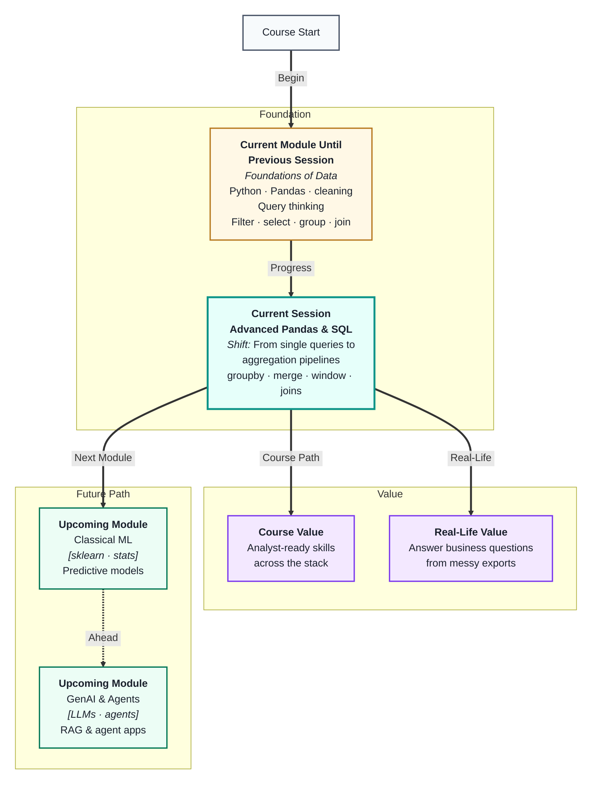
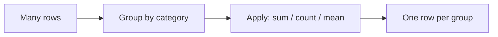
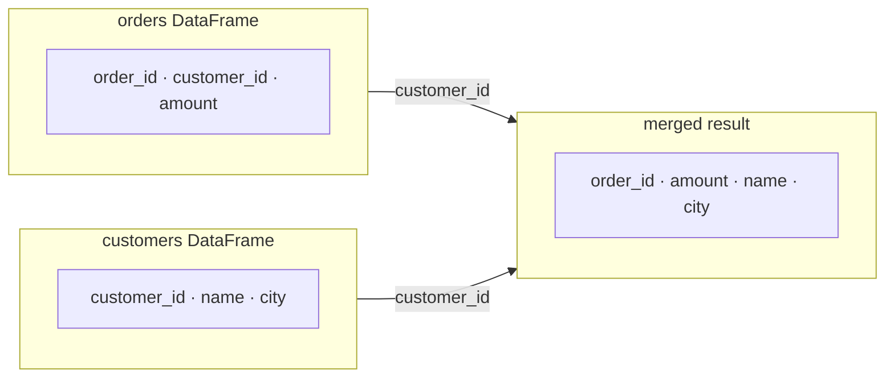
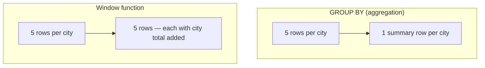

# Advanced Pandas & SQL Fundamentals
---

## Mental Map



## What You'll Learn

In this pre-read, you'll discover:

- How **aggregation** turns hundreds of rows into a single meaningful number
- How `groupby` in Pandas mirrors `GROUP BY` in SQL
- How to **merge** DataFrames the same way SQL joins tables
- What **window functions** do and when they are more useful than a group summary
- How to chain multiple operations into a clean **analysis pipeline**

---

## A. Aggregation — Collapsing Rows Into Answers

> 💡 **Analogy:** A school report card does not list every test score—it shows your *average* for the term. **Aggregation** is the step that takes every row and computes one summary number per group.

**One-line definition:** **Aggregation** means applying a function (sum, count, mean, max) to a column so many rows become one result per group.

You already know how to filter and select individual rows. Aggregation is when you stop caring about individual rows and start caring about *totals, counts, and averages*.



| Aggregation function | What it computes | Example |
|---|---|---|
| `sum` | Total of a column | Total sales per region |
| `count` | Number of rows | Orders per customer |
| `mean` | Average | Average delivery time |
| `max` / `min` | Highest or lowest | Best and worst score |
| `nunique` | Count of distinct values | Unique products ordered |

**In Pandas:** `df.groupby("region")["sales"].sum()`  
**In SQL:** `SELECT region, SUM(sales) FROM orders GROUP BY region`

The result of an aggregation is always a **smaller table** — one row per unique group value.

---

## B. `groupby` in Pandas — A Closer Look

> 💡 **Analogy:** Sorting your laundry into piles by colour, then counting each pile, is exactly what `groupby` does — split by a key, apply a function, combine back.

**One-line definition:** `groupby` **splits** a DataFrame by one or more columns, **applies** a function to each piece, and **combines** the results into one summary table.

**Three-step mental model:**

1. **Split** — form groups based on the column(s) you name
2. **Apply** — run an aggregation (or transform) on each group independently
3. **Combine** — stack the results back into one output table

**Multiple aggregations at once:**

You can ask for several summaries in a single call using `.agg()`:

```
group by product
→ total revenue (sum)
→ order count (count)
→ average discount (mean)
all in one table
```

| Groupby pattern | Use when |
|---|---|
| One column key | Summaries per category |
| Two column keys | Cross-table breakdowns (region × product) |
| `.agg()` with dict | Need different functions per column |
| `.transform()` | Add a group-level result back to original rows |

**`transform` vs `agg`:** `agg` gives you a *shorter* summary table; `transform` returns a column the *same length* as the original, so you can do things like "show each order alongside its region's total sales."

---

## C. Merging in Pandas — Joins Without SQL

> 💡 **Analogy:** Two spreadsheets — one with order details, one with customer addresses. You need a single sheet. A **merge** lines them up by a shared ID and creates that combined sheet.

**One-line definition:** `pd.merge()` combines two DataFrames by matching rows on a shared key column, the same way SQL joins two tables.



| Merge type | Pandas `how=` | Keeps |
|---|---|---|
| Inner | `"inner"` | Only rows with a match in both tables |
| Left | `"left"` | All rows from left; matched rows from right |
| Right | `"right"` | All rows from right; matched rows from left |
| Outer | `"outer"` | All rows from both; fills gaps with NaN |

**Common pitfalls:**

- **Duplicate key values** — if `customer_id` repeats in the right table, the merge multiplies rows. Always check with `.value_counts()` before merging.
- **Key name mismatch** — use `left_on=` / `right_on=` when key columns have different names.
- **Type mismatch** — joining an integer ID to a string ID silently finds no matches.

---

## D. SQL GROUP BY and Aggregate Functions

> 💡 **Analogy:** A restaurant till system shows individual receipts but the manager's end-of-night report shows *total revenue per table section*. SQL's `GROUP BY` produces that manager's view from the raw receipts.

**One-line definition:** SQL `GROUP BY` divides query results into groups by a column, and aggregate functions (`SUM`, `COUNT`, `AVG`) compute one value per group.

**Clause order to remember:**

```
SELECT   columns + aggregates
FROM     table
WHERE    row filters (before grouping)
GROUP BY grouping columns
HAVING   group-level filters (after grouping)
ORDER BY sort column
LIMIT    max rows
```

| Clause | Filters at which stage | Example |
|---|---|---|
| `WHERE` | Before grouping — on individual rows | `WHERE date > '2024-01-01'` |
| `HAVING` | After grouping — on summary values | `HAVING SUM(amount) > 5000` |

**`WHERE` vs `HAVING`** is one of the most commonly confused pairs. A helpful rule: if your filter involves an aggregate function (`SUM`, `COUNT`, etc.), use `HAVING`; otherwise use `WHERE`.

---

## E. Window Functions — Aggregation Without Collapsing

> 💡 **Analogy:** A football league table shows each team's *running total* of points after every match, not just a single final number. **Window functions** add that running context to every row without removing any rows.

**One-line definition:** A **window function** computes a value for each row using a group of related rows (the "window"), but keeps all original rows visible — unlike `GROUP BY`, which collapses them.



| Window function idea | What it adds to each row |
|---|---|
| Running total | Cumulative sum up to that row |
| Rank | Position of this row within its group |
| Lag / Lead | Value from the previous or next row |
| Group average | Average for the row's group, on every row |

**In Pandas:** use `.transform()` for group-level values; use `.cumsum()`, `.rank()`, `.shift()` for row-level window ideas.  
**In SQL:** use `OVER (PARTITION BY … ORDER BY …)` syntax.

Window functions are very common in business dashboards and ML feature engineering — knowing *when* to use them instead of a plain `GROUP BY` separates a beginner query from an analyst query.

---

## Practice Exercises

**1. Pattern Recognition**  
A table has columns `store_id`, `product`, `units_sold`, `date`. Label which aggregation function you would use for each question: (a) How many products does each store sell? (b) Which store had the highest single-day sales? (c) What is the average daily units sold per product?

**2. Concept Detective**  
A teammate writes a SQL query with `WHERE COUNT(orders) > 3`. The query errors out. Identify the mistake using what you learned about `WHERE` vs `HAVING` and write the corrected clause in plain words.

**3. Real-Life Application**  
Think of three real summaries you see every day — a sports leaderboard, a monthly bank statement, a school grade summary. For each one, name whether it uses aggregation (collapsed rows), a window function (running total or rank), or both.

**4. Spot the Error**  
A merge of `orders` and `customers` on `customer_id` returns more rows than the original `orders` table. What likely went wrong with the key column in one of the tables, and what would you check before re-running the merge?

**5. Planning Ahead**  
You have `sales(sale_id, rep_id, region, amount, sale_date)`. Plan — in plain steps, no code — how you would build a report showing: total sales per region, each rep's rank within their region, and only regions with more than ₹1 lakh in total sales. Name which concept (groupby/agg, window, HAVING) handles each requirement.

---

> ✅ **You're done!** You now understand how aggregation, merges, and window functions power the summaries behind every dashboard and report. These patterns are the same whether you write Pandas or SQL — the thinking is identical. Coming up next: **the Masterclass on Data Organisation mathematics**, which explains the relational logic underneath everything you just practised.
