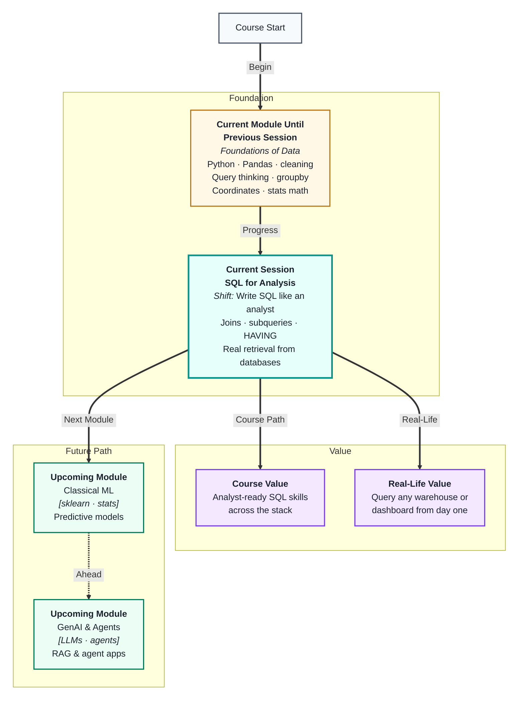
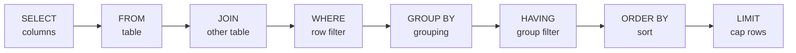
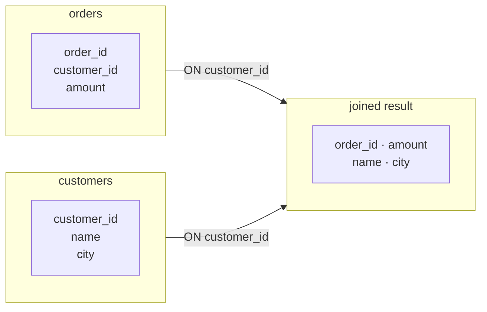
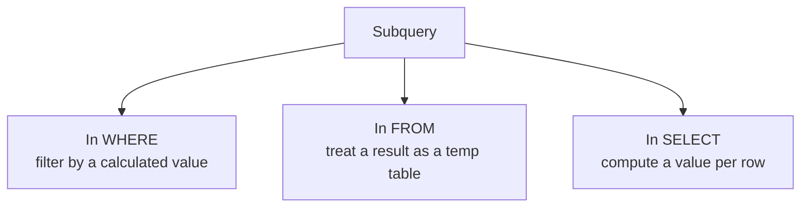

# SQL for Analysis & Data Retrieval
---

## Mental Map



## What You'll Learn

In this pre-read, you'll discover:

- How SQL clause order works and why you must write it in a specific sequence
- How **joins** combine data from multiple tables using a shared key
- How **subqueries** let you answer questions that need a query inside a query
- How `HAVING` filters groups *after* aggregation, unlike `WHERE`
- How to think like an analyst when choosing which SQL tool to reach for

---

## A. SQL Query Anatomy — The Clause Order That Matters

> 💡 **Analogy:** A recipe has a fixed sequence — prep ingredients, heat pan, cook, plate. Swap the order and the dish fails. SQL clauses must also follow a strict logical order, even if you do not write all of them every time.

**One-line definition:** A SQL query is a structured set of **clauses** that each do one job — picking, filtering, grouping, and sorting — executed in a fixed logical order by the database.

**The full clause order:**



You write clauses in this order. The database executes them in a different internal order — `FROM` first, then `WHERE`, then `GROUP BY`, then `HAVING`, then `SELECT`, then `ORDER BY`, then `LIMIT` — but you do not need to worry about that. Just write them top to bottom as shown.

| Clause | Required? | What it does |
|---|---|---|
| `SELECT` | Yes | Pick which columns to show |
| `FROM` | Yes | Name the source table |
| `JOIN` | No | Bring in columns from another table |
| `WHERE` | No | Filter individual rows before grouping |
| `GROUP BY` | No | Collapse rows into groups |
| `HAVING` | No | Filter groups by aggregate values |
| `ORDER BY` | No | Sort the result |
| `LIMIT` | No | Return only the first N rows |

**Rule of thumb:** If you add `GROUP BY`, every column in `SELECT` must either be in the group key or inside an aggregate function (`SUM`, `COUNT`, `AVG`, `MAX`, `MIN`).

---

## B. Joins — Connecting Tables on a Shared Key

> 💡 **Analogy:** Your gym membership card has an ID. The gym's attendance log also records that ID. To see "which members attended most," you match the two records on the same ID. A SQL **join** is exactly that matching step.

**One-line definition:** A SQL **join** combines rows from two tables wherever a specified column holds the same value in both — the shared column is the **join key**.



| Join type | What it returns | Use when |
|---|---|---|
| `INNER JOIN` | Only rows with a match in both tables | You only want complete records |
| `LEFT JOIN` | All rows from left table + matches from right | You want to keep every left row, even without a match |
| `RIGHT JOIN` | All rows from right + matches from left | Same as left join, just reversed |
| `FULL OUTER JOIN` | All rows from both tables | You want everything, gaps filled with NULL |

**Practical tip:** In analytics, `LEFT JOIN` is the most common. You start with a primary table (orders, users, events) and attach optional context from secondary tables. Rows with no match get `NULL` in the joined columns — always check for these after a join.

**Multi-table joins:** You can chain joins:

```
FROM orders
JOIN customers ON orders.customer_id = customers.id
JOIN products  ON orders.product_id  = products.id
```

Each `JOIN` adds columns from another table. Keep join keys consistent and indexed for performance.

---

## C. WHERE vs HAVING — Filtering at the Right Stage

> 💡 **Analogy:** At a concert, security checks tickets at the gate (before you enter — like `WHERE`). The venue manager then looks at which sections are overcrowded and closes some (after people are already seated — like `HAVING`).

**One-line definition:** `WHERE` filters **rows** before grouping; `HAVING` filters **groups** after aggregation — you need `HAVING` any time your filter condition involves an aggregate like `SUM` or `COUNT`.

| Clause | Runs at which stage | Can reference aggregates? | Example |
|---|---|---|---|
| `WHERE` | Before `GROUP BY` | No | `WHERE city = 'Mumbai'` |
| `HAVING` | After `GROUP BY` | Yes | `HAVING SUM(amount) > 50000` |

**Common pattern — both together:**

```
SELECT region, SUM(amount) AS total
FROM orders
WHERE date >= '2024-01-01'      -- row-level: only 2024 rows
GROUP BY region
HAVING SUM(amount) > 100000     -- group-level: only big regions
ORDER BY total DESC
```

A quick test before you write: *"Is my filter about individual rows or about the group's total?"* — that tells you which clause to use.

---

## D. Subqueries — A Query Inside a Query

> 💡 **Analogy:** Before booking a flight, you check "what's the cheapest price?" first, then book anything *at or below that price*. You use the answer to the first question inside the second question. A **subquery** does exactly that in SQL.

**One-line definition:** A **subquery** is a complete SQL query nested inside another query, whose result is used as a value, filter, or table by the outer query.

**Three places subqueries appear:**



**In WHERE** — find orders above the average amount:

```
SELECT order_id, amount
FROM orders
WHERE amount > (SELECT AVG(amount) FROM orders)
```

**In FROM** — use a grouped result as a source:

```
SELECT region, total
FROM (
    SELECT region, SUM(amount) AS total
    FROM orders
    GROUP BY region
) AS region_totals
WHERE total > 50000
```

**In SELECT** — add a column comparing each row to a group total:

```
SELECT order_id, amount,
       (SELECT SUM(amount) FROM orders) AS grand_total
FROM orders
```

| Subquery placement | Returns | Typical use |
|---|---|---|
| `WHERE … (subquery)` | Single value or list | Filter by computed threshold |
| `FROM (subquery)` | A table | Multi-step aggregation |
| `SELECT (subquery)` | Single value per row | Add a context column |

---

## E. Analytical SQL Patterns — The Analyst Toolkit

> 💡 **Analogy:** A carpenter has a few moves they reach for every job — measure, cut, join, sand. An analyst has a few SQL patterns they reach for on every dataset. Knowing these patterns means you can answer most business questions without starting from scratch.

**One-line definition:** **Analytical SQL patterns** are reusable query templates that answer common business questions — top-N, period comparisons, running totals, and cohort counts.

**Pattern 1 — Top N per category:**

```
SELECT category, product, SUM(sales) AS total
FROM orders
GROUP BY category, product
ORDER BY category, total DESC
LIMIT 10
```

**Pattern 2 — Filter by date range:**

```
WHERE order_date BETWEEN '2024-01-01' AND '2024-03-31'
```

**Pattern 3 — Count distinct vs total count:**

```
SELECT COUNT(*)          AS total_orders,
       COUNT(DISTINCT customer_id) AS unique_customers
FROM orders
```

**Pattern 4 — NULL-safe comparisons:**

```
WHERE discount IS NULL          -- find missing discounts
WHERE discount IS NOT NULL      -- find applied discounts
```

| Business question | SQL tool |
|---|---|
| "Top 5 products by revenue?" | `GROUP BY` + `ORDER BY` + `LIMIT` |
| "Customers with 3+ orders?" | `GROUP BY` + `HAVING COUNT(*) >= 3` |
| "Orders above average value?" | `WHERE amount > (subquery)` |
| "Sales report with customer names?" | `JOIN` |
| "Monthly trend?" | `GROUP BY MONTH(date)` + `ORDER BY` |

---

## Practice Exercises

**1. Pattern Recognition**  
Look at this query:  
`SELECT city, COUNT(*) FROM users WHERE active = 1 GROUP BY city HAVING COUNT(*) > 100 ORDER BY COUNT(*) DESC`  
Label each clause and say what stage of data processing it handles.

**2. Concept Detective**  
A teammate writes: `SELECT region, SUM(sales) FROM orders WHERE SUM(sales) > 10000 GROUP BY region`. The query errors out. Identify the mistake and write the corrected version in plain words, naming the right clause to use.

**3. Real-Life Application**  
Name three real business questions you might hear in a job — for example in e-commerce, HR, or healthcare. For each, say which SQL pattern from section E would answer it and what join (if any) would be needed.

**4. Spot the Error**  
A LEFT JOIN of `orders` onto `customers` returns `NULL` values in the `name` and `city` columns for some rows. A teammate says "the join is broken." What are two likely causes, and what would you check in each table before re-running?

**5. Planning Ahead**  
You have three tables: `orders(order_id, customer_id, amount, date)`, `customers(customer_id, name, city)`, `products(product_id, order_id, category)`. Plan — in plain steps — a query that answers: "Which cities generated the most revenue in Q1 2024, from orders containing the Electronics category, showing only cities above ₹2 lakh total?" Name every clause you would use and in what order.

---

> ✅ **You're done!** You now have the full analyst SQL toolkit — joins, subqueries, `HAVING`, and reusable patterns that answer real business questions. These skills will carry directly into **EDA & Visual Storytelling**, where you will use SQL and Pandas together to explore data and then turn your findings into clear, compelling visuals.
