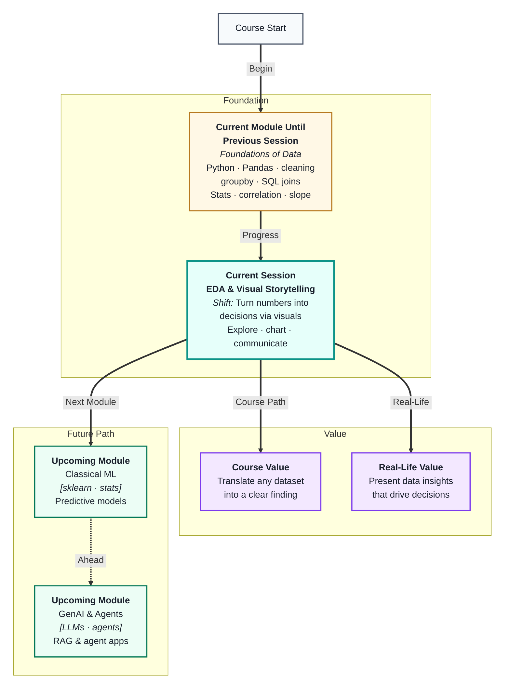
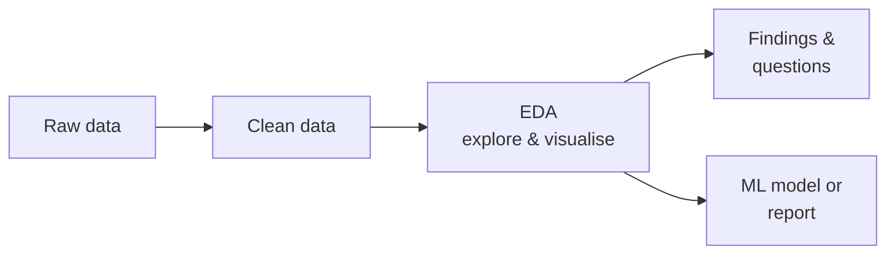
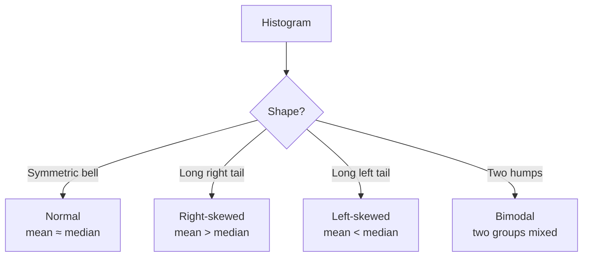
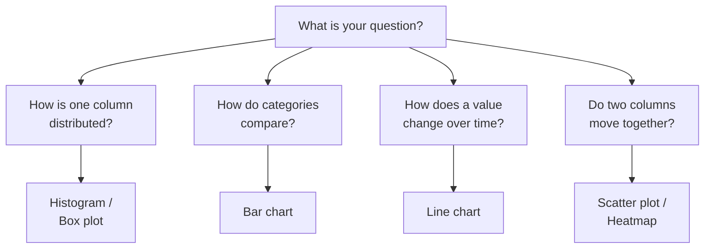

# EDA & Visual Storytelling
---

## Mental Map

## What You'll Learn

In this pre-read, you'll discover:

- What **Exploratory Data Analysis (EDA)** is and why it always comes before modelling
- How to use a repeatable **EDA checklist** to interrogate any new dataset
- Which **chart type** to reach for depending on what you want to show
- How **distributions** reveal the shape of your data — skews, outliers, and peaks
- How to craft a **visual narrative** that turns a chart into a decision

---

## A. What Is EDA — and Why Do It First?

> 💡 **Analogy:** A doctor does not prescribe medicine before examining the patient. An examination reveals what is actually wrong. **EDA** is your examination of the dataset before you build anything.

**One-line definition:** **Exploratory Data Analysis (EDA)** is the process of summarising, visualising, and questioning a dataset to understand its structure, patterns, and problems before modelling or reporting.

EDA sits between data cleaning and modelling. Cleaning fixes what is broken; EDA discovers what is *interesting* and what still needs attention.

**What EDA reveals:**

- Columns with unexpected ranges or outliers you missed in cleaning
- Relationships between variables that suggest useful features for ML
- Patterns that answer business questions without any model at all
- Skewed distributions that break certain statistical assumptions

| EDA activity | Tool | What you learn |
|---|---|---|
| Shape and types | `df.shape`, `df.dtypes` | Row count, column types |
| Summary stats | `df.describe()` | Mean, std, min, max, quartiles |
| Missing values | `df.isna().sum()` | Remaining gaps |
| Distributions | Histogram, box plot | Spread, skew, outliers |
| Relationships | Scatter plot, heatmap | Correlations between columns |
| Counts by category | Bar chart, `value_counts()` | Frequency of each category |

EDA is never fully finished — every answer raises new questions. The goal is to know your data well enough to make informed decisions about it.

---

## B. Distributions — The Shape Behind the Numbers

> 💡 **Analogy:** A crowd photo from above shows whether people are spread evenly, bunched at the front, or have a few stragglers far back. A **distribution** shows you the same thing about your data — where most values cluster and where the extremes lie.

**One-line definition:** A **distribution** describes how values in a column are spread — whether they are symmetric, skewed to one side, or have multiple peaks.

| Shape | What it suggests | Action |
|---|---|---|
| Symmetric (bell) | Even spread, no extremes | Mean is reliable |
| Right-skewed | A few very high values pull the mean up | Use median; consider log transform |
| Left-skewed | A few very low values drag the mean down | Use median; check for floor effects |
| Bimodal (two peaks) | Two distinct subgroups in the data | Investigate — may need to split |
| Flat (uniform) | Values equally likely | Rare in real data; check source |

**Box plots** show distribution shape at a glance: the box is the middle 50% of values, the line inside is the median, and dots beyond the whiskers are **outliers**. You can compare many groups side-by-side with one chart.

**Key rule:** Always look at the distribution *before* using the mean. The mean is only trustworthy for symmetric data.

---

## C. Choosing the Right Chart

> 💡 **Analogy:** You would not use a knife to tighten a screw. Every chart type is built for a specific job. Picking the wrong one makes your data harder — not easier — to understand.

**One-line definition:** A **chart type** is a visual format designed for a specific relationship in data — distribution, comparison, trend, composition, or correlation.

| What you want to show | Best chart | Avoid |
|---|---|---|
| Distribution of one numeric column | Histogram or box plot | Pie chart |
| Comparison across categories | Bar chart (vertical or horizontal) | 3-D bar chart |
| Trend over time | Line chart | Scatter plot for time |
| Relationship between two numeric cols | Scatter plot | Bar chart |
| Composition (parts of a whole) | Stacked bar or pie (max 5 slices) | Exploded 3-D pie |
| Correlation of many columns at once | Heatmap | Multiple scatter plots |

**Common mistakes to avoid:**

- Using a pie chart with more than 5 slices — the brain cannot compare thin wedges
- Starting a bar chart y-axis at a value other than zero — it exaggerates differences
- Plotting a trend with a bar chart instead of a line — bars imply discrete categories, not flow
- Overloading one chart with too many series — split into multiple if needed

---

## D. The EDA Checklist — A Repeatable Workflow

> 💡 **Analogy:** A pilot follows a pre-flight checklist every single time — not because they forget, but because skipping steps causes crashes. An **EDA checklist** gives you the same discipline: nothing important gets missed.

**One-line definition:** An **EDA checklist** is a fixed sequence of questions you answer on every new dataset, so you never skip something that matters.

**Step-by-step:**

1. **Load and inspect** — `shape`, `head()`, `dtypes`, `info()`
2. **Summary statistics** — `describe()` for numeric; `value_counts()` for categorical
3. **Missing values** — count per column; decide if they need fixing
4. **Distributions** — histogram for every numeric column; note skew and outliers
5. **Categorical counts** — bar chart for every category column; note imbalances
6. **Relationships** — scatter plots for correlated pairs; heatmap for all numerics
7. **Time trends** (if date column exists) — line chart by date
8. **Outlier investigation** — box plots; decide whether to keep, cap, or remove

| Step | What you find | What you decide |
|---|---|---|
| Missing values | Which columns have gaps | Fill, drop, or flag |
| Distribution shape | Skewed columns | Transform for ML or note for reports |
| Outliers | Extreme values | Keep (real) or remove (error) |
| Correlation | Columns that move together | Feature candidates for ML |
| Category imbalance | One value dominates | Handle before classification |

After EDA, you write a short **findings summary**: 3–5 bullet observations that tell the next reader what the data says and what questions it raises.

---

## E. Visual Storytelling — From Chart to Decision

> 💡 **Analogy:** A news headline is not the full article — it is the one sentence that makes you want to read more. A **chart title and annotation** do the same job: they tell the reader what to notice so they do not have to figure it out themselves.

**One-line definition:** **Visual storytelling** means designing each chart so its message is immediately clear — with a descriptive title, labelled axes, and a single focused insight per chart.

A chart that needs a long explanation has failed. A good chart answers one question and labels that answer directly.

**Anatomy of an effective chart:**

| Element | Bad example | Good example |
|---|---|---|
| Title | "Sales Chart" | "Mumbai revenue doubled Q3–Q4 2024" |
| Axes | Unlabelled | "Month (2024)" and "Revenue (₹ lakh)" |
| Annotations | None | Arrow to the spike: "New campaign launched" |
| Colours | 10 different colours | 2 colours max; one for highlight |
| Legend | Always shown | Only when comparing 2+ series |

**Storytelling structure for a slide or report:**

1. **Observation** — what the chart shows (e.g. revenue rose 40% in Q4)
2. **Context** — why it matters (seasonal trend or campaign impact?)
3. **Implication** — what action or question follows (replicate the campaign?)

Never leave a chart without a sentence that says: *"This chart shows X, which suggests Y."* That sentence is the story.

---

## Practice Exercises

**1. Pattern Recognition**  
A histogram of `delivery_days` shows a long right tail with most deliveries in 1–3 days but a few reaching 30 days. Identify the distribution shape, say whether mean or median better describes "typical delivery time," and name one chart you would use to compare delivery times across cities.

**2. Concept Detective**  
A teammate shows a pie chart with 12 slices to represent sales by product category. Viewers say the chart is "confusing." Name the chart design problem, which section of this pre-read explains it, and suggest a better chart type with a reason.

**3. Real-Life Application**  
Choose a dataset from daily life — commute times, monthly expenses, or fitness steps. For each of the five EDA checklist steps (load, stats, missing, distribution, relationships), say what you would expect to find and what chart you would use.

**4. Spot the Error**  
A bar chart comparing city sales starts its y-axis at ₹90,000 instead of zero. Mumbai shows a bar twice as tall as Delhi. The actual values are Mumbai: ₹1,00,000 and Delhi: ₹95,000. What visual storytelling rule does this violate, and what impression does it incorrectly create?

**5. Planning Ahead**  
You receive a fresh e-commerce dataset with columns: `order_date`, `customer_city`, `category`, `amount`, `delivery_days`, `rating`. Design a full EDA plan: list at least 6 charts you would create (one per step of the checklist), what question each chart answers, and which chart would be most useful to a business manager making a delivery improvement decision.

---

> ✅ **You're done!** You now know how to explore any dataset systematically and translate numbers into charts that make decisions obvious. EDA and visual storytelling are skills you will use in every ML project and every client presentation. Coming up: **APIs & Building AI Interfaces**, where you will connect your data work to live services and build something people can actually use.
