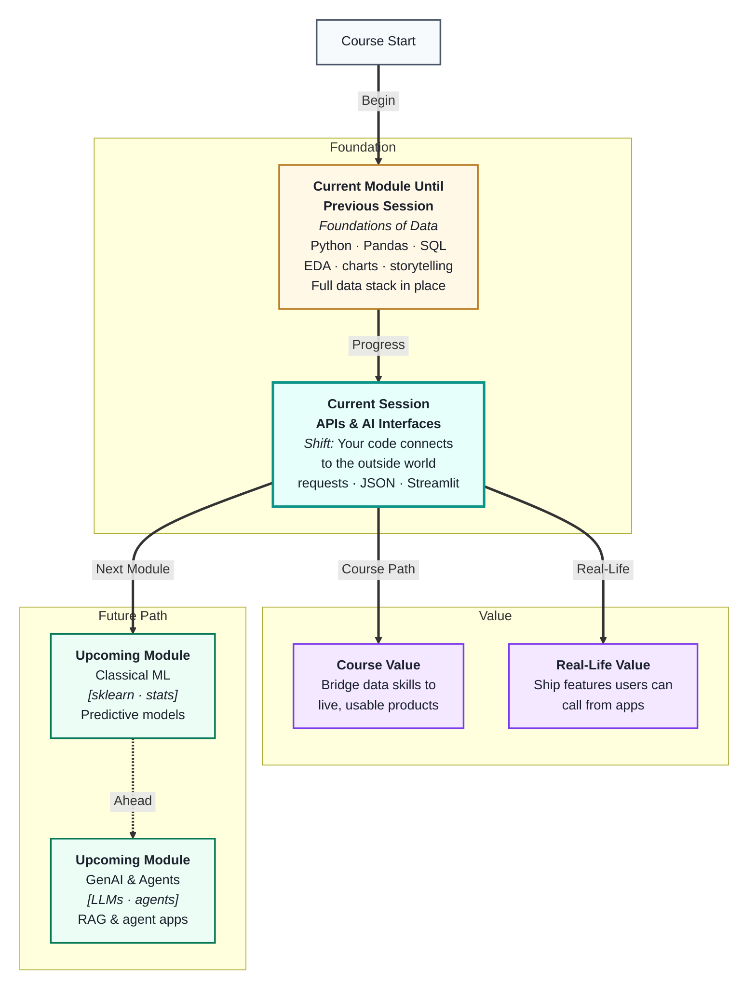
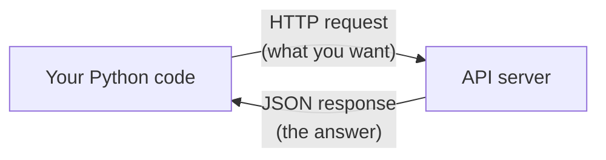
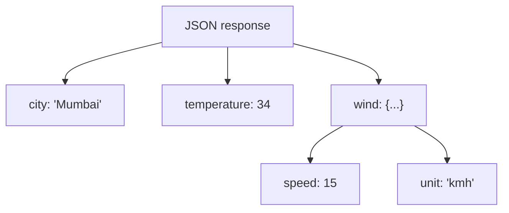
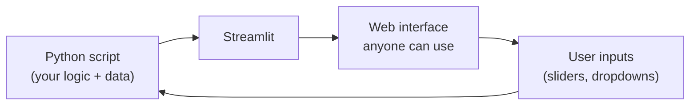

# APIs & Building AI Interfaces
---

## Mental Map



## What You'll Learn

In this pre-read, you'll discover:

- What an **API** is and how your Python code talks to external services
- How **HTTP requests** work — the language of the web
- How to read and use **JSON responses** returned by an API
- How to handle **API keys and authentication** safely
- How **Streamlit** lets you wrap Python logic into a shareable web interface

---

## A. What Is an API?

> 💡 **Analogy:** At a restaurant, you do not walk into the kitchen and cook your own food. You give your order to a waiter, who takes it to the kitchen and brings back what you asked for. An **API** is the waiter — a defined interface between your code and a service that does the work.

**One-line definition:** An **API (Application Programming Interface)** is a set of rules that lets two programs talk to each other — you send a request, the service sends back a response.



APIs are everywhere in AI work:

- Weather app fetching live temperature data
- Your code asking OpenAI for a text completion
- A payment gateway confirming a transaction
- A database service returning query results

**Key terms:**

| Term | Plain meaning |
|---|---|
| **Endpoint** | A specific URL that does one job (like `/get-weather`) |
| **Request** | Your message to the API saying what you want |
| **Response** | The API's reply, usually as JSON data |
| **Status code** | A number telling you if it worked (200 = OK, 404 = not found, 500 = server error) |

You do not need to know *how* the API works internally — only *what to ask* and *how to read the answer*. That is the power of an interface.

---

## B. HTTP Requests — GET and POST

> 💡 **Analogy:** Sending a GET request is like asking a librarian for a specific book — you give a reference, they hand it back. Sending a POST request is like handing the librarian a new manuscript and saying "please add this." Each action has a different method.

**One-line definition:** An **HTTP request** is a message your code sends over the web to an API, specifying *what action* to perform (GET, POST, etc.) and *what data* to include.

**The two methods you will use most:**

| Method | When to use | What travels | Analogy |
|---|---|---|---|
| `GET` | Retrieve data | Parameters in the URL | Asking a question |
| `POST` | Send data, trigger action | Data in the request body | Submitting a form |

**Using the `requests` library in Python:**

```
import requests

# GET — ask for data
response = requests.get("https://api.example.com/data", params={"city": "Mumbai"})

# POST — send data
response = requests.post("https://api.example.com/submit", json={"name": "Arjun"})
```

**Reading the response:**

```
response.status_code   # 200 means OK
response.json()        # parsed JSON as a Python dict
response.text          # raw text if not JSON
```

Always check `status_code` before using the response — a 200 means success, anything 4xx or 5xx means something went wrong.

---

## C. JSON — The Language APIs Speak

> 💡 **Analogy:** When you order food via a delivery app and track it live, the app is receiving constant tiny messages like `{"status": "on the way", "eta": 12}`. That compact, readable format is **JSON** — the universal language APIs use to pass data back and forth.

**One-line definition:** **JSON (JavaScript Object Notation)** is a lightweight text format for representing structured data as key-value pairs and lists — Python reads it directly as a dictionary or list.

**JSON looks like a Python dict:**

```
{
  "city": "Mumbai",
  "temperature": 34,
  "conditions": ["humid", "partly cloudy"],
  "wind": {"speed": 15, "unit": "kmh"}
}
```

**Mapping JSON to Python:**

| JSON structure | Python equivalent | Access example |
|---|---|---|
| `{"key": value}` | `dict` | `data["city"]` |
| `[item1, item2]` | `list` | `data["conditions"][0]` |
| Nested object | Nested `dict` | `data["wind"]["speed"]` |

**Navigating nested JSON:**



**Common pitfall:** APIs return JSON as a *string* over the wire. Calling `.json()` on the response converts it to a Python object automatically. If you see `{"error": "key not found"}` instead of your data, always check that your request parameters and endpoint URL are correct first.

---

## D. API Keys and Safe Authentication

> 💡 **Analogy:** A gym membership card proves you are allowed to use the facilities. An **API key** is your code's membership card — it tells the service "this request comes from an authorised account" and lets the service track and limit your usage.

**One-line definition:** An **API key** is a secret string that identifies who is making a request; it must be kept private and never written directly in shared code.

Most AI APIs (OpenAI, weather services, maps) require a key. The usual pattern:

```
# Correct — read from environment, not hardcoded
import os
api_key = os.environ.get("MY_API_KEY")

headers = {"Authorization": f"Bearer {api_key}"}
response = requests.get(url, headers=headers)
```

**Why never hardcode a key:**

- Pushing code to GitHub exposes the key to everyone
- The key gets billed to your account — someone could run up charges
- Most services auto-revoke keys found in public repos

**Safe habits:**

| Habit | Why it matters |
|---|---|
| Store keys in `.env` files | Keeps them out of code |
| Add `.env` to `.gitignore` | Prevents accidental upload |
| Use environment variables | Works on any machine without editing code |
| Rotate keys if exposed | Immediately limits damage |

You will use API keys in every AI session from Module 3 onwards — starting this habit now saves a painful mistake later.

---

## E. Streamlit — Turning Python Into a Web App

> 💡 **Analogy:** You have built an engine (your Python analysis). **Streamlit** is the car body — it wraps the engine in something a non-engineer can sit inside and drive.

**One-line definition:** **Streamlit** is a Python library that turns a plain `.py` script into an interactive web app — no HTML, CSS, or JavaScript required.



**What Streamlit gives you for free:**

| Streamlit element | What it does |
|---|---|
| `st.title()`, `st.write()` | Display text and results |
| `st.text_input()`, `st.slider()` | Collect user input |
| `st.dataframe()` | Show a Pandas DataFrame as a table |
| `st.line_chart()`, `st.bar_chart()` | Render charts |
| `st.button()` | Trigger an action |

**Typical AI interface pattern:**

```
user types a question
  → Streamlit collects the text
    → Python sends it to an API
      → API returns a response
        → Streamlit displays the result
```

This is how most early-stage AI demos and internal tools are built. In Module 3 you will build a full RAG application on top of exactly this pattern — a Streamlit front end calling an LLM API.

---

## Practice Exercises

**1. Pattern Recognition**  
An API response comes back with `status_code = 401`. Using what you know about status codes and authentication, name the most likely cause and the first thing you would check in your code.

**2. Concept Detective**  
A teammate's script calls an API successfully in testing but fails when deployed to a shared server, raising a `KeyError` on `os.environ.get("API_KEY")`. Which section of this pre-read explains the problem, and what is the likely cause?

**3. Real-Life Application**  
Name three apps or services you use daily that must be calling an API behind the scenes (e.g. a map app, a news feed, a translation tool). For each, describe what a single GET request might look like: what is the endpoint's job, what parameter would you send, and what would the JSON response probably contain?

**4. Spot the Error**  
A student writes `api_key = "sk-abc123xyz"` directly in their Python file and pushes it to a public GitHub repo. List two specific risks this creates and two immediate steps the student should take to fix the situation.

**5. Planning Ahead**  
You want to build a simple Streamlit app that lets a user type a city name and see live weather data. Plan the app in steps: which API would you call, what HTTP method, what parameter would you pass, what JSON keys would you read from the response, and which Streamlit elements would you use to display the result?

---

> ✅ **You're done!** You now understand how your Python code reaches out to the world through APIs, speaks JSON, and can be wrapped into a live interface with Streamlit. These building blocks power every AI product you will build in Module 3 — from calling LLM APIs to creating RAG apps with a real user interface. Next up: **Module Review, Ethics & Best Practices**, the final session of Module 1.
