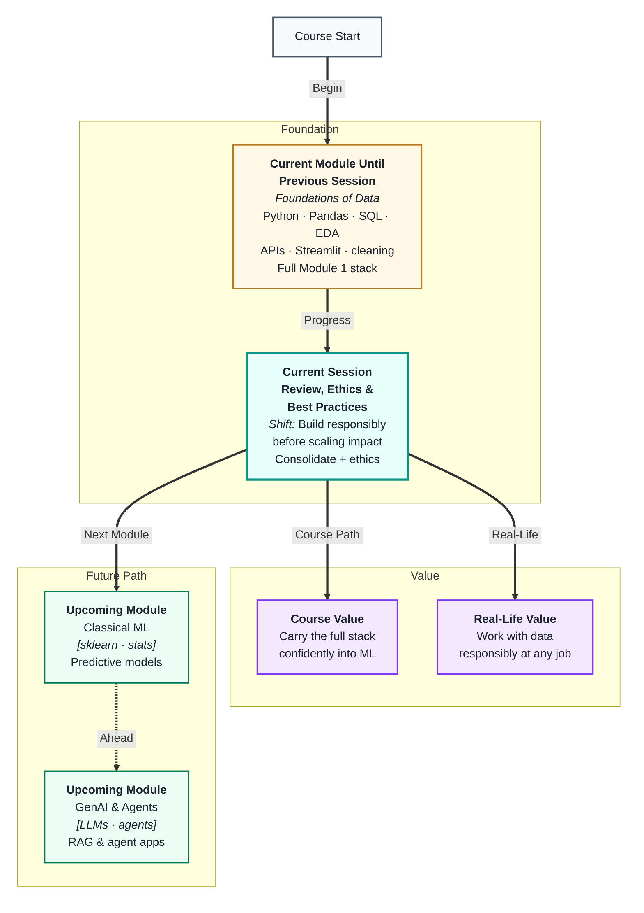
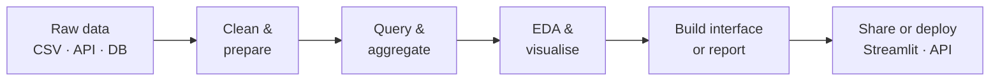
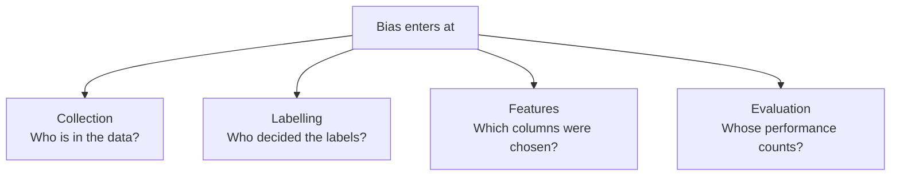
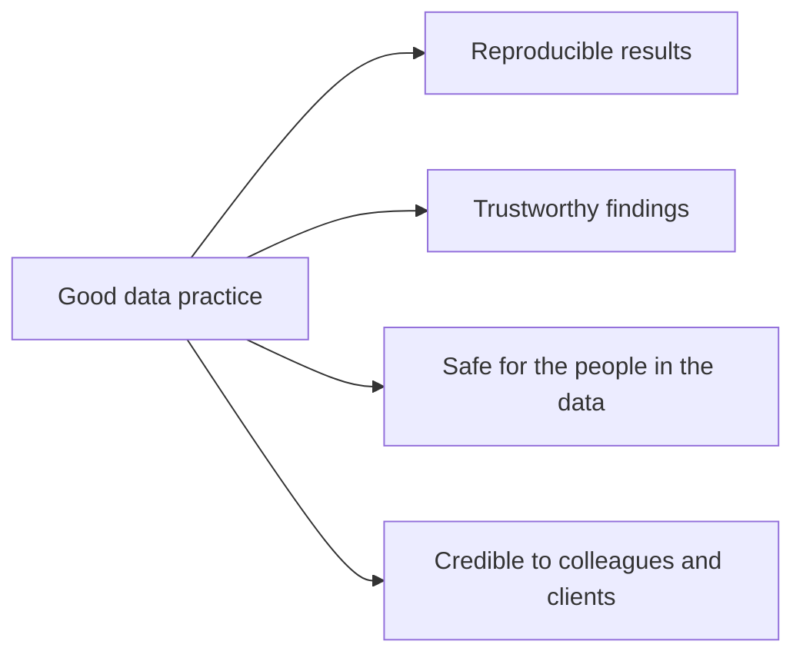

# Module Review, Ethics & Best Practices
---

## Mental Map

## What You'll Learn

In this pre-read, you'll discover:

- How all the skills from Module 1 connect into one coherent **data workflow**
- What **data ethics** means and why it matters before you touch any dataset
- How **bias** enters data and models — and what you can do about it
- What **privacy and consent** rules mean for the data you collect and use
- The professional **best practices** that separate responsible data work from careless work

---

## A. The Module 1 Workflow — Everything Connected

> 💡 **Analogy:** You have learned individual instruments all term — piano, drums, bass, guitar. This session is the first full band rehearsal where you hear how they all play together. **Module review** is that rehearsal.

**One-line definition:** The **Module 1 workflow** is the end-to-end sequence of skills — from raw data to clean tables to queries to visuals to APIs — that every AI engineer uses on every project.

Every session in Module 1 is one step in this pipeline:

| Session cluster | Skills covered | Where it sits |
|---|---|---|
| Python · Git · data structures | Code foundation | Before any data work |
| NumPy · Pandas · data cleaning | Load and fix tables | Step 1–2 |
| Query thinking · advanced Pandas · SQL | Ask and answer questions | Step 3 |
| Masterclass: math & stats | Understand the numbers | Supports Steps 2–4 |
| EDA & visual storytelling | Explore and communicate | Step 4 |
| APIs & Streamlit | Connect and deploy | Step 5–6 |

**Review question to ask yourself:** "Given a brand-new CSV file, can I take it from raw to a clean, queried, visualised, and shareable result?" If yes, you are ready for Module 2.

---

## B. What Is Data Ethics?

> 💡 **Analogy:** A pharmacist filling a prescription has access to private health information. The fact that they *can* read it does not mean they *should* share it or use it for anything else. **Data ethics** is the same principle: having access to data does not make every use of it acceptable.

**One-line definition:** **Data ethics** is the practice of collecting, using, and sharing data in ways that are fair, transparent, honest, and respectful of people's rights.

Ethics is not just a legal requirement — it is a professional standard. Unethical data practices cause real harm: people lose jobs because of biased hiring algorithms, patients are misdiagnosed, communities are unfairly targeted.

| Ethical principle | What it means in practice |
|---|---|
| **Transparency** | Be clear about what data you collected and why |
| **Consent** | People should know and agree their data is being used |
| **Fairness** | Do not let the data or model treat groups differently without justification |
| **Accountability** | Someone must own and answer for the data decisions made |
| **Minimisation** | Collect only what you actually need |

**A simple ethics check before using any dataset:**

- Do I know where this data came from?
- Did the people in it consent to this use?
- Does it contain information that could identify or harm someone?
- Am I using it for the purpose it was originally collected for?

---

## C. Bias — Where It Enters and What to Do

> 💡 **Analogy:** If every photo used to train a face recognition system shows only one skin tone, the system will struggle with others — not because of malice, but because the training data was incomplete. **Bias** in data produces unfair outcomes even when nobody intended it.

**One-line definition:** **Bias** in data or models is a systematic error where certain groups or outcomes are favoured or disadvantaged due to skewed data collection, labelling, or design choices.

**Common types of bias:**

| Bias type | Plain example | Effect |
|---|---|---|
| **Historical bias** | Past hiring data reflects past discrimination | Model perpetuates the same discrimination |
| **Sampling bias** | Survey only reached urban respondents | Model fails on rural users |
| **Label bias** | Annotators from one culture label sentiment | Model misreads other cultures |
| **Measurement bias** | One group's outcomes are tracked more carefully | Apparent gap is a recording artefact |

**What you can do:**

- Check `value_counts()` on every demographic column — are groups fairly represented?
- Ask who labelled the data and whether the labelling guide was objective
- Evaluate model performance *per group*, not just overall — a 95% overall accuracy can hide 60% accuracy for a minority group
- Document assumptions so others can challenge them

Bias is not always removable — sometimes the best action is to flag it clearly and limit the model's use.

---

## D. Privacy, Consent, and Data Minimisation

> 💡 **Analogy:** A doctor's file on you contains your name, address, diagnosis, and test results. You consented to share it *with your doctor* for your treatment — not for a marketing company to use. **Consent** is specific: it does not travel automatically to every use of the data.

**One-line definition:** **Data privacy** means protecting people's personal information; **consent** means they knowingly agreed to a specific use; **data minimisation** means only collecting what is genuinely necessary.

**Personal data — what counts:**

- Direct identifiers: name, email, phone, national ID, biometrics
- Indirect identifiers: postcode + age + occupation (combination can identify someone)
- Sensitive categories: health, religion, political views, financial situation

**Key rules to know:**

| Rule | What it means for you |
|---|---|
| **Anonymise before sharing** | Remove or hash direct identifiers before giving data to others |
| **Purpose limitation** | Do not use data collected for one reason for a completely different reason |
| **Right to deletion** | In many contexts, people can ask for their data to be removed |
| **Secure storage** | Do not leave sensitive CSVs in public folders or unprotected repos |

**In practice:** Before you load any real-world dataset, ask — "Would the people in this file be comfortable knowing I am running this analysis?" If the answer is no or uncertain, get guidance before proceeding.

---

## E. Best Practices for Responsible Data Work

> 💡 **Analogy:** A surgeon washes hands not because they are visibly dirty, but because the habit protects every patient. **Best practices** in data work are the same — professional habits that prevent harm even when nothing looks wrong.

**One-line definition:** **Best practices** are a set of professional habits — in coding, documentation, security, and communication — that make data work reliable, reproducible, and trustworthy.

**Coding hygiene:**

- Version control everything with Git — so you can trace and undo changes
- Use virtual environments — so your dependencies do not break others' machines
- Never hardcode credentials, API keys, or passwords in code
- Write clear variable and function names — code is read more than it is written

**Data hygiene:**

- Document where every dataset came from (source, date, version)
- Record every cleaning decision — what you dropped and why
- Keep raw data untouched; save cleaned versions separately
- Add a data dictionary: what each column means, its units, and its valid range

**Communication hygiene:**

| Habit | Why it matters |
|---|---|
| State what the data cannot answer | Prevents overclaiming findings |
| Show sample sizes on charts | Prevents misleading small-N results |
| Separate observation from interpretation | "Sales dropped" vs "sales dropped *because of*…" |
| Acknowledge limitations | Builds trust; hiding them destroys it |

The best data professionals are not just technically skilled — they are also careful, transparent, and honest about what their data and models can and cannot do.

---

## Practice Exercises

**1. Pattern Recognition**  
List the six stages of the Module 1 data workflow from section A. For each stage, name one Python tool or library you would use and one thing that could go wrong if you skip that stage.

**2. Concept Detective**  
A recruitment company trains a hiring model on 10 years of past interview outcomes. The model recommends rejecting candidates from certain universities at a much higher rate. The engineers say the model is "just reflecting historical data." Which type of bias from section C applies here, and why is "it's just the data" not an acceptable defence?

**3. Real-Life Application**  
Think of three apps or services you use that hold personal data about you (social media, food delivery, health tracker). For each: name one piece of personal data they hold, say whether you gave explicit consent for it, and name one privacy best practice from section D they should follow.

**4. Spot the Error**  
A data analyst publishes a chart titled "90% accuracy — our model works!" The footnote reveals the model was only tested on 20 rows from one city, and the dataset has severe class imbalance. Which best practices from section E were violated, and how should the finding be presented instead?

**5. Planning Ahead**  
You are about to start a new data project analysing student performance across schools. Before writing a single line of code, list five questions you would ask (drawing from ethics, bias, privacy, and best practice sections) to make sure the project is conducted responsibly. For each question, say which principle it protects.

---

> ✅ **You're done!** You have now completed the full Module 1 journey — from your first line of Python to clean data, sharp queries, honest charts, live APIs, and responsible practice. You are not just a coder; you are a data professional who thinks carefully about what the data says *and* what it means for the people inside it. Module 2 starts next with **Classical ML** — your clean, ethical, well-understood data is exactly what machine learning needs to learn from.
