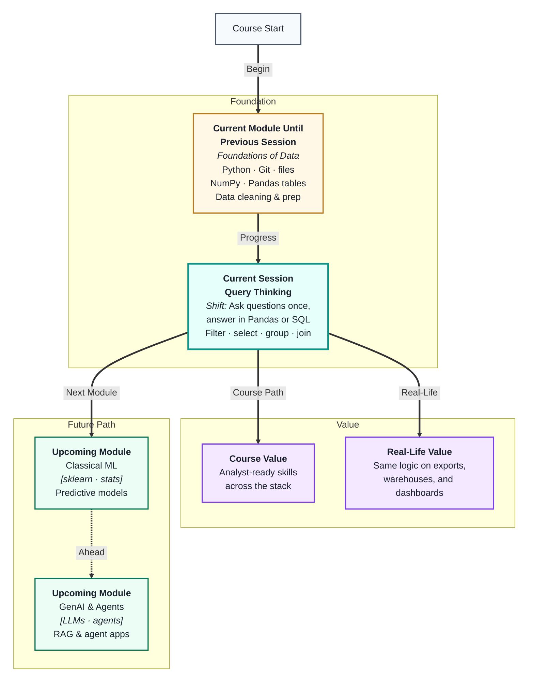
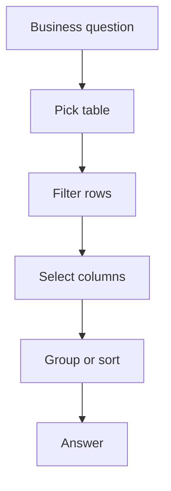
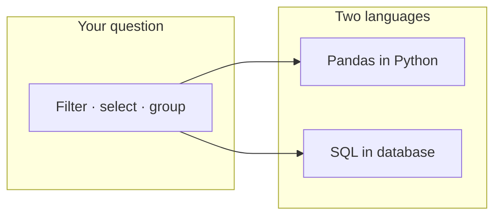
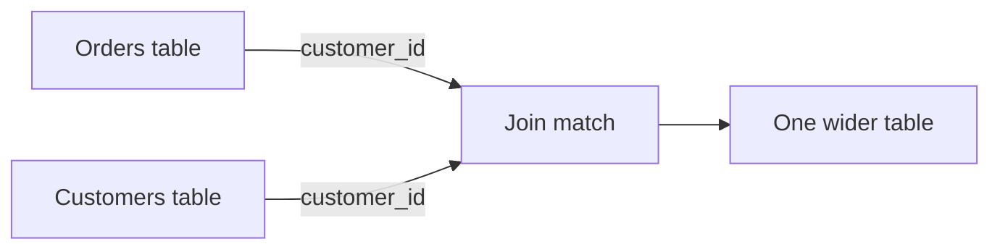

# Query Thinking Across Tools
---

## Mental Map



## What You'll Learn

In this pre-read, you'll discover:

- What **query thinking** means when you work with tables of data
- How the same question can be answered in **Pandas** and **SQL**
- How to **filter**, **select**, and **sort** rows to narrow your answer
- How **grouping** turns many rows into useful summaries
- Why **joining** tables is the next step when answers live in more than one place

---

## A. What Is Query Thinking?

> 💡 **Analogy:** A library catalog is not the books themselves—it is how you *ask* for what you need: “fiction after 2010,” “only Spanish,” “sorted by author.” **Query thinking** is learning to ask precise questions of your data the same way.

**One-line definition:** **Query thinking** is the habit of turning a business question into clear steps: pick a table, filter rows, choose columns, and summarize results.



You already clean tables so they are trustworthy. Query thinking is what you do *next*: you interrogate the table.

| Plain question | Query thinking step |
|---|---|
| “Who bought in March?” | Filter by date |
| “What is total revenue?” | Sum one column |
| “Top 5 products?” | Group, sort, limit |
| “Orders with customer city?” | Join two tables |

You do not need to memorize syntax first. You need a **repeatable question pattern**. Tools like Pandas and SQL are just different languages for the same pattern.

---

## B. The Same Questions, Different Tools

> 💡 **Analogy:** “Where is the restroom?” works in English, Hindi, or a hand gesture—the *intent* is the same. **Pandas** and **SQL** are two ways to express the same data question.

**One-line definition:** **Pandas** runs queries on tables in Python memory; **SQL** runs queries on tables stored in a database—but both follow filter → select → group logic.

| Intent | Pandas (idea) | SQL (idea) |
|---|---|---|
| Pick columns | `df[["name", "sales"]]` | `SELECT name, sales` |
| Filter rows | `df[df["city"] == "Pune"]` | `WHERE city = 'Pune'` |
| Sort | `df.sort_values("sales")` | `ORDER BY sales` |
| Top N | `.head(5)` | `LIMIT 5` |
| Count by group | `df.groupby("city").size()` | `GROUP BY city` |



**Key idea:** Learn the *question*, then map it to syntax. If you can say “show only rows where status is Active,” you are halfway to both `df[df["status"] == "Active"]` and `WHERE status = 'Active'`.

---

## C. Filter, Select, and Sort — The Core Trio

> 💡 **Analogy:** Shopping online: you pick a category (filter), choose which details to display on each card (select), and change “sort by price” (sort). Data queries use the same three moves.

**One-line definition:** A **filter** keeps only matching rows; a **select** picks which columns you see; a **sort** orders rows by a column value.

**Filter (WHERE thinking):**
- Keep rows where a column meets a rule: equals, greater than, contains text
- Combine rules with **and** / **or**: city is Pune *and* amount > 1000

**Select (column thinking):**
- Hide columns you do not need—smaller answers are easier to read
- Rename or compute columns later; first, choose what matters

**Sort (ORDER thinking):**
- Newest first, highest sales first, alphabetical by name
- Often paired with “top 10” style questions

| Step | Question it answers | Mistake to avoid |
|---|---|---|
| Filter | “Which rows qualify?” | Forgetting nulls break comparisons |
| Select | “Which fields do I show?” | Dragging every column “just in case” |
| Sort | “In what order?” | Sorting text that looks like numbers |

Pseudo-code pattern:

```
start with full table
keep rows that match rules
keep only needed columns
order rows by chosen column
take top N if asked
```

---

## D. Grouping — From Many Rows to One Summary

> 💡 **Analogy:** A cricket scoreboard does not list every ball bowled on the main screen—it shows *runs per batsman*. **Grouping** collapses many detail rows into one line per category.

**One-line definition:** **Grouping** means split rows by a category (like city or product), then compute a summary (count, sum, average) for each group.

| Business ask | Group by | Summary |
|---|---|---|
| Sales per region | `region` | `sum(amount)` |
| Orders per customer | `customer_id` | `count(*)` |
| Average rating per product | `product_id` | `mean(rating)` |

In Pandas you think: `groupby` → `agg`. In SQL you think: `GROUP BY` → `SELECT` with `SUM`, `COUNT`, `AVG`.

**Watch out:** Every column in the result must either be in the **group key** or inside an **aggregate**. You cannot group by `city` and also show raw `order_id` without aggregating it—that is like mixing team totals with every player’s individual play-by-play on one line.

---

## E. Joins — When the Answer Lives in Two Tables

> 💡 **Analogy:** A contact in your phone has a name; your email app has messages. To see “messages from Mom,” you match the same person across two apps. A **join** matches rows across two tables using a shared key.

**One-line definition:** A **join** combines two tables by lining up rows that share a matching column, such as `customer_id`.



| Join idea | Plain English |
|---|---|
| Inner join | Keep only rows that match in *both* tables |
| Left join | Keep all rows from the left table; add matches if found |

You will go deeper on joins in SQL sessions soon. For now, remember: **if your question needs columns from two tables, you need a join key**—usually an ID column that means the same thing in both places.

Query thinking checklist before you code:

- Which table(s) hold the answer?
- What row filter applies?
- Which columns should appear?
- Do I need a group summary or a join?

---

## Practice Exercises

**1. Pattern Recognition**  
A teammate writes: “I want active users in Delhi, only name and email, newest signup first.” Label each part as filter, select, sort, group, or join—even if they have not written any code yet.

**2. Concept Detective**  
A report shows `city` and `total_sales` but also lists individual `order_id` values on the same row for one city. Which concept from this pre-read was skipped, and what should the table show instead?

**3. Real-Life Application**  
Pick three places you already use filters in daily life (music app, food delivery, school portal). For each, write the data-table version: what is the “row,” what is the “filter,” and what is the “result”?

**4. Spot the Error**  
Someone runs a query equivalent to “all rows where `discount` > 10” but many `discount` cells are blank. Sales look too low after filtering. What went wrong with missing values, and what would you check before filtering?

**5. Planning Ahead**  
You have `orders(order_id, customer_id, amount, date)` and `customers(customer_id, name, city)`. Plan—in plain steps, not code—how you would answer: “Total amount per city for orders in the last 30 days.” Mention filter, join, group, and any sort/limit you would use.

---

> ✅ **You're done!** You now see queries as a thinking pattern—not a pile of syntax. The same filter, select, group, and join ideas travel from Pandas to SQL and beyond. Next you will sharpen aggregation in **Advanced Pandas & SQL Fundamentals**, then explore relationships and richer retrieval as the module continues.
