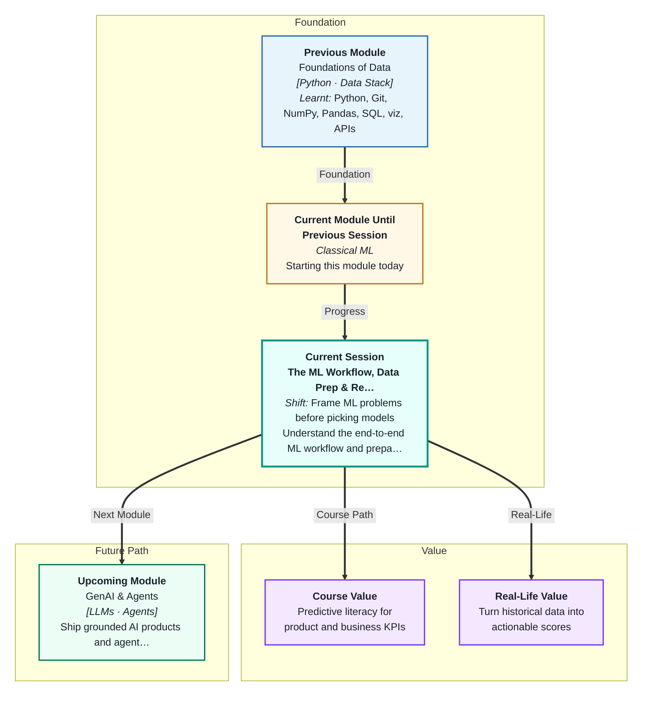
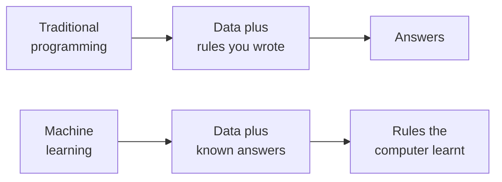
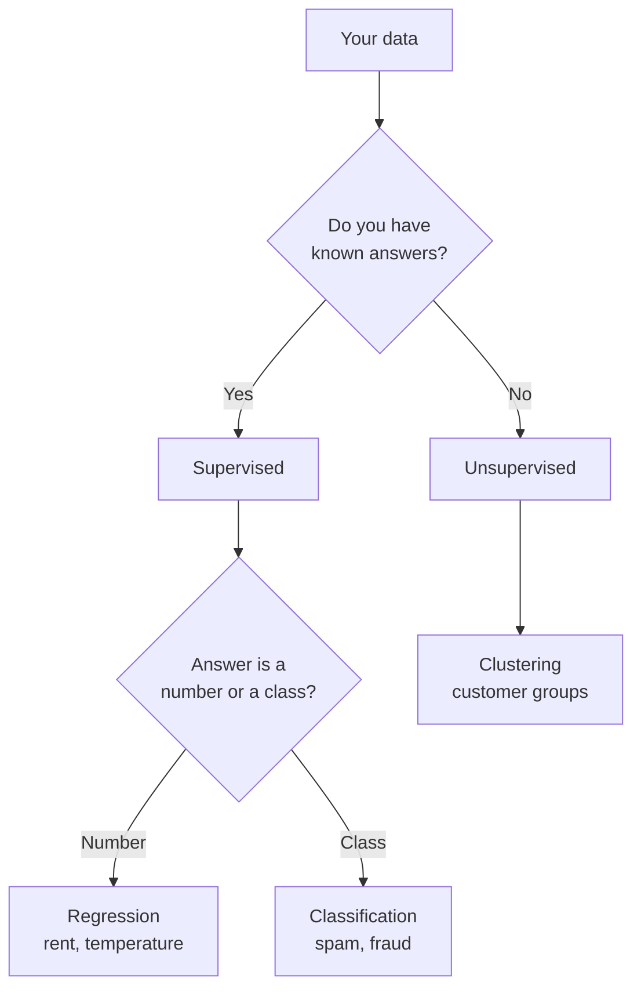
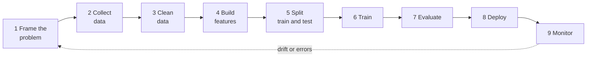
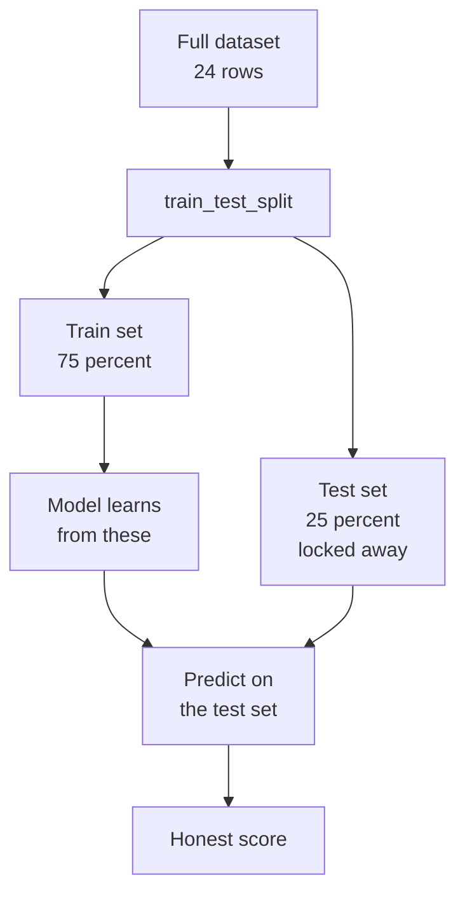
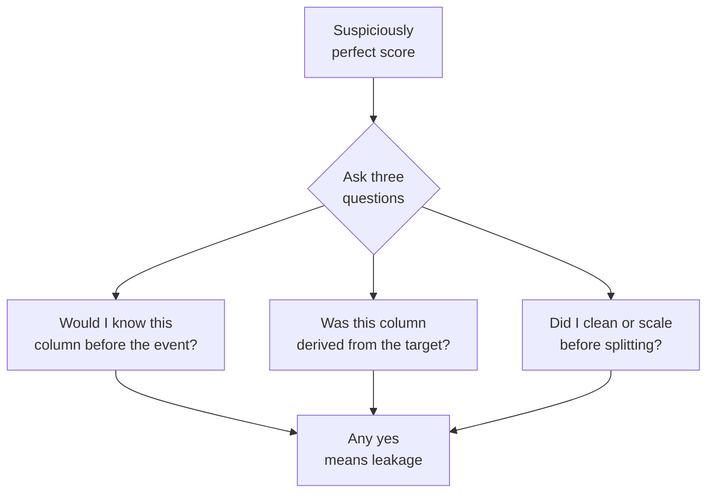

# The ML Workflow, Data Prep & Reliability
---

## Mental Map



## What You'll Learn

In this pre-read, you'll discover:

- What **machine learning** actually is, and how it differs from the Python you already write
- The difference between **supervised** and **unsupervised** learning
- The full **ML lifecycle** — from framing a question to watching a live model
- Why you must **hold data out** before training, and what breaks when you don't
- How **data leakage** silently makes a bad model look brilliant

---

## A. Machine Learning vs Traditional Programming

> 💡 **Analogy:** A recipe card tells you exactly what to do: 2 cups rice, 3 cups water, boil 12 minutes. That is traditional programming — you wrote the rules. A cook who has tasted a thousand pots of dal knows when the salt is right *without any recipe*. Nobody wrote those rules down. The cook learnt them from examples. That is **machine learning**.

**One-line definition:** **Machine learning (ML)** is writing a program that learns its own rules from examples, instead of you writing the rules by hand.

In everything you built in Module 1, *you* supplied the logic. You wrote `if amount > 50000: flag_it`. ML flips the arrows: you supply the data *and* the answers, and the computer works out the rule.



| | Traditional programming | Machine learning |
|---|---|---|
| You provide | Rules | Examples with answers |
| Computer produces | Answers | Rules |
| Good for | Tax calculation, sorting | Spam, prices, recommendations |
| Fails when | Rules are too many to write | Examples are few or dirty |

**When should you reach for ML?** Only when the rule is real but too messy to write down. Nobody can list every rule that makes an email spam — but you can easily collect 10,000 emails already marked spam or not. That is the ML sweet spot.

**When should you NOT?** If a simple `if` statement solves it, use the `if` statement. ML is more expensive, harder to debug, and can be wrong in surprising ways.

---

## B. Supervised vs Unsupervised Learning

> 💡 **Analogy:** Studying with flashcards that have the answer printed on the back — you guess, flip, and correct yourself. That is **supervised learning**. Now imagine someone hands you 500 unsorted holiday photos with no captions and asks you to make piles. You have no answers to check against, so you group by whatever looks similar. That is **unsupervised learning**.

**One-line definition:** **Supervised learning** learns from examples that already carry the correct answer; **unsupervised learning** finds structure in data that has no answers at all.

| | Supervised | Unsupervised |
|---|---|---|
| Data has answers? | Yes — every row is **labelled** | No labels |
| Question it answers | "What will this be?" | "How does this group?" |
| Typical tasks | **Regression**, **classification** | **Clustering** |
| Example | Predict a flat's rent | Group customers by behaviour |

Supervised learning splits into two flavours, decided entirely by *what kind of answer you want*:

- **Regression** — the answer is a number on a scale. *How much will this flat rent for in Bengaluru?* → ₹28,400
- **Classification** — the answer is a category from a fixed list. *Is this transaction fraud?* → Yes / No



Most of this module is supervised learning. You will meet clustering in **Session 9**.

---

## C. The End-to-End ML Lifecycle

> 💡 **Analogy:** You do not begin a road trip by switching on the engine. You pick where you are going, check the tyres, fill fuel, drive, glance at the map, and keep an eye on the fuel gauge the whole way. A model is the same journey — the driving is a small part of it.

**One-line definition:** The **ML lifecycle** is the full sequence of steps from asking a question to keeping a live model healthy — and training the model is only one step in the middle.



| Step | The question it answers |
|---|---|
| Frame the problem | What are we predicting, and what decision changes because of it? |
| Collect and clean | Do we have honest, complete data for that prediction? |
| Build features | Which columns actually carry signal? |
| Split | What data will we hide from the model to test it fairly? |
| Train and evaluate | Did it learn, and how well? |
| Deploy and monitor | Does it still work next month, on new data? |

Two things surprise beginners. First, steps 1–5 usually take **more than 70%** of the real effort — the training call itself is one line of code. Second, the loop never closes: a model that predicted rents well in 2024 can quietly rot as the market shifts. That is why **monitor** points back to **frame**.

---

## D. Features, Target, and Why You Hold Data Out

> 💡 **Analogy:** Before an exam, you practise on question papers whose answers you can see. But you would never judge your readiness by re-solving those same papers — of course you get them right, you have seen the answers. The real test is a paper you have never laid eyes on.

**One-line definition:** The **features** (called `X`) are the input columns the model learns from, the **target** (called `y`) is the answer column it predicts, and the **train/test split** hides part of the data so you can check the model on rows it has never seen.

For a rent dataset, this is the whole idea in one picture:

| | `area_sqft` | `bedrooms` | `age_years` | ➡️ `rent` |
|---|---|---|---|---|
| Role | Feature | Feature | Feature | **Target** |
| Goes into | `X` | `X` | `X` | `y` |



A model that scores brilliantly on data it trained on has told you nothing — it may have simply memorised it. **Generalisation** is the only thing that matters: does the model work on rows it has never seen? The test set is the only honest way to find out, and it works only if you keep it sealed until the very end.

**The one rule:** the test set is opened **once**, at the end. Not to tune, not to peek, not to "just check".

---

## E. Data Leakage — The Silent Reliability Killer

> 💡 **Analogy:** You build a model to predict which IPL team wins a match. One of your columns is *"number of fireworks set off by the crowd"*. Your model scores 100% on every past match — brilliant! But fireworks only go off *after* the winner is known. On a live match, the column is empty and your model is worthless. It never learnt cricket; it learnt fireworks.

**One-line definition:** **Data leakage** is when information the model could not possibly have at prediction time sneaks into training — producing a fantastic score that collapses in the real world.

Leakage is the single most common reason a model that "worked" in a notebook fails in production. It comes in two main shapes:

| Type | What happens | Rent example |
|---|---|---|
| **Target leakage** | A feature secretly contains the answer | `maintenance_fee` is 8% of rent — so it *is* the rent |
| **Preprocessing leakage** | You compute stats on the whole dataset before splitting | You scale using the mean of *all* rows, so test rows influenced training |



**The tell-tale sign:** an accuracy or R² that looks *too good* — 0.99, or a perfect 1.00. Real data is noisy. If your model looks flawless, be suspicious before you be proud.

**The defence is order:** split **first**, then clean, scale, and fit — using only the training rows to work out any statistic.

---

## F. Your First Model — The `fit` / `predict` Shape

> 💡 **Analogy:** Every TV remote, whatever the brand, has a power button and a volume rocker in roughly the same place. You do not relearn remotes. **scikit-learn** does this for models: every single one, from the simplest to the most complex, has the same two buttons.

**One-line definition:** **scikit-learn** (imported as `sklearn`) is Python's standard ML library, and every model in it learns with `.fit(X_train, y_train)` and predicts with `.predict(X_test)`.

| Method | What it does | When you call it |
|---|---|---|
| `.fit(X, y)` | Learns the rules from labelled data | Once, on the **training** set only |
| `.predict(X)` | Applies the learnt rules to new rows | On the test set, or on live data |
| `.score(X, y)` | Reports how well predictions match reality | On the test set, at the end |
| `random_state=42` | Fixes the randomness so results repeat | Everywhere randomness appears |

The whole of your first ML program is four lines:

```
model = LinearRegression()
model.fit(X_train, y_train)
predictions = model.predict(X_test)
print(model.score(X_test, y_test))
```

**Reproducibility** matters more than it looks. `train_test_split` shuffles rows randomly — so without `random_state=42`, you and your teammate get different splits, different scores, and a pointless argument. Set the seed, and the same code gives the same answer every single time.

---

## Practice Exercises

**1. Pattern Recognition**  
Here are four tasks: (a) calculating GST on an invoice, (b) predicting tomorrow's electricity demand for Delhi, (c) grouping 50,000 kirana customers into shopping personas, (d) deciding whether a photo shows a dog or a cat. For each one, say whether it needs traditional programming, supervised learning, or unsupervised learning — and if supervised, whether it is regression or classification. Justify each in one sentence.

**2. Concept Detective**  
A classmate trains a model to predict whether a student will pass a course. Their test accuracy is 100%. They are delighted. You look at their columns and see one named `final_grade_letter`. Diagnose exactly what has gone wrong, name the concept from this pre-read, and explain what would happen if this model were used on students halfway through a semester.

**3. Real-Life Application**  
Pick something you would genuinely like to predict from your own life — your monthly phone bill, your commute time, or how many hours you sleep. Write down the target `y`, at least four features you could realistically collect for `X`, and say whether it is a regression or classification problem. Then name one feature you would be *tempted* to use but that would leak.

**4. Spot the Error**  
A team writes this workflow: load the data, fill all missing values with the column mean, scale every column, then split into train and test, then train the model. Their test score is excellent but the deployed model performs badly. Identify which step is in the wrong place, explain what information travelled where it should not have, and write the corrected order.

**5. Planning Ahead**  
You are asked to build a model that predicts whether a customer will cancel their broadband subscription next month. Design the full lifecycle: what question you would frame, what data you would collect, which two features you think would carry real signal, how you would split the data, and — critically — name two columns that would look tempting but would actually be leaks. Explain why for each.

---

> ✅ **You're done!** You now know what machine learning really is, how the end-to-end workflow fits together, and why holding out a test set is the difference between a model you can trust and one that only *looks* good. In class you will run your very first `model.fit()` — and you will deliberately build a leaky model, watch it score a suspicious 1.00, and then fix it. Coming up next: **Avoiding ML Pitfalls & Model Generalization**, where you will meet overfitting head-on and learn how to tell a model that has genuinely learnt from one that has merely memorised.
