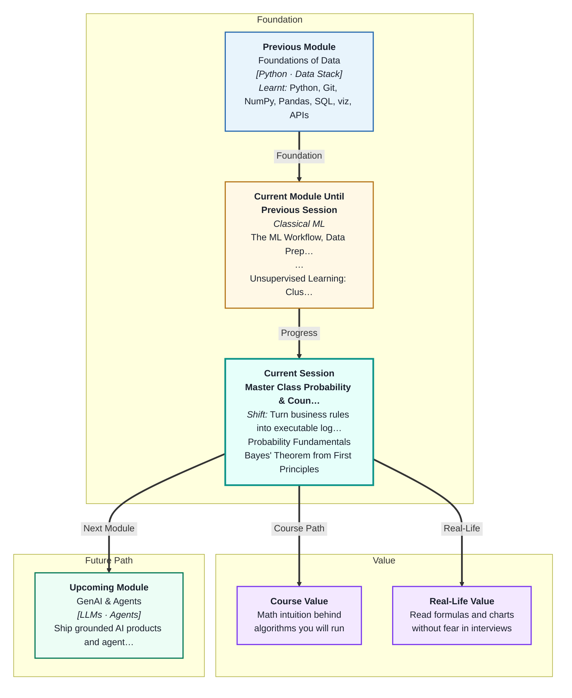
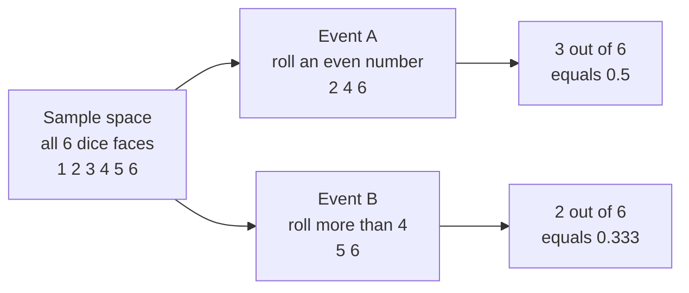
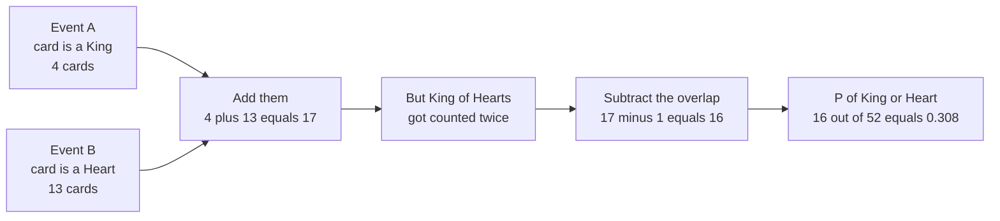
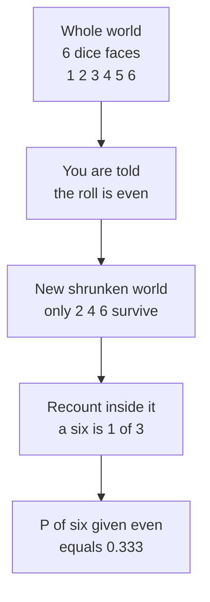
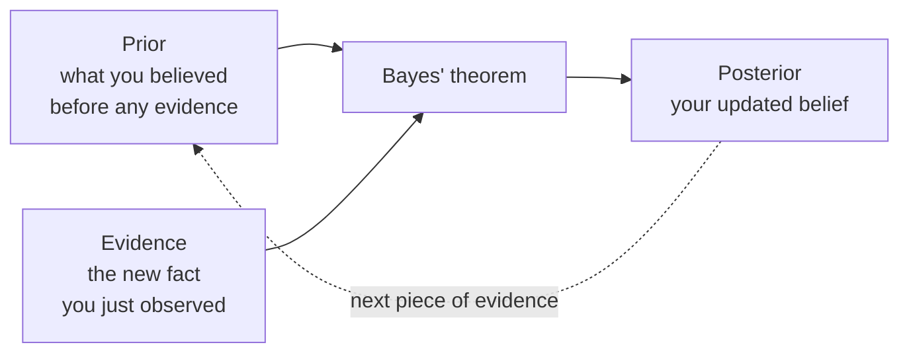

# Master Class: Probability & Counting — The Mathematics of Uncertainty
---

## Mental Map



## What You'll Learn

In this pre-read, you'll discover:

- How to count outcomes and turn that count into a **probability** using coins, dice and cards
- Why the **complement rule** is the fastest way to answer any "at least one" question
- How the **addition rule** works, and why you must subtract the overlap
- The difference between **mutually exclusive** and **independent** — two ideas students constantly mix up
- How **conditional probability** shrinks your world, and how **Bayes' theorem** turns a belief plus evidence into an updated belief

---

## A. Sample Space and Events — Counting Before Calculating

> 💡 **Analogy:** Think of a restaurant menu. Everything the kitchen *could* send to your table is the full menu. "Anything with paneer in it" is a smaller group inside that menu. Probability is just: how big is the paneer group compared to the whole menu?

**One-line definition:** The **sample space** is the complete list of everything that could happen, and an **event** is any group of outcomes inside it that you care about.



Once you can count, the formula is embarrassingly simple:

```
P(A) = number of favourable outcomes / total number of outcomes
```

This only works when every outcome is **equally likely** — a fair coin, a fair die, a well-shuffled deck. That is called **classical probability**.

| Setup | Sample space size | Example event | P(event) |
|---|---|---|---|
| One coin toss | 2 | Heads | 1/2 = 0.5 |
| One die roll | 6 | Roll a 6 | 1/6 ≈ 0.167 |
| Two dice | 36 | Sum equals 7 | 6/36 = 1/6 |
| One card from a deck | 52 | A King | 4/52 = 1/13 |
| One card from a deck | 52 | A Heart | 13/52 = 1/4 |

**Key fact:** Every probability is a number between 0 and 1. P = 0 means impossible. P = 1 means certain. Nothing is ever 1.3, and nothing is ever negative. If your answer breaks that rule, your counting is wrong.

---

## B. The Complement Rule — The "At Least One" Shortcut

> 💡 **Analogy:** You are packing for a Goa trip. Instead of listing every single item you *are* taking, it is faster to say "everything in the cupboard except the woollens." Counting what you leave out is often easier than counting what you take.

**One-line definition:** The **complement** of an event A is "A does not happen", and its probability is `P(not A) = 1 − P(A)`.

Because something must happen, the probability of A and the probability of not-A always add to 1.

**Where this becomes a superpower — the "at least one" trick:**

Suppose you roll a fair die 4 times. What is the chance of getting **at least one** six?

Counting the ways to get one six, or two sixes, or three, or four is painful. So flip it:

```
P(at least one six) = 1 − P(no six at all)
```

Step by step:

1. Chance a single roll is **not** a six = 5/6
2. Four rolls in a row with no six = (5/6) × (5/6) × (5/6) × (5/6) = (5/6)⁴ ≈ 0.4823
3. So P(at least one six) = 1 − 0.4823 ≈ **0.5177**, or about 52%

| Question you are asked | What you should actually compute |
|---|---|
| At least one six in 4 rolls | 1 − P(zero sixes) |
| At least one head in 10 tosses | 1 − P(all tails) |
| At least one defective item in a box | 1 − P(all items fine) |
| At least one rainy day this week | 1 − P(every day is dry) |

**Rule of thumb:** the moment you read the words "at least one", stop and compute the complement instead. It is almost always the shorter road.

---

## C. The Addition Rule — Why You Subtract the Overlap

> 💡 **Analogy:** A wedding has a guest list from the bride's side and a guest list from the groom's side. If you just add the two lists to order food, you over-order — because some cousins are on **both** lists and you counted them twice. You must subtract the people counted twice.

**One-line definition:** The **addition rule** says `P(A or B) = P(A) + P(B) − P(A and B)` — add the two events, then remove the overlap you counted twice.



Worked by hand, using one card drawn from a 52-card deck:

- P(King) = 4/52
- P(Heart) = 13/52
- P(King **and** Heart) = 1/52 — there is exactly one King of Hearts
- P(King **or** Heart) = 4/52 + 13/52 − 1/52 = **16/52 ≈ 0.308**

If you forget the subtraction you get 17/52, and you have quietly claimed there are two Kings of Hearts in the deck. Picture two overlapping circles: the shaded region is counted once from circle A and once from circle B, so it must be removed once.

**Special case:** if A and B can never happen together, the overlap is zero, and the rule simplifies to `P(A or B) = P(A) + P(B)`. That special case is the subject of the next section.

---

## D. Mutually Exclusive vs Independent — The Two Words Everyone Confuses

> 💡 **Analogy:** A traffic light is either red or green — it can never be both at the same moment. That is **mutually exclusive**. Meanwhile, whether it rains in Chennai today has nothing to do with whether your phone alarm rings tomorrow — knowing one tells you nothing about the other. That is **independent**. Two completely different ideas, and they are almost opposites.

**One-line definition:** **Mutually exclusive** means the two events cannot both happen; **independent** means one event happening does not change the chance of the other.

| Question | Mutually exclusive | Independent |
|---|---|---|
| Can both happen at once? | No, never | Yes, quite possibly |
| P(A and B) equals | 0 | P(A) × P(B) |
| Does A tell you about B? | Yes — a lot | No — nothing at all |
| One-card example | King and Queen | King and Heart |
| Everyday example | Train on platform 1 or 2 | Coin toss and tomorrow's weather |

Notice the sting in the table: mutually exclusive events are the **most dependent** events there are. If you know the card is a King, you know for certain it is not a Queen. That is a huge amount of information — the opposite of independence.

**The multiplication rule for independent events:**

```
P(A and B) = P(A) × P(B)     -- only when A and B are independent
```

Check it on the deck: P(King) × P(Heart) = (1/13) × (1/4) = 1/52. And there really is exactly one King of Hearts, so P(King and Heart) = 1/52. The numbers match, so "King" and "Heart" are genuinely independent.

Two fair coins: P(both heads) = 1/2 × 1/2 = **1/4**. Three coins: 1/2 × 1/2 × 1/2 = 1/8. Coins have no memory — a run of five heads does not make tails "due".

---

## E. Conditional Probability — Shrink the World Down to B

> 💡 **Analogy:** You have lost your house keys and the whole house is fair game. Then your sister says, "I saw them in the kitchen." Your search world instantly shrinks from the whole house to one room — and the chance of finding them near the fridge just shot up. Nothing about the keys changed. Your *world* changed.

**One-line definition:** **Conditional probability** `P(A|B)` is the probability of A *given that B has already happened* — you throw away every outcome where B is false, and recount inside what is left.



The formula is exactly this shrinking, written down:

```
P(A|B) = P(A and B) / P(B)
```

The bottom of the fraction, `P(B)`, is your **new smaller world**. The top is the part of that new world where A is also true.

Check it on the die: P(six **and** even) = 1/6, and P(even) = 3/6 = 1/2. So P(six | even) = (1/6) ÷ (1/2) = **1/3**. Being told the roll is even doubled your chance of a six, from 1/6 to 1/3.

**Read the bar as the word "given".** `P(A|B)` is "the probability of A, given B" — and crucially, `P(A|B)` is usually **not** the same as `P(B|A)`. P(has four legs | is a dog) is about 1. P(is a dog | has four legs) is nowhere close. Swapping the two is the single most common probability mistake in the world, and fixing it is what the next section is for.

---

## F. Bayes' Theorem — Prior Belief Plus Evidence Equals Updated Belief

> 💡 **Analogy:** You are waiting for a friend who is almost always on time — that is your starting belief. Then you look outside and see heavy monsoon rain. You do not throw away your old belief; you *update* it. Bayes' theorem is the arithmetic of exactly that update.

**One-line definition:** **Bayes' theorem** flips a conditional probability around: `P(A|B) = P(B|A) × P(A) / P(B)`.

**Deriving it in two lines.** There are two honest ways to write P(A and B):

```
P(A and B) = P(A|B) × P(B)
P(A and B) = P(B|A) × P(A)
```

Both describe the same thing, so set them equal and divide both sides by P(B):

```
P(A|B) = P(B|A) × P(A) / P(B)
```

That is the whole theorem. It is conditional probability read backwards.



**The famous medical test — worked by hand.** A disease affects 1 person in 1,000. A test is 99% accurate both ways. You test positive. How worried should you be?

Forget formulas. Just imagine **100,000 people**:

| Group | How many | Test says positive | Test says negative |
|---|---|---|---|
| Actually have the disease | 100 | 99 | 1 |
| Actually healthy | 99,900 | 999 | 98,901 |
| **Total** | **100,000** | **1,098** | **98,902** |

Now read the answer straight off the table. Of the 1,098 people who test positive, only 99 are truly ill:

```
P(disease | positive) = 99 / 1098 ≈ 0.09  →  about 9%
```

Only **9%**, despite a 99%-accurate test. The reason is the **base rate**: healthy people are so numerous that even a tiny 1% error rate among them produces 999 false alarms — ten times more than the 99 real cases.

**This is not a trick — it is your Session 8 precision metric.** A positive prediction on a rare class is mostly false alarms unless the model is extraordinarily accurate. It is also the seed of **Naive Bayes**, a classifier that scores every class with exactly this formula and picks the winner.

---

## Practice Exercises

**1. Pattern Recognition**  
For each pair, decide whether the two events are mutually exclusive, independent, both, or neither: (a) drawing a red card and drawing a Spade from one deck; (b) rolling a 3 on a die and getting Heads on a coin; (c) it raining in Bengaluru today and your local train being delayed today. Explain what test you applied to each pair to reach your answer.

**2. Concept Detective**  
A student computes the chance of drawing "a face card or a Club" from a 52-card deck as 12/52 + 13/52 = 25/52. Their friend insists the true answer is smaller. Diagnose exactly which quantity the student failed to account for, name the rule from this pre-read that they broke, and describe in words the group of cards being double-counted.

**3. Real-Life Application**  
A city installs a CCTV system that flags pickpockets with 98% accuracy, in a crowd where roughly 1 person in 500 is a pickpocket. Using the natural-frequency approach from section F, sketch a table for 100,000 people and reason out roughly what fraction of the people the system flags are actually pickpockets. What would you tell the police chief who assumed "98% accurate means 98% of the people we stop are guilty"?

**4. Spot the Error**  
A weather app claims: "There is a 40% chance of rain on Saturday and a 40% chance on Sunday, so there is an 80% chance of rain at some point over the weekend." Identify two separate mistakes in this reasoning — one about the addition rule and one about the complement rule — and describe how you would compute the answer correctly if the two days were independent.

**5. Planning Ahead**  
You are designing a spam filter for a college email inbox. Roughly 5% of incoming mail is spam. You have noticed the word "congratulations" appears in 60% of spam messages but also in 2% of genuine messages. Plan out, in words, how you would use Bayes' theorem to work out the probability that a message containing "congratulations" is actually spam. State clearly what your prior is, what your evidence is, and what you would need to compute the denominator.

---

> ✅ **You're done!** You can now count a sample space, dodge double-counting with the addition rule, tell mutually exclusive apart from independent, shrink the world with conditional probability, and update a belief with Bayes' theorem. These are the exact mechanics sitting underneath Naive Bayes, spam filters, fraud alerts, and every "confidence score" a model ever prints. Next up: **Dimensionality Reduction & Time Series**, where you will take datasets with far too many columns and squeeze them down to the few that actually matter.
