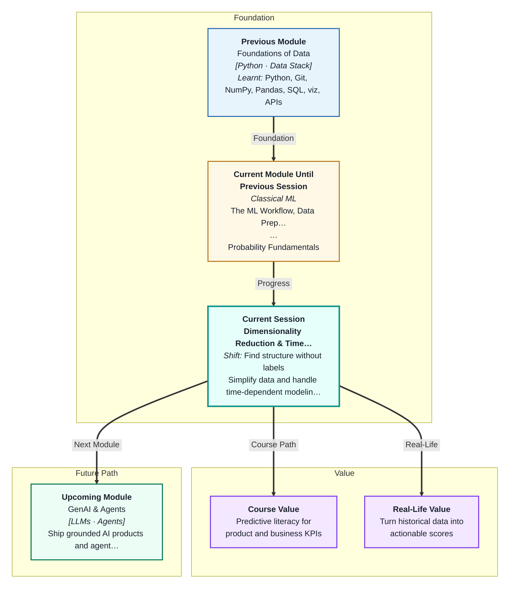
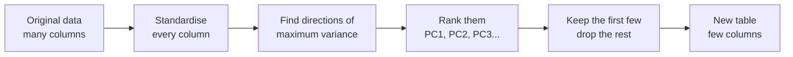
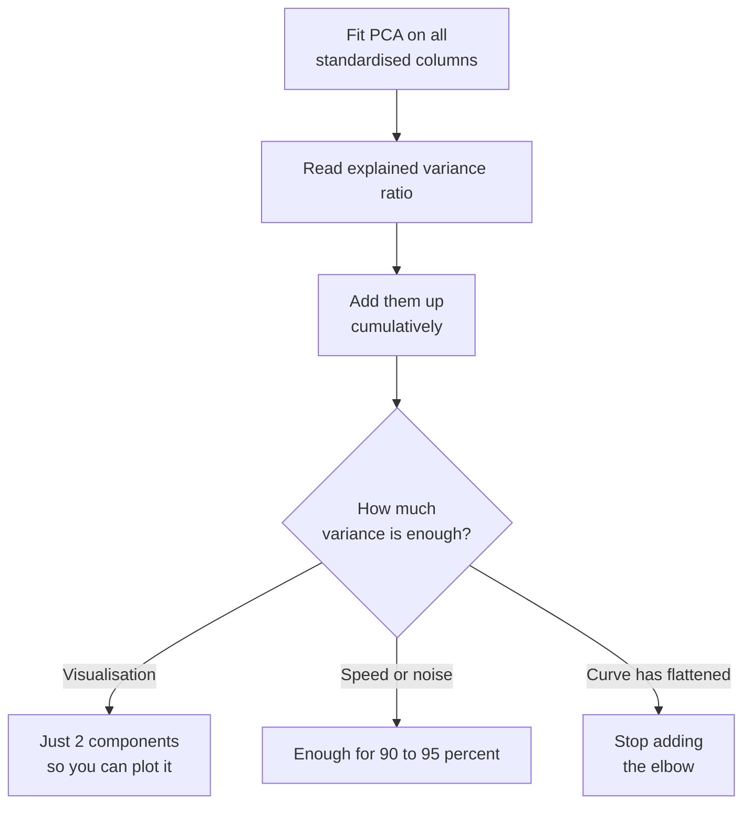
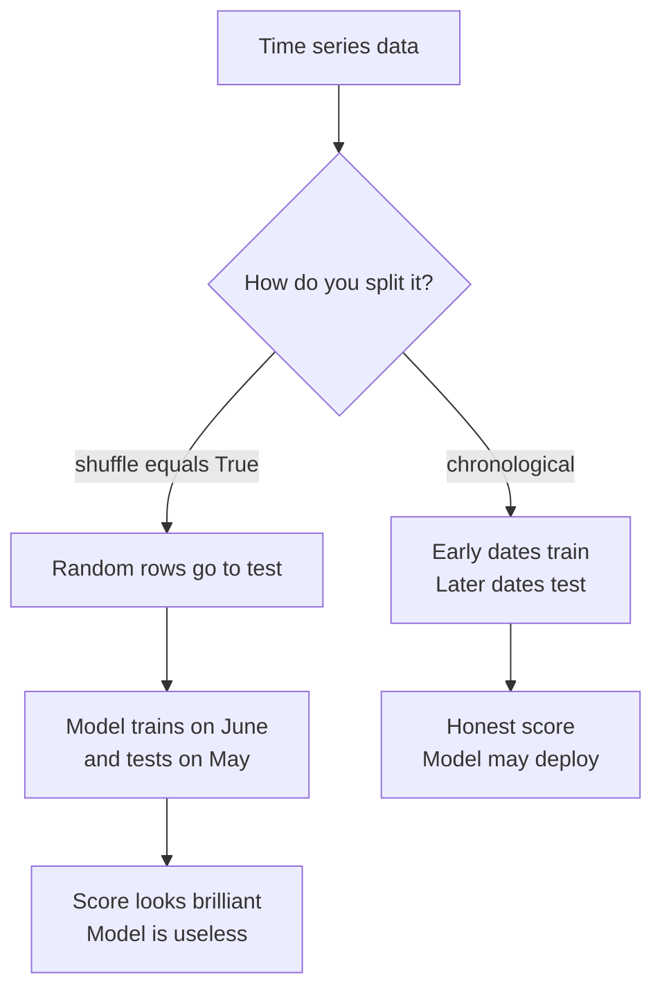
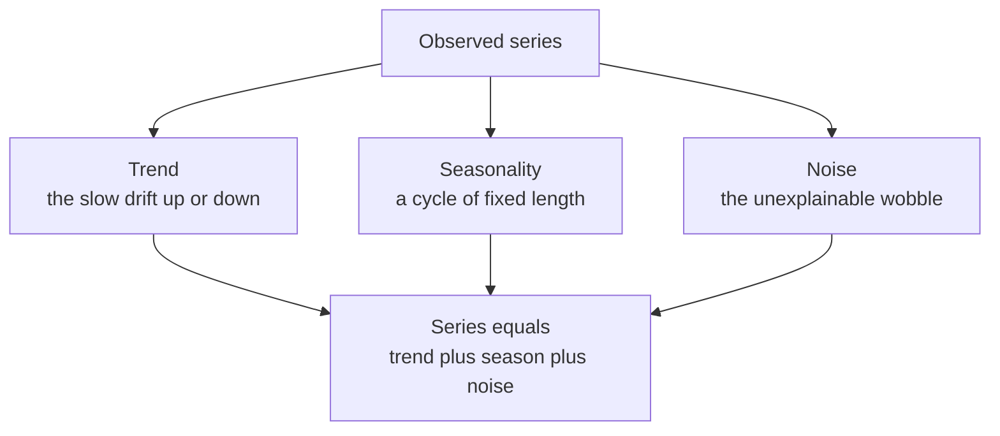

# Dimensionality Reduction & Time Series
---

## Mental Map



## What You'll Learn

In this pre-read, you'll discover:

- Why having **too many columns** quietly breaks the KNN and clustering models you already built
- How **PCA** squeezes many columns into a few new ones — and what you give up in exchange
- How to decide **how many components to keep**, using a simple variance chart
- Why time-ordered data **must never be shuffled**, and what happens when you do
- How to turn a time series into an ordinary table that any model you know can learn from

---

## A. The Curse of Dimensionality

> 💡 **Analogy:** You drop an earring. On a single row of 10 tiles, you find it in seconds. On a 10 × 10 floor there are 100 places. In a 10 × 10 × 10 room — floor, shelves, cupboard tops — there are 1,000. Every new direction you add multiplies the hiding places, and your search gets hopeless.

**One-line definition:** The **curse of dimensionality** is the fact that as you add more features (columns), your data points spread out so far apart that "nearby" stops meaning anything.

Here is why you should care. In Session 6 you built **KNN**, which classifies a point by looking at its nearest neighbours. In Session 9 you built **K-Means**, which groups points by distance to a centre. Both of them are built entirely on the idea of *distance*.

Now watch what happens to distance as columns pile up:

| Number of features | Nearest point is... | Farthest point is... | Difference between them |
|---|---|---|---|
| 2 | very close | far | huge — neighbours are meaningful |
| 20 | somewhat far | far | shrinking |
| 100 | far | far | tiny |
| 500 | far | far | almost none — everything is equally far |

By 500 columns, the closest point and the farthest point are nearly the same distance away. Your "nearest neighbour" is no longer meaningfully near. KNN is now guessing, and K-Means clusters become mush.

**The fix:** reduce the number of columns *before* you measure distance. But you must reduce them without throwing away the information that matters. That is exactly what the next section does.

---

## B. PCA — Photographing Your Data From the Best Angle

> 💡 **Analogy:** Hold a teapot in front of a torch and look at its shadow on the wall. Point the torch at the spout and the shadow is a meaningless blob. Rotate the teapot and suddenly the shadow shows the handle, the spout, the lid — you would recognise it instantly. The shadow is flat (2-D) but you chose the *angle that preserved the most shape*.

**One-line definition:** **Principal Component Analysis (PCA)** finds the new directions along which your data varies the most, then keeps only the first few — giving you far fewer columns while losing as little information as possible.

Your data lives in a high-dimensional space. PCA rotates that space to find the best "camera angle", then projects onto it.



**The two rules of PCA:**

1. **PC1** is the single direction along which the data spreads out the most. **PC2** is the next-most-spread direction that is at right angles to PC1. And so on.
2. **Variance = information.** A direction where all the points look identical tells you nothing, so PCA drops it first.

> ⚠️ **PCA requires standardised features.** PCA hunts for the direction with the biggest spread. If `salary` is in rupees (spread: 50,000) and `years_experience` is in years (spread: 5), PCA will decide salary is the most important direction — purely because rupees are bigger numbers than years. Always run `StandardScaler()` first. This is not optional; it is the single most common PCA bug.

---

## C. How Many Components — and the Price You Pay

> 💡 **Analogy:** A fruit smoothie is compact, delicious, and holds most of the goodness of the fruits you put in. But once it is blended, you can never point to *the banana*. PCA is a smoothie: the new columns are blends of your old ones, and they no longer have names you can explain.

**One-line definition:** **Explained variance ratio** tells you what fraction of the data's total information each principal component carries — and you keep adding components until you have enough.

Every fitted PCA gives you `explained_variance_ratio_`, a list like `[0.44, 0.19, 0.09, 0.07, ...]`. Add them up as you go and plot the running total — that is the **cumulative variance plot**. Pick the number of components where the curve flattens, or where it crosses a threshold you are happy with (80%, 90%, 95% are common).



**The real cost — you lose interpretability.** PC1 is not "salary". PC1 is something like `0.4 × salary + 0.3 × experience − 0.2 × commute_time + ...` — a weighted blend of every original column. Compare:

| | Before PCA | After PCA |
|---|---|---|
| Column names | `age`, `salary`, `city` | `PC1`, `PC2` |
| Can you explain a prediction? | Yes — "salary was high" | No — "PC1 was high" means nothing to a manager |
| Number of columns | 200 | 15 |
| Model training speed | Slow | Fast |

**So when do you use PCA?**

- **For visualisation:** project down to exactly 2 components, scatter-plot them, and colour by class or by cluster. You finally *see* whether your groups separate.
- **For speed and denoising:** keep enough components for ~95% of the variance, drop the rest, and train faster on cleaner data.
- **Not** when a human must be able to explain *why* the model said what it said. Then keep your original columns.

**Worth knowing:** **t-SNE** and **UMAP** are two other tools that squash data to 2-D. They handle curved, non-linear structure better than PCA, and their pictures often look prettier. But they are for *looking* only — never feed their output into a model, and never use them for speed.

---

## D. Time Series — Why Shuffling Is Cheating

> 💡 **Analogy:** Someone shows you a recorded IPL match, lets you watch the last over first, and then asks you to "predict" the winner. You will be right every time — and you have predicted nothing. Shuffling a time series does exactly this to your model.

**One-line definition:** A **time series** is data where each row is stamped with a time, the order of rows carries meaning, and **the rows are not independent** — today's value depends on yesterday's.

Every model you have built so far assumed rows were interchangeable. That is why `train_test_split(shuffle=True)` was safe. On a time series, it is a disaster.



**The cardinal sin:** if you shuffle, some future rows end up in your training set. The model learns from tomorrow to predict today. This is **leakage** (you met it in Session 2) in its purest form. Your test score will be beautiful and completely fake — the model will collapse the moment it faces a genuinely unseen future.

**How to split correctly:**

| | Normal tabular data | Time series data |
|---|---|---|
| Splitter | `train_test_split(shuffle=True)` | Slice by date, or `TimeSeriesSplit` |
| Cross-validation | `KFold` — folds in any order | `TimeSeriesSplit` — train always precedes test |
| Test set is... | a random sample | always the *most recent* stretch |
| Rows are... | independent | dependent on the rows before them |

`TimeSeriesSplit` from scikit-learn does this for you. It builds folds that always look like: *train on the first 200 days, test on the next 50; then train on the first 250, test on the next 50* — a walk forward through time, never backwards.

---

## E. What a Time Series Is Made Of

> 💡 **Analogy:** A slice of layered cake shows you the sponge, the cream, and the sprinkles all stacked up. You taste them together, but you can point at each layer separately. **Decomposition** cuts a time series into its layers.

**One-line definition:** **Decomposition** splits a series into a long-term **trend**, a repeating **seasonality**, and whatever is left over — the **noise**.



| Component | What it is | Real example |
|---|---|---|
| Trend | Slow, steady drift | Your kirana store's sales grow 4% every year |
| Seasonality | A cycle of *fixed, known* length | Sales spike every Saturday; umbrella sales spike every monsoon |
| Cyclical | A wave with *no fixed* length | Multi-year economic booms and slumps |
| Noise | What is left after the above | A random rainy Tuesday nobody could predict |

**Stationarity — the rules of the game are not changing.** A series is **stationary** if its average and its wobbliness stay roughly the same over time. A sales series that grows every year is *not* stationary — its average in 2024 is nowhere near its average in 2021. Many classical time-series models assume stationarity and will mislead you if it does not hold.

The standard fix is **differencing**: instead of modelling the value, model the *change* since yesterday (`df['sales'].diff()`). A series that climbs steadily is not stationary — but its day-to-day *changes* hover around a constant, and those are.

---

## F. Lag Features and the Baseline You Must Beat

> 💡 **Analogy:** The simplest weather forecast in the world is *"tomorrow will be like today."* It sounds lazy. It is also correct surprisingly often. Any expensive forecasting system that cannot beat it has earned nothing.

**One-line definition:** **Lag features** are simply past values of your column pasted in as new columns — which turns a time series into an ordinary supervised table that every model you already know can handle.

This is the key practical skill of this session. You have no `X` and `y` in a raw time series — just one column of numbers. So you *build* them:

| Feature | Pandas code | What it means |
|---|---|---|
| Lag 1 | `df['sales'].shift(1)` | Yesterday's sales |
| Lag 7 | `df['sales'].shift(7)` | Sales on the same weekday last week |
| Rolling mean | `df['sales'].shift(1).rolling(7).mean()` | Average of the last 7 days |
| Rolling std | `df['sales'].shift(1).rolling(7).std()` | How jumpy the last 7 days were |
| Calendar | `df.index.dayofweek` | Which day of the week it is |

Once those columns exist, `X` is the lag columns, `y` is `sales`, and you are back on familiar ground — Linear Regression, Random Forest, anything from Sessions 3 and 7.

> ⚠️ **Always `.shift(1)` before you `.rolling()`.** A plain `df['sales'].rolling(7).mean()` includes *today's* value in the window — and today's value is the thing you are trying to predict. That is leakage hiding inside a helpful-looking feature.

**The persistence baseline.** Before you train anything, make this prediction: *tomorrow = today*. In code, that is literally the `lag_1` column. Score it. That number is now the bar. If your Random Forest cannot beat it, your Random Forest is worthless, no matter how good its error looks in isolation.

**Where this goes next:** **ARIMA** and **Prophet** are dedicated forecasting tools that model trend and seasonality directly, without you hand-building lag columns. They are excellent, and they are a topic for another day. The lag-feature approach you learn here will get you a long way first.

---

## Practice Exercises

**1. Pattern Recognition**  
You are given two datasets. Dataset A has 800 rows and 900 columns of gene-expression readings. Dataset B has 50,000 rows and 6 columns of autorickshaw trip details. You plan to run KNN on both. Identify which one is in danger from the curse of dimensionality, explain what will go wrong with its distance calculations, and say what you would do about it before fitting the model.

**2. Concept Detective**  
A classmate runs PCA on a customer dataset containing `age` (range 18–70), `monthly_spend` (range ₹500–₹80,000), and `visits_per_month` (range 1–20). The first component comes back explaining 99.8% of the variance, and every other component is nearly zero. They are thrilled. Diagnose what has actually happened, name the step they skipped, and predict what `explained_variance_ratio_` will look like once they fix it.

**3. Real-Life Application**  
Pick something in your own life you record over time — daily steps, monthly electricity bill, or weekly petrol spend. Describe its trend, its seasonality (and the length of that season), and one source of noise. Then write out, in words, three lag or rolling features you would build to predict next week's value, and state your persistence baseline.

**4. Spot the Error**  
Here is a colleague's forecasting code:

```
df['roll_7'] = df['sales'].rolling(7).mean()
X = df[['roll_7', 'dayofweek']]
X_train, X_test, y_train, y_test = train_test_split(X, y, test_size=0.2, shuffle=True)
```

They report an R² of 0.97 and want to deploy on Monday. Find the **two** separate mistakes in these three lines, explain what each one leaks, and rewrite the block correctly.

**5. Planning Ahead**  
A Bengaluru food-delivery company gives you three years of daily order counts, plus 180 columns of sensor and app-telemetry features per day. They want a forecast of tomorrow's order count *and* a 2-D picture of which days behave alike. Design the full pipeline: which technique you apply to the 180 columns and in what order relative to scaling, how you build your `X` and `y`, how you split the data, what baseline you measure first, and which part of your pipeline you would **not** use if the CEO demands an explanation for each forecast.

---

> ✅ **You're done!** You now understand why extra columns can quietly destroy a distance-based model, how PCA compresses them at the cost of interpretability, and why time-ordered data demands a chronological split and hand-built lag features. These two skills — simplifying wide data and respecting time — are the ones that separate a working model from an embarrassing one. Coming up: **Model Selection, Persistence & Module Review**, where you will tune, compare, and finally *save* a trained model so it can be used outside your notebook.
