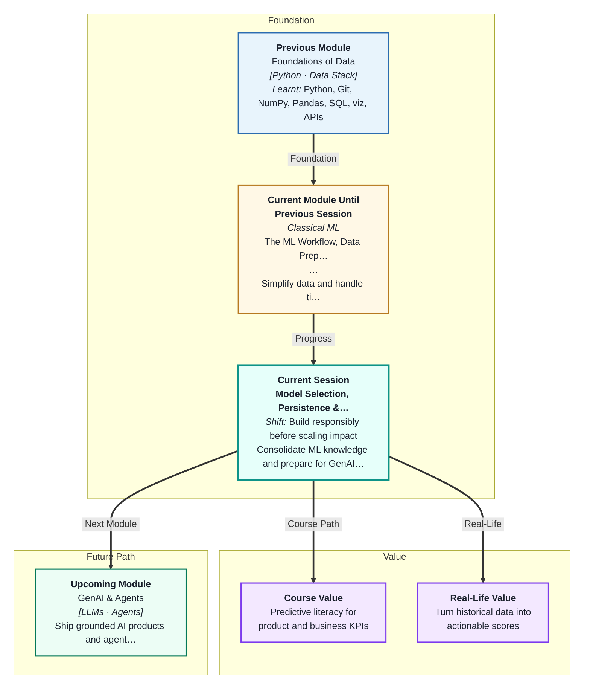
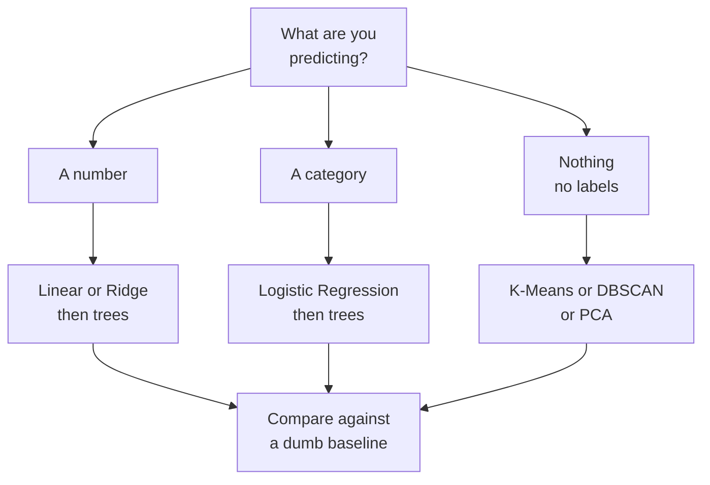
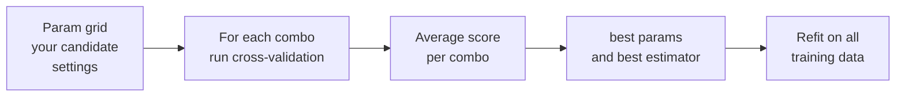
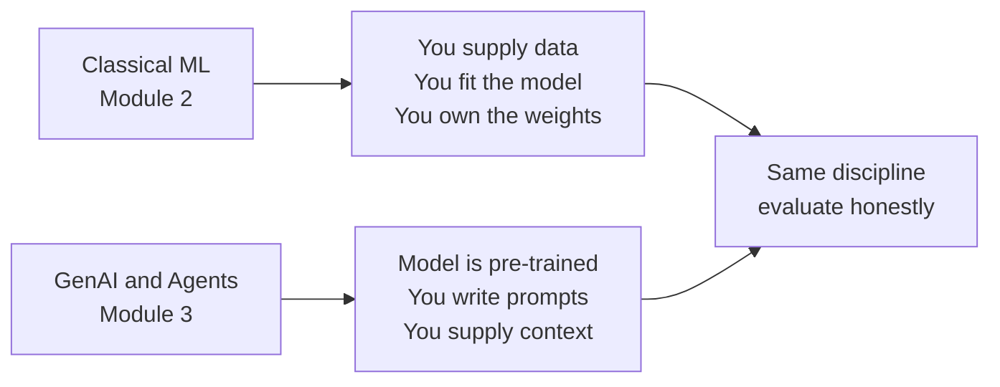

# Model Selection, Persistence & Module Review
---

## Mental Map



## What You'll Learn

In this pre-read, you'll discover:

- How to **choose** which model to reach for, instead of guessing
- How to **tune** a model's settings automatically — and why tuning on the test set is cheating
- How a **Pipeline** glues your preparation steps and your model into one leak-proof object
- How to **save** a trained model to disk and load it back tomorrow
- How all eleven previous sessions fit into one picture — and what changes in Module 3

---

## A. Model Selection — Choosing What to Reach For

> 💡 **Analogy:** You need to get across your city. You could walk, take an autorickshaw, ride the metro, or hire a car. There is no single "best" — it depends on the distance, your budget, and whether you need to carry luggage. Choosing a model is exactly this: you match the vehicle to the journey.

**One-line definition:** **Model selection** is the process of picking which algorithm to try first, based on your problem type, your data size, and how much you need to explain the result.

You have now met nine algorithms across Sessions 3 to 11. Here is the map that tells you which one to reach for:

| If your target is… | And you want… | Start with | Then try |
|---|---|---|---|
| A number | Simplicity and explanation | Linear Regression | Ridge or Lasso |
| A number | Best possible accuracy | Ridge | Random Forest, Gradient Boosting |
| A category | Simplicity and explanation | Logistic Regression | Decision Tree |
| A category | Best possible accuracy | Random Forest | Gradient Boosting |
| A category, tiny dataset | Something that just works | KNN | Logistic Regression |
| No target at all | Groups | K-Means | DBSCAN |
| No target at all | Fewer columns | PCA | — |

The golden rule of this whole session: **start with the simplest baseline, and only add complexity if it earns its place.** A Gradient Boosting model that beats Logistic Regression by 0.3% but takes 40 times longer to train and cannot be explained to your manager has *not* earned its place.



---

## B. Hyperparameters and Tuning

> 💡 **Analogy:** When you cook rice in a pressure cooker, the rice is the *ingredient* but the flame level and the number of whistles are *your settings*. The cooker learns nothing — you choose those dials. Get them wrong and the rice is either raw or mush.

**One-line definition:** A **hyperparameter** is a setting *you* choose before training, such as `alpha` in Ridge or `n_neighbors` in KNN, as opposed to the numbers the model itself learns from the data.

You have already met several: `alpha`, `k`, `max_depth`, `n_estimators`, `C`. Until now you guessed them. Now you let the computer search.

| Search method | How it works | Use it when |
|---|---|---|
| **`GridSearchCV`** | Tries **every** combination in your list | Few settings, small ranges |
| **`RandomizedSearchCV`** | Tries `n_iter` random combinations | Many settings, wide ranges, limited time |

Both do the same three things: build a model for each candidate setting, score it with **cross-validation** (from Session 2 — split the training data into `cv` folds, train on some, score on the rest), and remember the winner.



Two attributes you will use constantly:

- `search.best_params_` — the winning combination of settings
- `search.best_estimator_` — the winning model, already refitted on all your training data

**The one rule you must never break:** tuning happens **inside the training data only**. If you try 50 settings and pick the one with the best *test* score, your test score is no longer an honest estimate of the future — you have quietly fitted your choices to the test set. That is cheating, and reality will punish you.

---

## C. Pipeline — One Object, No Leaks

> 💡 **Analogy:** A filter coffee machine takes beans, grinds them, brews them, and pours a cup — all behind one button. You cannot accidentally brew before grinding, because the order is built into the machine. A **Pipeline** is that machine for your model.

**One-line definition:** A **`Pipeline`** chains your preparation steps and your model into a single object that you can `fit` and `predict` on as if it were one model.

```python
from sklearn.pipeline import Pipeline
from sklearn.preprocessing import StandardScaler
from sklearn.linear_model import LogisticRegression

pipe = Pipeline([
    ("scaler", StandardScaler()),
    ("model", LogisticRegression())
])
pipe.fit(X_train, y_train)   # scales, THEN trains
pipe.predict(X_test)         # scales with the SAME numbers, then predicts
```

**Why this is the single best defence against data leakage** (Session 2): if you call `StandardScaler().fit(X)` on your *whole* dataset before splitting, the mean and standard deviation used to scale your training rows secretly contain information from your test rows. Your score looks better than it should. Inside a Pipeline, cross-validation refits the scaler **separately inside every fold**, using only that fold's training rows. The leak is closed by construction.

| Approach | What gets fitted on the test rows | Honest score |
|---|---|---|
| Scale everything, then split | The scaler | ❌ No |
| Split, then Pipeline | Nothing | ✅ Yes |

For a table with both numeric and text columns, a **`ColumnTransformer`** applies different treatment to different columns — `StandardScaler` on `area_sqft`, one-hot encoding on `city` — and then hands the combined result to your model. It slots into a Pipeline in exactly the same way.

---

## D. Persistence — Saving Your Trained Model

> 💡 **Analogy:** You spend three hours reaching a hard level in a video game. If you close the game without saving, you start from level one tomorrow. **Persistence** is the save button for a trained model.

**One-line definition:** **Persistence** means writing your trained model to a file with `joblib.dump` so you can `joblib.load` it later and predict without training again.

```python
import joblib

joblib.dump(pipe, "loan_model.joblib")   # save
model = joblib.load("loan_model.joblib") # load, in any other script
model.predict(new_customer_row)          # scales + predicts, no retraining
```

**Save the whole Pipeline, not just the model.** If you save only the `LogisticRegression`, you have thrown away the scaler — and tomorrow's raw data will be fed in unscaled, giving you nonsense predictions with no error message. The Pipeline carries its own preparation steps with it.

| Habit | Why it matters |
|---|---|
| Save the whole Pipeline | Preparation travels with the model |
| Record library versions | A file saved with one scikit-learn version may not load in another |
| Never load an untrusted file | Loading a `.pkl` or `.joblib` can **run code**, like opening a stranger's attachment |
| Save the test score alongside | You will forget how good it was |

That third row is serious. A `.joblib` file is not just data — it can execute arbitrary Python when loaded. Only load files you or your team created.

---

## E. The Module 2 Picture

> 💡 **Analogy:** For eleven sessions you have been handed jigsaw pieces one at a time — a corner here, a bit of sky there. Today you turn the box over and see the picture on the lid. Nothing new is added; everything suddenly makes sense.

**One-line definition:** **Consolidation** is stepping back to see how supervised regression, supervised classification, unsupervised learning, and the maths beneath them form one workflow.

| Sessions | What you learned | The question it answers |
|---|---|---|
| 1–2 | Workflow, train/test split, leakage, overfitting | Is my score honest? |
| 3–5 | Linear, Ridge, Lasso, MAE/RMSE/R², the maths of a fitted line | How much? |
| 6–8 | Logistic Regression, KNN, trees, forests, boosting, precision/recall/ROC | Which class? |
| 9–11 | K-Means, DBSCAN, probability, PCA, time series | What patterns are in there? |
| 12 | Selection, tuning, Pipeline, persistence | Which model, and how do I ship it? |

**The checklist for any new ML project:**

1. What am I predicting — a number, a category, or nothing at all?
2. Split first. Test set locked away, untouched.
3. What is my dumb baseline? Predict the mean, or the most common class.
4. Simplest reasonable model, inside a Pipeline.
5. Cross-validate on the training set. Tune with `GridSearchCV`.
6. Score once on the untouched test set.
7. Did complexity earn its place? If not, ship the simple model.
8. `joblib.dump` the whole Pipeline.

---

## F. The Bridge to Module 3

> 💡 **Analogy:** So far you have been cooking every meal from raw ingredients in your own kitchen — you chose the rice, controlled the flame, tasted as you went. In Module 3 you walk into an enormous, already-running kitchen and place an order. You cannot rebuild the kitchen. Your skill becomes *ordering precisely* and *checking what comes back*.

**One-line definition:** Classical ML **fits** a small model to *your* data; **Generative AI** uses a giant model someone else already trained, which you **prompt** rather than fit.



| What carries over | What changes |
|---|---|
| Evaluate honestly on held-out examples | You prompt instead of `fit` |
| Garbage data in, garbage out | The "data" is now text you retrieve |
| Never leak the answer into the input | Training is done; you steer with context |
| Always know your baseline | Baseline is often "a simple rule" or "a human" |

Notice that the *discipline* is unchanged. A team that skips baselines and evaluation in classical ML will skip them with an LLM too — and ship something confidently wrong. Everything you built in Module 2 is the professional habit you carry into Module 3.

---

## Practice Exercises

**1. Pattern Recognition**  
Look at the model selection table in section A. Group the nine algorithms you have met into exactly three families based on what they need from you. For each family, name the one thing all its members share and the one hyperparameter you would tune first.

**2. Concept Detective**  
A classmate reports a cross-validation accuracy of 0.94 but a test accuracy of 0.71. On inspection, they scaled the full dataset with `StandardScaler` before calling `train_test_split`, and they tried 60 different `max_depth` values, keeping whichever gave the highest test accuracy. Name both mistakes, say which one inflated which score, and explain how a `Pipeline` plus `GridSearchCV` would have prevented each.

**3. Real-Life Application**  
A kirana store owner wants to predict tomorrow's demand for milk packets from the last two years of daily sales, weather, and whether it is a festival day. Walk through the eight-step checklist in section E for this problem: what is the target, what is the dumb baseline, which model would you start with, and what would make you reach for a more complex one?

**4. Spot the Error**  
An engineer trains a Pipeline of `StandardScaler` plus `LogisticRegression`, then writes `joblib.dump(pipe.named_steps["model"], "model.joblib")`. In production, the loaded model receives raw, unscaled data and returns predictions with no error at all — but they are badly wrong. Explain precisely what was thrown away, why no exception is raised, and what the one-word fix is.

**5. Planning Ahead**  
You have a dataset with 5,000 rows, three numeric columns, two text categories, and a yes-or-no target. Design the complete search you would run: which two candidate models, which preprocessing steps for which columns, whether you would use `GridSearchCV` or `RandomizedSearchCV` and why, what `cv` and `scoring` you would set, and what you would save to disk at the end.

---

> ✅ **You're done!** You can now choose a model deliberately instead of guessing, tune it honestly, wrap it in a leak-proof Pipeline, and save the finished thing to a file that runs anywhere. That is not a homework exercise — that is the actual shape of a shipped ML system. Module 3 begins next with **GenAI & Agents**, where the model arrives pre-trained and your job shifts from fitting to prompting — but the evaluation discipline you built here is exactly what will separate you from people who ship confident nonsense.
