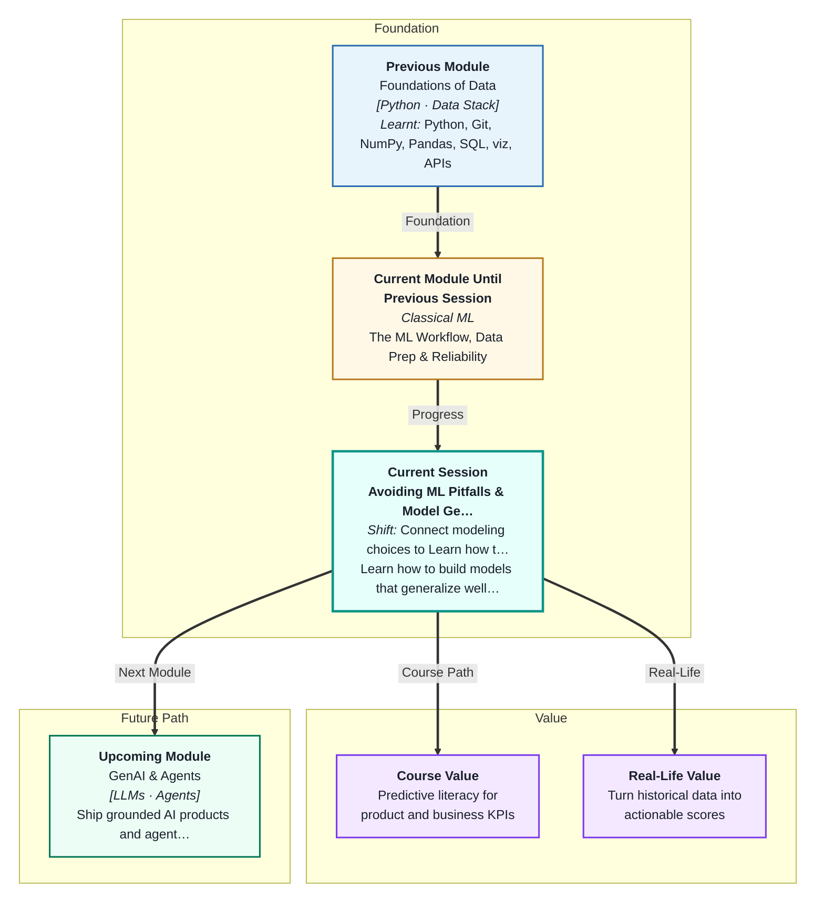
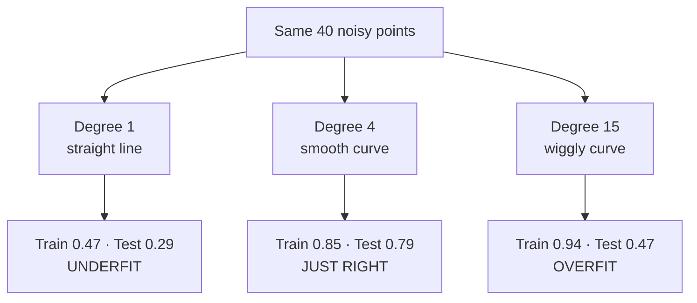
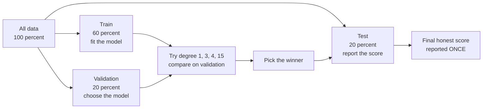
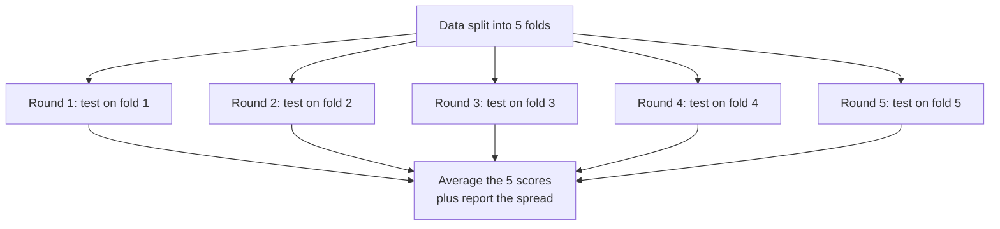
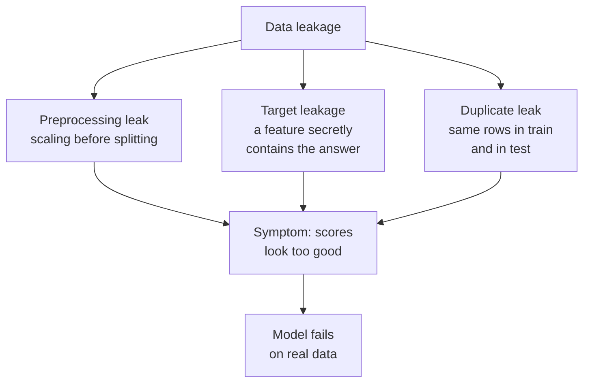

# Avoiding ML Pitfalls & Model Generalization
---

## Mental Map

## What You'll Learn

In this pre-read, you'll discover:

- What **generalisation** means, and why a high training score can be a warning sign
- How to tell **overfitting** apart from **underfitting** using just two numbers
- Understand the **bias–variance tradeoff** in plain language, and read a **learning curve**
- Why one train/test split is not enough, and how **k-fold cross-validation** fixes it
- How **data leakage** silently ruins models — and the three forms it takes

---

## A. What Generalisation Actually Means

> 💡 **Analogy:** You learn to drive on the same 5 km stretch near your home. You know every pothole and every turn by heart. Then someone hands you the keys in an unfamiliar city — and you freeze. You never learned *driving*. You memorised *one road*.

**One-line definition:** **Generalisation** is a model's ability to perform well on data it has never seen before — not just on the data it was trained on.

In Session 1 you split your data with `train_test_split`, called `.fit()` on the training half, and `.score()` on the test half. That test score is your first honest measure of generalisation. Your model has already seen the training rows, so scoring well on them proves nothing.

The whole point of a model is prediction on *future* data — tomorrow's customers, next month's orders, the patient who walks in next week. None of those rows exist in your dataset today.

| Train score | Test score | What it means |
|---|---|---|
| 0.95 | 0.93 | Learned a real pattern — this generalises |
| 0.95 | 0.55 | Memorised the training rows — does not generalise |
| 0.48 | 0.46 | Model is too simple — it learned almost nothing |
| 0.60 | 0.88 | Suspicious — check your split for a mistake |

**The one rule to carry forward:** a model is only as good as its score on data it has never touched. Never quote a training score as proof that a model works.

---

## B. Overfitting and Underfitting

> 💡 **Analogy:** A tailor stitching a shirt. A shirt cut as a plain rectangle fits nobody well — too crude. A shirt stitched to your exact pose *while you happened to be leaning left* fits only when you lean left. The good shirt captures your real shape and ignores the accidental pose.

**One-line definition:** **Underfitting** is a model too simple to capture the real pattern; **overfitting** is a model so flexible it memorises the noise along with the pattern.

The classic demonstration fits curves of increasing flexibility to the same wobbly points. A **polynomial degree** controls that flexibility: degree 1 is a straight line, degree 4 is a gentle curve, degree 15 is a wildly wiggly curve.

Look closely at degree 15. It has the **best training score of the three** — and the worst gap by far. It bent itself through every random wobble in the training data. Those wobbles are **noise**: random variation that will not repeat in new data.

| Symptom | Diagnosis | Typical fix |
|---|---|---|
| Train low, test low | Underfitting | Use a more flexible model; add better features |
| Train high, test much lower | Overfitting | Simplify the model; get more data |
| Train high, test high | Good fit | Ship it, then keep monitoring |
| Train and test both near-perfect | Suspect **data leakage** (Section F) | Audit your pipeline before celebrating |

**The gap is the signal.** Train score minus test score is your overfitting meter.

---

## C. The Bias–Variance Tradeoff

> 💡 **Analogy:** Two players throwing darts. Player 1 groups all darts tightly in one spot — but that spot is the bottom-left corner, nowhere near the bullseye. Player 2 scatters darts all over the board, centred on the bullseye but never consistent. Player 1 has high **bias**. Player 2 has high **variance**. Neither wins.

**One-line definition:** **Bias** is error from a model being too simple to represent reality; **variance** is error from a model reacting too strongly to the particular training data it happened to see.

| | High bias | High variance |
|---|---|---|
| The model is | Too rigid | Too flexible |
| Shows up as | Underfitting | Overfitting |
| Train score | Low | High |
| Test score | Low | Much lower than train |
| Change the training data slightly | Predictions barely move | Predictions swing wildly |

You cannot drive both to zero. Making a model more flexible lowers bias and raises variance. Making it simpler does the reverse. The **tradeoff** is finding the sweet spot where the *total* test error is smallest — that was degree 4 in Section B.

### Reading a Learning Curve

A **learning curve** plots the training score and the validation score as you feed the model more and more rows. Its shape tells you which problem you have.

| Curve shape | Diagnosis | What to do |
|---|---|---|
| Both curves flatten out **low**, close together | High bias | More data will NOT help — use a better model |
| Big gap: train high, validation far below | High variance | More data WILL help; or simplify the model |
| Both converge **high**, small gap | Healthy fit | You are done tuning complexity |

That first row is the money insight: when a model underfits, collecting more data is wasted effort. The learning curve tells you that before you spend three weeks gathering it.

---

## D. Train, Validation, Test — The Three-Way Split

> 💡 **Analogy:** A cricket season. **Net practice** is where you build your technique. A **selection trial** is where the coach decides who plays and which shots to use. The **actual match** is the real thing — and you only get one. If you keep "trying again" at the match until you like the result, the scoreboard stops meaning anything.

**One-line definition:** A **three-way split** divides your data into a training set (to fit the model), a validation set (to choose between models), and a test set (touched exactly once, at the very end, to report honest performance).

Why not just use the test set to pick the model? Because the moment you use a set to *make a decision*, that set stops being unseen. If you try 20 models and keep whichever scores best on the test set, you have quietly fitted your choices to the test set. Your reported score becomes optimistic — sometimes badly so.

| Set | Model sees it during `.fit()`? | You look at its score | Purpose |
|---|---|---|---|
| Train | Yes | Constantly | Learn the parameters |
| Validation | No | Many times | Compare models, tune choices |
| Test | No | **Exactly once** | Report a trustworthy number |

**The discipline:** lock the test set in a drawer on day one. Open it on the last day.

---

## E. k-Fold Cross-Validation

> 💡 **Analogy:** You are checking whether a big pot of biryani is salted correctly. Taking one spoonful from one corner might mislead you — that corner could be the one place the salt clumped. Taking five spoonfuls from five different places and averaging your verdict is far more trustworthy.

**One-line definition:** **k-fold cross-validation** splits the data into k equal parts, trains k times — each time holding out a different part for testing — and averages the k scores.

Every row gets to be a test row exactly once, and a training row k−1 times. In scikit-learn this is one line: `cross_val_score(model, X, y, cv=KFold(n_splits=5, shuffle=True, random_state=42))`.

| | Single train/test split | 5-fold cross-validation |
|---|---|---|
| Number of scores you get | 1 | 5 |
| Depends on a lucky split? | Yes, heavily | Much less |
| Tells you the **spread**? | No | Yes — the standard deviation |
| Cost | Fit once | Fit 5 times (slower) |

The **spread matters as much as the average**. A model scoring `0.78 ± 0.11` is dependable. A model scoring `0.78 ± 0.40` is a coin toss that happened to average out — one fold probably collapsed. Always report both.

---

## F. Data Leakage — The Biggest Pitfall of All

> 💡 **Analogy:** A student is handed the answer key the night before the exam. She scores 100%. Everybody celebrates. Then she takes a different exam, without the key, and scores 40%. The 100% was never real — it measured her access to the key, not her knowledge.

**One-line definition:** **Data leakage** is when information that would not be available at prediction time sneaks into training, producing a score that looks brilliant and collapses in production.

**1. Preprocessing leak.** You call `StandardScaler().fit_transform(X)` on the whole dataset, *then* split. The scaler computed its mean and standard deviation using test rows. Your training data now carries a whisper of the test set. The fix: split first, `fit` the scaler on train only, then `transform` both — or wrap it in a `Pipeline` so this cannot happen.

**2. Target leakage.** A feature contains the answer. Predicting whether a student `passed` — using `final_marks` as a feature. Accuracy jumps from ~0.82 to ~0.96. But at prediction time, if you already knew the final marks, you would not need a model at all.

**3. Duplicate leak.** The same row appears twice; one copy lands in train, the other in test. The model has literally memorised the test row. Drop duplicates *before* splitting.

| Leak type | Ask yourself | Fix |
|---|---|---|
| Preprocessing | Did anything look at all rows before the split? | Split first; use `Pipeline` |
| Target | Would I actually know this value at prediction time? | Delete the feature |
| Duplicate | Could the same record appear twice? | `df.drop_duplicates()` before splitting |

**The rule of thumb:** when a result looks too good to be true, it usually is. Go hunting for the leak.

---

## Practice Exercises

**1. Pattern Recognition**  
Three models are trained on the same customer-churn data. Model A scores 0.99 on train and 0.62 on test. Model B scores 0.71 on train and 0.70 on test. Model C scores 0.88 on train and 0.86 on test. Name the condition each model is in, say which one you would deploy, and explain what the train-minus-test gap told you in each case.

**2. Concept Detective**  
A teammate reports 5-fold cross-validation results of `0.81 ± 0.29` for one model and `0.76 ± 0.03` for another. He wants to ship the first one because "the average is higher." Diagnose what the standard deviations are telling you, explain what probably happened inside those five folds, and argue which model you would actually trust in production.

**3. Real-Life Application**  
You are building a model to predict whether an autorickshaw ride in Bengaluru will take longer than 30 minutes. Available columns: `pickup_area`, `drop_area`, `time_of_day`, `day_of_week`, `is_raining`, `distance_km`, `driver_rating`, `actual_fare_paid`, `ride_duration_mins`. Identify which columns you must drop before training and explain, for each one, exactly why it would leak.

**4. Spot the Error**  
Here is a colleague's workflow: (1) load the CSV, (2) `scaler.fit_transform(X)` on all rows, (3) `train_test_split`, (4) fit a model, (5) score on test, (6) try eight different model settings and report the best test score in the final presentation. Find the **two** separate mistakes in this sequence, name each one, and rewrite the sequence in the correct order.

**5. Planning Ahead**  
You have 900 labelled rows of monsoon rainfall data and want to choose between three model complexities. Design the full evaluation plan: how you would split the data, whether you would use a validation set or k-fold cross-validation (and why), what you would do with the test set, and what learning-curve shape would tell you that collecting another 900 rows is *not* worth the effort.

---

> ✅ **You're done!** You now understand what generalisation really means, how to spot overfitting and underfitting from two numbers, how to get a trustworthy score using cross-validation, and how to hunt down the data leakage that ruins more real-world models than any other mistake. This is the discipline that separates a model that demos well from a model that works. Coming up next: **Regression Models & Regularization**, where you will meet the tools that actively *fight* overfitting instead of just detecting it.
