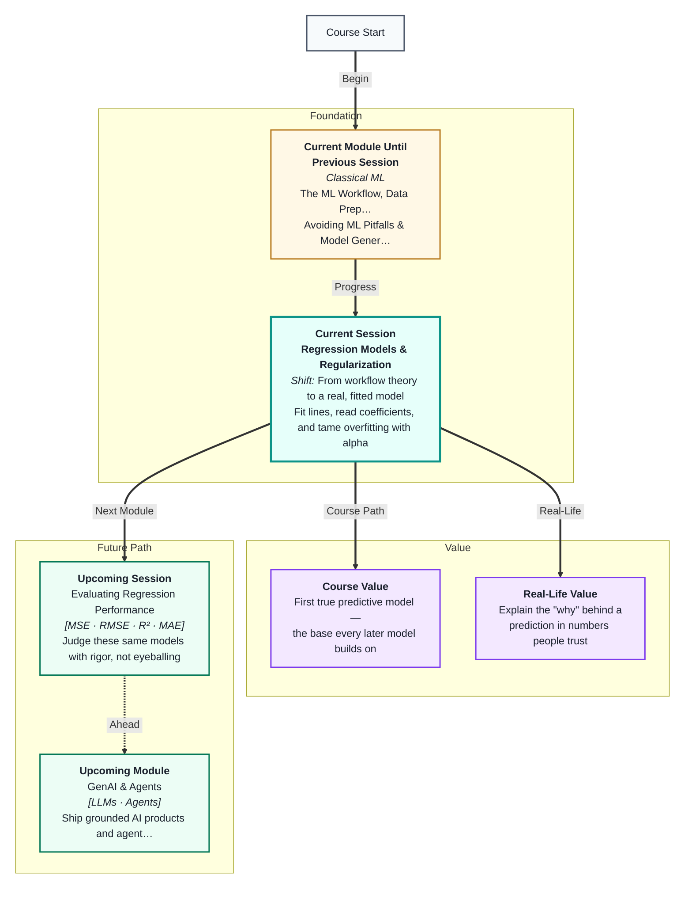

```mermaid
%%{init: {'flowchart': {'nodeSpacing': 55, 'rankSpacing': 65, 'diagramPadding': 24}}}%%
flowchart TB
linkStyle default stroke-width:3px

subgraph foundation[" Foundation "]
direction TB
    CURMOD["<b>Current Module Until<br/>Previous Session</b><br/><i>Classical ML</i><br/>The ML Workflow, Data Prep…<br/>Avoiding ML Pitfalls & Model Gener…"]
    CURSES["<b>Current Session</b><br/><b>Regression Models & Regularization</b><br/><i>Shift:</i> From workflow theory to a real, fitted model<br/>Fit lines, read coefficients, and tame overfitting with alpha"]
end

subgraph value[" Value "]
direction LR
    CVAL["<b>Course Value</b><br/>First true predictive model —<br/>the base every later model builds on"]
    RVAL["<b>Real-Life Value</b><br/>Explain the &quot;why&quot; behind a<br/>prediction in numbers people trust"]
end

subgraph future[" Future Path "]
direction TB
    U0["<b>Upcoming Session</b><br/>Evaluating Regression Performance<br/><i>[MSE · RMSE · R² · MAE]</i><br/>Judge these same models with rigor, not eyeballing"]
    U1["<b>Upcoming Module</b><br/>GenAI & Agents<br/><i>[LLMs · Agents]</i><br/>Ship grounded AI products and agent…"]
end

START["Course Start"] ==>|&nbsp;Begin&nbsp;| CURMOD
CURMOD ==>|&nbsp;Progress&nbsp;| CURSES
CURSES ==>|&nbsp;Course Path&nbsp;| CVAL
CURSES ==>|&nbsp;Real-Life&nbsp;| RVAL
CURSES ==>|&nbsp;Next Module&nbsp;| U0
U0 -.->|&nbsp;Ahead&nbsp;| U1

classDef prevBox fill:#E8F4FC,stroke:#2B6CB0,stroke-width:2px,color:#1A202C
classDef curModBox fill:#FFF8E6,stroke:#B7791F,stroke-width:2px,color:#1A202C
classDef curSessBox fill:#E6FFFA,stroke:#0D9488,stroke-width:3px,color:#1A202C
classDef valueBox fill:#F3E8FF,stroke:#7C3AED,stroke-width:2px,color:#1A202C
classDef futureBox fill:#ECFDF5,stroke:#047857,stroke-width:2px,color:#1A202C
classDef startBox fill:#F7FAFC,stroke:#4A5568,stroke-width:2px,color:#1A202C
class START startBox
class CURMOD curModBox
class CURSES curSessBox
class CVAL,RVAL valueBox
class U0,U1 futureBox
```
