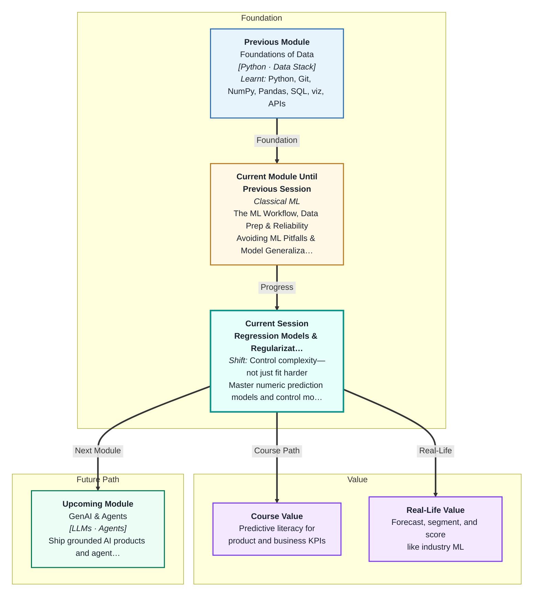
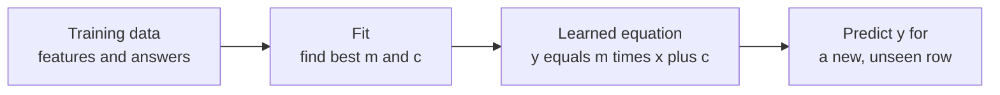
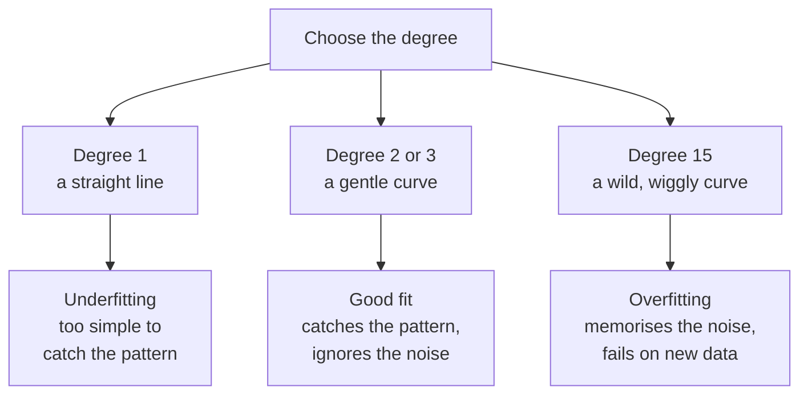
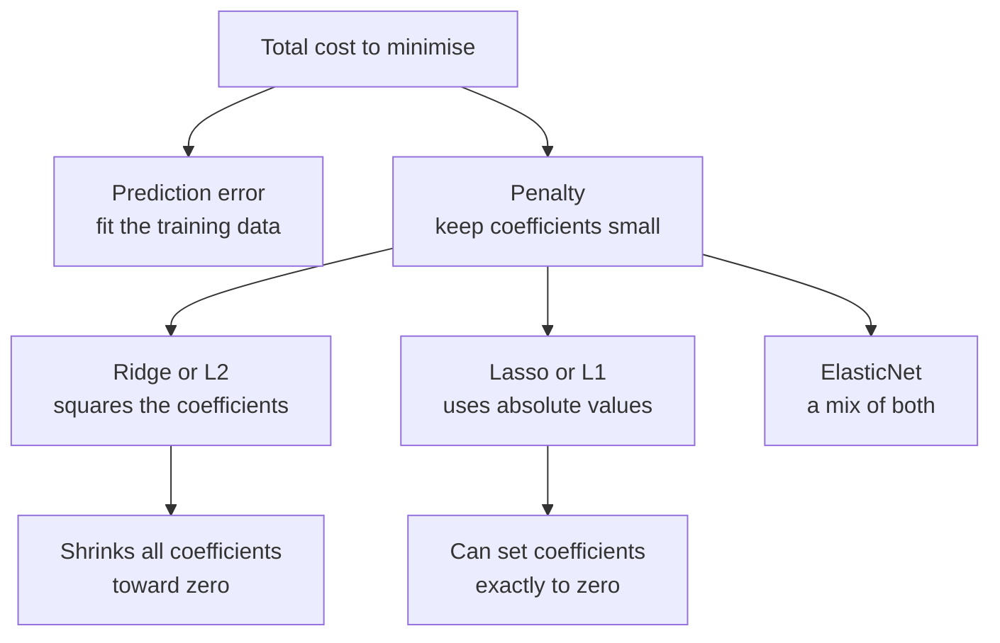
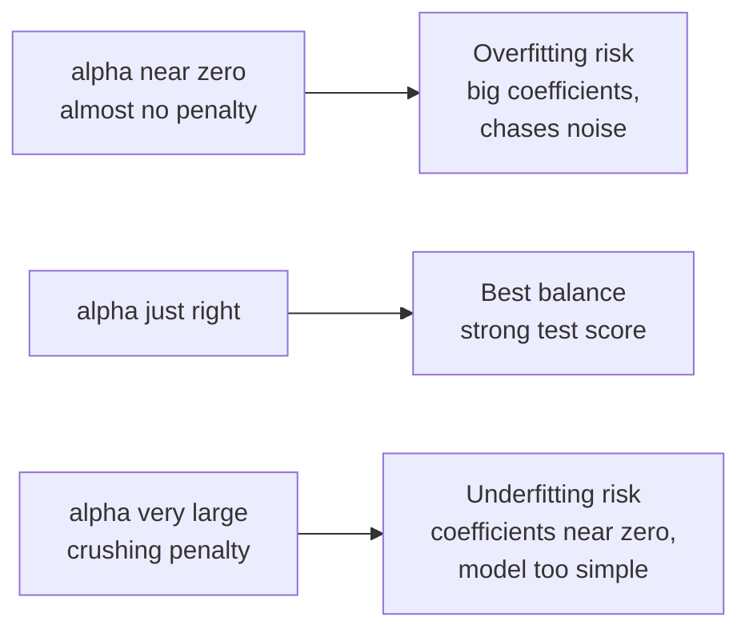

# Regression Models & Regularization
---

## Mental Map

## What You'll Learn

In this pre-read, you'll discover:

- How **linear regression** predicts a number by learning one weight per feature
- How to read a model's **coefficients** and **intercept** as "what the model learned"
- How **polynomial regression** bends a straight line into a curve — and invites overfitting
- Why **feature scaling** is not optional once you start penalising a model
- How **Ridge**, **Lasso**, and **ElasticNet** control complexity, and how **alpha** tunes them

---

## A. Linear Regression — Learning One Weight Per Feature

> 💡 **Analogy:** An autorickshaw fare has two parts: a fixed amount the moment you sit down, plus a rate for every kilometre you travel. If you know the base fare and the per-km rate, you can predict any trip's cost. Linear regression learns exactly these two kinds of numbers from data.

**One-line definition:** **Linear regression** predicts a number by multiplying each input feature by a learned weight and adding them all up, plus a constant.

The whole model is one equation you already know:

`y = m1*x1 + m2*x2 + m3*x3 + ... + c`

Here `y` is what you predict (a flat's price), each `x` is a feature (area, bedrooms, age), each `m` is a **coefficient** — the weight the model learned for that feature — and `c` is the **intercept**, the starting value when every feature is zero.

"Fitting" means the model tries many combinations of `m` and `c` and keeps the one whose predictions sit closest to the real answers. In scikit-learn this is three lines: create `LinearRegression()`, call `.fit(X_train, y_train)`, then `.predict(X_test)`. The same workflow and the same train/test split you met in Sessions 1 and 2 still apply — regression just changes what sits inside the model.

---

## B. Reading the Coefficients — What the Model Learned

> 💡 **Analogy:** A cricket scorecard does not just show the final total of 287 runs. It breaks the total down player by player, so you can see exactly who contributed what. A model's coefficients are its scorecard.

**One-line definition:** A **coefficient** tells you how much the prediction changes when that one feature goes up by one unit and everything else stays the same.

After fitting, scikit-learn stores the learned numbers in `model.coef_` (one per feature) and `model.intercept_`. Reading them is how you check the model learned something sensible instead of nonsense.

Suppose you predict flat prices in lakh from four features:

| Feature | Coefficient | How to read it |
|---|---|---|
| `area_sqft` | `+0.046` | Each extra square foot adds about ₹0.046 lakh |
| `bedrooms` | `+3.10` | Each extra bedroom adds about ₹3.10 lakh |
| `age_years` | `-0.66` | Each extra year of age *removes* about ₹0.66 lakh |
| `metro_km` | `-1.64` | Each extra km from the metro *removes* about ₹1.64 lakh |
| *intercept* | `+24.5` | The starting price before any feature is counted |

Two things to notice. First, the **sign** matters: a negative coefficient means the feature pushes the prediction *down*, which is exactly what you would expect for age and distance. Second, you cannot compare coefficient *sizes* across features when the features use different units — `0.046` looks tiny next to `3.10`, but square feet come in the thousands while bedrooms only run from 1 to 5. That units problem comes back to bite you in Section D.

---

## C. Polynomial Regression — Bending the Line

> 💡 **Analogy:** Picture bending a flexible wire to trace a winding road. A stiff wire stays straight and misses every curve. A very floppy wire hugs the road perfectly — but it also wraps itself around every stray pebble and pothole, which are not part of the road at all.

**One-line definition:** **Polynomial regression** lets a linear model fit curves by adding powers of your features — `x²`, `x³`, and so on — as brand-new columns.

Real relationships are rarely perfectly straight. `PolynomialFeatures(degree=2)` takes a column `x` and creates `x` and `x²`. The model is still linear regression — it just now has more columns to weight, so the *shape* it can draw becomes a curve.

The **degree** controls the flexibility, and this is where danger enters:

This is the **overfitting** you met in Session 2, now with a dial you can turn. A high-degree model scores *better and better* on training data while its test score collapses — it has memorised the training rows rather than learnt the pattern. More flexibility is not more skill.

---

## D. Feature Scaling — Putting Features on One Ruler

> 💡 **Analogy:** Imagine a talent contest where one judge scores out of 10 and another scores out of 1000. Even if both judges care equally, the second judge's numbers completely swamp the first. You must convert both to a common scale before you can compare them fairly.

**One-line definition:** **Feature scaling** rewrites every feature onto the same scale, so no feature dominates just because its numbers happen to be bigger.

`StandardScaler` is the standard tool: it shifts each column to have an average of 0 and rescales it so a typical distance from the average is 1.

| Feature | Raw range | Learned coefficient | After `StandardScaler` |
|---|---|---|---|
| `area_sqft` | 464 to 2352 | `0.046` — looks tiny | Average 0, spread 1 |
| `bedrooms` | 1 to 5 | `3.10` — looks large | Average 0, spread 1 |

Plain linear regression does not care about this — it happily uses whatever units you give it. But the moment you add a **penalty on coefficient size** (Section E), units start to matter enormously. A penalty punishes *big-looking* coefficients, and `bedrooms` only has a big-looking coefficient because its raw numbers are small.

**Key rule:** Always scale your features *before* using Ridge, Lasso, or ElasticNet. Fit the scaler on the training data only, then apply it to the test data — exactly the discipline you learnt in Session 2 about never letting test data leak into training.

---

## E. Regularisation — A Penalty for Large Coefficients

> 💡 **Analogy:** You are packing a suitcase with a strict 15 kg limit. You can still bring anything you like, but every item now has to earn its weight. Marginally useful things get packed in smaller quantities, and truly useless things get left at home entirely.

**One-line definition:** **Regularisation** adds a penalty for large coefficients to the model's goal, so it must balance fitting the data against staying simple.

Normally a model only tries to minimise its error on the training data. Regularisation changes the goal to two competing terms:

`total cost = prediction error + alpha * penalty on coefficient sizes`

Because huge coefficients now cost something, the model only grows a coefficient when that feature genuinely pays for itself. That restraint is what stops the wild, wiggly curve from Section C.

| Model | Penalty uses | What it does to coefficients | Reach for it when |
|---|---|---|---|
| **Ridge** (L2) | Squared values | Shrinks all of them toward zero, but never *to* zero | Most features are somewhat useful |
| **Lasso** (L1) | Absolute values | Can push some **exactly to zero** | You suspect some features are useless |
| **ElasticNet** | A blend of both | Shrinks, and can also zero some out | You want a middle ground |

The headline difference: because Lasso can zero a coefficient out completely, it performs **feature selection** for free. A feature with a coefficient of exactly zero has been dropped from the model — the suitcase item left at home.

---

## F. Alpha — The Dial Between Underfitting and Overfitting

> 💡 **Analogy:** Salt in a dish. Too little and it tastes bland. Too much and it is inedible. There is no universal correct amount — you find it by tasting as you cook.

**One-line definition:** **Alpha** is the hyperparameter that sets how strongly the penalty is applied — how seriously the model takes "keep the coefficients small".

Alpha directly trades **bias** against **variance**, the tension you met in Session 2:

| As alpha grows | Coefficients | Training score | Test score |
|---|---|---|---|
| Small alpha | Stay large | Very high | May be poor — overfitting |
| Medium alpha | Shrink noticeably | Slightly lower | Usually **best** |
| Large alpha | Shrink toward zero | Drops a lot | Poor — underfitting |

So how do you pick alpha? You do not guess, and you absolutely do not peek at the test set. You use **cross-validation** from Session 2: try many alphas, and for each one score it on held-out folds of the *training* data. Scikit-learn bundles this for you — `RidgeCV` and `LassoCV` take a list of alphas, run the cross-validation internally, and keep the winner in `.alpha_`.

That is the loop: penalise, tune, validate. It is how you control complexity instead of merely hoping for the best.

---

## Practice Exercises

**1. Pattern Recognition**  
You fit two models to the same data. Model A is a degree-2 polynomial scoring 0.68 on training data and 0.68 on test data. Model B is a degree-15 polynomial scoring 0.84 on training data and a large *negative* number on test data. Identify which model is overfitting, explain how you knew from the two scores alone, and say which model you would actually deploy.

**2. Concept Detective**  
A teammate fits a Lasso model and complains that three of their ten coefficients came out as exactly `0.0`. They assume this is a bug and want to switch back to plain linear regression. Diagnose what actually happened, name the section of this pre-read that explains it, and explain why this behaviour might be a *feature* rather than a fault.

**3. Real-Life Application**  
You want to predict the monthly electricity bill for a home from: number of rooms, number of air conditioners, monsoon month or not, and total floor area in square feet. Write out the model's equation in the `y = m1*x1 + ... + c` form, predict the *sign* you expect for each coefficient, and explain what the intercept would represent here.

**4. Spot the Error**  
Someone builds a Ridge model on flat prices. They feed in `area_sqft` (values in the thousands) and `bedrooms` (values from 1 to 5) directly, with no scaling, and set a large alpha. Their final model has kept almost all of the `area_sqft` coefficient but shrunk `bedrooms` nearly to zero. They conclude "bedrooms don't affect price." What did they get wrong, and what single step would have fixed it?

**5. Planning Ahead**  
You are given a dataset with 40 numeric features to predict a flat's rent, and you suspect many of the features are useless. Design your full plan: which model you would choose and why, where scaling fits in your pipeline, how you would select alpha without touching the test set, and how you would work out which features the model decided to keep.

---

> ✅ **You're done!** You now understand how a regression model turns data into an equation you can read, how extra flexibility invites overfitting, and how a penalty on coefficient size — tuned by alpha and chosen by cross-validation — keeps that complexity under control. These are the first models you can genuinely interrogate rather than just run. Coming up: **Evaluating Regression Performance**, where you will go far beyond R² and learn the error metrics that tell you how wrong your predictions actually are, and in which direction.
