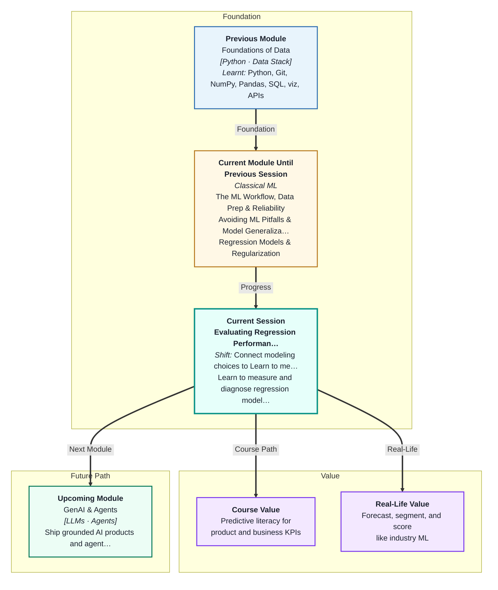
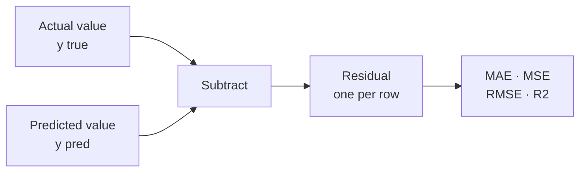
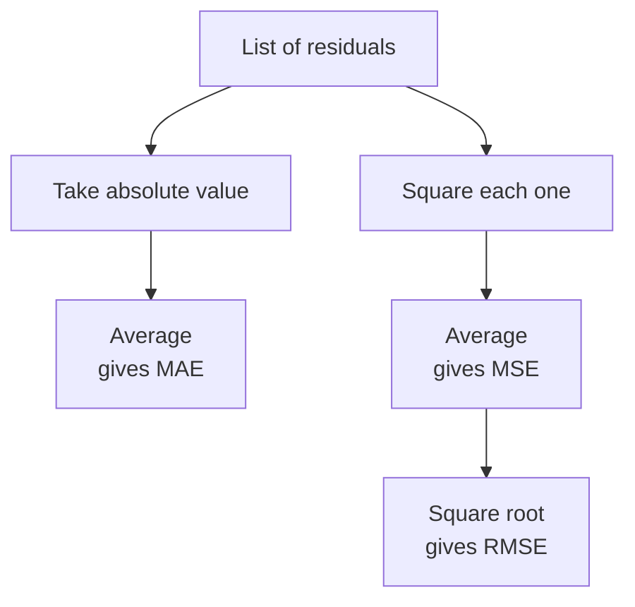
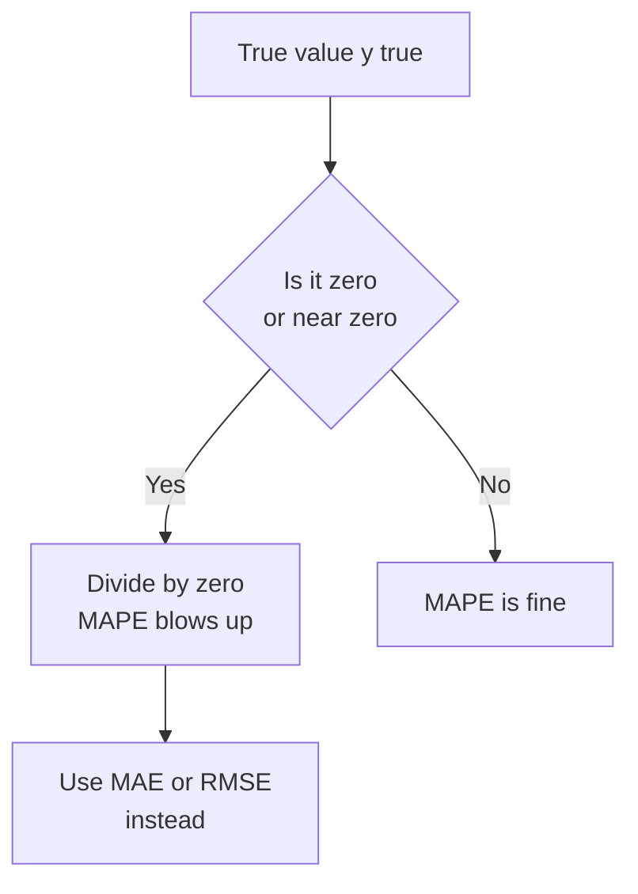
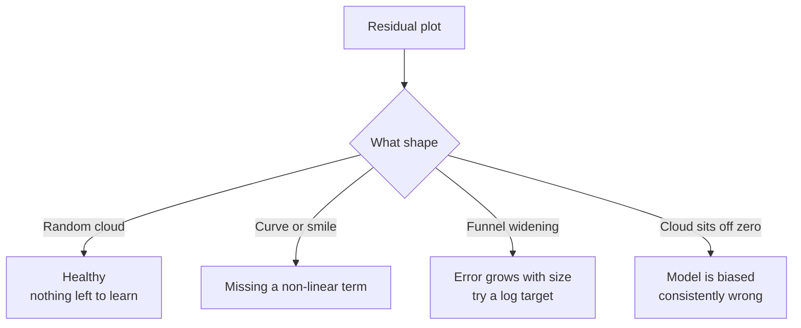
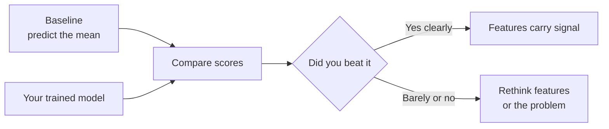

# Evaluating Regression Performance
---

## Mental Map

## What You'll Learn

In this pre-read, you'll discover:

- What a **residual** is, and why every regression metric is built from it
- How **MAE**, **MSE**, **RMSE** and **R²** each summarise error differently — and when to reach for which
- Why **MAPE** looks friendly but can blow up in your face
- How to **diagnose** a model by looking at pictures of its errors, not just its score
- Why a score means nothing until you compare it to a **baseline** and to the training set

---

## A. The Residual — The Atom of Every Metric

> 💡 **Analogy:** You fire an arrow at a target. It lands 12 cm above the bullseye. That "12 cm above" is not a judgement — it is just a measurement of the miss, with a size and a direction. Every regression score you will ever compute is nothing more than a clever way of adding up those miss-distances.

**One-line definition:** A **residual** is the gap between what actually happened and what your model predicted, for a single row: `residual = y_true - y_pred`.

In Session 3 you trained models that predict a number — a flat's price, a delivery time. Those predictions are almost never exactly right. The residual records *how* wrong each one was.

Two things about a residual carry meaning:

- **Its sign.** A **positive residual** means the truth was higher than you guessed — you **under-predicted**. A **negative residual** means you **over-predicted**.
- **Its size.** A residual of ₹2 lakh on a flat matters far more than a residual of ₹2,000.

You get one residual per row. On a test set of 80 flats, you get 80 residuals. A metric is just a rule for squashing those 80 numbers into one.

**Why not simply average the residuals?** Because the positives and negatives cancel out. A model that is ₹20 lakh too high on one flat and ₹20 lakh too low on the next has an average residual of zero — and it is a terrible model. Every real metric first removes the sign, by taking the **absolute value** or by **squaring**.

---

## B. MAE, MSE, RMSE — Three Ways to Add Up the Misses

> 💡 **Analogy:** Two friends are waiting for you. Friend A's irritation grows steadily — one notch per minute you are late. Friend B's irritation grows with the *square* of the delay: being 10 minutes late is not 10 times worse than 1 minute, it is 100 times worse. Same lateness, two very different judgements. That is exactly the difference between MAE and MSE.

**One-line definition:** **MAE**, **MSE** and **RMSE** are three rules for turning a list of residuals into a single error number — differing only in how harshly they punish the big misses.

- **MAE** = `mean(|y_true - y_pred|)` — the **Mean Absolute Error**. Your average miss, in the target's own units. An MAE of 7 on a flat-price model in ₹ lakh means: *on a typical flat, we are about ₹7 lakh off.* That sentence is sayable to a non-technical person, which is MAE's superpower.
- **MSE** = `mean((y_true - y_pred)²)` — the **Mean Squared Error**. Squaring makes one enormous miss dominate the score. But the units are now *lakh-squared*, which means nothing to anybody.
- **RMSE** = `sqrt(MSE)` — the **Root Mean Squared Error**. Take the square root and you are back in ₹ lakh. RMSE keeps MSE's harshness towards big misses but is readable again.

| Metric | Formula | Units | Big misses | Reach for it when |
|---|---|---|---|---|
| MAE | `mean(abs(err))` | Same as target | Counted fairly | You have outliers you do not want dominating |
| MSE | `mean(err²)` | Target squared | Punished hard | You are optimising inside code, not reporting |
| RMSE | `sqrt(MSE)` | Same as target | Punished hard | One huge miss is genuinely much worse than several small ones |

**The rule of thumb:** RMSE is always ≥ MAE. If RMSE is *much* bigger than MAE, you have a few catastrophic predictions hiding in an otherwise decent model — go find them.

---

## C. R² — The Score That Compares You to a Lazy Classmate

> 💡 **Analogy:** In a class quiz, one classmate never bothers to read the question. For every single question, they write down the class average as their answer. **R²** is the score that measures how much better than that classmate you did. Do better, and you climb towards 1. Do exactly as well, and you score 0. Do *worse* — and yes, this is possible — you go negative.

**One-line definition:** **R²** (r-squared, or the **coefficient of determination**) is the fraction of the variation in the target that your model explains, measured against the "always predict the mean" model.

R² has no units, which is what makes it feel comparable across problems. Roughly: `R² = 1 - (your squared error / the mean-predictor's squared error)`.

| R² value | What it means | How to read it |
|---|---|---|
| 1.0 | Every prediction is exactly right | Suspicious — check for leakage |
| 0.85 | You explain 85% of the variation | A genuinely useful model |
| 0.0 | You match the always-predict-the-mean guess | Your features add nothing |
| Below 0 | You are **worse** than predicting the mean | Broken model, or wrong features |

**The negative-R² surprise.** Many students think R² is "a percentage, so it lives between 0 and 100." It does not. On the **test set** it can go negative, and that is not a bug — it is your model telling you it has learnt something that does not exist outside the training data. A negative test R² is one of the loudest signals of **overfitting** you will ever see.

**Careful:** R² is unitless, so it hides the size of the error. A model can score R² = 0.90 and still be ₹9 lakh off on a typical flat. Always report R² *next to* MAE or RMSE, never instead of them.

---

## D. MAPE — The Percentage That Can Explode

> 💡 **Analogy:** An autorickshaw ride should cost ₹40; you are charged ₹50. That ₹10 stings. A flight should cost ₹8,000; you are charged ₹8,010. Same ₹10, and you would not even notice. Some errors only make sense as a *percentage* of the thing being measured.

**One-line definition:** **MAPE** (Mean Absolute Percentage Error) expresses each miss as a percentage of the true value, then averages them: `MAPE = mean(|(y_true - y_pred) / y_true|) * 100`.

MAPE is loved by non-technical stakeholders because "we're 9% off" needs no explanation. But it carries a serious defect.

**The divide-by-zero danger.** MAPE divides by `y_true`. If a single row has a true value of 0 — zero sales on a shop's closed day, zero rainfall in a dry month — that term becomes infinite and your whole MAPE is `inf`. Even a true value that is merely *small*, like 1, produces a percentage error in the hundreds that drags the average up.

**The asymmetry.** MAPE also punishes over-prediction more than under-prediction. Predicting 200 when the truth is 100 gives 100% error; predicting 0 when the truth is 100 also gives 100% error — but you can never exceed 100% by under-predicting, while over-predicting is unbounded.

**Use MAPE when:** your target is always comfortably above zero (prices, populations, durations) and your audience thinks in percentages. **Avoid it when:** zeros or near-zeros are possible. Fall back on MAE.

---

## E. Diagnosis by Plotting — Your Errors Have a Shape

> 💡 **Analogy:** You follow a biryani recipe end to end. If you did it right, whatever is left on the counter is random scraps — an onion skin, a bay leaf. But if a whole packet of saffron is sitting there unopened, the leftovers are telling you something: *you skipped a step.* Residuals are your leftovers. Random scraps mean a healthy model. A clear pattern means you missed an ingredient.

**One-line definition:** **Residual diagnosis** means plotting your errors instead of just averaging them, so you can see *structure your model failed to capture*.

A single number like `RMSE = 8.4` cannot tell you *where* your model is failing. Three plots can. This is the same EDA instinct from Module 1 — but pointed at the errors instead of the raw data.

| Plot | What you draw | What a healthy model looks like |
|---|---|---|
| Predicted vs Actual | `y_pred` on x, `y_true` on y | Points hug the 45° diagonal line |
| Residual plot | `y_pred` on x, `residual` on y | A shapeless cloud around the zero line |
| Residual histogram | Distribution of residuals | A single bell centred on zero |

**Reading the shapes:**

- **The random cloud** is the goal. It says: *whatever is left over is noise, and noise cannot be learnt.*
- **A curve (a "smile" or a "frown")** means your straight-line model is being fitted to a bent relationship. The residuals are positive at the ends and negative in the middle. The fix is a better feature, not a better metric.
- **A funnel** — errors small for cheap flats, huge for expensive ones — means your error scales with the target. Predicting the *log* of the target often fixes it.

The lesson: **a metric tells you how much you are wrong; a residual plot tells you why.**

---

## F. The Baseline and the Train–Test Gap

> 💡 **Analogy:** Your new phone's battery lasts 8 hours. Good or bad? You genuinely cannot say — until someone tells you the old phone lasted 5. A number in isolation is not information. It only becomes information next to a **comparison**.

**One-line definition:** A **baseline model** is the dumbest possible predictor — usually "always predict the mean" — and your model's score is only meaningful as a comparison against it.

Scikit-learn gives you this for free with `DummyRegressor(strategy="mean")`. It ignores every feature and predicts the training mean for every row. Fit it, score it, and now you have a floor.

**"RMSE is 8.4."** Meaningless. **"RMSE is 8.4 versus a baseline of 27.5."** Now you know your features are earning their keep.

The second comparison is **train versus test**, which turns Session 2's generalisation idea into a number you can read off a table.

| Train score | Test score | Diagnosis |
|---|---|---|
| Good | Good, similar | Healthy — this is what you want |
| Excellent | Much worse | **Overfitting** — memorised the training rows |
| Poor | Poor | **Underfitting** — model is too simple |
| Poor | Better than train | Fluke or a data split bug — investigate |

**The rule you must never break:** every metric you *report* comes from the **test set**. Training metrics exist only to be compared against test metrics, so you can name the gap. A model that scores R² = 1.00 on train and R² = -4.29 on test is not a good model — it is a model that memorised the answer key.

---

## Practice Exercises

**1. Pattern Recognition**  
A rent-prediction model reports `MAE = 2,100` and `RMSE = 9,800` on the same test set, both in rupees. Explain what the large gap between these two numbers tells you about the shape of the residuals, and describe the specific kind of prediction you would expect to find if you sorted the test rows by absolute residual and looked at the top five.

**2. Concept Detective**  
A teammate's model gets `R² = -0.31` on the test set. He says "that must be a bug — R² can't be negative." Explain why the value is perfectly possible, what it says about his model compared to a `DummyRegressor`, and which section of this pre-read diagnoses it. Name two realistic causes.

**3. Real-Life Application**  
Pick something you could genuinely predict from your own life — your daily commute time from the weather and day of week, or your monthly phone data usage. Decide which single metric you would report to yourself, and justify it: would an occasional catastrophic miss matter more than many small ones, or not? State what your "predict the mean" baseline would be.

**4. Spot the Error**  
A team is forecasting daily sales for a kirana store and reports `MAPE = inf`. The store shuts on Sundays, so those rows have `sales = 0`. Explain exactly which part of the MAPE formula produces `inf`, why dropping the Sunday rows to "fix" it is a bad idea, and what metric you would report instead.

**5. Planning Ahead**  
You are handed a fitted model that predicts delivery time in minutes, plus its test set. Design the full evaluation you would run before letting anyone deploy it: which baseline you fit, which metrics you compute, which three plots you draw, and — for each plot — one specific shape that would make you refuse to sign off.

---

> ✅ **You're done!** You now know that every regression score is just a way of summarising residuals, that no score means anything without a baseline and a train–test comparison, and that a residual plot will tell you *why* a model fails when a metric only tells you *that* it fails. Next up: **Master Class — The Mathematics Behind Learning: Lines, Curves & Errors**, where you'll open up the error function you have been measuring and see exactly how a model uses it to learn.
