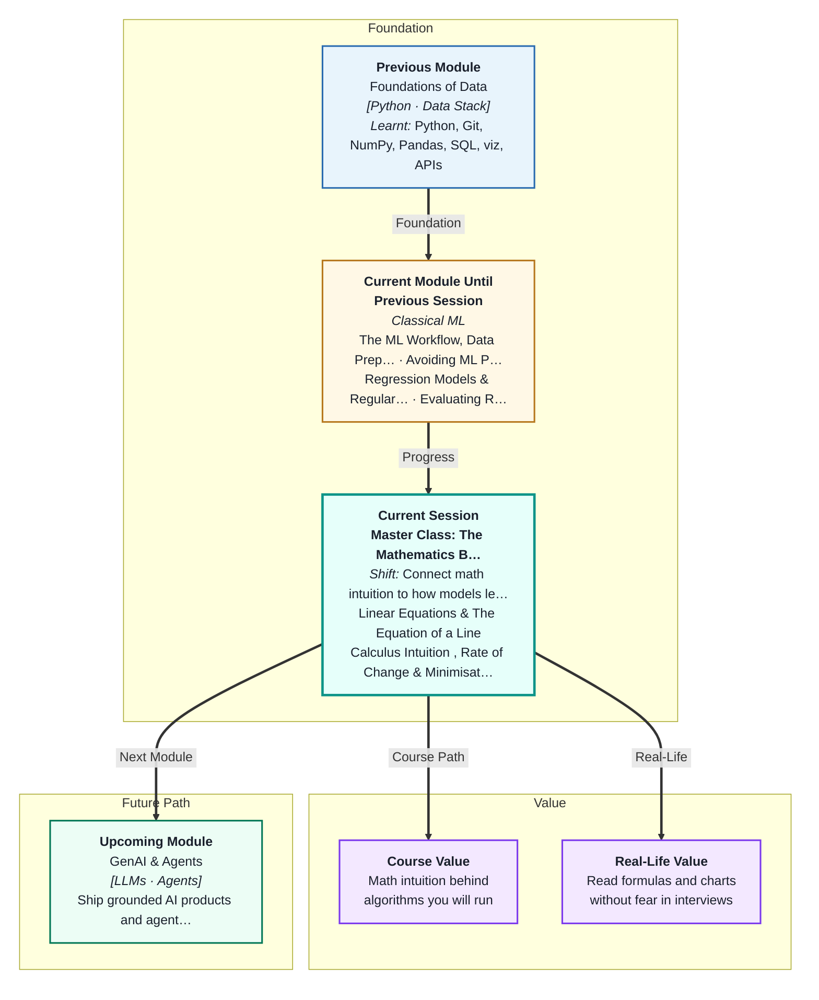
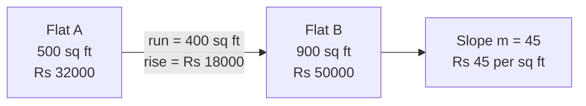
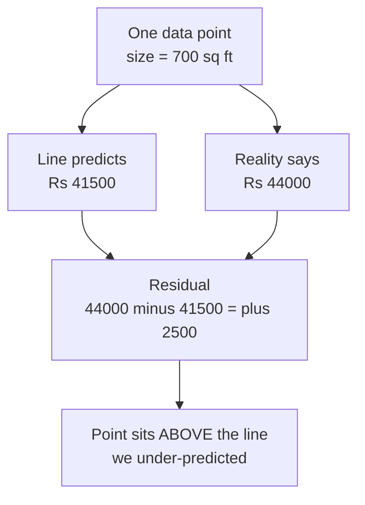
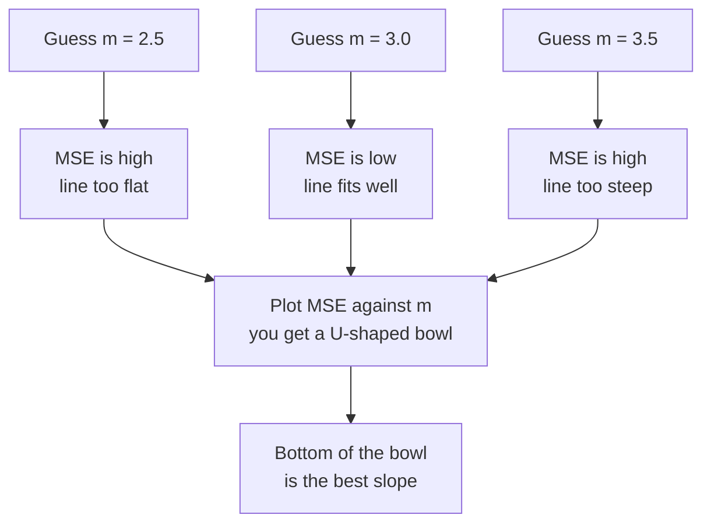
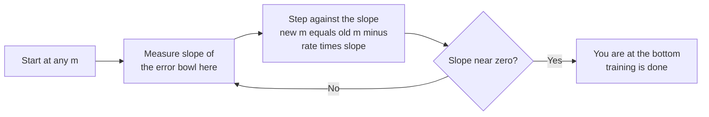

# Master Class: The Mathematics Behind Learning — Lines, Curves & Errors
---

## Mental Map



## What You'll Learn

In this pre-read, you'll discover:

- What the **slope** and **intercept** of a line actually mean in real units — rupees, kilometres, marks
- How to see a **residual** as the gap between what happened and what your line predicted
- Why we **square** errors instead of just adding them up
- How total error becomes a **curve** — the "error bowl" — that a model slides down
- What a **derivative** means in plain English, and how **gradient descent** is just walking downhill

---

## A. The Equation of a Line — y = mx + c

> 💡 **Analogy:** An autorickshaw meter starts at a flag-down charge of ₹25 the moment you sit down, then adds ₹15 for every kilometre. Your final fare is a straight line: a starting value plus a per-unit rate.

**One-line definition:** A **line** is described by `y = mx + c`, where `m` is the **slope** (how much y changes for each 1-unit increase in x) and `c` is the **intercept** (the value of y when x is zero).

For the autorickshaw: `fare = 15 × km + 25`. Here `m = 15` and `c = 25`.

| Symbol | Name | Autorickshaw meaning | Rent model meaning |
|---|---|---|---|
| `x` | Input | Kilometres travelled | Flat size in sq ft |
| `m` | Slope | ₹15 per extra km | ₹45 per extra sq ft |
| `c` | Intercept | ₹25 flag-down charge | Base rent at 0 sq ft |
| `y` | Output | Total fare | Predicted monthly rent |

**Slope is rise over run.** Take any two points on the line and divide:

```
m = (change in y) / (change in x) = rise / run
```

If a 500 sq ft flat rents for ₹32,000 and a 900 sq ft flat rents for ₹50,000:

```
m = (50000 - 32000) / (900 - 500) = 18000 / 400 = 45
```



**The whole point:** when you fit a line to real data, `m` is not an abstract number. It is a sentence in plain English — *"each extra square foot costs about ₹45 more per month."* That sentence is the model's finding.

---

## B. Residuals — The Gap Between the Line and the Point

> 💡 **Analogy:** Your weather app predicted 32 °C for Delhi today. It actually hit 35 °C. That 3-degree gap is the app's mistake for today. Do that for every day of the week and you can judge how good the app is.

**One-line definition:** A **residual** is the gap between what actually happened and what your line predicted: `residual = actual − predicted`.



Every point in your dataset gets its own residual:

- **Positive residual** → the point sits *above* the line. You predicted too low.
- **Negative residual** → the point sits *below* the line. You predicted too high.
- **Zero residual** → the line passes exactly through the point. Rare, and slightly suspicious.

A residual is measured in the **units of your target**. If you are predicting rent in rupees, a residual of `+2500` means "this flat is ₹2,500 pricier than the line thinks it should be."

**Why this matters:** Linear Regression does not "know" the right answer in advance. It tries a line, looks at all the residuals, and asks: *can I nudge the line to make these gaps smaller?* That single question is the entire learning process.

---

## C. Why We Square the Errors

> 💡 **Analogy:** In darts, one throw lands 10 cm to the left of the bullseye and the next lands 10 cm to the right. Nobody says your average throw was perfect. A miss is a miss, whichever side it fell on.

**One-line definition:** We **square** each residual so that negative and positive gaps cannot cancel each other out, and so that large mistakes count for much more than small ones.

Consider a line whose residuals are `+10, −10, +10, −10`.

| Method | Calculation | Result | Problem |
|---|---|---|---|
| Just add them | 10 − 10 + 10 − 10 | 0 | Looks perfect. It is not. |
| Add absolute values | 10 + 10 + 10 + 10 | 40 | Honest, but treats all misses equally |
| Add the squares | 100 + 100 + 100 + 100 | 400 | Honest **and** punishes big misses hard |

Squaring does two jobs at once:

1. **Negatives disappear.** `(−10)² = 100`, same as `(+10)²`. Errors can only add up, never cancel.
2. **Big errors are punished.** Ten small errors of 1 contribute `10 × 1 = 10`. One big error of 10 contributes `100`. The model will work much harder to fix that one bad point.

Two names you already met in **Evaluating Regression Performance**, now explained from the inside:

```
SSE = sum of (actual - predicted)²        ← total squared error
MSE = SSE / n                             ← average squared error per point
```

They measure the same thing. `MSE` just divides by the number of points so the number does not grow simply because you collected more data.

---

## D. The Error Bowl — Total Error as a Curve

> 💡 **Analogy:** Drop a marble into a kitchen mixing bowl. Whatever the wall it starts on, it rolls down, wobbles, and settles at the single lowest point. It cannot rest anywhere else.

**One-line definition:** If you plot **total error on the y-axis** against **the value of your slope `m` on the x-axis**, you get a U-shaped curve — the **cost function** — and the best `m` is the one at the very bottom.

This is the mental leap of the whole session. Stop thinking about the data plot for a moment. Draw a *different* plot:

- x-axis is no longer flat size. It is the **slope you chose**.
- y-axis is no longer rent. It is the **MSE that choice produced**.



| Where you are on the bowl | What the line looks like | What the slope of the bowl tells you |
|---|---|---|
| High on the left wall | Line too flat, under-predicts | Bowl slopes down to the right — go right |
| High on the right wall | Line too steep, over-predicts | Bowl slopes down to the left — go left |
| At the very bottom | Best possible fit | Bowl is flat here — slope is zero |

**The key insight:** *training a model = finding the bottom of this bowl.* And here is the beautiful part — at the bottom, the curve is momentarily **flat**. Finding the minimum means finding where the slope of the curve equals zero.

---

## E. The Derivative and Gradient Descent — Walking Downhill

> 💡 **Analogy:** You are hiking down a hill and thick fog rolls in. You cannot see the valley floor. But you can still feel, with your feet, which direction slopes downward — so you take a step that way, then feel again. Repeat, and you reach the bottom without ever seeing it.

**One-line definition:** A **derivative** is the slope of a curve *at a single point*, and **gradient descent** is the recipe of repeatedly stepping in the downhill direction that the derivative points to.

**Derivative, built in three steps:**

1. Pick two points on the curve and join them. That straight line is a **secant**, and its slope is plain rise ÷ run.
2. Slide the second point closer and closer to the first. The secant tilts as you go.
3. When the gap shrinks to almost nothing, the secant becomes a **tangent** — a line that just grazes the curve. Its slope *is* the derivative at that point.

You only need one derivative rule all session: for the curve `y = x²`, the slope at any x is `2x`. So at `x = 3` the slope is `6` (steep, going up). At `x = 0` the slope is `0` — flat. That flat point is the bottom of the parabola.

**Gradient descent is one line of arithmetic, repeated:**

```
new_m = old_m - learning_rate × (slope of the error curve at old_m)
```

Read it aloud: *"move against the slope."* If the curve slopes **down** to the right (a negative slope), subtracting a negative pushes `m` **up** — towards the bottom. It self-corrects.



The **learning rate** is how big a step you take. It is a dial you choose:

| Learning rate | What happens | Picture |
|---|---|---|
| Too small | Creeps down, takes thousands of steps | Baby steps down a hill |
| Just right | Slides smoothly to the bottom | Confident walking pace |
| Too big | Overshoots the valley, bounces up the far wall, explodes | Leaping across the valley |

That is it. Every model you will ever train — regression, neural networks, even the large language models in Module 3 — learns by some version of this loop.

---

## Practice Exercises

**1. Pattern Recognition**  
A fitted line for Bengaluru flats reads `rent = 38 × size + 4200`, with size in square feet and rent in rupees per month. Say in one plain English sentence what the `38` means and what the `4200` means. Then decide which of the two numbers is more believable as a real-world quantity, and explain why an intercept can sometimes be a value that could never actually occur.

**2. Concept Detective**  
A classmate reports that their line has a total error of exactly zero, because their residuals were `+8, −8, +5, −5`. They conclude the line is a perfect fit. Diagnose what has gone wrong using the ideas from section C, and state what they should have computed instead.

**3. Real-Life Application**  
Think of something in your own week that behaves like `y = mx + c` — a mobile data plan, a gym membership with a joining fee, a tiffin service, a metro card. Write down its equation, name what `m` and `c` are in real units, then invent one data point that would *not* sit exactly on the line and compute its residual.

**4. Spot the Error**  
A student is running gradient descent on the error bowl and writes their update as `new_m = old_m + learning_rate × slope`. They report that their error keeps getting bigger every single step. Identify the single character that is wrong, and explain — using the downhill-in-fog picture — why that character flips the behaviour completely.

**5. Planning Ahead**  
You are given a scatter of 200 points and told to find the best slope `m` by hand, with the intercept fixed. Design a plan: which values of `m` would you try first, how would you use the MSE at each guess to decide where to look next, and at what point would you decide you have reached the bottom of the bowl? Then describe how gradient descent automates exactly the plan you just wrote.

---

> ✅ **You're done!** You now know what is happening underneath every `.fit()` call you have made so far: a line is proposed, residuals are measured, they are squared into a single error number, and that number is walked downhill until its slope hits zero. This is the engine inside Linear Regression, Ridge, Lasso — and later, every neural network. Next up: **Classification Foundations**, where the target stops being a number and starts being a category — and you will see this same downhill walk reappear in a brand new costume.
