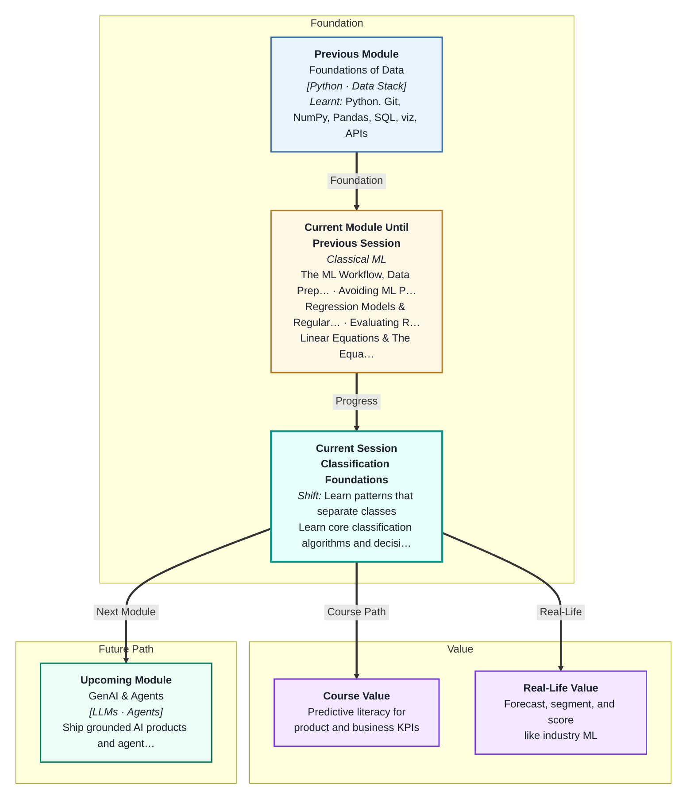
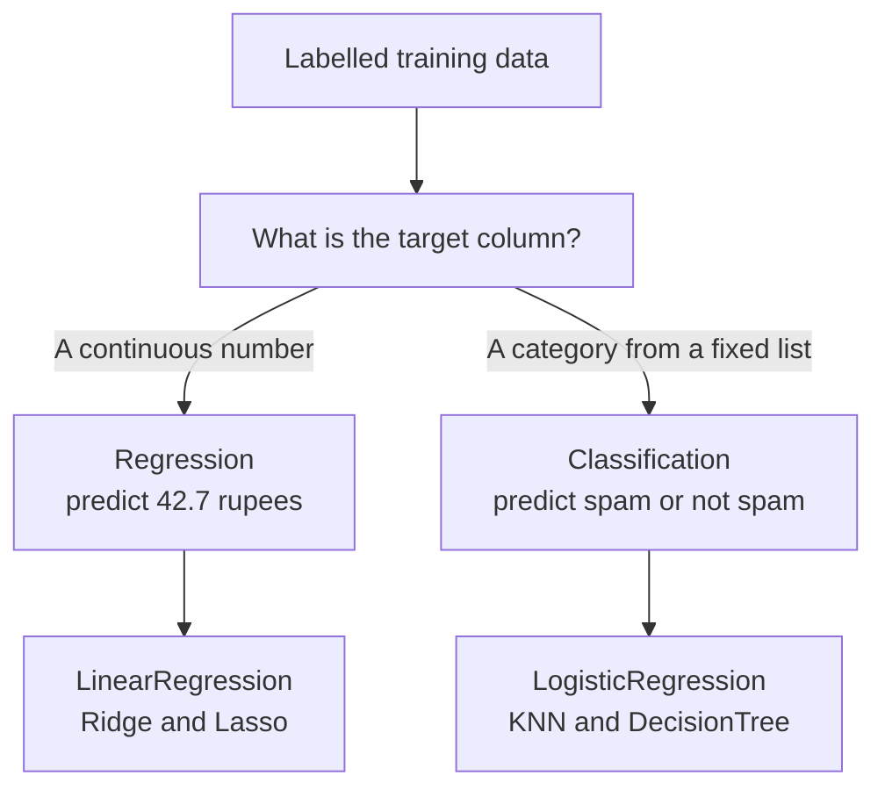
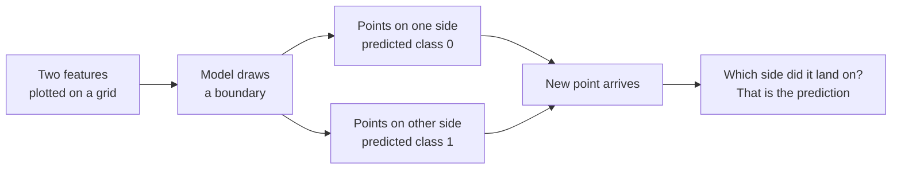
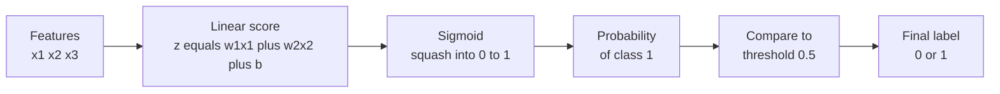
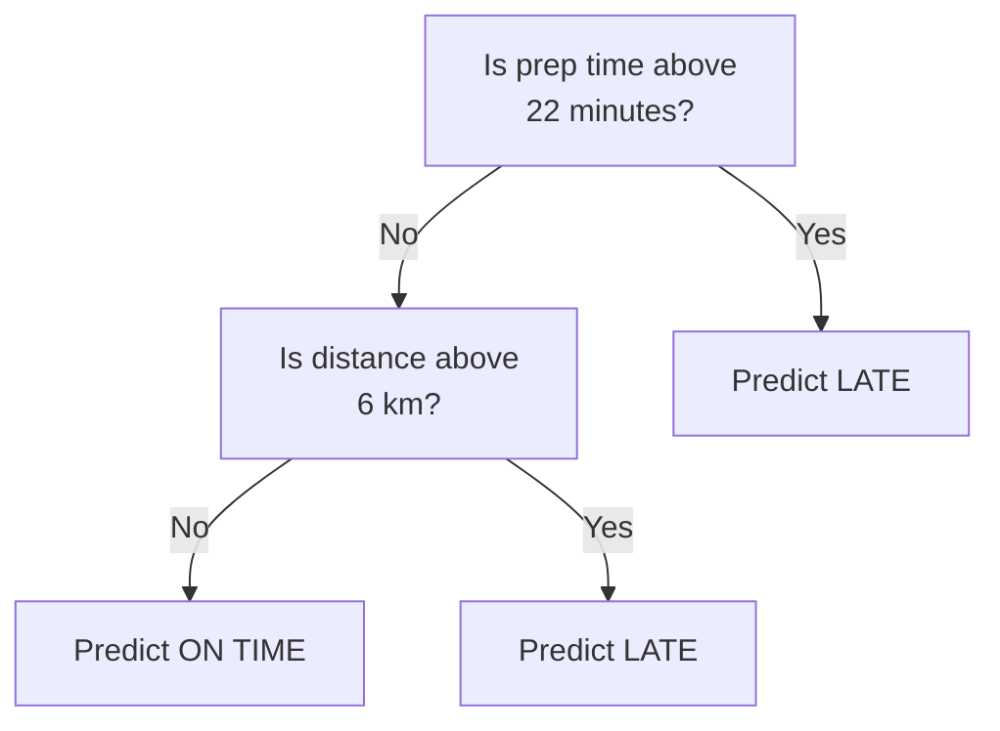

# Classification Foundations
---

## Mental Map

## What You'll Learn

In this pre-read, you'll discover:

- How **classification** differs from the regression you have been doing — a label instead of a number
- Why every classifier is really just drawing a **decision boundary** between groups
- How **Logistic Regression** turns any score into a probability between 0 and 1
- How **K-Nearest Neighbours** classifies by asking the closest examples, and why it needs scaled features
- How a **Decision Tree** learns a flowchart of if-else questions you can actually read
- Why **accuracy** alone can quietly lie to you

---

## A. From a Number to a Label

> 💡 **Analogy:** A thermometer tells you it is 34.7 degrees — a number. A traffic light tells you *stop* or *go* — a category. Both are predictions about the world, but they answer different kinds of question. Everything you built in Sessions 3 and 4 was a thermometer. This session, you build traffic lights.

**One-line definition:** **Classification** is supervised learning where the model predicts a **class** — a label from a fixed, finite set — instead of a continuous number.

The whole workflow you already know stays exactly the same: split the data, `fit` on train, `predict` on test, score the result. Only the target column and the scoring metric change.

| Question | Regression | Classification |
|---|---|---|
| What is predicted? | A number on a scale | A label from a list |
| Example target | Flat price in ₹ | Loan repaid: yes or no |
| Output of `predict` | `47.3` | `1` or `"spam"` |
| Typical error measure | RMSE, R² | Accuracy |
| Is "close" meaningful? | Yes — off by ₹2 is nearly right | No — a wrong label is just wrong |

That last row is the real difference. A regression model that predicts ₹98 when the answer was ₹100 is doing well. A classifier that says "benign" when the answer was "malignant" is not *slightly* wrong — it is simply wrong.

**Binary classification** has exactly two classes (spam / not spam). **Multi-class classification** has three or more (cat / dog / horse). Everything in this session works for both, but we will think in twos.

---

## B. The Decision Boundary — The One Picture to Remember

> 💡 **Analogy:** In cricket, the umpire does not measure how far the ball travelled. They only check which side of the boundary rope it landed on. The rope is a line that splits the ground into two verdicts. Every classifier is trying to draw that rope.

**One-line definition:** A **decision boundary** is the dividing line — or curve — a model draws through the feature space, so that everything on one side is predicted as class 0 and everything on the other side as class 1.

Here is the key insight that ties the whole session together: **the three algorithms below differ only in the shape of boundary they are allowed to draw.**

- **Logistic Regression** draws one straight line. Simple, stable, sometimes too rigid.
- **K-Nearest Neighbours** draws a wiggly, hand-drawn boundary that hugs the data.
- **Decision Trees** draw a boundary made of straight horizontal and vertical steps, like a staircase.

Remember Session 2. A boundary that wiggles around every single training point has **overfit** — it memorised noise. A boundary that is too simple has **underfit** — it missed the real pattern. Every dial you turn in this session is really a dial on how wiggly the boundary is allowed to be.

---

## C. Logistic Regression — Squashing a Score into a Probability

> 💡 **Analogy:** Your phone battery percentage can never go above 100 or below 0, no matter how long you leave it charging. However much energy you push in, the display politely squashes it into the 0–100 range. The **sigmoid** function does exactly this to a model's raw score.

**One-line definition:** **Logistic Regression** computes a straight-line score from the features, then passes that score through the sigmoid function to turn it into a probability between 0 and 1.

Despite the name, Logistic Regression is a **classifier**, not a regressor. The name is a historical accident that trips up every beginner exactly once.

Step 1 is the familiar line from Session 5: `z = w1*x1 + w2*x2 + ... + b`. That `z` can be any number at all — minus 40, plus 900. Useless as a probability.

Step 2 fixes that. The sigmoid is `sigmoid(z) = 1 / (1 + e^(-z))`, and it always lands between 0 and 1:

| Raw score `z` | `sigmoid(z)` | Meaning |
|---|---|---|
| -4 | 0.02 | Very confident it is class 0 |
| -1 | 0.27 | Leaning class 0 |
| 0 | 0.50 | Completely undecided — this is the boundary |
| +1 | 0.73 | Leaning class 1 |
| +4 | 0.98 | Very confident it is class 1 |

Step 3 applies the **threshold**. By default scikit-learn calls anything above `0.5` class 1, and anything below it class 0. Notice that `sigmoid(z) = 0.5` happens exactly when `z = 0` — so the straight line `z = 0` *is* the decision boundary.

**Reading the coefficients.** Each learned weight `w` is a push. A large positive `w` means "when this feature goes up, push the prediction towards class 1." A large negative `w` means "push towards class 0." A weight near zero means the feature barely matters. This readability is why Logistic Regression is still the first model banks and hospitals reach for.

---

## D. K-Nearest Neighbours — Ask the People Standing Closest

> 💡 **Analogy:** You join a new hostel and want to know whether tonight's mess dinner is worth eating. You do not survey all 400 residents. You ask the 5 people sitting nearest to you and go with the majority. That is the entire algorithm.

**One-line definition:** **K-Nearest Neighbours (KNN)** classifies a new point by finding the `k` training points closest to it and taking a majority vote of their labels.

KNN is strange: it does no real "learning" at `fit` time. It just memorises the training data. All the work happens at `predict` time, when it measures distances to every training point.

The only dial that matters is `k`:

| Value of `k` | Boundary shape | Behaviour | Risk |
|---|---|---|---|
| `k = 1` | Extremely jagged | Copies every single training point | **Overfits** — train accuracy is always a perfect 1.00 |
| `k = 5` to `15` | Reasonably smooth | Follows the real pattern | Usually the sweet spot |
| `k` = huge | Nearly flat | Everything becomes the majority class | **Underfits** — ignores local structure |

A `k = 1` model that scores 100% on training data has learnt nothing. It is looking each answer up in a table. This is the clearest overfitting demo in all of machine learning.

**KNN demands feature scaling.** This is not optional, and here is why. Suppose you classify orders using `distance_km` (range 1–10) and `order_value` in rupees (range 200–5000). Distance is measured in single digits; order value in thousands. When KNN computes the distance between two orders, the rupee difference is roughly a thousand times bigger — so `distance_km` is effectively ignored. The model silently becomes a one-feature model.

Fixing it is one line: put a `StandardScaler` before the classifier so every feature is rescaled to a comparable spread. Then, and only then, does "nearest" mean what you think it means.

---

## E. Decision Trees — A Flowchart the Machine Writes Itself

> 💡 **Analogy:** Ring a customer care helpline and you get a menu: "Press 1 for billing. Press 2 for network." Each answer sends you down a narrower path until you reach the right desk. A **decision tree** is that menu — except the machine works out the questions by itself.

**One-line definition:** A **decision tree** classifies by asking a chain of yes/no questions about single features, following the answers down until it reaches a leaf that holds the predicted class.

**How is a split chosen?** The tree tries every feature and every possible cut-off, and picks the one that leaves the two resulting groups as *pure* as possible. "Pure" means the group is mostly one class. The two common purity scores are **Gini impurity** and **entropy**; both simply measure how mixed a group is. A group of 10 items that are all "late" has impurity 0 — perfectly pure. A group of 5 late and 5 on-time is maximally mixed. The tree greedily grabs whichever split buys the biggest drop in impurity, then repeats on each half.

**`max_depth` is the overfitting dial.** Left unlimited, a tree keeps splitting until every leaf holds a single training row — a perfect memorisation of the training set, and a boundary that shatters on new data.

| `max_depth` | What it learns | Train vs test |
|---|---|---|
| 1 | A single yes/no rule — a "stump" | Both low — **underfit** |
| 3 to 5 | A handful of readable rules | Usually the best test score |
| `None` | One leaf per training row | Train hits 1.00, test drops — **overfit** |

**Their superpower is interpretability.** Call `plot_tree` and you get a picture you can hand to a doctor, a loan officer, or a delivery manager, and they can follow it without knowing any maths. No other model in this module gives you that.

> **Briefly worth knowing:** **Naive Bayes** is a fourth classifier you will hear about. It uses probability rules to ask "given these features, which class is most likely?", and it assumes — naively, hence the name — that features are independent of each other. It is very fast and surprisingly strong on text, which is why classic spam filters used it. You do not need it today.

---

## F. Judging a Classifier — And the Trap Waiting for You

> 💡 **Analogy:** A smoke alarm that never beeps is correct on 364 days of the year. It scores 99.7% "accuracy". It is also completely useless, because the one day it mattered, it stayed silent.

**One-line definition:** **Accuracy** is the fraction of predictions the model got right — and it becomes dangerously misleading when one class is far rarer than the other.

**`predict` vs `predict_proba`.** Every scikit-learn classifier gives you two ways to ask a question:

- `model.predict(X)` returns the hard label — `0` or `1`. The decision is already made for you.
- `model.predict_proba(X)` returns the probabilities — one column per class, always summing to 1. Row `[0.28, 0.72]` means "28% chance class 0, 72% chance class 1."

`predict` is just `predict_proba` with the 0.5 threshold applied. The probability is the richer answer: it tells you *how sure* the model is. A 0.51 prediction and a 0.99 prediction both come out of `predict` as a confident-looking `1`, but only one of them deserves your trust.

**The accuracy trap.** Imagine 1,000 UPI transactions of which 20 are fraudulent:

| Model | Frauds caught | Accuracy | Actually useful? |
|---|---|---|---|
| Always predicts "not fraud" | 0 out of 20 | **98%** | No — it is worthless |
| Catches 15 of 20 frauds | 15 out of 20 | 96% | Yes, clearly |

The useless model scores *higher*. Accuracy simply counts correct answers, so when 98% of rows are one class, predicting that class every time wins on paper and fails in reality.

For today, accuracy is fine — the datasets we use are reasonably balanced, and it is the right first metric to build intuition with. But hold this warning in your head: **the moment your classes are imbalanced, accuracy stops being trustworthy.** Session 8 gives you the metrics that survive imbalance.

---

## Practice Exercises

**1. Pattern Recognition**  
For each of these five targets, decide whether it is a regression or a classification problem, and if it is classification say how many classes there are: (a) tomorrow's maximum temperature in Delhi; (b) whether a monsoon day will see rainfall above 10 mm; (c) which of four IPL teams a fan supports; (d) the resale price of a second-hand scooter; (e) whether a delivery arrives on time. Then explain what would go wrong if you tried to solve (b) with a `LinearRegression` model.

**2. Concept Detective**  
A classmate trains KNN with `k=5` to predict whether a customer will reorder, using two features: `visits_last_month` (values 1 to 12) and `total_spent_rupees` (values 500 to 40000). The model performs badly, and changing `k` barely helps. Name the specific problem, explain in your own words why one feature is being ignored, and state the one-line fix and where in the pipeline it belongs.

**3. Real-Life Application**  
Pick a decision you make in daily life that has a yes/no answer — for example, "should I carry an umbrella today?" or "will this autorickshaw ride take more than 20 minutes?". Write down three features you would use as inputs. Then describe what the decision boundary would look like if you could plot two of those features on a graph, and say which of the three algorithms in this pre-read you would choose and why.

**4. Spot the Error**  
A team builds a classifier to detect a rare disease that affects 1 in 100 patients. They report: "Our model achieves 99% accuracy on the test set — better than doctors." On inspection, the model predicts "healthy" for every single patient it has ever seen. Explain exactly why the 99% figure is technically true but completely worthless, and describe what the model's `predict_proba` output would probably look like for a genuinely sick patient.

**5. Planning Ahead**  
You are handed a dataset of 5,000 loan applications with columns: `age`, `monthly_income`, `existing_loans`, `city`, `credit_history_years`, and the label `repaid` (yes/no). Design your approach: which algorithm you would try first and why; what you would do to the features before feeding them to KNN; what `max_depth` you would start a decision tree at and how you would decide if it is too deep; and one reason accuracy alone might mislead you on this particular dataset.

---

> ✅ **You're done!** You now understand the pivot from predicting numbers to predicting labels, you can picture every classifier as a boundary being drawn through your data, and you know the three workhorse algorithms — Logistic Regression, KNN and Decision Trees — along with the single dial that controls overfitting in each. This is the foundation that almost all applied ML sits on. Coming up: **Ensemble Classification Models**, where you will discover that combining many weak trees into a forest beats any single tree, almost every time.
