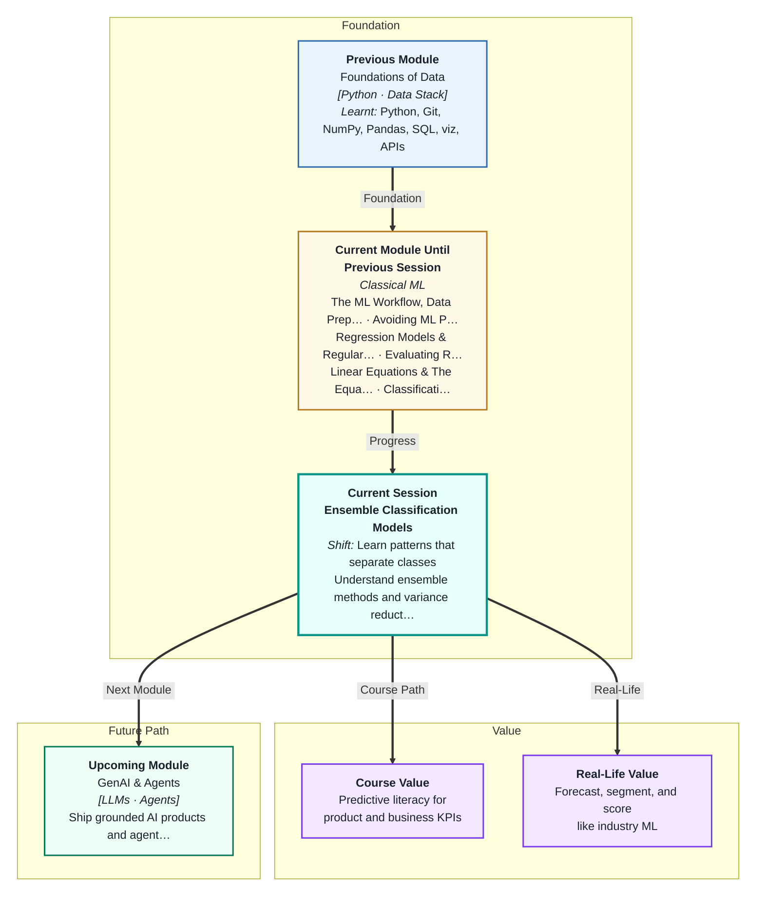
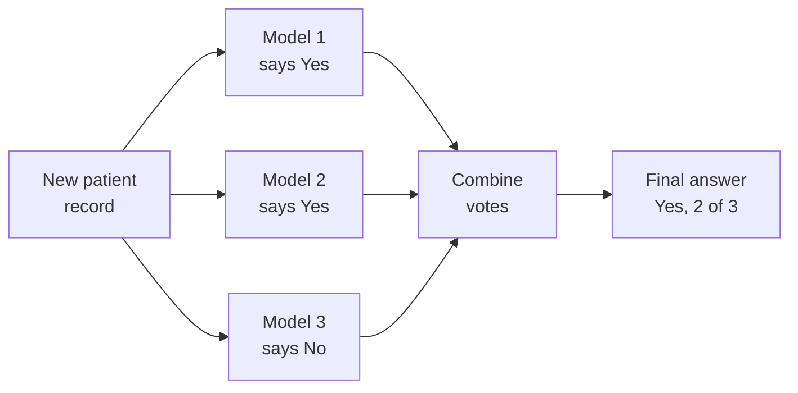
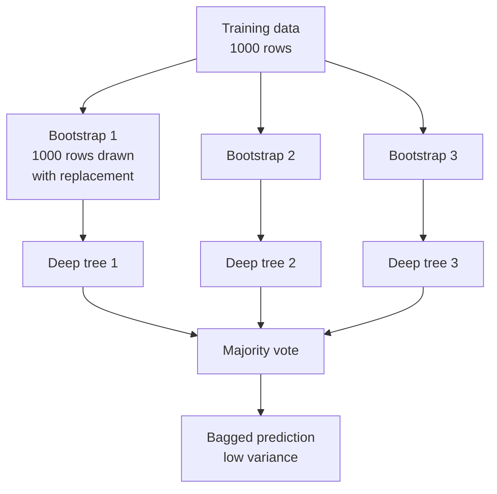
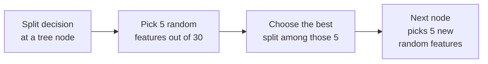
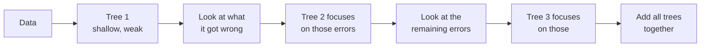

# Ensemble Classification Models
---

## Mental Map



## What You'll Learn

In this pre-read, you'll discover:

- Why one deep **decision tree** is unreliable — it memorises instead of learning
- How **combining many models** beats using one strong model, and why crowds are wise
- How **bagging** and **Random Forests** cut **variance** by averaging many noisy trees
- How **boosting** cuts **bias** by training trees one after another to fix mistakes
- How to read a forest's **feature importance** chart — and why it is not proof of cause

---

## A. The Problem: One Deep Tree Memorises

> 💡 **Analogy:** Ask one friend to review a new restaurant. They went on a rainy Tuesday when the chef was off. Their review is confident, detailed — and completely unrepresentative. One opinion swings wildly with luck.

**One-line definition:** A fully grown decision tree has **high variance** — small changes in the training data produce a completely different tree, and a completely different set of predictions.

In Session 6 you grew decision trees. A tree with no depth limit keeps splitting until every leaf is pure. It fits the training rows perfectly, including the noise in them. That is **overfitting** — the model learnt the data, not the pattern.

Here is what that looks like when you train the same deep tree on five slightly different samples of the same data:

| Training sample | Train accuracy | Test accuracy |
|---|---|---|
| Sample 1 | 1.00 | 0.95 |
| Sample 2 | 1.00 | 0.94 |
| Sample 3 | 1.00 | 0.94 |
| Sample 4 | 1.00 | 0.90 |
| Sample 5 | 1.00 | 0.93 |

Train accuracy is a flat, useless 1.00 every time. Test accuracy jumps around by five whole percentage points. The model is not *wrong on average* — it is **unstable**. That instability is variance, and variance is what today's session attacks.

**The key insight:** a deep tree is **unbiased but noisy**. On average it points at the right answer, but any single tree is thrown off by the particular rows it happened to see.

---

## B. Wisdom of the Crowd — What an Ensemble Is

> 💡 **Analogy:** On a quiz show, the contestant uses the "ask the audience" lifeline. No single audience member is a genius. But the *majority vote* of 200 ordinary people is right far more often than any one of them. Individual mistakes cancel out; the shared signal survives.

**One-line definition:** An **ensemble** is a group of models whose individual predictions are combined — usually by voting or averaging — into one final prediction that is more reliable than any member.



The simplest ensemble in scikit-learn is the **Voting Classifier**. You hand it several *different* models — say a logistic regression, a KNN, and a small decision tree — and it pools their answers.

| Voting type | How it decides | Needs from each model | Usually |
|---|---|---|---|
| **Hard voting** | Majority of the predicted labels | A label, e.g. `1` | Simple, blunt |
| **Soft voting** | Average of the predicted probabilities | `predict_proba` | Smoother, often better |

Soft voting listens to *confidence*, not just the label. A model that says "Yes, 51% sure" contributes less than one that says "Yes, 99% sure." Hard voting treats both as one equal vote.

**The one rule that makes ensembles work:** the members must make *different* mistakes. Three models that always agree add nothing — you have just paid three times for one opinion.

---

## C. Bagging — Bootstrap, Then Aggregate

> 💡 **Analogy:** You are cooking biryani for a wedding and want to check if the rice sack is good. Instead of judging by one handful, you scoop ten random handfuls, cook ten small test batches, and judge the *average*. Any one scoop might be unlucky. Ten scoops together tell the truth.

**One-line definition:** **Bagging** — short for *bootstrap aggregating* — trains many copies of the same model on many random resamples of the training data, then averages their votes.



Two ideas are hiding in that word:

1. **Bootstrap** — draw a sample of the same size as your training set, *with replacement*. Some rows appear twice, some not at all. Every tree therefore sees a slightly different world.
2. **Aggregate** — let all the trees vote. For classification, take the majority.

**Why does this cut variance?** Each tree's error has a random part that depends on which rows it saw. Averaging many trees makes those random parts cancel out. The shared, real pattern does not cancel — it reinforces.

The rough rule from statistics: averaging `n` independent noisy estimates shrinks the noise by a factor of `√n`. Ten trees are meaningfully steadier than one; a hundred are steadier still.

**Crucially, bagging does not reduce bias.** If every tree is wrong in the *same* direction, averaging them keeps that error. Bagging fixes wobble, not blindness.

---

## D. Random Forest — Bagging With a Twist

> 💡 **Analogy:** A cricket selection panel where every selector watched the *same three matches* will produce one groupthink opinion. Now force each selector to watch a *different random subset* of matches. Their opinions genuinely diverge — and the panel's combined verdict gets stronger.

**One-line definition:** A **Random Forest** is bagging on decision trees, plus one extra rule — at every split, each tree may only consider a *random subset of the features*.

That extra rule is called **feature subsampling**, and it exists to **decorrelate** the trees. In plain bagging, if one column is hugely predictive, every tree splits on it first, and the trees end up nearly identical. Averaging near-identical trees buys you almost nothing. Forcing each split to choose from a random handful of columns means weaker-but-different columns get their turn, and the trees become genuinely diverse.



**The three knobs you will actually turn:**

| Knob | What it controls | Typical starting point |
|---|---|---|
| `n_estimators` | How many trees are in the forest | 100 to 500. More is safer, just slower |
| `max_depth` | How deep each tree may grow | `None` is fine — bagging handles the overfitting |
| `max_features` | Features considered per split | `"sqrt"` for classification |

**Key facts:**

- More trees **never** cause overfitting in a Random Forest. They only cost time. Accuracy rises fast, then flattens.
- Random Forests need almost no tuning to work well. That is why they are the default first model on tabular data.
- No feature scaling required — trees split on thresholds, so units do not matter.

---

## E. Feature Importance — Asking the Forest What Mattered

> 💡 **Analogy:** You taste a friend's dal and try to work out which spice carries the flavour. You cannot see inside the pot, so you judge by impact — remove the cumin and the dish collapses; remove the bay leaf and nobody notices. **Feature importance** ranks ingredients by how much the dish would suffer without them.

**One-line definition:** **Feature importance** scores how much each column contributed to the forest's splitting decisions — a ranked list of which inputs the model actually leaned on.

Every tree records how much each split *improved* the purity of its leaves. A forest averages that gain across all its trees and all its splits. The scores are then normalised so they sum to 1.0.

```python
importances = pd.Series(rf.feature_importances_, index=X.columns)
importances.sort_values().plot(kind="barh")
```

A horizontal bar chart, sorted, is the standard way to show this — long bars at the top, the useless columns collapsing to near-zero at the bottom.

| How to read it | What it means | What it does NOT mean |
|---|---|---|
| `worst_perimeter` scores 0.15 | The forest split on it often, and those splits helped | That perimeter *causes* the outcome |
| Five columns score under 0.01 | The forest barely used them | That they are useless — they may just be duplicates of a stronger column |
| One column scores 0.60 | The model depends heavily on it | It is the only thing that matters |

> ⚠️ **Importance is not causation.** In Session 13 of Module 1 you learnt that correlation is a clue, not a conclusion. The same warning applies here, twice over: a feature can score high simply because it is *correlated* with the true driver. Importance tells you what the *model* used. It does not tell you what the *world* does.

---

## F. Boosting — Learning From Your Own Mistakes

> 💡 **Analogy:** You go to a tailor for a wedding kurta. The first fitting is roughly right but the sleeves are long. The second fitting only fixes the sleeves. The third only fixes the collar. Each visit works on *what the last one got wrong* — nobody starts the kurta again from scratch.

**One-line definition:** **Boosting** trains models **sequentially**, where each new model is trained to correct the errors left behind by the models before it.



Boosting uses **weak learners** — deliberately shallow trees, often just 3 levels deep. A single one of them is barely better than guessing. Chain hundreds together, each patching the last one's residual error, and the combined model becomes extremely strong.

This attacks the *other* half of the bias–variance problem from Session 2. Bagging cuts **variance** — the wobble. Boosting cuts **bias** — the systematic wrongness. In scikit-learn you get `GradientBoostingClassifier` and the faster `HistGradientBoostingClassifier`. Outside scikit-learn, **XGBoost** and **LightGBM** are the industry standard and win most tabular ML competitions.

| | **Bagging / Random Forest** | **Boosting** |
|---|---|---|
| How trees are built | In **parallel**, independently | **Sequentially**, each fixing the last |
| Mainly reduces | **Variance** | **Bias** |
| Base learner | Deep, strong trees | Shallow, weak trees |
| More trees means | Safer, just slower | Can eventually **overfit** |
| Tuning | Forgiving — works out of the box | Sensitive — `learning_rate` matters a lot |

**The trade-off:** boosting usually wins on accuracy. Random Forest usually wins on effort. Start with the forest; reach for boosting when you need the last two percent.

---

## Practice Exercises

**1. Pattern Recognition**  
You train five deep decision trees on five bootstrap samples of the same 1,000-row dataset. All five report a training accuracy of exactly 1.00, but their test accuracies are 0.88, 0.94, 0.91, 0.85, and 0.93. Identify which of the two problems from Session 2 — high bias or high variance — this pattern shows, explain how you can tell from the *spread* rather than the average, and name the ensemble family designed to fix it.

**2. Concept Detective**  
A teammate builds a bagged ensemble of 200 deep trees on a dataset where one column, `total_purchase_amount`, is by far the strongest predictor. The ensemble scores barely better than a single tree. They are baffled — "averaging is supposed to help!" Diagnose why the averaging bought them so little, name the specific mechanism a Random Forest adds to solve exactly this, and say which hyperparameter controls it.

**3. Real-Life Application**  
A kirana store owner in Pune wants to predict which customers will not repay their monthly credit tab. Available columns: months as a customer, average monthly bill, number of late payments last year, distance from the store, and whether they buy on festival days. Explain how you would use a Random Forest here, what the feature importance chart would tell the owner, and one sentence you would say to stop them concluding that "living far away *makes* people default."

**4. Spot the Error**  
A student writes: *"I used a Random Forest with `n_estimators=1000`. My training accuracy is 100% and my test accuracy is only 79%, so clearly I used too many trees. I will drop down to 50 trees to reduce the overfitting."* Two separate things in that reasoning are wrong. Identify both, and suggest what the student should actually change instead.

**5. Planning Ahead**  
You are given a tabular dataset of 50,000 IPL ball-by-ball rows and asked to classify whether each delivery will be a boundary. Design your model plan: which single model you would try first as a baseline, which ensemble you would try second and why, which you would try third, and — for each — one sentence on whether you expect it to help more with bias or with variance. Then say how you would decide when to stop.

---

> ✅ **You're done!** You now understand the single most useful idea in classical ML: that a crowd of imperfect models, combined properly, beats one carefully polished model. You can explain why bagging attacks variance while boosting attacks bias, and you know that Random Forest is the sensible default on almost any tabular problem. Coming up: **Classification Metrics & Threshold Analysis**, where you will discover why accuracy alone can be a dangerously misleading score — and what to use instead.
