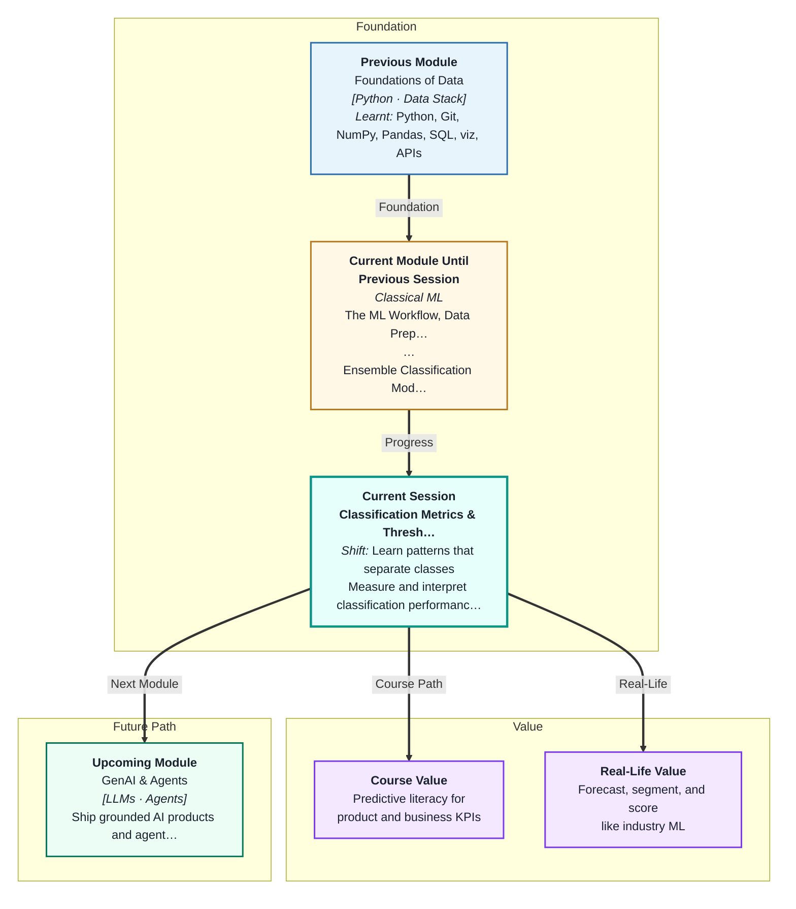
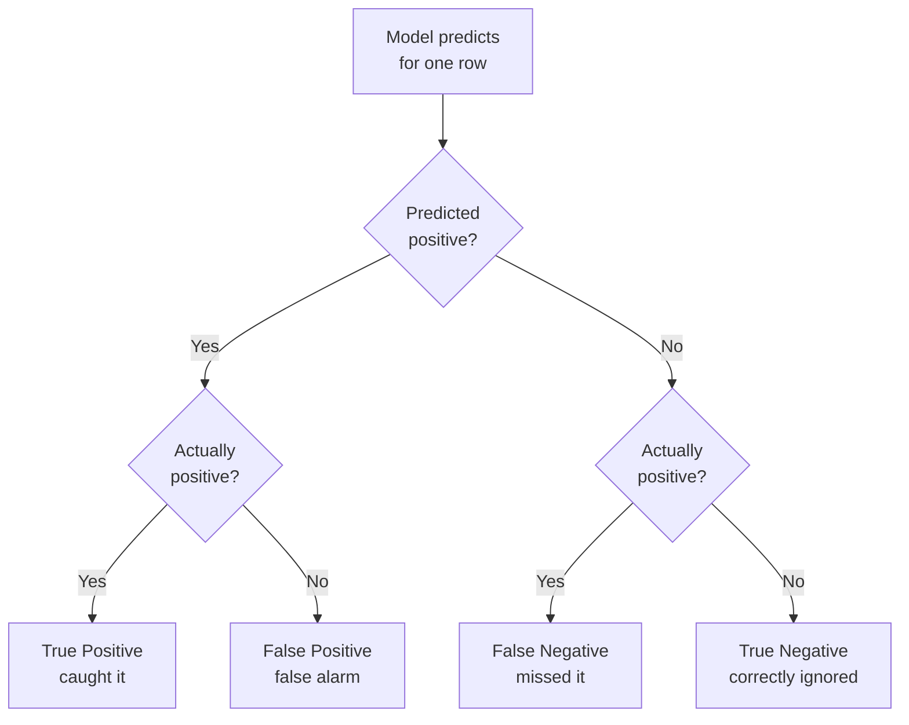
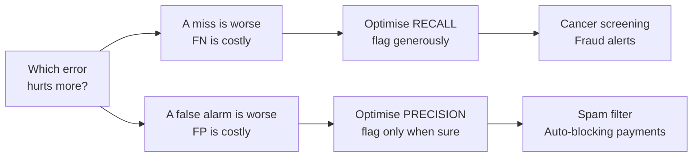
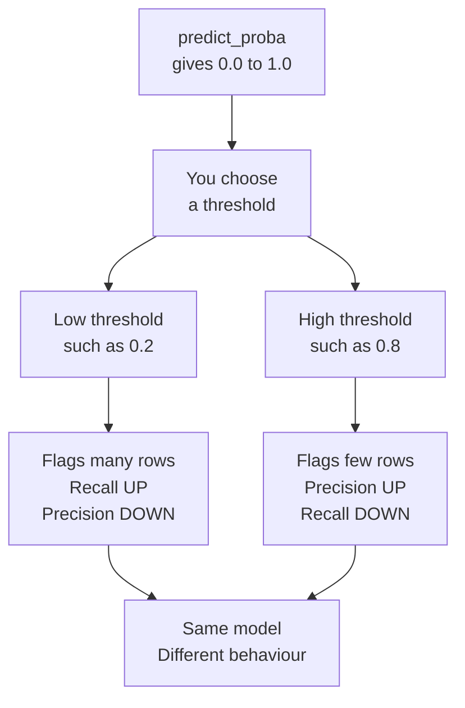

# Classification Metrics & Threshold Analysis
---

## Mental Map

## What You'll Learn

In this pre-read, you'll discover:

- Why **accuracy lies** — and how a useless model can score 95% and still be worthless
- How to read a **confusion matrix** and name your two errors in plain words
- The difference between **precision** and **recall**, and how to choose which one matters
- How the **decision threshold** is a dial you control — not a law of nature
- How the **ROC curve** and **precision–recall curve** judge a model at *every* threshold at once

---

## A. Accuracy Lies

> 💡 **Analogy:** A smoke alarm that is disconnected from the ceiling is "correct" on 364 days of the year. There is no fire on those days, and it stays silent — a 99.7% success rate. It is also completely useless, because it will stay silent on the one day that matters.

**One-line definition:** **Accuracy** is the fraction of predictions a model got right — and on **imbalanced data** (where one class is rare) it can be high while the model is worthless.

You already met accuracy in Session 6. It looks like the obvious way to grade a classifier:

`accuracy = correct predictions / total predictions`

Now imagine a fraud detection dataset: 10,000 UPI transactions, of which 500 are fraudulent. That is 5% fraud. Write a "model" that is one line long — it always predicts **"not fraud"**, no matter what the input is.

| Model | What it does | Accuracy | Frauds caught |
|---|---|---|---|
| The lazy model | Always says "not fraud" | **95%** | 0 out of 500 |
| A real model | Actually looks at the features | 96% | 36 out of 500 |

The lazy model scores 95% and catches nothing. This is the **accuracy paradox**: when one class is rare, you can score brilliantly by ignoring it entirely. Accuracy quietly rewards the model for being lazy about the class you actually care about.

The problem is that accuracy squashes two very different mistakes into one number. Raising a **false alarm** on a genuine transaction and **missing** a real fraud are not the same mistake — they cost different amounts, they annoy different people, and they need different fixes. Accuracy cannot tell them apart.

**Key rule:** The moment your classes are imbalanced, accuracy stops being a score and starts being a distraction. You need a metric that separates your errors before you can improve anything.

---

## B. The Confusion Matrix — Naming Your Two Errors

> 💡 **Analogy:** A cricket umpire has two ways to be wrong. They can raise the finger when the batter was not out (a wrongful dismissal), or shake their head when the batter *was* out (a let-off). Both are errors, but the crowd reacts very differently to each. A good umpire tracks them separately.

**One-line definition:** A **confusion matrix** is a small table that splits every prediction into four boxes, so you can see exactly *which kind* of mistake your model is making.

Pick the class you care about and call it **positive** (fraud, disease, spam). Everything else is **negative**. Now every prediction lands in one of four boxes:

| Box | Meaning | Fraud detection, in plain words |
|---|---|---|
| **True Positive** (TP) | Predicted yes, was yes | Flagged a real fraud. Money saved. |
| **False Positive** (FP) | Predicted yes, was no | Blocked an honest customer's payment. |
| **False Negative** (FN) | Predicted no, was yes | Let a real fraud through. Money gone. |
| **True Negative** (TN) | Predicted no, was no | Let an honest payment through. |

The two error boxes are **FP** and **FN**. Learn to say them out loud in the language of your problem, not in initials. "A false positive means we froze Priya's card while she was buying groceries." "A false negative means ₹40,000 left the account and we did nothing."

Notice what the lazy model from Section A looks like here: TP = 0, FP = 0, FN = 500, TN = 9,500. Every single fraud sits in the FN box. Accuracy hid that. The confusion matrix cannot.

---

## C. Precision vs Recall — Which Mistake Hurts More?

> 💡 **Analogy:** Think of fishing with a net. **Precision** asks: of everything I pulled into the boat, how much was actually fish and not plastic? **Recall** asks: of all the fish that were in the water, how many did I actually pull in? A tiny net has great precision and terrible recall. A net that drags the whole seabed has perfect recall and dreadful precision.

**One-line definition:** **Precision** measures how trustworthy your positive predictions are; **recall** measures how much of the real positive class you managed to catch.

`precision = TP / (TP + FP)`  — "of what I flagged, how much was right?"

`recall = TP / (TP + FN)`  — "of what was really there, how much did I catch?"

Look at the denominators. Precision is punished by **false alarms**. Recall is punished by **misses**. They are two different questions, and improving one usually damages the other — this is the **precision–recall tradeoff**.

| Scenario | The expensive error | Optimise for | Why |
|---|---|---|---|
| Cancer screening | Missing a real tumour | **Recall** | A false alarm costs one extra scan. A miss costs a life. |
| Spam filter | Binning a real job offer | **Precision** | Users forgive some spam. They never forgive a lost email. |
| Fraud alerts | Letting fraud through | **Recall** | A blocked card is an annoyance. Stolen money is a loss. |
| Court conviction | Convicting an innocent person | **Precision** | Better a guilty person goes free than an innocent is jailed. |

**Recall** is also called **sensitivity** — same formula, different textbook. Its mirror image is **specificity** = `TN / (TN + FP)`: of everything that was genuinely negative, how much did you correctly leave alone? A screening test with high sensitivity catches the sick; high specificity means it does not terrify the healthy.

There is no universally "better" metric. There is only the question: **in my problem, which error costs more?** Answer that first, and the metric picks itself.

---

## D. F1 and the Classification Report

> 💡 **Analogy:** To grade a footballer you need both goals scored *and* passes completed. Averaging them normally lets a player who scores 10 goals but never passes look excellent. A **harmonic mean** refuses to do that — it drags the score down towards the *weaker* number, so you cannot hide a weakness behind one great stat.

**One-line definition:** **F1 score** is the harmonic mean of precision and recall — a single number that stays low unless *both* are decent.

`F1 = 2 × (precision × recall) / (precision + recall)`

Why not a normal average? Take a model with precision 1.0 and recall 0.0 (it flags exactly one fraud, correctly, and misses the other 499).

| Precision | Recall | Plain average | **F1** |
|---|---|---|---|
| 1.00 | 0.02 | 0.51 — looks passable | **0.04** — correctly awful |
| 0.90 | 0.85 | 0.875 | **0.87** — balanced, honest |
| 0.60 | 0.60 | 0.60 | **0.60** — identical when balanced |

The plain average gives that useless model a 0.51. F1 gives it 0.04. The harmonic mean punishes imbalance between the two, which is exactly what you want from a single summary number.

**Use F1 when** you genuinely care about both errors and want one number to compare models with. **Do not use F1 when** one error clearly costs more than the other — in that case, optimise the metric that matters and simply *report* the other.

scikit-learn hands you all of this in one call, `classification_report`, which prints precision, recall, and F1 **for each class separately**, plus a `support` column showing how many real examples of each class existed. That support column is where imbalance becomes impossible to ignore.

---

## E. The Threshold Is a Dial, Not a Law

> 💡 **Analogy:** Your phone's motion sensor decides when to wake the screen. The engineer sets a sensitivity level. Turn it up and the screen lights up in your pocket constantly. Turn it down and you have to shake the phone like a cocktail. The sensor did not change — only the cut-off did.

**One-line definition:** A classifier's **threshold** is the probability cut-off above which a prediction is called "positive" — and `0.5` is just a default, not a rule.

In Session 6 you used `.predict()`. It hides something. What the model actually produces is a **probability**, via `.predict_proba()` — a number between 0 and 1 saying "how confident am I that this row is fraud?" `.predict()` then silently applies one rule: *if probability ≥ 0.5, say positive.*

That 0.5 was chosen by nobody, for no reason connected to your problem. You can change it.

Sliding the threshold does **not** retrain the model. The probabilities stay exactly the same. All you are changing is where you draw the line — and that slides you along the precision–recall tradeoff:

| Threshold | Rows flagged | Precision | Recall | Good for |
|---|---|---|---|---|
| 0.10 | Lots | Low | High | Catching everything, tolerating false alarms |
| 0.50 | Default | Medium | Medium | Nothing in particular — it is just the default |
| 0.90 | Very few | High | Low | Only acting when nearly certain |

**Threshold analysis** is the practical skill: sweep the threshold from 0 to 1, record precision and recall at each stop, and pick the value that satisfies your real requirement — "catch at least 90% of frauds" or "keep false alarms under 50 a day". That is a business decision expressed in code.

---

## F. ROC, AUC, and the Precision–Recall Curve

> 💡 **Analogy:** Judging a student on one exam tells you how they did on one day. Judging them on their whole year tells you how good they *are*. A single confusion matrix is one exam — it is the model at one threshold. A **curve** is the whole year — the model at every threshold at once.

**One-line definition:** The **ROC curve** plots recall against the false alarm rate across every threshold, and **ROC-AUC** compresses that whole curve into one number measuring how well the model *ranks* positives above negatives.

The ROC curve plots two things as the threshold slides from 1 down to 0:

- **True Positive Rate** (TPR) on the y-axis — this is just recall
- **False Positive Rate** (FPR) on the x-axis — `FP / (FP + TN)`, the share of negatives you wrongly flagged

A model that ranks perfectly hugs the top-left corner: full recall with no false alarms. A model guessing at random traces the diagonal. **ROC-AUC** ("area under the curve") measures the area beneath your curve:

| ROC-AUC | Interpretation |
|---|---|
| 1.00 | Perfect ranking — every fraud scores above every legitimate transaction |
| 0.90 | Strong — a random fraud outranks a random legit row 90% of the time |
| 0.70 | Weak but real signal |
| 0.50 | Coin flip. The model has learnt nothing. |

The beauty of AUC is that it is **threshold-independent**. It does not care where you draw the line; it asks whether the model *orders* the rows well. That makes it perfect for comparing two models before you have chosen an operating point.

**But AUC has a blind spot on imbalanced data.** FPR has TN in its denominator — and when 95% of your rows are negative, TN is enormous. Hundreds of false alarms barely move FPR, so a mediocre model still looks impressive.

The **precision–recall curve** fixes this. It plots precision against recall, and precision has **no TN in it at all** — so false alarms hurt immediately and visibly. On heavily imbalanced problems, the PR curve is the honest one; two models can sit at ROC-AUC 0.92 and 0.94 while their PR curves are miles apart.

**Rule of thumb:** balanced classes → ROC is fine. Rare positive class → trust the precision–recall curve.

---

## Practice Exercises

**1. Pattern Recognition**  
A hospital model screening for a rare condition reports 98.5% accuracy, and the condition appears in 1.5% of patients. Without seeing any other output, describe what you suspect the confusion matrix looks like, which of the four boxes is almost certainly holding all the errors, and what single metric you would demand to see before believing the model works.

**2. Concept Detective**  
A teammate's spam filter has recall 0.97 and precision 0.42. Users are complaining loudly, but your teammate insists the model is "catching almost everything." Explain in plain words what is actually happening to the users' inboxes, name the specific error box that is overflowing, and say which metric your teammate should have been optimising instead.

**3. Real-Life Application**  
Pick a real screening decision from your own life — a college admissions shortlist, an airport security scanner, or a kirana store deciding which customers get credit. Name the positive class, describe the false positive and the false negative in one sentence each *in the language of that situation*, decide which error is more expensive, and state whether you would push the threshold up or down from 0.5 as a result.

**4. Spot the Error**  
A student writes: *"My model got ROC-AUC 0.93, so at the default threshold it must have precision and recall around 0.93 too."* Identify the misunderstanding, explain what ROC-AUC actually measures, and describe a situation where a model with AUC 0.93 has a recall below 0.5.

**5. Planning Ahead**  
You are building a fraud model for a payments company. A missed fraud costs the company ₹5,000. A false alarm costs ₹500 in manual review and a slightly annoyed customer. Design a complete plan for choosing your operating threshold: what you would sweep, what you would compute at each threshold, what quantity you would minimise, and how you would explain the final chosen number to a non-technical manager.

---

> ✅ **You're done!** You now understand why accuracy is the most misleading number in machine learning, how to name your two errors precisely, and how to move the threshold to make a model behave the way your problem actually needs. This is the skill that separates people who *train* models from people who *ship* them. Coming up: **Unsupervised Learning: Clustering**, where the labels disappear entirely — and you have to find the structure in data with no right answers to check against.
