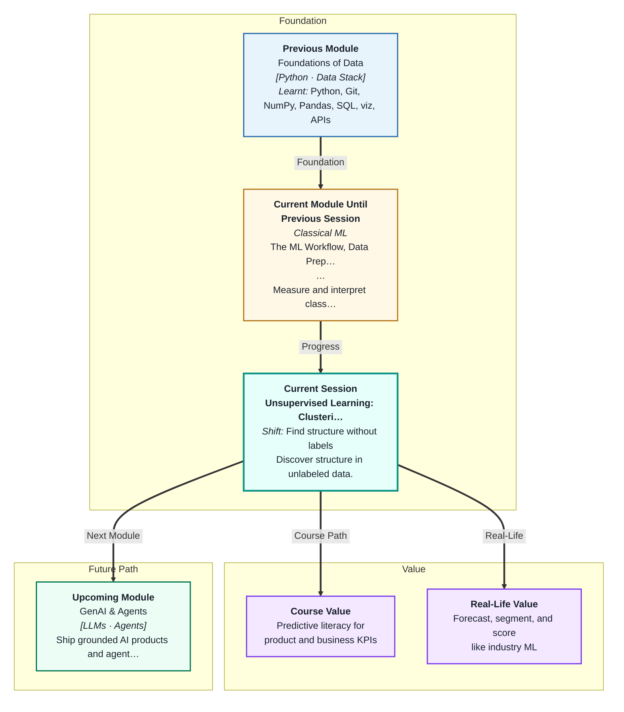
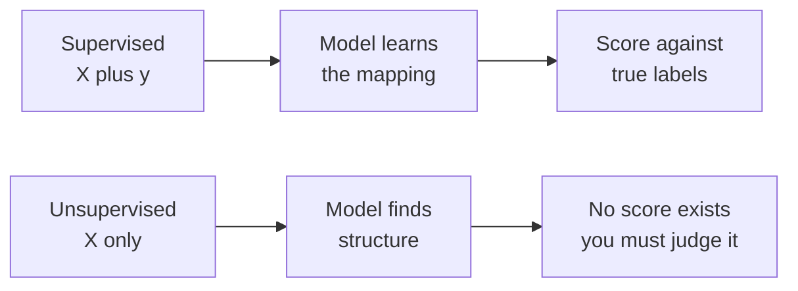
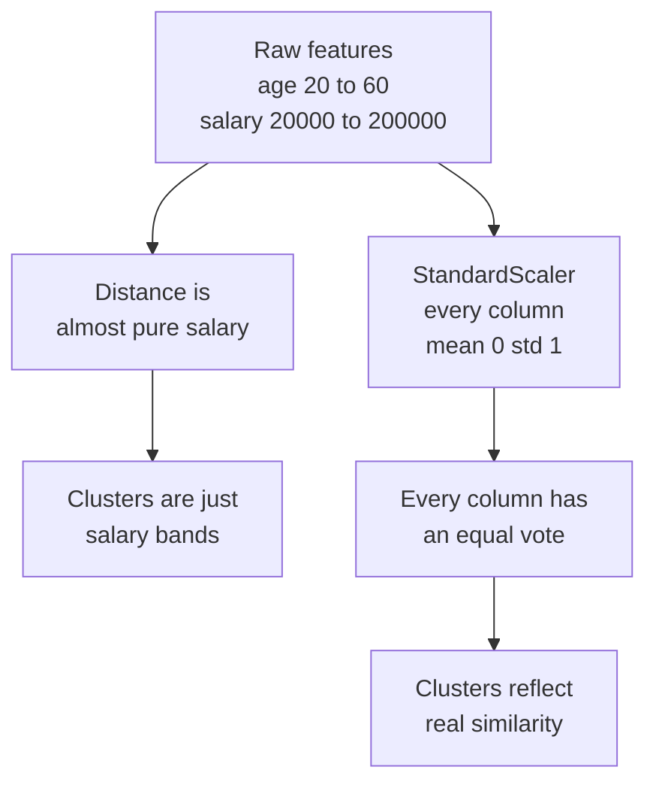
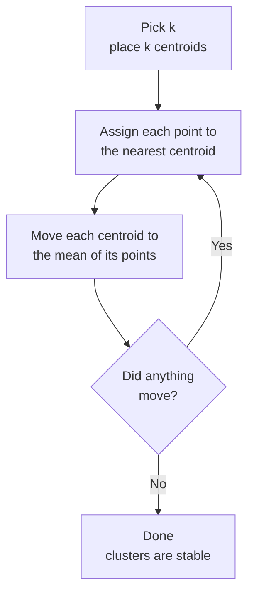
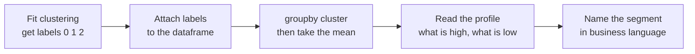

# Unsupervised Learning: Clustering
---

## Mental Map

## What You'll Learn

In this pre-read, you'll discover:

- Why **unsupervised learning** has no answer key — and what that changes about how you judge a model
- How machines measure "similar" using **distance**, and why **feature scaling** stops being optional
- How **K-Means** finds groups by repeating four simple steps until nothing moves
- How to choose the number of clusters using the **elbow method** and the **silhouette score**
- Why **DBSCAN** succeeds on shapes where K-Means fails, and how to turn clusters into named customer segments

---

## A. Learning Without an Answer Key

> 💡 **Analogy:** At a wedding reception, nobody hands out a seating chart. Yet within ten minutes, guests have drifted into clumps — the cricket-talk group near the snacks, the cousins near the music, the elders on the chairs. Nobody labelled them. The groups formed because similar people drifted together. That is clustering.

**One-line definition:** **Unsupervised learning** finds patterns in data that has **no target column** — no `y`, no labels, no right answers.

Every model in Sessions 1 to 8 was **supervised**. You had a target: house price, tumour class, churn or no-churn. You trained on `X` and `y`, then scored predictions against the true `y`.

Now the `y` column is gone. You only have `X`.

| | Supervised (Sessions 1–8) | Unsupervised (today) |
|---|---|---|
| Input | `X` and `y` | `X` only |
| Goal | Predict the known answer | Discover unknown structure |
| Example | "Will this customer churn?" | "What kinds of customers do we even have?" |
| Evaluation | Accuracy, F1, R², RMSE | No accuracy — judged by usefulness |
| Train/test split | Essential | Usually not used |

**The uncomfortable truth:** there is no accuracy score here, because there is nothing to be accurate *about*. Two people can cluster the same data differently and both be right. Your job shifts from *"is this correct?"* to *"is this useful, stable, and explainable?"*

---

## B. Similar Means Close — and Why Scaling Is Mandatory

> 💡 **Analogy:** Imagine a talent show with two judges. Judge One scores every act from 0 to 10. Judge Two scores from 0 to 1000. When you add the two scores together, Judge One is effectively ignored — Judge Two's numbers are so large they decide the winner alone. Your data columns behave exactly like this.

**One-line definition:** **Clustering** groups points by similarity, and similarity is measured as **Euclidean distance** — the straight-line gap between two points.

For two customers with age and salary, the distance is:

`distance = sqrt((age1 - age2)² + (salary1 - salary2)²)`

Now put real numbers in. Two customers are both 30 years old. One earns ₹40,000 a month, the other ₹90,000.

- Age gap: `0`
- Salary gap: `50,000`
- Distance ≈ `50,000`

Age contributes *nothing*. Even a 40-year age gap would only add 40 to a number in the tens of thousands. Salary is the loud judge.

**The rule:** any algorithm that uses distance — K-Means, DBSCAN, KNN — **must** be given scaled features. Use `StandardScaler` before you fit. If you skip this step, your clusters are not wrong so much as meaningless: they are the largest-numbered column, wearing a costume.

---

## C. K-Means — Four Steps, Repeated Until Nothing Moves

> 💡 **Analogy:** Three ice-cream carts park randomly in a big park. Every child runs to the nearest cart. Each cart driver then looks at their own crowd and rolls the cart to the middle of it. The children look again and some switch carts. Repeat. Very quickly, the carts settle into the three natural crowds in the park — and stop moving.

**One-line definition:** **K-Means** is an algorithm that splits data into `k` groups by repeatedly assigning each point to its nearest **centroid** (a cluster's centre point) and then moving each centroid to the mean of its points.

**How it scores itself:** K-Means measures **inertia**, also called **WCSS** (within-cluster sum of squares) — the total squared distance from every point to its own centroid. Lower inertia means tighter clusters. The algorithm's whole job is to shrink inertia.

**Two things to know in scikit-learn:**

- `init='k-means++'` — the default. It spreads the starting centroids out instead of dropping them at random, which avoids bad final answers. Keep it.
- `n_init=10` — it reruns the whole thing 10 times from different starts and keeps the best. Because the starting positions are random, always set `random_state=42` so your result is reproducible.

**What K-Means quietly assumes:** clusters are round, roughly equal in size, and separated like blobs. When that is true, it is fast and excellent. When it is not, see Section E.

---

## D. Choosing k — the Elbow and the Silhouette

> 💡 **Analogy:** You are organising a wardrobe into drawers. One drawer, and everything is a jumble. Twenty drawers, and each holds a single sock — technically perfectly organised, completely useless. The right number sits somewhere in between, and you feel it: the point where adding one more drawer stops making things noticeably tidier.

**One-line definition:** Because there is no right answer, you pick `k` using two diagnostics — the **elbow method** (where inertia stops dropping sharply) and the **silhouette score** (how well-separated the clusters are).

**The elbow method:** fit K-Means for `k = 1, 2, 3, ... 10` and plot inertia against `k`. Inertia always falls as `k` rises (with `k` = number of points, inertia is zero). What you look for is the **elbow** — the bend where the steep fall flattens into a gentle slope. That bend is your `k`.

**The silhouette score:** for each point, compare how close it is to its *own* cluster versus the *next nearest* cluster. Average that over every point.

| Silhouette value | Meaning |
|---|---|
| Close to `+1` | Point sits deep inside its own cluster — well separated |
| Around `0` | Point sits on the border between two clusters |
| Close to `-1` | Point is probably in the wrong cluster |

A dataset-wide average above roughly `0.5` suggests genuinely distinct clusters. Below `0.25`, the structure is weak — the "clusters" may not really exist.

**Use both.** The elbow is often ambiguous (people argue about where the bend is). The silhouette gives you a single number you can compare across `k` values. When both point at the same `k`, you can be confident. When they disagree, prefer the `k` that a human can actually explain to the business.

---

## E. When K-Means Fails — DBSCAN and Hierarchical Clustering

> 💡 **Analogy:** Look at a night-time satellite photo of India. Cities appear as dense knots of light — Mumbai sprawls in a long coastal ribbon, Delhi spreads in a wide splat, neither is a neat circle. A single farmhouse light in the middle of Rajasthan belongs to no city at all. Your eye finds the cities by **density**, not by roundness, and it happily calls the lone light "not a city."

**One-line definition:** **DBSCAN** (Density-Based Spatial Clustering) groups points that are packed closely together, finds clusters of *any shape*, needs no `k`, and labels sparse leftover points as **noise**.

K-Means breaks on three things: elongated or crescent-shaped clusters, clusters of very different sizes, and outliers (which drag a centroid towards them). DBSCAN handles all three.

DBSCAN takes two settings instead of `k`:

- `eps` — the radius of a point's neighbourhood. How close counts as "nearby"?
- `min_samples` — how many neighbours a point needs within `eps` to count as being in a dense region.

Points in dense regions form clusters. Points that are near a cluster get pulled in. Points that are alone are given the label `-1`, meaning **noise** — DBSCAN's honest way of saying "this one belongs nowhere."

| | K-Means | DBSCAN | Hierarchical |
|---|---|---|---|
| Need to choose `k`? | Yes | No | No — cut the tree later |
| Cluster shape | Round blobs only | Any shape | Any shape |
| Handles outliers | Poorly — forces them in | Yes — labels them `-1` | Poorly |
| Main setting | `n_clusters` | `eps`, `min_samples` | Linkage method |
| Speed on big data | Fast | Moderate | Slow |

**Hierarchical clustering** takes a third approach: it starts with every point as its own cluster and repeatedly merges the two closest, building a tree. That tree is drawn as a **dendrogram** — and you choose your number of clusters by deciding where to cut across it. It is slow, but the dendrogram is wonderful for *seeing* the structure.

---

## F. The Payoff — From Clusters to Named Segments

> 💡 **Analogy:** A kirana shop owner does not run an algorithm, but after a year behind the counter he knows his customers: the morning-milk regulars, the weekend big-basket families, the late-night snack crowd. Those names are what let him decide when to stock extra bread. A cluster number is not a name. The naming is the point.

**One-line definition:** **Cluster profiling** means examining the average feature values inside each cluster and translating them into a plain-language segment name a business can act on.

The model gives you a column of meaningless integers: `0`, `1`, `2`. Nobody can act on "Cluster 1." You must interpret them.

**The workflow, concretely:**

1. Scale the features and fit your clusterer.
2. Add the labels back onto the **unscaled** dataframe — you want readable ₹ values, not z-scores.
3. Run `df.groupby('cluster').mean()`.
4. Read each row and ask: what is unusually high here? What is unusually low?
5. Give it a name.

| Cluster | Avg age | Avg monthly spend | Avg visits | Your name for it |
|---|---|---|---|---|
| 0 | 24 | ₹1,200 | 12 | Frequent Small-Basket Youngsters |
| 1 | 41 | ₹9,500 | 2 | Occasional Big-Ticket Families |
| 2 | 35 | ₹3,000 | 3 | The Quiet Middle |

Those names are the deliverable. A marketing team can send a different offer to each one. "Cluster 1" cannot be marketed to — "Occasional Big-Ticket Families" can.

---

## Practice Exercises

**1. Pattern Recognition**  
You are handed four project briefs: (a) predict tomorrow's rainfall in Pune from the last 30 days of weather, (b) group 50,000 Swiggy users so the offers team can target them, (c) decide whether an SMS is spam, (d) find which of 10,000 sensor readings look unlike all the others. For each, say whether it is supervised or unsupervised, and give the one-sentence reason. For the unsupervised ones, name what plays the role that accuracy played in Sessions 1–8.

**2. Concept Detective**  
A teammate clusters customers on two columns — `age` (18 to 65) and `annual_income_rupees` (₹2,00,000 to ₹40,00,000). She runs K-Means with `k=3` directly on the raw dataframe. The three clusters come out as neat income bands, and age is spread almost evenly inside every cluster. She concludes "age doesn't matter for segmentation." Diagnose what actually happened, name the exact preprocessing step she skipped, and explain why her conclusion about age is unsafe.

**3. Real-Life Application**  
Think about the students in your own batch. Choose three numeric features you could realistically measure about each of them (for example: hours studied per week, number of assignments submitted, minutes spent on the discussion forum). Describe what two or three clusters you would *expect* to emerge, what name you would give each segment, and one concrete action a course coordinator could take for each segment.

**4. Spot the Error**  
An engineer reports: *"I ran DBSCAN on our delivery-time data. It returned clusters labelled 0, 1, 2 and -1. Since -1 is not a valid cluster number, I dropped those rows as a bug, then computed the average delivery time per cluster."* Identify what `-1` actually means, explain why deleting those rows is a mistake, and describe what those rows might have been telling the delivery team.

**5. Planning Ahead**  
You are given an unlabelled dataset of 20,000 IPL viewers with columns: `age`, `matches_watched`, `avg_minutes_per_match`, `merchandise_spend_rupees`, `city`. Design the full clustering plan: which columns you would feed the model and what you would do with `city`, which preprocessing step is non-negotiable and why, how you would choose `k`, how you would check whether the clusters are real, and how you would present the final result to a non-technical sponsor.

---

> ✅ **You're done!** You now understand the single biggest shift in this module — that data without labels still has structure, and that finding it means measuring similarity as distance, scaling your features, choosing `k` with the elbow and silhouette, and reaching for DBSCAN when the shapes get strange. Most importantly, you know that the real deliverable is not a cluster number but a named segment someone can act on. Coming up: **Master Class — Probability & Counting: The Mathematics of Uncertainty**, where you'll build the mathematical footing beneath everything you have modelled so far.
