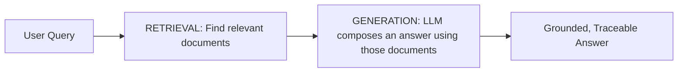

# RAG & Embedding Foundations

## 1. What You'll Learn in This Section

In this lesson, you'll learn to:

- Explain what RAG (Retrieval-Augmented Generation) is and why grounding an LLM in retrieval solves a real problem.
- Convert text into embeddings and understand what similarity scores between them represent.
- Walk through a full retrieval pipeline, from a query to a ranked set of relevant documents.
- Identify what an "intro to vector databases" like Chroma or FAISS actually solves at scale.

## 2. Detailed Explanation

### What RAG is, and the problem it solves

The core analogy is a well-read consultant versus one who was just handed your company's actual policy
manual before the meeting. Both can speak fluently and confidently about return policies in general —
only one of them can tell you *your* business's actual 7-day return window, because only one of them
was given the real document to read first. **RAG (Retrieval-Augmented Generation)** is exactly that
second consultant: an LLM whose answer is grounded in documents retrieved from your own data, not just
whatever it happened to learn generically during training.

This lesson uses a 20-article customer support knowledge base (`support_kb_articles.csv`) for the same
retail business used throughout this module, covering delivery, returns, inventory, payments, feedback,
and support-escalation policies across the Gurugram, Mumbai, Delhi, Noida, and Chennai stores.

### What is RAG? — the two halves



```
RETRIEVAL                              GENERATION
────────────────────────────           ────────────────────────────────
Find the most relevant documents        Compose a natural-language answer
for a query, from your own data          using ONLY the retrieved documents
                                        as context -- not the model's own
                                        generic training knowledge
```

Today's session builds the **retrieval** half in full — text to vectors, similarity scores, and a
working retrieval pipeline — which the next session (Building a RAG Application) wires up to
generation and a user interface.

### Text to vectors — what an embedding is

An **embedding** is a list of numbers produced by a model trained to place text with similar meaning
close together in that number-space, and different meaning far apart.

```python
from sentence_transformers import SentenceTransformer

model = SentenceTransformer("all-MiniLM-L6-v2")
embedding = model.encode("The delivery arrived two days late.")

print(len(embedding))     # e.g. 384 numbers
print(embedding[:5])       # a small slice of the vector
```

```
"The delivery arrived two days late."        -> [0.03, -0.11, 0.08, ...]
"My order showed up 48 hours behind schedule."  -> [0.02, -0.09, 0.07, ...]
"The weather in Chennai was sunny today."       -> [-0.21, 0.15, -0.04, ...]

The first two sentences share almost no exact words but describe
the same event -- their embeddings land close together. The third,
about something unrelated, lands far away.
```

### Similarity scores — what they represent

**Cosine similarity** measures how close two embeddings are in meaning-space, using the angle between
the two vectors.

```python
from sklearn.metrics.pairwise import cosine_similarity

embedding_1 = model.encode(["The delivery arrived two days late."])
embedding_2 = model.encode(["My order showed up 48 hours behind schedule."])
embedding_3 = model.encode(["The weather in Chennai was sunny today."])

print("Similar meaning:", cosine_similarity(embedding_1, embedding_2)[0][0])
print("Unrelated meaning:", cosine_similarity(embedding_1, embedding_3)[0][0])
```

```
SCORE CLOSE TO 1          Very similar meaning, even with completely
                        different wording

SCORE CLOSE TO 0           Unrelated content -- roughly perpendicular
                        in vector space

SCORE CLOSE TO -1           Rare for text, represents strongly
                        opposed meaning when it occurs
```

**Watch out for:** a bag-of-words technique (counting shared vocabulary, like TF-IDF) is *not* the same
as an embedding — it fails on a genuine paraphrase that shares no exact words with its match, while a
trained embedding model succeeds, because it captures meaning rather than vocabulary overlap.

### The full retrieval pipeline

```python
import pandas as pd

kb = pd.read_csv("support_kb_articles.csv")
doc_embeddings = model.encode(kb["content"].tolist())

def retrieve(query, top_k=3, min_similarity=0.25):
    query_embedding = model.encode([query])
    scores = cosine_similarity(query_embedding, doc_embeddings)[0]
    kb_scored = kb.copy()
    kb_scored["similarity"] = scores
    top = kb_scored.sort_values("similarity", ascending=False).head(top_k)
    return top[top["similarity"] >= min_similarity]

results = retrieve("How long do I have to send something back?")
print(results[["doc_id", "title", "similarity"]])
```

Handling rules for a retrieval pipeline:

- **Always attach the source, not just the score** — a `doc_id` and title must travel with every
  result, so a retrieved match can be traced and verified, not just trusted blindly.
- **Sort before slicing to top-K** — ranking happens first, truncation happens second.
- **Set an explicit minimum-similarity threshold** — without one, a query entirely outside your
  knowledge base still returns *something*, just weakly related, which risks becoming false context in
  the generation step next session.

### Intro to vector databases — what changes at scale

Computing similarity against all 20 articles one at a time works fine here. It stops working at
100,000 documents. A **vector database** (e.g. Chroma or FAISS) stores embeddings and answers "which
stored vectors are most similar to this one?" using an index built for fast lookup, instead of
comparing against every single stored vector one by one.

```python
import chromadb

client = chromadb.Client()
collection = client.create_collection("support_kb")

# Pass our own embeddings directly, rather than relying on Chroma's own default embedder
collection.add(
    documents=kb["content"].tolist(),
    ids=kb["doc_id"].tolist(),
    embeddings=doc_embeddings.tolist()
)

query_vector = model.encode(["How long do I have to send something back?"]).tolist()
results = collection.query(query_embeddings=query_vector, n_results=3)
print(results["documents"])
```

> **A practical framing to carry into next session:** a vector database doesn't change *what* is being
> computed — it's still similarity search under the hood — it changes *how fast* results come back once
> the number of stored documents grows well beyond what a simple loop can handle quickly.

### The mental model to carry in

```
TEXT (A DOCUMENT OR A QUERY)
      │
      ▼
GENERATE AN EMBEDDING          A vector placing similar meaning close
                             together in number-space
      │
      ▼
COMPUTE COSINE SIMILARITY         A score between the query's vector
                             and every stored document's vector
      │
      ▼
RANK AND FILTER BY THRESHOLD        Top-K results, with a minimum
                             similarity so irrelevant queries don't
                             silently return weak matches
      │
      ▼
(AT SCALE) STORE IN A VECTOR DATABASE   Same computation, indexed for
                             fast lookup across many documents
      │
      ▼
THE RETRIEVAL HALF OF RAG, READY FOR GENERATION NEXT SESSION
```

## 3. Key Takeaways

- RAG grounds an LLM's answer in documents retrieved from your own data, closing the gap between
  "sounds plausible" and "is actually correct for this business."
- An embedding is a vector representing meaning; cosine similarity measures closeness between two
  embeddings, unaffected by exact wording differences.
- A retrieval pipeline must sort before truncating to top-K, always attach source info to results, and
  apply an explicit similarity threshold so irrelevant queries don't return weak, misleading matches.
- A vector database changes retrieval speed at scale, not the underlying similarity computation itself.

**Mental model:** Think of RAG's retrieval half as handing a consultant the exact right page from your
policy manual before they answer — the embedding and similarity search is how that "right page" gets
found in the first place.
