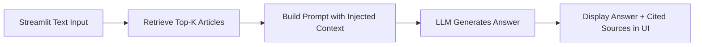

# Building a RAG Application

## 1. What You'll Learn in This Section

In this lesson, you'll learn to:

- Integrate the retrieval pipeline from last session with an LLM to produce grounded, natural-language answers.
- Inject retrieved context into a prompt correctly, and instruct the model to stay within it.
- Build a simple Streamlit interface so the RAG pipeline becomes something a non-technical stakeholder can actually use.
- Evaluate whether the finished application's answers are genuinely grounded, not just fluent.

## 2. Detailed Explanation

### From a pipeline to an application

Last session built the retrieval half of RAG end to end — embeddings, similarity search, and an intro
to vector databases. Today assembles the *whole* system: retrieval feeding generation, wrapped in an
interface someone outside this room could actually open and use.

```
Last session   → Given a query, retrieve the most relevant knowledge-
                base articles, ranked by similarity
This session    → Take those articles, generate a grounded answer, and
                wrap the whole thing in a usable interface
```

### The full application flow



### Python integration — wiring retrieval to generation

```python
import os
import pandas as pd
from sentence_transformers import SentenceTransformer
from sklearn.metrics.pairwise import cosine_similarity
from openai import OpenAI

kb = pd.read_csv("support_kb_articles.csv")
model = SentenceTransformer("all-MiniLM-L6-v2")
doc_embeddings = model.encode(kb["content"].tolist())
client = OpenAI(api_key=os.environ["OPENAI_API_KEY"])

def retrieve(query, top_k=3, min_similarity=0.25):
    query_embedding = model.encode([query])
    scores = cosine_similarity(query_embedding, doc_embeddings)[0]
    kb_scored = kb.copy()
    kb_scored["similarity"] = scores
    top = kb_scored.sort_values("similarity", ascending=False).head(top_k)
    return top[top["similarity"] >= min_similarity]

def generate_answer(query, context_docs):
    context_text = "\n\n".join(
        f"[{row.doc_id}] {row.title}: {row.content}" for row in context_docs.itertuples()
    )
    prompt = f"""Answer the customer's question using ONLY the context below. If the context doesn't
fully answer the question, say so rather than guessing. Cite the doc_id(s) you used.

Context:
{context_text}

Question: {query}"""
    response = client.chat.completions.create(
        model="gpt-4", messages=[{"role": "user", "content": prompt}], temperature=0.2
    )
    return response.choices[0].message.content
```

**Watch out for:** injecting context and asking the model to "cite the doc_id(s) you used" is what
makes the final answer auditable — a support agent reviewing the application's output can trace any
claim back to a specific article, the same grounding discipline carried through every session in this
module so far.

### Building the Streamlit UI

```python
import streamlit as st

st.title("Customer Support Assistant")
query = st.text_input("Ask a question about delivery, returns, payments, or store policy:")

if query:
    context_docs = retrieve(query)
    if context_docs.empty:
        st.warning("No relevant knowledge-base article found for this question.")
    else:
        answer = generate_answer(query, context_docs)
        st.write("### Answer")
        st.write(answer)

        st.write("### Sources used")
        for row in context_docs.itertuples():
            st.write(f"- **{row.doc_id}** — {row.title} (similarity: {row.similarity:.2f})")
```

```
WHY DISPLAY THE SOURCES, NOT JUST THE ANSWER
─────────────────────────────────────────────
A fluent answer with no visible sourcing asks the user to trust
it blindly. Showing which articles were retrieved -- and their
similarity scores -- lets a support agent quickly sanity-check
whether the answer is actually grounded, before relying on it
with a real customer.
```

**Handling rule for the empty-retrieval case in the UI specifically:** the interface must show an
explicit "no relevant article found" state, not call the LLM anyway and risk displaying a fluent but
ungrounded answer to whoever is using the tool.

### Evaluating the finished application

Before treating the application as done, run it against a small, deliberate test set — not just the
happy-path questions that come to mind first.

```
TEST QUERY TYPE                    WHAT TO CHECK
─────────────────────────          ────────────────────────────────
Exact-wording match to an           Correct article retrieved, answer
article                            matches its actual content
Genuine paraphrase, no word         Correct article STILL retrieved
overlap                            (tests the embedding, not luck)
Question spanning two topics         Multiple relevant articles surface,
                                   answer reflects both
Entirely out-of-scope question       "No relevant article found" state
                                   triggers -- NOT a fabricated answer
```

> **Why this test set matters before calling the application finished:** an application that only
> works on the phrasing its own builder would naturally type looks finished in a demo and fails the
> first time a real user phrases something differently — this is the exact same "test beyond your own
> phrasing" discipline from earlier agent-spec thinking, applied here to a RAG application specifically.

### The mental model to carry in

```
A USER TYPES A QUESTION INTO THE INTERFACE
      │
      ▼
RETRIEVE RELEVANT ARTICLES          Same pipeline from last session,
                                unchanged
      │
      ▼
INJECT CONTEXT + GENERATE               Prompt instructs the model to
                                answer ONLY from retrieved context,
                                and to cite sources
      │
      ▼
DISPLAY ANSWER + SOURCES TOGETHER         Never the answer alone --
                                sourcing is what makes it auditable
      │
      ▼
TEST BEYOND THE HAPPY PATH               Paraphrases, multi-topic, and
                                out-of-scope queries, before calling
                                it done
      │
      ▼
A RAG APPLICATION A NON-TECHNICAL STAKEHOLDER CAN ACTUALLY TRUST AND USE
```

## 3. Key Takeaways

- Building a RAG application means wiring last session's retrieval pipeline to generation, then wrapping
  the whole thing in an interface someone outside the room can use.
- The prompt must instruct the model to answer only from retrieved context and cite its sources — this
  is what makes the final answer auditable, not just fluent.
- The UI should display retrieved sources alongside the answer, and show an explicit "not found" state
  for the empty-retrieval case, rather than ever calling the LLM with no real context.
- A finished application is tested against paraphrases, multi-topic questions, and out-of-scope
  questions — not just the phrasing its own builder would naturally type.

**Mental model:** Think of the finished application as the consultant-with-the-policy-manual from last
session, now given a front desk to sit at — the answer they give is only as trustworthy as the sources
they show alongside it.
