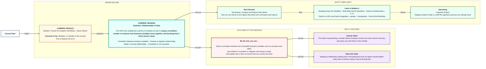

# Mental Map — Statistics: Relationships in Data
> Academic Session 26 · Module 4: GenAI for Analytics Workflows + Basic Python

```mermaid
%%{init: {'flowchart': {'htmlLabels': true, 'nodeSpacing': 60, 'rankSpacing': 95, 'wrappingWidth': 620, 'padding': 18}}}%%
flowchart LR

START["<b>Course Start</b>"]

subgraph foundation[" WHERE WE ARE "]
direction TB
    CURMOD["<b>CURRENT MODULE</b><br/><i>Module 4: GenAI for Analytics Workflows + Basic Python</i><br/>&nbsp;<br/><b>Covered so far:</b> Modules 1–3 (earlier in the course)<br/>This is Session 26 of 41"]
    CURSES["<b>CURRENT SESSION</b><br/><b>Statistics: Relationships in Data</b><br/>&nbsp;<br/><i>The shift:</i> from <i>reading two columns of numbers by eye</i> to <b>using a correlation number to measure how business variables move together, and knowing why it never proves cause</b><br/>&nbsp;<br/>Correlation between business variables · Positive &amp; negative relationships<br/>Weak vs strong relationships · Correlation is not causation"]
end

subgraph outcome[" OUTCOME OF THIS SESSION "]
direction TB
    OUT["<b>By the end, you can…</b><br/>&nbsp;<br/>Read a correlation between two Kirana365 business variables such as ad spend and sales,<br/>say whether it is positive or negative and strong or weak,<br/>and explain why it does not prove that one causes the other"]
end

subgraph value[" WHY IT MATTERS "]
direction TB
    CVAL["<b>Course Value</b><br/>The habit of questioning a number before trusting it carries into every GenAI summary and report you will check in this module"]
    RVAL["<b>Real-Life Value</b><br/>Stopping a leadership meeting from concluding that more ad spend caused higher sales when a festive season may be driving both"]
end

subgraph future[" WHAT COMES NEXT "]
direction TB
    U0["<b>Next Session</b><br/>Summarise, Compare and Report with GenAI<br/><i>Now we use GenAI to turn figures like these into summaries and reports</i>"]
    U1["<b>Later in Module 4</b><br/>Breaking Down the Workflow · Multi-Step GenAI Workflows · Python Fundamentals I, II, III<br/>Python for APIs and GenAI Integration · pandas · Visualization · End-to-End Workflow"]
    U2["<b>Upcoming</b><br/>Capstone Project<br/><i>Judging evidence fairly is a skill the capstone assumes you already have</i>"]
end

START ==>|" begin "| CURMOD
CURMOD ==>|" progress "| CURSES
CURSES ==>|" you get "| OUT
OUT ==>|" course "| CVAL
OUT ==>|" real life "| RVAL
CURSES ==>|" next up "| U0
U0 -.->|" then "| U1
U1 -.->|" ahead "| U2

classDef startBox fill:#F7FAFC,stroke:#4A5568,stroke-width:2px,color:#1A202C
classDef curModBox fill:#FFF8E6,stroke:#B7791F,stroke-width:2px,color:#1A202C
classDef curSessBox fill:#E6FFFA,stroke:#0D9488,stroke-width:3px,color:#1A202C
classDef outBox fill:#FEF2F2,stroke:#DC2626,stroke-width:3px,color:#1A202C
classDef valueBox fill:#F3E8FF,stroke:#7C3AED,stroke-width:2px,color:#1A202C
classDef futureBox fill:#ECFDF5,stroke:#047857,stroke-width:2px,color:#1A202C

class START startBox
class CURMOD curModBox
class CURSES curSessBox
class OUT outBox
class CVAL,RVAL valueBox
class U0,U1,U2 futureBox

linkStyle default stroke-width:2px
```
