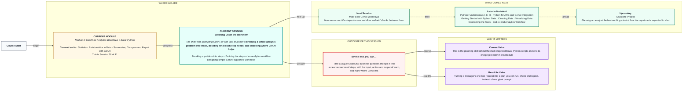

# Mental Map — Breaking Down the Workflow
> Academic Session 28 · Module 4: GenAI for Analytics Workflows + Basic Python

```mermaid
%%{init: {'flowchart': {'htmlLabels': true, 'nodeSpacing': 60, 'rankSpacing': 95, 'wrappingWidth': 620, 'padding': 18}}}%%
flowchart LR

START["<b>Course Start</b>"]

subgraph foundation[" WHERE WE ARE "]
direction TB
    CURMOD["<b>CURRENT MODULE</b><br/><i>Module 4: GenAI for Analytics Workflows + Basic Python</i><br/>&nbsp;<br/><b>Covered so far:</b> Statistics: Relationships in Data · Summarise, Compare and Report with GenAI<br/>This is Session 28 of 41"]
    CURSES["<b>CURRENT SESSION</b><br/><b>Breaking Down the Workflow</b><br/>&nbsp;<br/><i>The shift:</i> from <i>prompting GenAI for one task at a time</i> to <b>breaking a whole analysis problem into steps, deciding what each step needs, and choosing where GenAI helps</b><br/>&nbsp;<br/>Breaking a problem into steps · Defining the steps of an analytics workflow<br/>Designing simple GenAI-supported workflows"]
end

subgraph outcome[" OUTCOME OF THIS SESSION "]
direction TB
    OUT["<b>By the end, you can…</b><br/>&nbsp;<br/>Take a vague Kirana365 business question and split it into<br/>a clear sequence of steps, with the input, action and output of each,<br/>and mark where GenAI fits"]
end

subgraph value[" WHY IT MATTERS "]
direction TB
    CVAL["<b>Course Value</b><br/>This is the planning skill behind the multi-step workflows, Python scripts and end-to-end project later in this module"]
    RVAL["<b>Real-Life Value</b><br/>Turning a manager's one-line request into a plan you can run, check and repeat, instead of one giant prompt"]
end

subgraph future[" WHAT COMES NEXT "]
direction TB
    U0["<b>Next Session</b><br/>Multi-Step GenAI Workflows<br/><i>Now we connect the steps into one workflow and add checks between them</i>"]
    U1["<b>Later in Module 4</b><br/>Python Fundamentals I, II, III · Python for APIs and GenAI Integration<br/>Getting Started with Python Data · Cleaning Data · Visualizing Data<br/>Connecting the Tools · End-to-End Analytics Workflow"]
    U2["<b>Upcoming</b><br/>Capstone Project<br/><i>Planning an analysis before touching a tool is how the capstone is expected to start</i>"]
end

START ==>|" begin "| CURMOD
CURMOD ==>|" progress "| CURSES
CURSES ==>|" you get "| OUT
OUT ==>|" course "| CVAL
OUT ==>|" real life "| RVAL
CURSES ==>|" next up "| U0
U0 -.->|" then "| U1
U1 -.->|" ahead "| U2

classDef startBox fill:#F7FAFC,stroke:#4A5568,stroke-width:2px,color:#1A202C
classDef curModBox fill:#FFF8E6,stroke:#B7791F,stroke-width:2px,color:#1A202C
classDef curSessBox fill:#E6FFFA,stroke:#0D9488,stroke-width:3px,color:#1A202C
classDef outBox fill:#FEF2F2,stroke:#DC2626,stroke-width:3px,color:#1A202C
classDef valueBox fill:#F3E8FF,stroke:#7C3AED,stroke-width:2px,color:#1A202C
classDef futureBox fill:#ECFDF5,stroke:#047857,stroke-width:2px,color:#1A202C

class START startBox
class CURMOD curModBox
class CURSES curSessBox
class OUT outBox
class CVAL,RVAL valueBox
class U0,U1,U2 futureBox

linkStyle default stroke-width:2px
```
