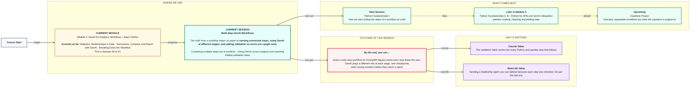

# Mental Map — Multi-Step GenAI Workflows
> Academic Session 29 · Module 4: GenAI for Analytics Workflows + Basic Python

```mermaid
%%{init: {'flowchart': {'htmlLabels': true, 'nodeSpacing': 60, 'rankSpacing': 95, 'wrappingWidth': 620, 'padding': 18}}}%%
flowchart LR

START["<b>Course Start</b>"]

subgraph foundation[" WHERE WE ARE "]
direction TB
    CURMOD["<b>CURRENT MODULE</b><br/><i>Module 4: GenAI for Analytics Workflows + Basic Python</i><br/>&nbsp;<br/><b>Covered so far:</b> Statistics: Relationships in Data · Summarise, Compare and Report with GenAI · Breaking Down the Workflow<br/>This is Session 29 of 41"]
    CURSES["<b>CURRENT SESSION</b><br/><b>Multi-Step GenAI Workflows</b><br/>&nbsp;<br/><i>The shift:</i> from <i>a workflow drawn on paper</i> to <b>running connected steps, using GenAI at different stages, and adding validation so errors are caught early</b><br/>&nbsp;<br/>Combining multiple steps into a workflow · Using GenAI across analysis and reporting<br/>Adding validation steps"]
end

subgraph outcome[" OUTCOME OF THIS SESSION "]
direction TB
    OUT["<b>By the end, you can…</b><br/>&nbsp;<br/>Build a multi-step workflow for Kirana365 figures where each step feeds the next,<br/>GenAI plays a different role at each stage, and checkpoints<br/>catch wrong numbers before they reach a report"]
end

subgraph value[" WHY IT MATTERS "]
direction TB
    CVAL["<b>Course Value</b><br/>The validation habit carries into every Python and pandas step that follows"]
    RVAL["<b>Real-Life Value</b><br/>Sending a leadership report you can defend because each step was checked, not just the last one"]
end

subgraph future[" WHAT COMES NEXT "]
direction TB
    U0["<b>Next Session</b><br/>Python Fundamentals I<br/><i>Now we start writing the steps of a workflow as code</i>"]
    U1["<b>Later in Module 4</b><br/>Python Fundamentals II, III · Python for APIs and GenAI Integration<br/>pandas: loading, cleaning and plotting data"]
    U2["<b>Upcoming</b><br/>Capstone Project<br/><i>Checked, repeatable workflows are what the capstone is judged on</i>"]
end

START ==>|" begin "| CURMOD
CURMOD ==>|" progress "| CURSES
CURSES ==>|" you get "| OUT
OUT ==>|" course "| CVAL
OUT ==>|" real life "| RVAL
CURSES ==>|" next up "| U0
U0 -.->|" then "| U1
U1 -.->|" ahead "| U2

classDef startBox fill:#F7FAFC,stroke:#4A5568,stroke-width:2px,color:#1A202C
classDef curModBox fill:#FFF8E6,stroke:#B7791F,stroke-width:2px,color:#1A202C
classDef curSessBox fill:#E6FFFA,stroke:#0D9488,stroke-width:3px,color:#1A202C
classDef outBox fill:#FEF2F2,stroke:#DC2626,stroke-width:3px,color:#1A202C
classDef valueBox fill:#F3E8FF,stroke:#7C3AED,stroke-width:2px,color:#1A202C
classDef futureBox fill:#ECFDF5,stroke:#047857,stroke-width:2px,color:#1A202C

class START startBox
class CURMOD curModBox
class CURSES curSessBox
class OUT outBox
class CVAL,RVAL valueBox
class U0,U1,U2 futureBox

linkStyle default stroke-width:2px
```
