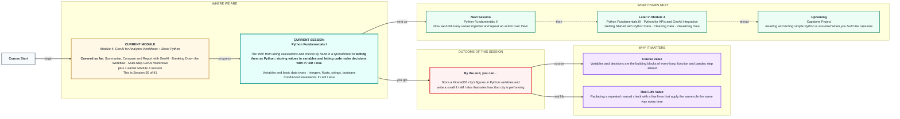

# Mental Map — Python Fundamentals I
> Academic Session 30 · Module 4: GenAI for Analytics Workflows + Basic Python

```mermaid
%%{init: {'flowchart': {'htmlLabels': true, 'nodeSpacing': 60, 'rankSpacing': 95, 'wrappingWidth': 620, 'padding': 18}}}%%
flowchart LR

START["<b>Course Start</b>"]

subgraph foundation[" WHERE WE ARE "]
direction TB
    CURMOD["<b>CURRENT MODULE</b><br/><i>Module 4: GenAI for Analytics Workflows + Basic Python</i><br/>&nbsp;<br/><b>Covered so far:</b> Summarise, Compare and Report with GenAI · Breaking Down the Workflow · Multi-Step GenAI Workflows<br/>plus 1 earlier Module 4 session<br/>This is Session 30 of 41"]
    CURSES["<b>CURRENT SESSION</b><br/><b>Python Fundamentals I</b><br/>&nbsp;<br/><i>The shift:</i> from <i>doing calculations and checks by hand in a spreadsheet</i> to <b>writing them as Python: storing values in variables and letting code make decisions with if / elif / else</b><br/>&nbsp;<br/>Variables and basic data types · Integers, floats, strings, booleans<br/>Conditional statements: if / elif / else"]
end

subgraph outcome[" OUTCOME OF THIS SESSION "]
direction TB
    OUT["<b>By the end, you can…</b><br/>&nbsp;<br/>Store a Kirana365 city's figures in Python variables and<br/>write a small if / elif / else that rates how that city is performing"]
end

subgraph value[" WHY IT MATTERS "]
direction TB
    CVAL["<b>Course Value</b><br/>Variables and decisions are the building blocks of every loop, function and pandas step ahead"]
    RVAL["<b>Real-Life Value</b><br/>Replacing a repeated manual check with a few lines that apply the same rule the same way every time"]
end

subgraph future[" WHAT COMES NEXT "]
direction TB
    U0["<b>Next Session</b><br/>Python Fundamentals II<br/><i>Now we hold many values together and repeat an action over them</i>"]
    U1["<b>Later in Module 4</b><br/>Python Fundamentals III · Python for APIs and GenAI Integration<br/>Getting Started with Python Data · Cleaning Data · Visualizing Data"]
    U2["<b>Upcoming</b><br/>Capstone Project<br/><i>Reading and writing simple Python is assumed when you build the capstone</i>"]
end

START ==>|" begin "| CURMOD
CURMOD ==>|" progress "| CURSES
CURSES ==>|" you get "| OUT
OUT ==>|" course "| CVAL
OUT ==>|" real life "| RVAL
CURSES ==>|" next up "| U0
U0 -.->|" then "| U1
U1 -.->|" ahead "| U2

classDef startBox fill:#F7FAFC,stroke:#4A5568,stroke-width:2px,color:#1A202C
classDef curModBox fill:#FFF8E6,stroke:#B7791F,stroke-width:2px,color:#1A202C
classDef curSessBox fill:#E6FFFA,stroke:#0D9488,stroke-width:3px,color:#1A202C
classDef outBox fill:#FEF2F2,stroke:#DC2626,stroke-width:3px,color:#1A202C
classDef valueBox fill:#F3E8FF,stroke:#7C3AED,stroke-width:2px,color:#1A202C
classDef futureBox fill:#ECFDF5,stroke:#047857,stroke-width:2px,color:#1A202C

class START startBox
class CURMOD curModBox
class CURSES curSessBox
class OUT outBox
class CVAL,RVAL valueBox
class U0,U1,U2 futureBox

linkStyle default stroke-width:2px
```
