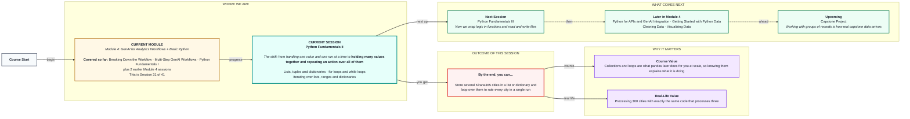

# Mental Map — Python Fundamentals II
> Academic Session 31 · Module 4: GenAI for Analytics Workflows + Basic Python

```mermaid
%%{init: {'flowchart': {'htmlLabels': true, 'nodeSpacing': 60, 'rankSpacing': 95, 'wrappingWidth': 620, 'padding': 18}}}%%
flowchart LR

START["<b>Course Start</b>"]

subgraph foundation[" WHERE WE ARE "]
direction TB
    CURMOD["<b>CURRENT MODULE</b><br/><i>Module 4: GenAI for Analytics Workflows + Basic Python</i><br/>&nbsp;<br/><b>Covered so far:</b> Breaking Down the Workflow · Multi-Step GenAI Workflows · Python Fundamentals I<br/>plus 2 earlier Module 4 sessions<br/>This is Session 31 of 41"]
    CURSES["<b>CURRENT SESSION</b><br/><b>Python Fundamentals II</b><br/>&nbsp;<br/><i>The shift:</i> from <i>handling one value and one run at a time</i> to <b>holding many values together and repeating an action over all of them</b><br/>&nbsp;<br/>Lists, tuples and dictionaries · for loops and while loops<br/>Iterating over lists, ranges and dictionaries"]
end

subgraph outcome[" OUTCOME OF THIS SESSION "]
direction TB
    OUT["<b>By the end, you can…</b><br/>&nbsp;<br/>Store several Kirana365 cities in a list or dictionary and<br/>loop over them to rate every city in a single run"]
end

subgraph value[" WHY IT MATTERS "]
direction TB
    CVAL["<b>Course Value</b><br/>Collections and loops are what pandas later does for you at scale, so knowing them explains what it is doing"]
    RVAL["<b>Real-Life Value</b><br/>Processing 300 cities with exactly the same code that processes three"]
end

subgraph future[" WHAT COMES NEXT "]
direction TB
    U0["<b>Next Session</b><br/>Python Fundamentals III<br/><i>Now we wrap logic in functions and read and write files</i>"]
    U1["<b>Later in Module 4</b><br/>Python for APIs and GenAI Integration · Getting Started with Python Data<br/>Cleaning Data · Visualizing Data"]
    U2["<b>Upcoming</b><br/>Capstone Project<br/><i>Working with groups of records is how real capstone data arrives</i>"]
end

START ==>|" begin "| CURMOD
CURMOD ==>|" progress "| CURSES
CURSES ==>|" you get "| OUT
OUT ==>|" course "| CVAL
OUT ==>|" real life "| RVAL
CURSES ==>|" next up "| U0
U0 -.->|" then "| U1
U1 -.->|" ahead "| U2

classDef startBox fill:#F7FAFC,stroke:#4A5568,stroke-width:2px,color:#1A202C
classDef curModBox fill:#FFF8E6,stroke:#B7791F,stroke-width:2px,color:#1A202C
classDef curSessBox fill:#E6FFFA,stroke:#0D9488,stroke-width:3px,color:#1A202C
classDef outBox fill:#FEF2F2,stroke:#DC2626,stroke-width:3px,color:#1A202C
classDef valueBox fill:#F3E8FF,stroke:#7C3AED,stroke-width:2px,color:#1A202C
classDef futureBox fill:#ECFDF5,stroke:#047857,stroke-width:2px,color:#1A202C

class START startBox
class CURMOD curModBox
class CURSES curSessBox
class OUT outBox
class CVAL,RVAL valueBox
class U0,U1,U2 futureBox

linkStyle default stroke-width:2px
```
