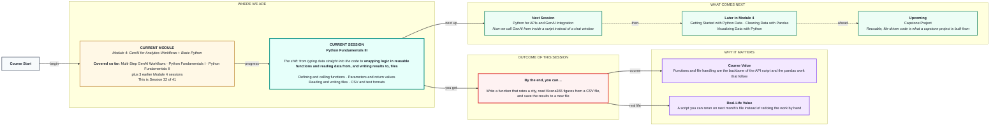

# Mental Map — Python Fundamentals III
> Academic Session 32 · Module 4: GenAI for Analytics Workflows + Basic Python

```mermaid
%%{init: {'flowchart': {'htmlLabels': true, 'nodeSpacing': 60, 'rankSpacing': 95, 'wrappingWidth': 620, 'padding': 18}}}%%
flowchart LR

START["<b>Course Start</b>"]

subgraph foundation[" WHERE WE ARE "]
direction TB
    CURMOD["<b>CURRENT MODULE</b><br/><i>Module 4: GenAI for Analytics Workflows + Basic Python</i><br/>&nbsp;<br/><b>Covered so far:</b> Multi-Step GenAI Workflows · Python Fundamentals I · Python Fundamentals II<br/>plus 3 earlier Module 4 sessions<br/>This is Session 32 of 41"]
    CURSES["<b>CURRENT SESSION</b><br/><b>Python Fundamentals III</b><br/>&nbsp;<br/><i>The shift:</i> from <i>typing data straight into the code</i> to <b>wrapping logic in reusable functions and reading data from, and writing results to, files</b><br/>&nbsp;<br/>Defining and calling functions · Parameters and return values<br/>Reading and writing files · CSV and text formats"]
end

subgraph outcome[" OUTCOME OF THIS SESSION "]
direction TB
    OUT["<b>By the end, you can…</b><br/>&nbsp;<br/>Write a function that rates a city, read Kirana365 figures from a CSV file,<br/>and save the results to a new file"]
end

subgraph value[" WHY IT MATTERS "]
direction TB
    CVAL["<b>Course Value</b><br/>Functions and file handling are the backbone of the API script and the pandas work that follow"]
    RVAL["<b>Real-Life Value</b><br/>A script you can rerun on next month's file instead of redoing the work by hand"]
end

subgraph future[" WHAT COMES NEXT "]
direction TB
    U0["<b>Next Session</b><br/>Python for APIs and GenAI Integration<br/><i>Now we call GenAI from inside a script instead of a chat window</i>"]
    U1["<b>Later in Module 4</b><br/>Getting Started with Python Data · Cleaning Data with Pandas<br/>Visualizing Data with Python"]
    U2["<b>Upcoming</b><br/>Capstone Project<br/><i>Reusable, file-driven code is what a capstone project is built from</i>"]
end

START ==>|" begin "| CURMOD
CURMOD ==>|" progress "| CURSES
CURSES ==>|" you get "| OUT
OUT ==>|" course "| CVAL
OUT ==>|" real life "| RVAL
CURSES ==>|" next up "| U0
U0 -.->|" then "| U1
U1 -.->|" ahead "| U2

classDef startBox fill:#F7FAFC,stroke:#4A5568,stroke-width:2px,color:#1A202C
classDef curModBox fill:#FFF8E6,stroke:#B7791F,stroke-width:2px,color:#1A202C
classDef curSessBox fill:#E6FFFA,stroke:#0D9488,stroke-width:3px,color:#1A202C
classDef outBox fill:#FEF2F2,stroke:#DC2626,stroke-width:3px,color:#1A202C
classDef valueBox fill:#F3E8FF,stroke:#7C3AED,stroke-width:2px,color:#1A202C
classDef futureBox fill:#ECFDF5,stroke:#047857,stroke-width:2px,color:#1A202C

class START startBox
class CURMOD curModBox
class CURSES curSessBox
class OUT outBox
class CVAL,RVAL valueBox
class U0,U1,U2 futureBox

linkStyle default stroke-width:2px
```
